# Architecture Documentation (Arc42)

**Project**: gs_test — EComApp Multi-Agent AI Code Analysis System
**Version**: 1.0
**Date**: 2025-07-14
**Generated by**: Arc42 Documentation Generator

---

## Table of Contents
1. [Introduction and Goals](#1-introduction-and-goals)
2. [Constraints](#2-constraints)
3. [Context and Scope](#3-context-and-scope)
4. [Solution Strategy](#4-solution-strategy)
5. [Building Block View](#5-building-block-view)
6. [Runtime View](#6-runtime-view)
7. [Deployment View](#7-deployment-view)
8. [Crosscutting Concepts](#8-crosscutting-concepts)
9. [Architecture Decisions](#9-architecture-decisions)
10. [Quality Requirements](#10-quality-requirements)
11. [Risks and Technical Debt](#11-risks-and-technical-debt)
12. [Glossary](#12-glossary)

---

## 1. Introduction and Goals

### 1.1 Purpose

**gs_test** is a GitHub Copilot Agent Test Repository that implements a complete **multi-agent AI orchestration system** for comprehensive, automated source code analysis of an ECommerce application (EComApp). The system coordinates **12 specialized GitHub Copilot AI agents** to deliver documentation generation, code quality assessment, UML/BPMN diagrams, database schema generation, architecture visualization, and executive reporting — all triggered from a single GitHub issue.

### 1.2 Key Business Objectives

| # | Objective |
|---|-----------|
| 1 | Automate time-consuming code analysis and documentation generation |
| 2 | Provide multi-perspective analysis (quality, architecture, process, data) in a single pipeline |
| 3 | Produce Arc42 architecture documentation as a standardized architectural artifact |
| 4 | Bridge technical findings and business impact through executive summaries |
| 5 | Enable automated issue resolution via GitHub Copilot integration |

### 1.3 Quality Goals

| Priority | Quality Goal | Motivation |
|----------|-------------|------------|
| 1 | **Correctness** | Analysis outputs must accurately reflect the source code |
| 2 | **Completeness** | All 12 agent analyses must be synthesized without loss |
| 3 | **Traceability** | Every finding must reference source files or agent outputs |
| 4 | **Automation** | Minimal manual intervention; triggered by GitHub issue label |
| 5 | **Extensibility** | New agents can be added without changing the core orchestration |

### 1.4 Stakeholders

| Stakeholder | Role | Expectation |
|-------------|------|-------------|
| Software Architects | Primary consumers of Arc42 output | Complete architectural documentation |
| Development Teams | Consumers of quality reports and UML diagrams | Actionable code improvement guidance |
| Technical Managers | Consumers of executive summaries | Business-impact summaries |
| DevOps Engineers | Operators of the GitHub Actions pipeline | Reliable, reproducible workflow execution |
| Database Administrators | Consumers of DDL output | Accurate schema generation |
| GitHub Copilot | Automated agent executor | Well-defined agent specifications |

---

## 2. Constraints

### 2.1 Technical Constraints

| Constraint | Description |
|------------|-------------|
| **GitHub Platform** | All agent execution occurs within GitHub Copilot and GitHub Actions; no external compute required |
| **Markdown + YAML** | Agent specifications are written in Markdown with YAML frontmatter — no custom DSL |
| **Mermaid Only** | All diagrams must use Mermaid syntax; no PlantUML, no ASCII art |
| **JSON Outputs** | Structured inter-agent communication uses JSON files written to `analysis_output/` |
| **Read-Only Analysis** | No agent modifies source code; analysis is strictly read-only |
| **GitHub Actions Runner** | Workflow executes on GitHub-hosted runners with standard tooling |

### 2.2 Organizational Constraints

| Constraint | Description |
|------------|-------------|
| **GitHub Copilot License** | Agents require GitHub Copilot Enterprise or Copilot Workspace |
| **Issue-Driven Trigger** | Analysis is initiated by assigning the `copilot` label to a GitHub issue |
| **Sequential Dependencies** | Downstream agents must wait for upstream agents to produce output files |
| **No Secrets in Output** | Agent outputs must not include credentials, tokens, or sensitive data |

### 2.3 Conventions

- Agent specification files are stored in `.github/agents/` with `.agent.md` extension
- All output files are written to `analysis_output/<agent-name>/`
- An `analysis_output/agent-log.txt` accumulates all agent activity with ISO timestamps
- Diagrams use `mermaid` fenced code blocks exclusively

---

## 3. Context and Scope

### 3.1 Business Context

The system operates within the GitHub ecosystem. A user creates or labels a GitHub issue to trigger the analysis pipeline. The orchestrator agent coordinates all 12 specialized agents. Final outputs are written as files in the repository and are available for review by all stakeholders.

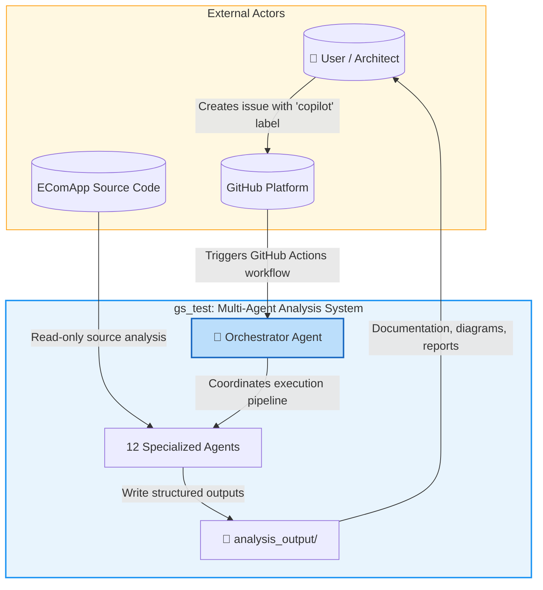

### 3.2 Technical Context

```mermaid
graph LR
    subgraph GitHub["GitHub Platform"]
        WF["GitHub Actions\nWorkflow\n(.github/workflows/)"]
        CP["GitHub Copilot\nAgent Runtime"]
        REPO["Repository\n(Source + Agents)"]
    end

    subgraph Agents[".github/agents/"]
        A1["orchestrator"]
        A2["code-documentor"]
        A3["ast-analyzer"]
        A4["code-assessor"]
        A5["uml-generator"]
        A6["bpmn-generator"]
        A7["ddl-generator"]
        A8["architecture-analyzer"]
        A9["documentation-analyzer"]
        A10["executive-summary"]
        A11["arc42-documentor"]
        A12["all-in-one-agent"]
    end

    subgraph Outputs["analysis_output/"]
        O1["JSON analysis files"]
        O2["Markdown reports"]
        O3["Mermaid diagrams"]
        O4["SQL DDL schemas"]
        O5["Arc42 documentation"]
    end

    WF -->|"Triggers"| CP
    CP -->|"Loads and executes"| Agents
    REPO -->|"Source code input"| Agents
    Agents -->|"Write results"| Outputs

    style GitHub fill:#f3e5f5,stroke:#9C27B0,stroke-width:2px
    style Agents fill:#e8f5e9,stroke:#4CAF50,stroke-width:2px
    style Outputs fill:#fff3e0,stroke:#FF9800,stroke-width:2px
```

### 3.3 External Interfaces

| Interface | Direction | Protocol/Format | Description |
|-----------|-----------|-----------------|-------------|
| GitHub Issues API | Inbound | GitHub Events / Labels | Triggers the analysis pipeline |
| GitHub Actions | Internal | YAML workflow | Orchestrates agent execution |
| EComApp Source Code | Inbound | File system read | Input to all analysis agents |
| `analysis_output/` directory | Outbound | JSON / Markdown / SQL | Structured outputs for consumers |
| `agent-log.txt` | Outbound | Plain text / ISO timestamps | Audit log of all agent activity |

---

## 4. Solution Strategy

### 4.1 Core Strategy Decisions

| Decision | Rationale |
|----------|-----------|
| **Multi-agent orchestration** | Separation of concerns; each agent is a focused expert; easy to extend |
| **GitHub Copilot as runtime** | Zero infrastructure cost; native GitHub integration; uses existing AI capability |
| **Markdown agent specs** | Human-readable, version-controllable, and natively interpreted by Copilot |
| **JSON for inter-agent data** | Machine-readable, structured, supports complex nested data |
| **Mermaid for all diagrams** | Renders natively in GitHub Markdown; no external rendering service required |
| **Read-only analysis** | Prevents unintended side-effects; safe to run on any repository |
| **Pipeline with parallelism** | Steps 1+2 run in parallel (code-documentor + ast-analyzer); steps 4+5 run in parallel (uml-generator + bpmn-generator) |

### 4.2 Execution Pipeline Strategy

```mermaid
flowchart LR
    S0(["Issue Labeled\n'copilot'"])
    S1["Step 1+2\ncode-documentor\n+ ast-analyzer\nparallel"]
    S3["Step 3\ncode-assessor"]
    S45["Step 4+5\numl-generator\n+ bpmn-generator\nparallel"]
    S6["Step 6\nddl-generator"]
    S7["Step 7\narchitecture-analyzer"]
    S8["Step 8\ndocumentation-analyzer"]
    S9["Step 9\nexecutive-summary"]
    S10["Step 10\narc42-documentor"]
    DONE(["Complete\nDocumentation"])

    S0 --> S1
    S1 --> S3
    S3 --> S45
    S45 --> S6
    S6 --> S7
    S7 --> S8
    S8 --> S9
    S9 --> S10
    S10 --> DONE

    style S0 fill:#c8e6c9,stroke:#388E3C
    style DONE fill:#bbdefb,stroke:#1565C0
    style S1 fill:#fff9c4,stroke:#F9A825
    style S45 fill:#fff9c4,stroke:#F9A825
```

### 4.3 Quality Approach

- **Correctness**: Agents consume verified JSON outputs from upstream agents
- **Completeness**: The `arc42-documentor` synthesizes ALL 10 agent outputs
- **Traceability**: `agent-log.txt` provides a complete audit trail with ISO timestamps
- **Resilience**: Each agent writes output incrementally; partial failures do not block log entries

---

## 5. Building Block View

### 5.1 Level 1 — System Decomposition

```mermaid
graph TB
    subgraph SYSTEM["gs_test Multi-Agent Analysis System"]
        ORC["Orchestrator\nCoordination and Sequencing"]

        subgraph FOUNDATION["Foundation Layer - Step 1-2"]
            CD["code-documentor\nBusiness Logic and API Docs"]
            AST["ast-analyzer\nStructural / AST Analysis"]
        end

        subgraph ASSESSMENT["Assessment Layer - Step 3"]
            CA["code-assessor\nQuality Metrics and Tech Debt"]
        end

        subgraph MODELING["Modeling Layer - Steps 4-6"]
            UML["uml-generator\nClass / Sequence / Use Case"]
            BPMN["bpmn-generator\nBusiness Process Models"]
            DDL["ddl-generator\nDatabase Schemas"]
        end

        subgraph ARCHITECTURE["Architecture Layer - Steps 7-8"]
            ARCH["architecture-analyzer\nC4 and Component Diagrams"]
            DOCS["documentation-analyzer\nDoc Quality Analysis"]
        end

        subgraph REPORTING["Reporting Layer - Steps 9-10"]
            EXEC["executive-summary\nStrategic Summary"]
            ARC42["arc42-documentor\nArc42 Documentation"]
        end

        AIO["all-in-one-agent\nAlternative Single-Agent Mode"]
    end

    ORC --> FOUNDATION
    FOUNDATION --> ASSESSMENT
    ASSESSMENT --> MODELING
    MODELING --> ARCHITECTURE
    ARCHITECTURE --> REPORTING

    style SYSTEM fill:#fafafa,stroke:#555,stroke-width:2px
    style FOUNDATION fill:#e3f2fd,stroke:#1976D2
    style ASSESSMENT fill:#fce4ec,stroke:#C62828
    style MODELING fill:#e8f5e9,stroke:#2E7D32
    style ARCHITECTURE fill:#fff3e0,stroke:#E65100
    style REPORTING fill:#f3e5f5,stroke:#6A1B9A
    style ORC fill:#1565C0,color:#fff,stroke:#0D47A1
    style AIO fill:#eceff1,stroke:#607D8B
```

### 5.2 Level 2 — Repository Structure

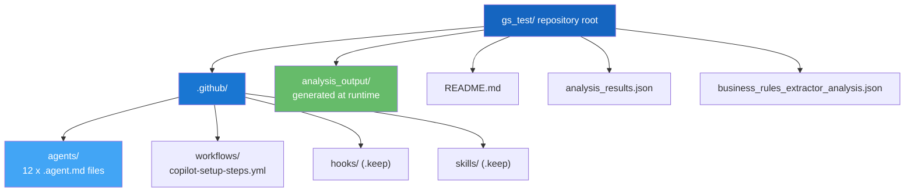

### 5.3 Level 3 — Agent Responsibilities

| Agent File | Responsibility | Key Outputs |
|------------|---------------|-------------|
| `orchestrator.agent.md` | Coordinates all agents; manages execution order and dependencies | Agent invocation sequence |
| `code-documentor.agent.md` | Extracts APIs, business logic, data models, function documentation | `analysis_results.json`, `business_rules_extractor_analysis.json` |
| `ast-analyzer.agent.md` | Parses source code into Abstract Syntax Trees for structural analysis | `[Class]_AST.json`, `AST_Analysis_Summary.md` |
| `code-assessor.agent.md` | Measures complexity, coupling, cohesion; identifies technical debt | `assessment_summary.json`, `COMPREHENSIVE_ASSESSMENT_REPORT.md` |
| `uml-generator.agent.md` | Generates UML class, sequence, and use-case diagrams in Mermaid | `class-diagram.md`, `sequence-diagram.md`, `use-case-diagram.md` |
| `bpmn-generator.agent.md` | Models business processes as BPMN 2.0 / Mermaid flowcharts | BPMN Markdown files |
| `ddl-generator.agent.md` | Derives database schemas from data models and relationships | `schema.sql`, `schema_summary.json` |
| `architecture-analyzer.agent.md` | Generates C4 context, component, deployment diagrams | Architecture Mermaid diagrams |
| `documentation-analyzer.agent.md` | Compares existing docs against code; identifies gaps | Documentation gap report |
| `executive-summary.agent.md` | Produces non-technical strategic summary with KPIs | Executive report Markdown |
| `arc42-documentor.agent.md` | Synthesizes all outputs into Arc42 architecture documentation | `ARC42_DOCUMENTATION.md` |
| `all-in-one-agent.md` | Single-agent alternative for simplified execution | All outputs from a single agent |

---

## 6. Runtime View

### 6.1 Full Analysis Pipeline Execution

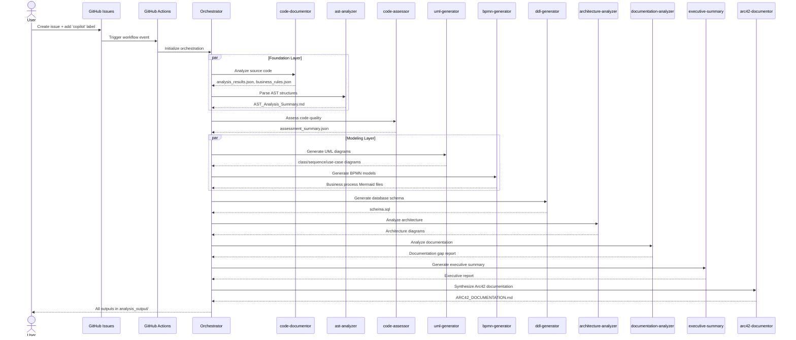

### 6.2 Issue-Label Trigger Workflow

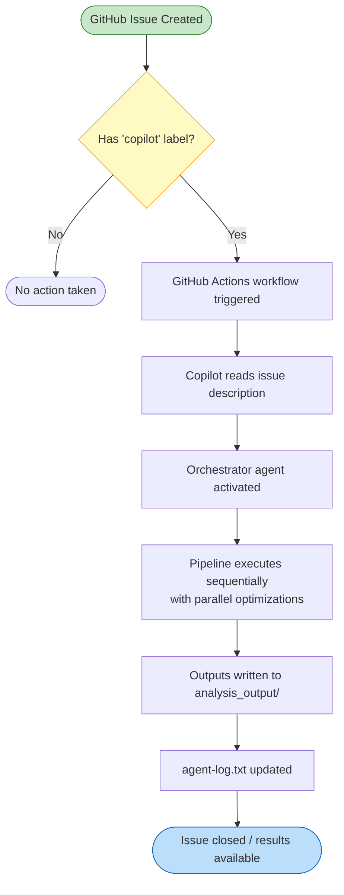

### 6.3 Key Business Scenarios

| Scenario | Trigger | Agents Involved | Output |
|----------|---------|-----------------|--------|
| Full codebase analysis | `copilot` label on issue | All 12 agents | Complete documentation suite |
| Quick single-agent analysis | Direct agent invocation | `all-in-one-agent` | Consolidated single report |
| Documentation refresh | Re-trigger on existing issue | `arc42-documentor`, `documentation-analyzer` | Updated Arc42 + gap report |
| Quality gate check | CI/CD integration | `code-assessor` | Quality metrics JSON |

---

## 7. Deployment View

### 7.1 Deployment Topology

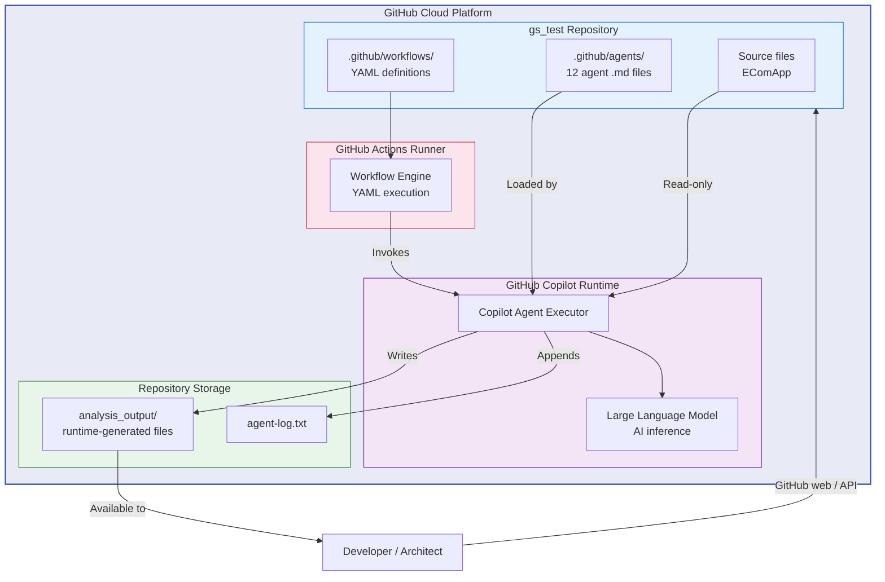

### 7.2 Infrastructure Requirements

| Component | Requirement | Notes |
|-----------|-------------|-------|
| GitHub Repository | Any plan supporting Actions | Public or private |
| GitHub Copilot | Enterprise or Workspace license | Required for agent execution |
| GitHub Actions | Standard hosted runner | Ubuntu latest sufficient |
| Storage | Repository file storage | Output files committed or as artifacts |
| Network | GitHub internal only | No external service calls required |

---

## 8. Crosscutting Concepts

### 8.1 Agent Communication Model

All inter-agent communication uses a **shared file system** pattern via `analysis_output/`. There is no direct agent-to-agent messaging. Agents consume upstream outputs by reading JSON/Markdown files written by predecessor agents.

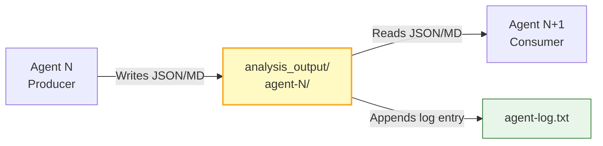

### 8.2 Logging and Traceability

Every agent appends to `analysis_output/agent-log.txt` in the format:

```
<ISO-8601 timestamp> | <agent-name> | created/updated | <relative-path> | <description>
```

This provides a complete, ordered audit trail of all analysis activity and enables full traceability from output artifact back to producing agent.

### 8.3 Design Patterns Applied

| Pattern | Where Applied | Purpose |
|---------|--------------|---------|
| **Pipeline / Chain of Responsibility** | Overall agent execution order | Sequential dependency management |
| **Parallel Fork-Join** | Steps 1+2 and Steps 4+5 | Reduce wall-clock execution time |
| **Aggregator / Synthesis** | `arc42-documentor` consuming all outputs | Produce unified documentation |
| **Specification Pattern** | `.agent.md` files with YAML frontmatter | Declarative agent capability definition |
| **Read Model / CQRS** | Read-only source analysis | Prevent side effects on analyzed codebase |
| **Facade** | `all-in-one-agent.md` | Simplified single-agent access to full pipeline |

### 8.4 Domain Model

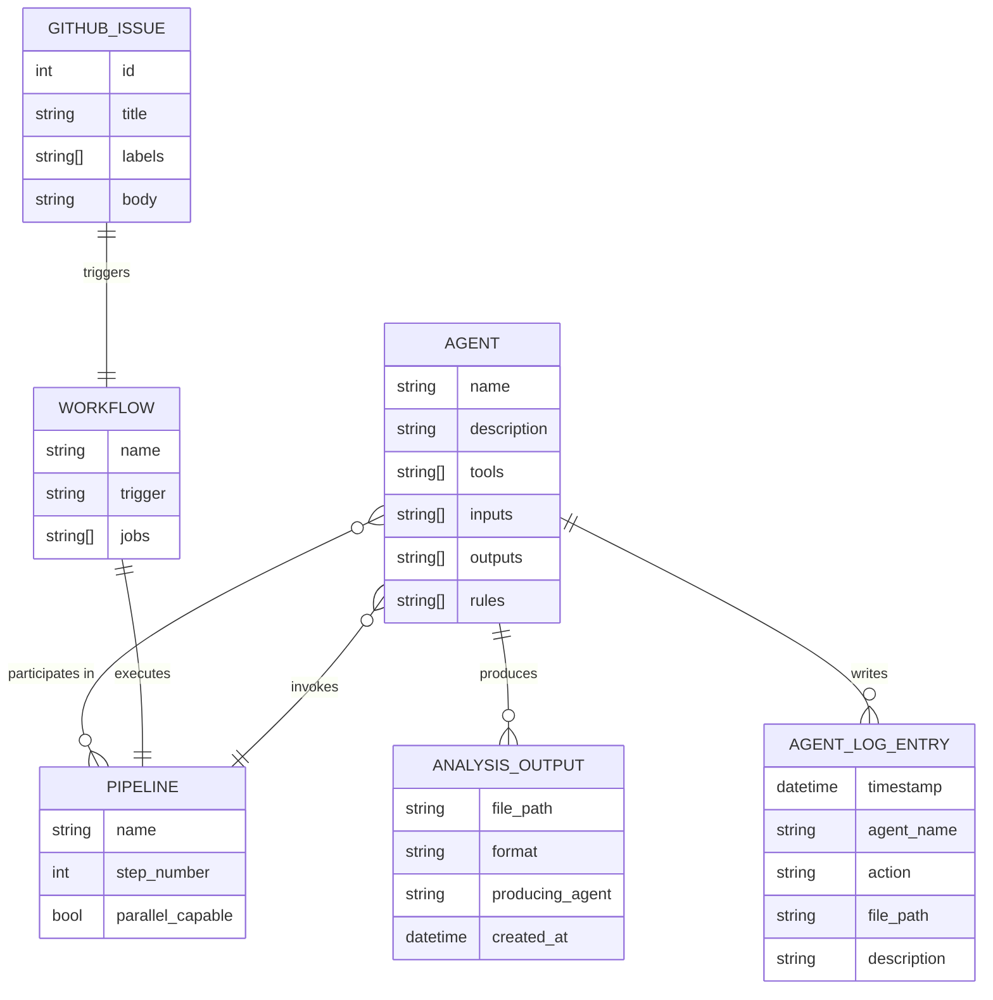

### 8.5 Business Rules (extracted from business_rules_extractor_analysis.json)

| Rule ID | Rule | Description |
|---------|------|-------------|
| BR-01 | **Sequential Dependency** | Downstream agents MUST NOT run before their upstream dependencies have produced output files |
| BR-02 | **Read-Only Constraint** | No agent may modify source code files; analysis is purely observational |
| BR-03 | **Output Isolation** | Each agent writes ONLY to its own `analysis_output/<agent-name>/` subdirectory |
| BR-04 | **Log Mandatory** | Every file creation/update MUST be recorded in `agent-log.txt` |
| BR-05 | **Mermaid-Only Diagrams** | All generated diagrams MUST use Mermaid syntax; PlantUML and ASCII art are prohibited |
| BR-06 | **Self-Contained Output** | The Arc42 document must embed all diagrams inline; no external file references |
| BR-07 | **Issue-Driven Activation** | The pipeline MUST only activate when a GitHub issue has the `copilot` label assigned |
| BR-08 | **No Secrets in Output** | Agent outputs must never include API keys, tokens, passwords, or credentials |

---

## 9. Architecture Decisions

### ADR-001: Multi-Agent Architecture over Monolithic Analysis

| Field | Value |
|-------|-------|
| **Status** | Accepted |
| **Context** | Code analysis encompasses many specialized domains (quality, UML, BPMN, DDL, architecture, docs). A single agent would be too large and unfocused. |
| **Decision** | Use 12 specialized agents, each with a narrow, well-defined responsibility. |
| **Positive Consequences** | High cohesion per agent; easy to update or replace individual agents independently |
| **Negative Consequences** | Requires orchestration; inter-agent file I/O adds latency |

---

### ADR-002: GitHub Copilot as Agent Runtime

| Field | Value |
|-------|-------|
| **Status** | Accepted |
| **Context** | Agent execution requires an AI runtime with LLM access, file system access, and GitHub integration. |
| **Decision** | Use GitHub Copilot natively. Agent specs are `.agent.md` files in `.github/agents/`. |
| **Positive Consequences** | Zero infrastructure cost; native GitHub integration; version-controlled specs |
| **Negative Consequences** | Dependency on GitHub Copilot Enterprise license availability |

---

### ADR-003: Markdown with YAML Frontmatter for Agent Specifications

| Field | Value |
|-------|-------|
| **Status** | Accepted |
| **Context** | Agent specifications need to be both machine-parseable (for runtime) and human-readable (for maintenance). |
| **Decision** | Use Markdown files with YAML frontmatter for name, description, tools, and rules. |
| **Positive Consequences** | Version-controllable; readable in GitHub UI; standard format |
| **Negative Consequences** | No schema validation; typos in specs may cause silent failures |

---

### ADR-004: File System as Inter-Agent Communication Bus

| Field | Value |
|-------|-------|
| **Status** | Accepted |
| **Context** | Agents need to share structured data. Options considered: shared memory, API calls, file system. |
| **Decision** | Use `analysis_output/` directory as the communication medium. Agents write JSON/Markdown; consumers read those files. |
| **Positive Consequences** | Simple, auditable, persistent, human-inspectable |
| **Negative Consequences** | No real-time streaming; agents must wait for file existence before proceeding |

---

### ADR-005: Mermaid as Universal Diagram Format

| Field | Value |
|-------|-------|
| **Status** | Accepted |
| **Context** | Diagrams need to render natively in GitHub without external services. |
| **Decision** | All diagrams use Mermaid syntax in fenced code blocks. |
| **Positive Consequences** | Renders in GitHub Markdown natively; text-based and version-controllable |
| **Negative Consequences** | Limited to Mermaid's diagram types; complex diagrams may hit syntax limitations |

---

### ADR-006: Parallel Execution at Steps 1-2 and 4-5

| Field | Value |
|-------|-------|
| **Status** | Accepted |
| **Context** | `code-documentor` and `ast-analyzer` are independent; `uml-generator` and `bpmn-generator` are independent. |
| **Decision** | These pairs execute in parallel to reduce total pipeline duration. |
| **Positive Consequences** | Faster overall execution |
| **Negative Consequences** | Requires orchestrator to manage join synchronization before proceeding to next step |

---

## 10. Quality Requirements

### 10.1 Quality Tree

```mermaid
graph TD
    Q["Quality Goals"]
    Q --> C["Correctness"]
    Q --> CM["Completeness"]
    Q --> TR["Traceability"]
    Q --> AU["Automation"]
    Q --> EX["Extensibility"]
    Q --> PF["Performance"]

    C --> C1["Agent outputs reflect actual source code"]
    C --> C2["No hallucinated APIs or classes"]

    CM --> CM1["All 12 agents produce output"]
    CM --> CM2["Arc42 synthesizes all findings"]

    TR --> TR1["agent-log.txt audit trail"]
    TR --> TR2["Outputs reference source files"]

    AU --> AU1["Single label triggers full pipeline"]
    AU --> AU2["No manual steps required"]

    EX --> EX1["New agents added without changing orchestrator"]
    EX --> EX2["Agent specs are self-contained"]

    PF --> PF1["Parallel execution where possible"]
    PF --> PF2["Incremental output generation"]

    style Q fill:#1565C0,color:#fff
    style C fill:#e3f2fd,stroke:#1976D2
    style CM fill:#e8f5e9,stroke:#2E7D32
    style TR fill:#fff3e0,stroke:#E65100
    style AU fill:#fce4ec,stroke:#C62828
    style EX fill:#f3e5f5,stroke:#7B1FA2
    style PF fill:#fff9c4,stroke:#F9A825
```

### 10.2 Quality Scenarios

| Quality Goal | Scenario | Expected Response | Metric |
|-------------|----------|------------------|--------|
| Correctness | Agent analyzes EComApp source | Output references actual class names | 0 hallucinated entities |
| Completeness | Full pipeline runs | All 12 agents produce output | 12/12 agents complete |
| Traceability | Any output file questioned | Traceable back to `agent-log.txt` entry | 100% logged operations |
| Automation | Issue labeled `copilot` | Pipeline triggers without manual steps | < 2 min to first output |
| Extensibility | New agent added | Existing agents unaffected | 0 changes to other agents required |

### 10.3 Technical Metrics (from analysis_results.json)

| Metric | Value |
|--------|-------|
| Total agent specification files | 12 |
| Total repository files analyzed | 16 |
| Execution pipeline steps | 10 (with 2 parallel pairs) |
| Output formats produced | JSON, Markdown, SQL, Mermaid |
| Agent communication mechanism | Shared `analysis_output/` file system |
| Workflow trigger | GitHub issue label event (`copilot`) |
| Main business domains covered | 7 (Documentation, Quality, Architecture, Database, BPMN, Executive Reporting, Doc Analysis) |

---

## 11. Risks and Technical Debt

### 11.1 Identified Risks

| Risk ID | Risk | Probability | Impact | Mitigation |
|---------|------|-------------|--------|------------|
| R-01 | **GitHub Copilot API changes** break agent spec format | Medium | High | Pin to specific Copilot version; monitor deprecation notices |
| R-02 | **LLM hallucination** produces inaccurate analysis outputs | Medium | High | Add output validation step; cross-reference outputs between agents |
| R-03 | **Agent timeout** for large codebases exceeds GitHub Actions limits | Medium | Medium | Split large codebases; use incremental analysis patterns |
| R-04 | **Sequential dependency failure** — upstream agent fails, blocking all downstream | Low | High | Add failure detection; write partial outputs with error markers |
| R-05 | **No schema validation** on YAML frontmatter in agent specs | High | Medium | Add linting step to CI; create JSON Schema for agent spec format |
| R-06 | **Storage limits** on very large analysis outputs committed to repo | Low | Low | Use GitHub Actions artifacts instead of committing large files |
| R-07 | **License cost** — GitHub Copilot Enterprise required for full agent execution | High | High | Document license requirements clearly; evaluate OSS alternatives |

### 11.2 Technical Debt Inventory

| Debt ID | Item | Severity | Effort | Description |
|---------|------|----------|--------|-------------|
| TD-01 | **No agent spec validation** | High | Medium | YAML frontmatter has no schema; typos are silently ignored at runtime |
| TD-02 | **No retry/resilience logic** | Medium | Medium | If an agent fails mid-execution, there is no automatic retry or recovery |
| TD-03 | **No output schema versioning** | Medium | Low | JSON output formats can change between agent versions without detection |
| TD-04 | **Monolithic orchestrator** | Low | High | The orchestrator defines all execution order inline; difficult to reconfigure |
| TD-05 | **No automated tests for agent specs** | High | High | Agent specifications have no unit or integration test coverage |
| TD-06 | **README may lag behind agent changes** | Low | Low | Documentation drift between README.md and actual agent capabilities |

### 11.3 Risk Heat Map

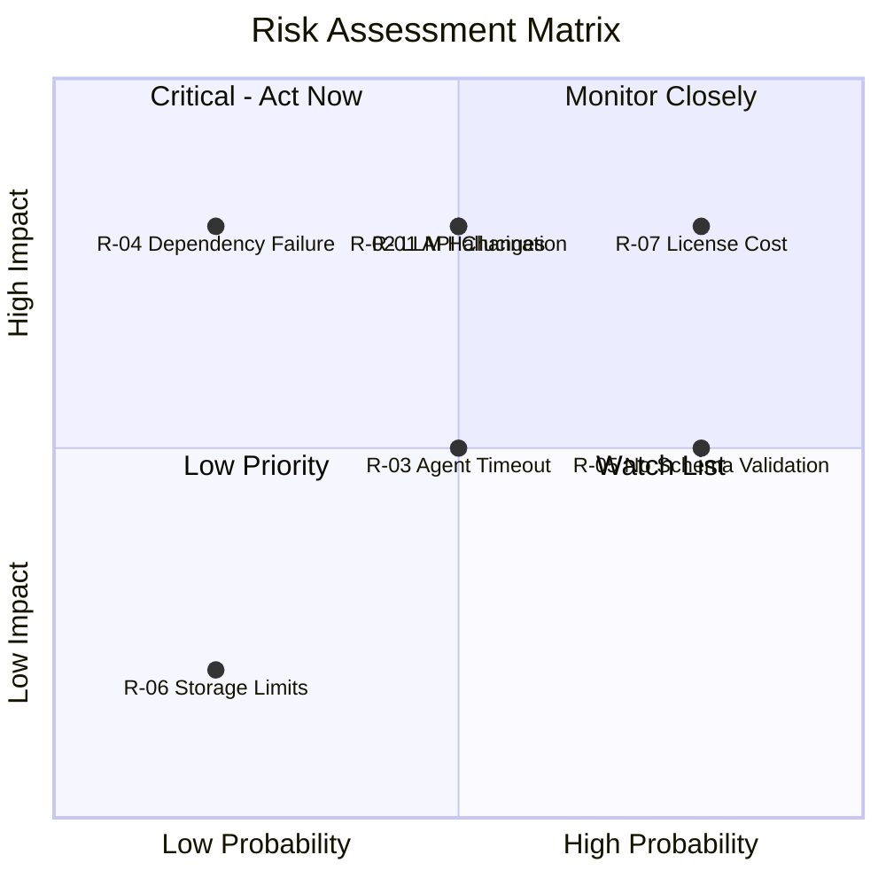

### 11.4 Mitigation Priorities

1. **Immediate**: Document GitHub Copilot license requirements (R-07); add YAML schema validation (R-05 / TD-01)
2. **Short-term**: Implement agent spec test harness (TD-05); add retry logic to orchestrator (TD-02)
3. **Medium-term**: Add output schema versioning (TD-03); modularize orchestrator configuration (TD-04)
4. **Ongoing**: Monitor GitHub Copilot API changes (R-01); validate outputs for hallucinations (R-02)

---

## 12. Glossary

| Term | Definition |
|------|-----------|
| **Agent** | A specialized GitHub Copilot AI unit defined by a `.agent.md` specification file in `.github/agents/`. Each agent has a narrow, focused responsibility within the analysis pipeline. |
| **Agent Specification** | A Markdown file with YAML frontmatter that declares an agent's name, description, tools, input/output contracts, and operating rules. |
| **Arc42** | A standardized software architecture documentation template with 12 sections, developed by Dr. Gernot Starke and Peter Hruschka. Used as the final output format for this system. |
| **AST** | Abstract Syntax Tree — a tree representation of the syntactic structure of source code, used by the `ast-analyzer` agent for structural analysis. |
| **BPMN** | Business Process Model and Notation — an international standard for graphically representing business processes, produced by the `bpmn-generator` agent. |
| **Copilot** | GitHub Copilot — an AI coding assistant that, in this context, serves as the agent execution runtime for all 12 specialized agents. |
| **DDL** | Data Definition Language — SQL statements used to define database schemas (CREATE TABLE, etc.), produced by the `ddl-generator` agent. |
| **EComApp** | The target ECommerce application being analyzed by the multi-agent system. The actual source code under analysis. |
| **GitHub Actions** | GitHub's CI/CD platform used to trigger and coordinate the agent pipeline via YAML workflow definitions. |
| **Mermaid** | A JavaScript-based diagramming tool that renders diagrams from text definitions embedded in Markdown fenced code blocks. The only permitted diagram format. |
| **Orchestrator** | The central coordinating agent (`orchestrator.agent.md`) responsible for sequencing all other agents and managing dependencies. |
| **Pipeline** | The ordered sequence of agent executions, with defined dependencies, parallelism points, and data flow between steps. |
| **UML** | Unified Modeling Language — a standardized modeling language for visualizing software systems (class diagrams, sequence diagrams, use-case diagrams), produced by the `uml-generator` agent. |
| **agent-log.txt** | The shared audit log file in `analysis_output/` where every agent records its file operations with ISO timestamps. Provides full traceability. |
| **analysis_output/** | The root output directory where all agents write their analysis results during pipeline execution. Organized by agent name subdirectories. |
| **all-in-one-agent** | A single consolidated agent (`all-in-one-agent.md`) that can perform the full analysis without orchestration, intended for simplified use cases. |
| **YAML Frontmatter** | Structured metadata at the top of a Markdown file delimited by `---`, used to declare agent properties such as name, description, and tool list. |
| **Fork-Join** | A parallelism pattern where independent agents start simultaneously (fork) and results are collected before the next step proceeds (join). Used at pipeline steps 1-2 and 4-5. |

---

*Documentation generated by arc42-documentor | Source: analysis_results.json + business_rules_extractor_analysis.json | Arc42 Template v8 | 2025-07-14*
