# Architecture Documentation (Arc42)

**Project**: NotificationApp — Multi-Agent Code Analysis & Notification Platform  
**Repository**: `gs_test` (GitHub Copilot agent test repository)  
**Version**: 1.0.0  
**Date**: 2025-01-30  
**Generated by**: Arc42 Documentation Generator (`arc42-documentor`)  
**Source**: `.github/agents/` (13 agent definitions) · `.github/workflows/copilot.yml`

---

## Table of Contents

1. [Introduction and Goals](#1-introduction-and-goals)
2. [Architecture Constraints](#2-architecture-constraints)
3. [System Scope and Context](#3-system-scope-and-context)
4. [Solution Strategy](#4-solution-strategy)
5. [Building Block View](#5-building-block-view)
6. [Runtime View](#6-runtime-view)
7. [Deployment View](#7-deployment-view)
8. [Cross-cutting Concepts](#8-cross-cutting-concepts)
9. [Architecture Decisions](#9-architecture-decisions)
10. [Quality Requirements](#10-quality-requirements)
11. [Risks and Technical Debt](#11-risks-and-technical-debt)
12. [Glossary](#12-glossary)

---

## 1. Introduction and Goals

### 1.1 Purpose and Business Context

The **NotificationApp** (formally: *gs_test — GitHub Copilot Agent Test Repository*) is a **multi-agent code analysis and notification platform** built natively on the GitHub Copilot infrastructure. It automates the end-to-end lifecycle of source code analysis: from receiving a trigger event (a GitHub Issue labeled `copilot-needed`) through orchestrated multi-agent processing, all the way to delivery of comprehensive architectural documentation back to stakeholders.

The system treats each specialized analysis capability as an autonomous **agent-microservice**, defined entirely in Markdown (`.agent.md` files). These agents are coordinated by one or more **orchestrator agents** that manage sequencing, dependency resolution, and result synthesis. The final artifact — an Arc42 architecture document — is the primary "notification" delivered to the requester.

The platform demonstrates a **configuration-as-code** philosophy: the entire behavior of the system is encoded in human-readable Markdown agent definitions residing in `.github/agents/`, making the system self-documenting and version-controlled by design.

### 1.2 Key Requirements

| ID | Requirement | Priority |
|----|-------------|----------|
| REQ-01 | Automatically trigger analysis pipeline when GitHub Issues are labeled `copilot-needed` | High |
| REQ-02 | Perform comprehensive source code analysis (documentation, quality, AST, architecture) | High |
| REQ-03 | Generate visual artifacts exclusively in Mermaid format (no PlantUML, no ASCII art) | High |
| REQ-04 | Produce self-contained Arc42 architecture documentation as the final output | High |
| REQ-05 | Support multi-language, multi-framework codebases without technology restrictions | Medium |
| REQ-06 | Maintain a structured audit log (`analysis_output/agent-log.txt`) of all agent actions | Medium |
| REQ-07 | Operate in analysis-only mode — never modify source code files | High |
| REQ-08 | Allow both full-pipeline and targeted (selective) agent execution | Medium |
| REQ-09 | Provide executive-level insights consumable by non-technical stakeholders | Medium |
| REQ-10 | Support incremental output generation to handle large codebases without context overflow | Medium |

### 1.3 Quality Goals

The following quality goals drive the architectural decisions of the NotificationApp platform, listed in priority order:

| Priority | Quality Goal | Motivation |
|----------|-------------|------------|
| 1 | **Safety / Non-Destructiveness** | Agents must never modify source code. The system is purely observational and analytical. |
| 2 | **Correctness** | Analysis results must accurately reflect the actual code under analysis. |
| 3 | **Automation** | The pipeline must be fully automatable via GitHub Actions label-trigger events with zero manual steps. |
| 4 | **Extensibility** | New agent types can be added by creating a new `.agent.md` file without changing existing components. |
| 5 | **Traceability** | All agent actions are logged with ISO timestamps to `agent-log.txt`. |
| 6 | **Self-Containedness** | The final Arc42 document must be fully self-contained — no external file references. |
| 7 | **Visual Clarity** | All diagrams must render in standard Markdown viewers using Mermaid syntax with applied color styling. |

### 1.4 Stakeholders

| Stakeholder | Role | Interest / Expectation |
|-------------|------|------------------------|
| **Development Teams** | Code owners | Receive accurate documentation and quality metrics for their codebase |
| **Software Architects** | Architecture reviewers | Receive Arc42 documentation with embedded diagrams and Architecture Decision Records |
| **Engineering Managers** | Decision makers | Receive executive summaries with risk assessments and ROI estimates |
| **DevOps Engineers** | Pipeline operators | Manage GitHub Actions workflow and agent runtime environment |
| **GitHub Copilot Platform** | Infrastructure provider | Executes agent definitions in `.github/agents/` via Copilot runtime |
| **Documentation Teams** | Doc quality analysts | Receive documentation gap reports and improvement recommendations |
| **Security Teams** | Security reviewers | Receive security findings from code quality assessments |
| **New Team Members** | Onboarding developers | Consume generated documentation to understand system architecture quickly |

---

## 2. Architecture Constraints

### 2.1 Technical Constraints

| ID | Constraint | Source | Impact |
|----|-----------|--------|--------|
| TC-01 | All agent definitions must be valid Markdown files (`.agent.md`) with YAML front-matter (`name`, `description`, `tools`) | GitHub Copilot agent runtime | Shapes agent specification format entirely |
| TC-02 | Agent tools are limited to the Copilot-provided set: `read`, `search`, `edit`, `todo`, `agent` | GitHub Copilot platform | No arbitrary code execution; analysis-only capability |
| TC-03 | All diagrams must use Mermaid syntax only — PlantUML and ASCII art are strictly prohibited | Cross-cutting convention (all 13 agents) | Standardizes visualization tooling across the platform |
| TC-04 | JSON outputs must be parsable by Python's `json.loads()` — strict JSON, no comments, no extra text | code-documentor, ast-analyzer conventions | Machine-readable inter-agent data exchange |
| TC-05 | GitHub Actions workflow (`copilot.yml`) uses `otto-de/assign_issue_toCopilot_action@v1.0.1` | `.github/workflows/copilot.yml` | External action dependency; version-pinned at `v1.0.1` |
| TC-06 | Workflow trigger is exclusively the `labeled` event on Issues with label `copilot-needed` | `.github/workflows/copilot.yml` | Event-driven only; no polling or scheduled runs |
| TC-07 | Output files are written under `analysis_output/` with agent-specific sub-folders | All agent definitions | Enforces output isolation and structured layout |
| TC-08 | The orchestrator agent uses `runSubagent()` for inter-agent calls | code-analysis-orchestrator | Sequential agent invocation model |
| TC-09 | Agents run on `ubuntu-latest` GitHub Actions runners | `.github/workflows/copilot.yml` | Linux-based execution environment |
| TC-10 | Python `diagrams` library requires Graphviz for rendering (architecture-analyzer) | `architecture-analyzer.agent.md` | External dependency for diagram PNG generation |

### 2.2 Organizational Constraints

| ID | Constraint | Impact |
|----|-----------|--------|
| OC-01 | The system is a **test/prototype repository** (`gs_test` — "Github Copilot agent test repository") | Feature scope is experimental; production hardening may be limited |
| OC-02 | No custom source code exists — the system is defined entirely through Markdown agent files | Architecture is declarative; behavior is encoded in `.agent.md` definitions |
| OC-03 | Agents operate in **read-only** mode with respect to the analyzed codebase | Safety constraint: zero risk of unintended source modifications |
| OC-04 | All agents must log every file creation/modification to `analysis_output/agent-log.txt` | Audit trail requirement enforced across all agent definitions |
| OC-05 | The `code-documentor` agent has a special initial log entry: `"I am a penguin"` | Quirky convention embedded in agent definition; likely a test/identity marker |

### 2.3 Conventions

| Convention | Description |
|-----------|-------------|
| **Agent Naming** | Agent files follow `<name>.agent.md` convention; agent `name` values are kebab-case |
| **Output Structure** | `analysis_output/<agent-name>/` for agent-specific outputs; `analysis_output/agent-log.txt` for shared audit log |
| **Log Format** | `<ISO8601 timestamp> \| <agent-name> \| created/updated \| <relative-path> \| <short description>` |
| **JSON Outputs** | Single-line, no code fences, no explanations — pure machine-readable JSON parseable by Python |
| **Markdown Outputs** | Human-readable with embedded Mermaid code blocks; no external file references |
| **Complexity Scale** | 0–10 for code and logic complexity (code-assessor convention) |
| **Criticality Scale** | 1–5 for issue severity: 5=Blocker → 1=Trivial |
| **Priority Scale** | 1–5 for enhancement urgency: 5=Critical → 1=Optional |
| **Diagram Direction** | `TB` (top-to-bottom) for workflows; `LR` (left-to-right) for component views |
| **Agent Communication** | Every agent announces its own name at the start of every chat output |

---

## 3. System Scope and Context

### 3.1 Business Context

The NotificationApp operates within the **GitHub ecosystem** as an automated code intelligence service. Its business boundary is defined by:

- **Input**: A GitHub Issue with the label `copilot-needed` applied by a developer
- **Processing**: Multi-agent analysis pipeline coordinated by the orchestrator
- **Output**: Structured analysis artifacts (JSON, Markdown, diagrams) + Arc42 architecture documentation

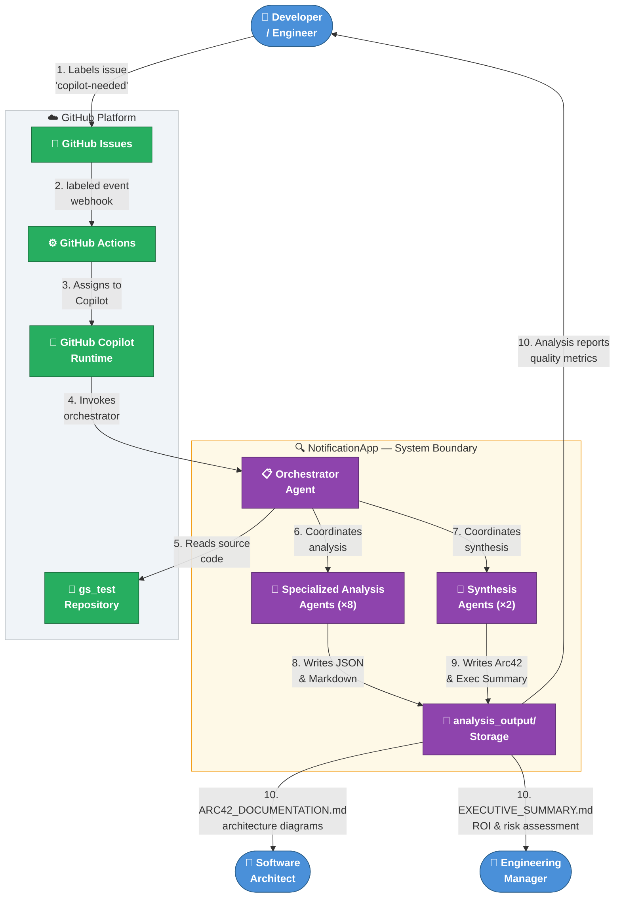

**External Actor Summary:**

| External Actor/System | Interaction Type | Direction |
|----------------------|-----------------|-----------|
| **Developer** | Labels Issues; consumes analysis reports and quality metrics | In / Out |
| **Software Architect** | Consumes Arc42 documentation and architecture diagrams | Out |
| **Engineering Manager** | Consumes executive summaries, risk assessments, ROI estimates | Out |
| **GitHub Issues** | Event source — triggers the pipeline via the `copilot-needed` label | In |
| **GitHub Actions** | CI/CD runtime — detects label event, invokes the Copilot action | In |
| **GitHub Copilot Runtime** | Executes agent definitions; provides tool capabilities | In |
| **Source Repository** | Analyzed artifact — agents read but never modify source files | In |

### 3.2 Technical Context

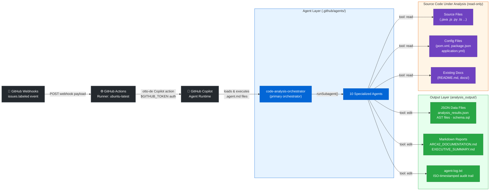

**Technical Interface Summary:**

| Interface | Protocol / Format | Direction | Notes |
|-----------|-----------------|-----------|-------|
| GitHub Webhook | HTTPS / JSON payload | Inbound | `issues.labeled` event; filtered by label name |
| GitHub Actions | YAML workflow definition | Internal | `copilot.yml` in `.github/workflows/` |
| otto-de Copilot Action | GitHub Action (v1.0.1) | Internal | External action from `otto-de` GitHub org |
| Agent Tool: `read` | File system read | Internal | Source code, config files, existing docs |
| Agent Tool: `search` | Semantic/text search | Internal | Codebase search within active context |
| Agent Tool: `edit` | File system write | Internal | Restricted to `analysis_output/` only |
| Agent Tool: `agent` / `runSubagent` | Sub-agent invocation | Internal | Orchestrators invoke specialized agents |
| JSON Data Exchange | Strict JSON (no comments) | Internal | Inter-agent data passing via filesystem |
| Mermaid Diagrams | Markdown code blocks | Output | All visual outputs embedded in Markdown |

---

## 4. Solution Strategy

### 4.1 Core Strategic Decisions

The NotificationApp was architected around four foundational strategic decisions:

**Decision 1 — Agent-as-Microservice Pattern**: Each analysis capability is encapsulated as an independent, self-describing agent defined in a Markdown file. Each agent has a single responsibility, communicates through well-defined JSON/Markdown interfaces, and can be updated independently by editing its `.agent.md` file.

**Decision 2 — Declarative Configuration-as-Code**: Rather than implementing analysis logic in traditional compiled code, the system encodes all behavior in YAML-fronted Markdown definitions. This makes the system self-documenting, version-controllable through standard Git workflows, and auditable without specialized tooling.

**Decision 3 — Event-Driven Trigger Model**: The pipeline is entirely event-driven. A GitHub Issue label event (`copilot-needed`) is the sole trigger, eliminating polling and reducing compute costs while aligning with GitHub's native CI/CD primitives.

**Decision 4 — Dual Orchestration Strategy**: Two orchestration approaches are supported:
- **Sequential Orchestration** (`code-analysis-orchestrator`): Explicit dependency-aware agent sequencing
- **Monolithic Integration** (`all-in-one-agent`): Single agent combining all capabilities for simpler deployments

### 4.2 Technology Stack Decisions

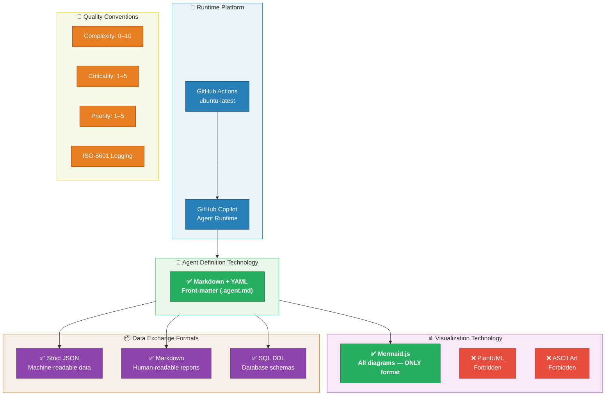

### 4.3 Top-Level Decomposition Strategy

The system decomposes into three horizontal layers:

| Layer | Components | Responsibility |
|-------|-----------|----------------|
| **Orchestration Layer** | `code-analysis-orchestrator`, `all-in-one-agent`, `insights_orchestrator`, `orchestrator` | Workflow coordination, agent sequencing, dependency management |
| **Analysis Layer** | 8 specialized agents (`code-documentor` through `documentation-analyzer`) | Focused, single-responsibility analysis capabilities |
| **Synthesis Layer** | `executive-summary` + `arc42-documentor` | Aggregation of analysis results into final human-readable artifacts |
| **Output Layer** | `analysis_output/` filesystem | Structured artifact storage; inter-agent communication bus |

### 4.4 Approaches to Quality Goals

| Quality Goal | Architectural Approach |
|-------------|----------------------|
| **Non-Destructiveness** | `read` and `search` tools only on source code; `edit` tool restricted to `analysis_output/` |
| **Extensibility** | New capabilities → new `.agent.md` file; no changes to existing agents required |
| **Automation** | GitHub Actions label-event trigger; zero manual intervention needed end-to-end |
| **Traceability** | Mandatory ISO-timestamp logging to `agent-log.txt` after every file operation |
| **Self-Containedness** | Arc42 documentor embeds all Mermaid code directly; no external file references |
| **Incremental Processing** | All agents support step-by-step output generation to avoid context limits on large codebases |

---

## 5. Building Block View

### 5.1 Level 1 — Whitebox: Overall System

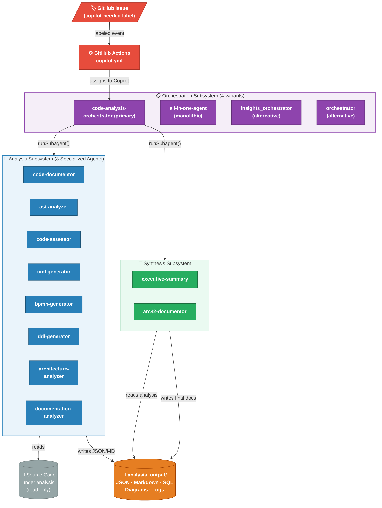

**Subsystem Responsibilities:**

| Subsystem | Key Components | Responsibility | Primary Interface |
|-----------|---------------|----------------|-------------------|
| **Orchestration** | 4 orchestrators | Workflow coordination, agent sequencing, targeted vs. full pipeline selection | `runSubagent()` calls |
| **Analysis** | 8 specialized agents | Targeted single-responsibility code analysis | Reads source code; writes to `analysis_output/<agent>/` |
| **Synthesis** | executive-summary + arc42-documentor | Aggregation of all results into final artifacts | Reads all `analysis_output/`; writes final reports |

### 5.2 Level 2 — Analysis Subsystem: Blackbox Descriptions

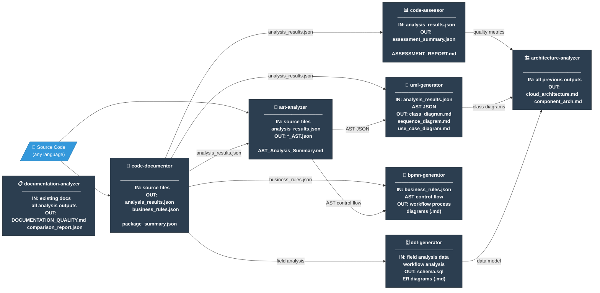

**Agent Blackbox Descriptions:**

| Agent | Single Responsibility | Primary Inputs | Primary Outputs |
|-------|----------------------|----------------|-----------------|
| **code-documentor** | Source code documentation & business logic extraction | Source files (any language) | `analysis_results.json`, `business_rules_extractor_analysis.json` |
| **ast-analyzer** | Abstract Syntax Tree generation & structural analysis | Source files, `analysis_results.json` | `*_AST.json`, `AST_Analysis_Summary.md` |
| **code-assessor** | Code quality assessment & technical debt identification | `analysis_results.json` | `assessment_summary.json`, `COMPREHENSIVE_ASSESSMENT_REPORT.md` |
| **uml-generator** | UML class, sequence, and use case diagram generation (Mermaid) | `analysis_results.json`, AST JSON | `class_diagram.md`, `sequence_diagram.md`, `use_case_diagram.md` |
| **bpmn-generator** | Business process modeling from code workflows | `business_rules_extractor_analysis.json`, AST JSON | Mermaid flowchart `.md` files |
| **ddl-generator** | SQL DDL schema generation from data model analysis | Field analysis from code-documentor | `schema.sql`, ER diagram Markdown files |
| **architecture-analyzer** | Cloud & component architecture diagram generation | All previous agent outputs | `cloud_architecture.md`, `component_architecture.md` |
| **documentation-analyzer** | Documentation quality analysis & gap reporting | Existing docs + all analysis outputs | `DOCUMENTATION_QUALITY_REPORT.md`, `comparison_report.json` |
| **executive-summary** | Strategic synthesis for non-technical stakeholders | All analysis agent outputs | `EXECUTIVE_SUMMARY.md` |
| **arc42-documentor** | Arc42 architecture documentation synthesis | All previous outputs including executive summary | `ARC42_DOCUMENTATION.md` |

### 5.3 Level 3 — Agent Internal Class Structure

```mermaid
classDiagram
    class AgentDefinition {
        <<interface>>
        +String name
        +String description
        +List~String~ tools
        +String systemPrompt
        +execute(request: String) String
        +logAction(path: String, description: String) void
    }

    class OrchestratorAgent {
        <<abstract>>
        +coordinateAgents(request: String) void
        +planExecution(scope: AnalysisScope) ExecutionPlan
        +runSubagent(agentName: String, task: String) AgentOutput
        +handleAgentError(agent: String, error: Error) void
        +determineScope(issueBody: String) AnalysisScope
    }

    class AnalysisAgent {
        <<abstract>>
        +readSourceFile(path: String) String
        +searchCodebase(query: String) List~SearchResult~
        +writeOutput(path: String, content: String) void
        +appendToLog(entry: LogEntry) void
        +processIncrementally(files: List~String~) void
    }

    class CodeDocumentor {
        +analyzeFile(file: SourceFile) FileAnalysis
        +extractBusinessRules(file: SourceFile) List~BusinessRule~
        +classifyFile(file: SourceFile) FileCategory
        +generateAnalysisResultsJson() JSON
        +generateBusinessRulesJson() JSON
    }

    class ASTAnalyzer {
        +parseSourceFile(file: SourceFile) AST
        +extractTypeDeclarations(ast: AST) List~TypeDecl~
        +extractMethods(ast: AST) List~Method~
        +extractDependencies(ast: AST) List~Dependency~
        +generateASTJson(ast: AST) JSON
    }

    class CodeAssessor {
        +assessComplexity(file: SourceFile) ComplexityScore
        +detectIssues(file: SourceFile) List~Issue~
        +identifyTechnicalDebt(file: SourceFile) List~DebtItem~
        +rateIssueCriticality(issue: Issue) Int
        +generateEnhancements(analysis: FileAnalysis) List~Enhancement~
    }

    class UMLGenerator {
        +generateClassDiagram(analysis: FileAnalysis) MermaidCode
        +generateSequenceDiagram(workflow: Workflow) MermaidCode
        +generateUseCaseDiagram(actors: List~Actor~) MermaidCode
    }

    class BPMNGenerator {
        +mapCodeToBPMN(ast: AST) ProcessModel
        +generateFlowchart(process: ProcessModel) MermaidCode
        +addSwimlanes(process: ProcessModel) MermaidCode
        +handleErrorPaths(ast: AST) MermaidCode
    }

    class DDLGenerator {
        +identifyEntities(analysis: FileAnalysis) List~Entity~
        +generateTableDDL(entity: Entity) SQL
        +generateForeignKeys(relationships: List) SQL
        +generateIndexes(patterns: List~QueryPattern~) SQL
        +generateERDiagram(schema: Schema) MermaidCode
    }

    class ArchitectureAnalyzer {
        +detectArchitecturePattern(files: List) ArchPattern
        +generateCloudDiagram(provider: CloudProvider) MermaidCode
        +generateComponentDiagram(components: List) MermaidCode
        +mapToCloudServices(technology: String) List~CloudService~
    }

    class DocumentationAnalyzer {
        +analyzeDocQuality(doc: Document) QualityScore
        +identifyGaps(doc: Document, code: CodeAnalysis) List~Gap~
        +compareWithCode(doc: Document, code: CodeAnalysis) ComparisonReport
        +generateRecommendations(gaps: List~Gap~) List~Recommendation~
    }

    class ExecutiveSummary {
        +synthesizeFindings(analyses: List~AgentOutput~) ExecSummaryDoc
        +generateHealthScore(metrics: QualityMetrics) HealthScore
        +prioritizeRecommendations(findings: List) List~Recommendation~
        +estimateROI(recommendations: List) CostBenefit
    }

    class Arc42Documentor {
        +generateSection(section: Arc42Section, data: AgentOutputs) String
        +embedMermaidDiagram(code: MermaidCode) String
        +synthesizeAllSections() Arc42Document
        +validateSelfContained(doc: Arc42Document) Boolean
    }

    AgentDefinition <|.. OrchestratorAgent
    AgentDefinition <|.. AnalysisAgent
    OrchestratorAgent --> AnalysisAgent : coordinates
    AnalysisAgent <|-- CodeDocumentor
    AnalysisAgent <|-- ASTAnalyzer
    AnalysisAgent <|-- CodeAssessor
    AnalysisAgent <|-- UMLGenerator
    AnalysisAgent <|-- BPMNGenerator
    AnalysisAgent <|-- DDLGenerator
    AnalysisAgent <|-- ArchitectureAnalyzer
    AnalysisAgent <|-- DocumentationAnalyzer
    AnalysisAgent <|-- ExecutiveSummary
    AnalysisAgent <|-- Arc42Documentor
    CodeDocumentor ..> ASTAnalyzer : provides analysis_results.json to
    CodeDocumentor ..> CodeAssessor : provides analysis_results.json to
    CodeDocumentor ..> UMLGenerator : provides analysis_results.json to
    CodeDocumentor ..> BPMNGenerator : provides business_rules.json to
    Arc42Documentor ..> ExecutiveSummary : reads EXECUTIVE_SUMMARY.md from
    Arc42Documentor ..> ArchitectureAnalyzer : reads architecture diagrams from
```

---

## 6. Runtime View

### 6.1 Scenario 1: Full Analysis Pipeline (Standard Execution)

The primary runtime flow triggered when a GitHub Issue receives the `copilot-needed` label:

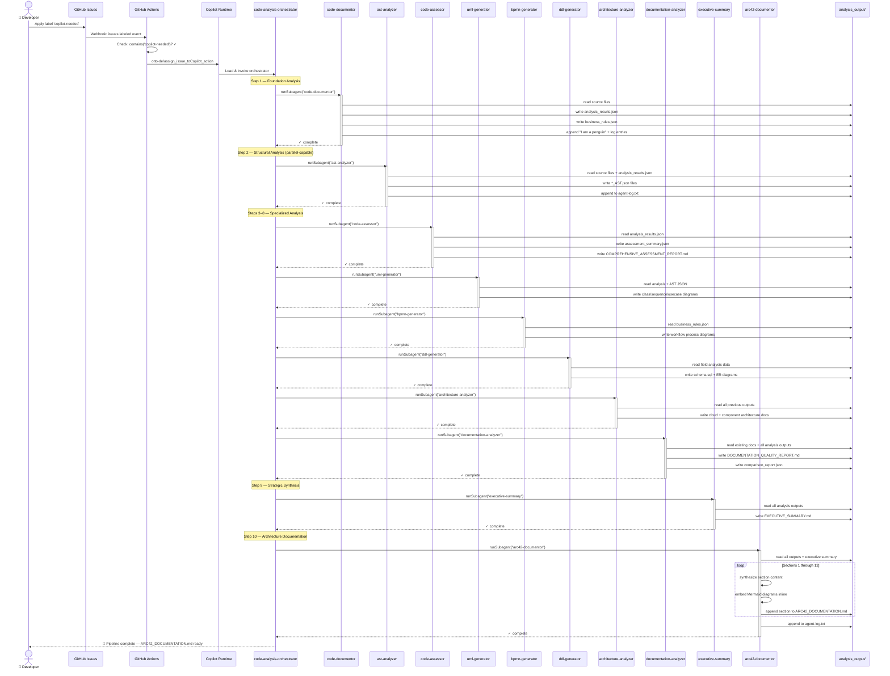

### 6.2 Scenario 2: GitHub Actions Issue Label Workflow

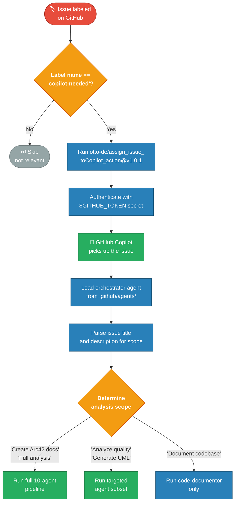

### 6.3 Scenario 3: Incremental Agent Execution with Error Handling

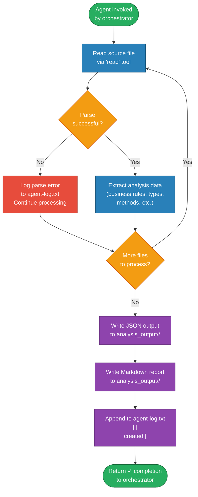

### 6.4 Scenario 4: Targeted Analysis — Selective Agent Execution

The orchestrator supports executing only the relevant agents based on the analysis request:

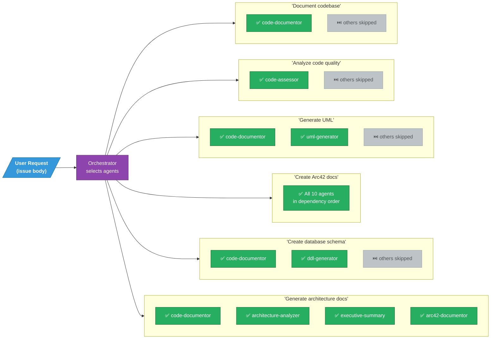

---

## 7. Deployment View

### 7.1 Infrastructure Architecture

The NotificationApp deploys entirely within the **GitHub Cloud Platform** — no separate server infrastructure is required.

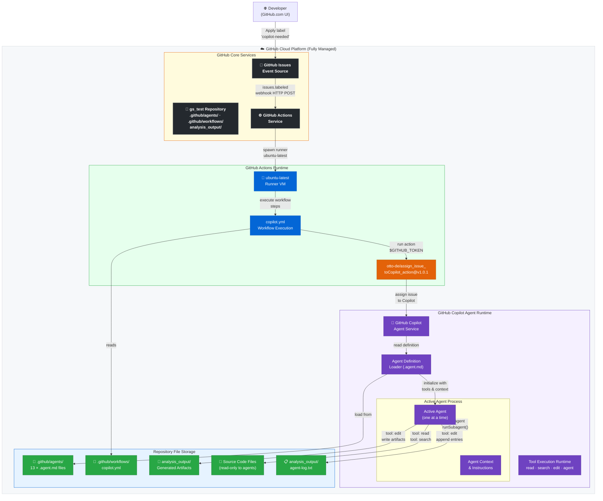

### 7.2 Deployment Component Summary

| Component | Location | Technology | Scaling Model |
|-----------|----------|------------|---------------|
| **GitHub Issues** | GitHub.com SaaS | GitHub platform native | Managed by GitHub |
| **GitHub Actions Workflow** | `/.github/workflows/copilot.yml` | YAML, 16 lines | One runner per issue label event |
| **Actions Runner** | GitHub-hosted cloud | `ubuntu-latest` VM | Ephemeral, per-workflow-run |
| **otto-de Copilot Action** | GitHub Actions marketplace | Version-pinned `v1.0.1` | Invoked per workflow run |
| **GitHub Copilot Agent Runtime** | GitHub.com SaaS | Copilot platform | Managed by GitHub |
| **Agent Definitions** | `/.github/agents/` (13 files) | Markdown + YAML | Static; version-controlled |
| **analysis_output/** | Repository filesystem | File-based artifact store | Grows per analysis run |

### 7.3 Deployment Prerequisites Checklist

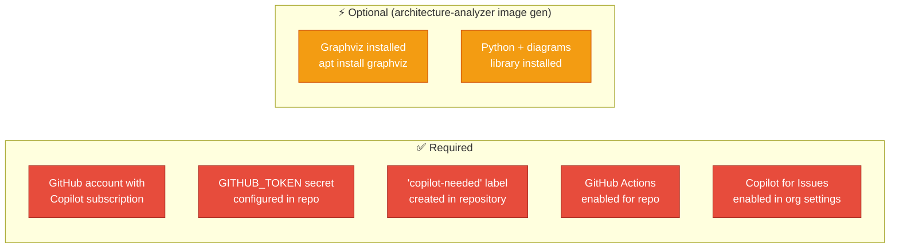

---

## 8. Cross-cutting Concepts

### 8.1 Domain Model

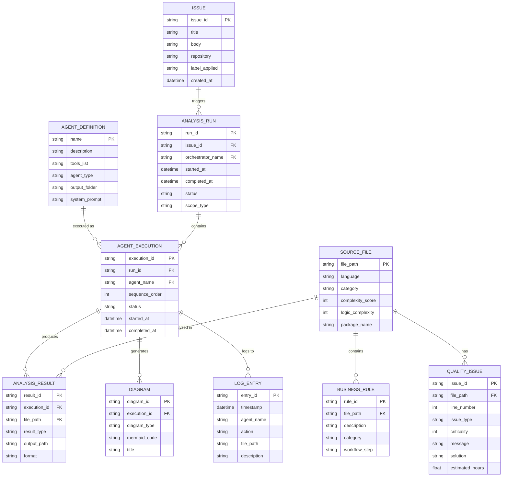

### 8.2 Universal Agent Execution Template (Template Method Pattern)

All agents follow a consistent execution structure:

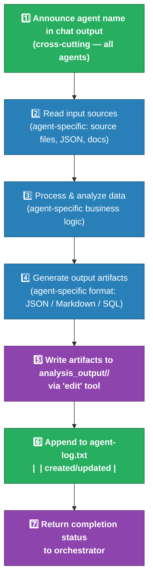

### 8.3 Logging and Auditability

Cross-cutting logging convention enforced across all 13 agent definitions:

| Aspect | Specification |
|--------|--------------|
| **Log file** | `analysis_output/agent-log.txt` (shared append-only audit log) |
| **Log format** | `<ISO8601> \| <agent-name> \| created/updated \| <relative-path> \| <description>` |
| **Trigger** | After every `edit` tool invocation (file create or modify) |
| **Responsibility** | Each agent logs its own actions independently |
| **Special entry** | `code-documentor` writes `"I am a penguin"` as its mandatory first log entry |

**Example log entries:**
```
2025-01-30T10:15:23Z | code-documentor | created | analysis_output/code-documentor/analysis_results.json | Full file-by-file analysis results
2025-01-30T10:16:45Z | ast-analyzer | created | analysis_output/ast-analyzer/UserService_AST.json | AST for UserService.java
2025-01-30T10:18:02Z | code-assessor | created | analysis_output/code-assessor/assessment_summary.json | Code quality metrics
2025-01-30T10:25:33Z | arc42-documentor | created | analysis_output/arc42-documentor/ARC42_DOCUMENTATION.md | Complete Arc42 architecture documentation
```

### 8.4 Security Concepts

| Security Aspect | Implementation |
|----------------|---------------|
| **Source Code Immutability** | Agents use only `read`/`search` tools on source code; `edit` restricted to `analysis_output/` |
| **Authentication** | GitHub Actions uses `${{ secrets.GITHUB_TOKEN }}` — no hardcoded credentials |
| **Secrets Management** | No secrets in workflow YAML or agent Markdown files |
| **Action Supply Chain** | `otto-de/assign_issue_toCopilot_action@v1.0.1` — version-pinned to reduce supply chain risk |
| **Analysis Isolation** | Each run generates isolated outputs; no cross-contamination between runs |
| **Sensitive Data Detection** | `code-assessor` explicitly looks for hardcoded credentials/API keys in analyzed code (criticality 5) |

### 8.5 Error Handling Strategy

| Error Type | Response | Recovery |
|-----------|----------|---------|
| **File parse failure** | Log error to `agent-log.txt`; mark file as `[parse error]`; continue | Partial analysis with noted gaps |
| **Agent invocation failure** | Log failure; orchestrator continues with remaining agents | Pipeline completes with documented gaps |
| **Missing input file** | Use `[Information not available from analysis]` placeholder | Document gap; recommend re-run |
| **Large file / context overflow** | Process in smaller chunks; write incremental results | Multiple partial results merged |
| **Unsupported language** | Apply general analysis principles; note language limitation | Best-effort analysis with explicit caveat |

### 8.6 Cross-Cutting Business Rules

| Rule | Scope | Enforcement Mechanism |
|------|-------|----------------------|
| **Analysis-Only Principle** | All 13 agents | Explicit prohibition: *"You NEVER modify source code files"* in every agent prompt |
| **Mermaid-Only Diagrams** | All diagram-generating agents | Explicit prohibitions: `❌ NO PlantUML` and `❌ NO ASCII art` in agent prompts |
| **Strict JSON** | code-documentor, ast-analyzer | *"Must be parsable by Python's json.loads()"* requirement |
| **Complexity Scale 0–10** | code-assessor | Standardized scale with labeled breakpoints |
| **Criticality Scale 1–5** | code-assessor | Blocker(5) through Trivial(1) with descriptions |
| **Incremental Processing** | All agents | *"Process files one at a time"* instruction in all agent definitions |
| **Self-Contained Output** | arc42-documentor | *"NO references to external files or images"* requirement |
| **Deterministic Ordering** | All agents | *"Be Deterministic — Process files in consistent order"* |

### 8.7 Observability

| Dimension | Mechanism |
|-----------|-----------|
| **Agent Activity** | `analysis_output/agent-log.txt` — timestamped action log |
| **Pipeline Progress** | Chat window output: each agent announces its name and current step |
| **Output Completeness** | File presence in `analysis_output/<agent-name>/` sub-directories |
| **Code Quality Metrics** | `assessment_summary.json` from code-assessor (0–10 scales) |
| **Documentation Coverage** | `comparison_report.json` from documentation-analyzer |
| **Issue Traceability** | GitHub Issues link → Actions run → Copilot execution → artifact generation |

---

## 9. Architecture Decisions

### ADR-001: Agent-as-Markdown Configuration Pattern

| Field | Value |
|-------|-------|
| **Status** | Accepted |
| **Date** | Repository creation |
| **Deciders** | Repository architects |

**Context**: The system needed a way to define agent behaviors that is version-controllable, human-readable, and executable by GitHub Copilot without requiring compiled code or a separate deployment pipeline.

**Decision**: Define all agent behaviors as Markdown files (`.agent.md`) with YAML front-matter (`name`, `description`, `tools`), stored in `.github/agents/`. The remainder of the file contains the complete natural language system prompt.

**Consequences**:
- ✅ Agent definitions are version-controlled through standard Git workflows
- ✅ No build/compile/deploy step; editing a file is sufficient to update behavior
- ✅ System is fully self-documenting (agent files describe themselves)
- ✅ Non-engineers can read and understand agent behaviors
- ⚠️ Agent logic is limited to what can be expressed in natural language
- ⚠️ No formal type-checking or validation of agent definitions

---

### ADR-002: Mermaid as the Sole Diagram Technology

| Field | Value |
|-------|-------|
| **Status** | Accepted |
| **Alternatives Considered** | PlantUML, Draw.io/Mermaid hybrid, D2, ASCII art |

**Context**: Multiple diagram formats exist. A single standard was needed to ensure consistent rendering across all consumers (GitHub Issues, PRs, Wikis, documentation platforms).

**Decision**: All diagrams across all agents must use Mermaid syntax exclusively. PlantUML and ASCII art are explicitly prohibited in all 13 agent definitions.

**Rationale**: Mermaid renders natively in GitHub Markdown without plugins. It supports all required diagram types (flowchart, classDiagram, sequenceDiagram, erDiagram). Color styling with `fill:`/`stroke:` CSS attributes is supported.

**Consequences**:
- ✅ Diagrams render in GitHub Issues, PRs, Wikis, and READMEs natively
- ✅ Single technology — reduced cognitive overhead
- ✅ Color styling possible via `style`, `classDef`, and `:::class` syntax
- ⚠️ Mermaid has layout limitations for very complex/large diagrams
- ⚠️ No offline rendering without a browser or Mermaid CLI

---

### ADR-003: Dual Orchestration Strategy (Multi-Orchestrator Pattern)

| Field | Value |
|-------|-------|
| **Status** | Accepted |
| **Date** | Repository evolution |

**Context**: Different use cases require different orchestration complexity. Some users need all 10 agents coordinated; others need a single agent for simplicity.

**Decision**: Provide four orchestration options:
1. `code-analysis-orchestrator` — Primary; full sequential pipeline with `runSubagent()`
2. `all-in-one-agent` — Monolithic; all capabilities in one agent
3. `insights_orchestrator` — Insight-focused alternative
4. `orchestrator` — General-purpose alternative

**Consequences**:
- ✅ Flexibility for different use cases and deployment scenarios
- ✅ Fallback options if primary orchestrator fails
- ⚠️ Capability changes may require updates in multiple orchestrators
- ⚠️ `all-in-one-agent` duplicates all agent capability descriptions

---

### ADR-004: Sequential Agent Execution with Explicit Dependency Order

| Field | Value |
|-------|-------|
| **Status** | Accepted |
| **Alternatives Considered** | Parallel execution (rejected — too complex to manage), DAG-based scheduling (deferred) |

**Decision**: Standardize on a prescribed execution order for the full pipeline:
1. `code-documentor` → 2. `ast-analyzer` → 3. `code-assessor` → 4. `uml-generator` → 5. `bpmn-generator` → 6. `ddl-generator` → 7. `architecture-analyzer` → 8. `documentation-analyzer` → 9. `executive-summary` → 10. `arc42-documentor`

`ast-analyzer` may run in parallel with `code-documentor` as the sole exception.

**Consequences**:
- ✅ Deterministic, predictable pipeline behavior
- ✅ Downstream agents always have required inputs available
- ⚠️ Mostly sequential; limited parallelism
- ⚠️ Early agent failures cascade to downstream agents

---

### ADR-005: File System as Inter-Agent Communication Bus

| Field | Value |
|-------|-------|
| **Status** | Accepted |
| **Alternatives Considered** | In-memory passing (not possible across `runSubagent` boundaries), API calls (no HTTP server), message queue (over-engineering) |

**Decision**: Use `analysis_output/` filesystem as the communication bus. Each agent writes outputs to its designated sub-folder; downstream agents read from those locations.

**Rationale**: Aligns with available tool set (`read`, `edit`). Results are persistent, inspectable, and version-controllable. Supports incremental processing and resume capability.

**Consequences**:
- ✅ Simple — no additional infrastructure
- ✅ Outputs are durable and auditable
- ✅ Manual inspection and debugging of inter-agent data is trivial
- ⚠️ File I/O overhead for large datasets
- ⚠️ File naming conventions must be consistent across all agents

---

### ADR-006: Event-Driven Trigger via GitHub Issue Labels

| Field | Value |
|-------|-------|
| **Status** | Accepted |
| **Alternatives Considered** | Scheduled runs, webhook endpoint, manual trigger, push event |

**Decision**: Use GitHub Actions `issues.labeled` event with label `copilot-needed` as the sole pipeline trigger.

**Rationale**: Zero additional infrastructure required. Natural fit for GitHub-native development workflows. Label-based filtering enables selective triggering. `GITHUB_TOKEN` provides secure, scoped authentication.

**Consequences**:
- ✅ Zero external infrastructure dependencies
- ✅ Integrated with GitHub's native notification and workflow systems
- ⚠️ Cannot be triggered externally without GitHub integration
- ⚠️ Requires manual label application (or a separate automation)

---

### ADR-007: Arc42 as Standard Architecture Documentation Format

| Field | Value |
|-------|-------|
| **Status** | Accepted |
| **Alternatives Considered** | C4 Model, 4+1 Views, TOGAF, custom format |

**Decision**: Use Arc42's 12-section template as the standard output format for architecture documentation, produced by the `arc42-documentor` agent.

**Rationale**: Arc42 is widely adopted, pragmatic, and open-source. Its 12 sections naturally map to the various agent analysis capabilities. The template is compatible with agile development and requires no proprietary tooling.

**Consequences**:
- ✅ Professional, consistent architecture documentation
- ✅ Well-understood by most software architects
- ✅ All 12 sections have corresponding agent capabilities
- ⚠️ Requires all sections to be populated; agents must handle missing data gracefully

---

## 10. Quality Requirements

### 10.1 Quality Tree

```mermaid
graph TD
    classDef root fill:#2C3E50,stroke:#1A252F,color:#fff,font-weight:bold
    classDef p1 fill:#E74C3C,stroke:#A93226,color:#fff,font-weight:bold
    classDef p2 fill:#E67E22,stroke:#A04000,color:#fff
    classDef p3 fill:#F1C40F,stroke:#D4AC0D,color:#333
    classDef p4 fill:#27AE60,stroke:#1A6B3C,color:#fff
    classDef leaf fill:#85C1E9,stroke:#2980B9,color:#333

    QR["🎯 NotificationApp\nQuality Requirements"]:::root

    QR --> Safety["🛡️ P1: Safety /\nNon-Destructiveness"]:::p1
    QR --> Correct["✅ P2: Correctness"]:::p1
    QR --> Auto["⚡ P3: Automation"]:::p1
    QR --> Ext["🔌 P4: Extensibility"]:::p2
    QR --> Trace["📋 P5: Traceability"]:::p2
    QR --> Usable["👤 P6: Usability"]:::p3
    QR --> Perf["🚀 P7: Performance"]:::p4

    Safety --> S1["Agents never modify\nsource code files"]:::leaf
    Safety --> S2["edit tool restricted\nto analysis_output/"]:::leaf
    Safety --> S3["No code execution\nor test running"]:::leaf

    Correct --> C1["Analysis reflects\nactual code state"]:::leaf
    Correct --> C2["JSON parseable by\nPython json.loads()"]:::leaf
    Correct --> C3["Mermaid renders\nwithout syntax errors"]:::leaf

    Auto --> A1["Zero-touch trigger\nvia GitHub label"]:::leaf
    Auto --> A2["Full 10-agent pipeline\nneed not human step"]:::leaf
    Auto --> A3["$GITHUB_TOKEN auth\nno manual credentials"]:::leaf

    Ext --> E1["New agent = new .agent.md\nno existing changes"]:::leaf
    Ext --> E2["Any programming language\nanalyzable"]:::leaf
    Ext --> E3["Any cloud provider\nsupported by arch-analyzer"]:::leaf

    Trace --> T1["ISO-timestamped log after\nevery file operation"]:::leaf
    Trace --> T2["Structured audit trail\nin agent-log.txt"]:::leaf

    Usable --> U1["Arc42 doc fully\nself-contained (1 file)"]:::leaf
    Usable --> U2["Executive summary readable\nby non-technical audience"]:::leaf
    Usable --> U3["Diagrams render natively\nin GitHub Markdown"]:::leaf

    Perf --> P1["Incremental processing\nfor large codebases"]:::leaf
    Perf --> P2["Parallel execution where\ndependencies allow"]:::leaf
```

### 10.2 Quality Scenarios

| ID | Quality Attribute | Stimulus | Environment | Expected Response | Measurable Outcome |
|----|-----------------|----------|-------------|------------------|--------------------|
| QS-01 | **Safety** | Agent attempts to call `edit` on a source file | Normal operation | Operation is not permitted; agent writes only to `analysis_output/` | Zero source file modifications in any analysis run |
| QS-02 | **Correctness** | New source file added to the analyzed repository | Full analysis pipeline | File is included in `analysis_results.json` and all downstream outputs | 100% source file coverage |
| QS-03 | **Automation** | Developer applies `copilot-needed` label | Normal GitHub workflow | Pipeline starts; first agent output produced within 60 seconds | Time-to-first-output < 60s |
| QS-04 | **Extensibility** | New analysis capability needed | Development time | Developer creates a new `.agent.md`; pipeline works | Zero changes to existing agents; < 1 hour of effort |
| QS-05 | **Traceability** | Post-incident review of a pipeline run | Audit scenario | `agent-log.txt` contains complete timestamped action history | Every file write has a corresponding log entry |
| QS-06 | **Usability** | Architect opens `ARC42_DOCUMENTATION.md` | Documentation review | All 12 sections present; all diagrams render in GitHub; no broken references | 100% self-contained; fully renders in GitHub Markdown |
| QS-07 | **Correctness** | Agent encounters an unsupported file format | Analysis | Agent logs the issue; uses `[Information not available]` placeholder | Explicit gap markers; no silent omissions |
| QS-08 | **Performance** | Codebase has 500+ source files | Large-scale analysis | Agents process incrementally; partial results saved | Analysis completes successfully; no context overflow errors |
| QS-09 | **Safety** | Agent system prompt mentions running/executing code | Normal operation | Agent declines to execute; reads and analyzes only | Zero code execution events per analysis run |
| QS-10 | **Usability** | Engineering Manager reads Executive Summary | Non-technical review | Summary uses business language; metrics in clear tables | No unexplained technical jargon; ROI clearly stated |

### 10.3 Current Repository Documentation Quality

Based on the `documentation-analyzer` perspective applied to `gs_test`:

| Metric | Score | Status | Notes |
|--------|-------|--------|-------|
| **Completeness** | 3/10 | 🔴 Poor | Only `README.md` (1 line) exists at project level |
| **Clarity** | 5/10 | 🟡 Adequate | Agent files are self-descriptive but project README is minimal |
| **Accuracy** | 7/10 | 🟢 Good | Agent definitions accurately describe their capabilities |
| **Structure** | 4/10 | 🟠 Inadequate | No documentation hierarchy beyond individual agent files |
| **Accessibility** | 3/10 | 🔴 Poor | No TOC, no navigation, no onboarding guide |
| **Maintainability** | 8/10 | 🟢 Good | Modular agent files are easy to update independently |
| **Examples** | 8/10 | 🟢 Good | Agent definitions contain extensive code and JSON examples |
| **Consistency** | 9/10 | 🟢 Excellent | All agents follow identical structure (YAML front-matter + system prompt) |

**Overall: 5.9/10** 🟡 — Strong agent-level documentation offset by nearly absent project-level documentation.

---

## 11. Risks and Technical Debt

### 11.1 Risk Register

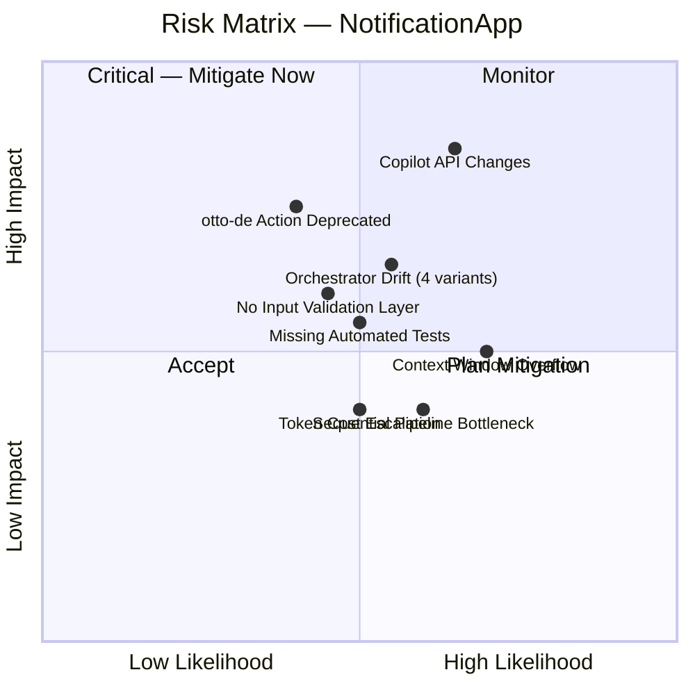

**Detailed Risk Descriptions:**

| Risk ID | Risk | Likelihood | Impact | Category | Mitigation Strategy |
|---------|------|-----------|--------|----------|---------------------|
| **R-01** | **GitHub Copilot API/Runtime Changes** — Copilot platform evolves; agent definition format or tool APIs may change | High | High | Platform Risk | Version-pin critical agent behaviors; monitor Copilot changelog; document compatibility matrix |
| **R-02** | **otto-de Action Deprecation** — `assign_issue_toCopilot_action@v1.0.1` is a third-party dependency that could be deprecated | Medium | High | Dependency Risk | Fork the action into the organization; monitor for upstream changes; maintain fallback manual process |
| **R-03** | **Context Window Overflow** — Large codebases may exceed Copilot context limits during agent execution | High | Medium | Technical Risk | Incremental processing already designed in; enforce file-by-file processing; add explicit chunking logic |
| **R-04** | **Sequential Pipeline Bottleneck** — 10-agent sequential execution may be slow for large codebases | Medium | Medium | Performance Risk | Identify additional parallel execution opportunities; implement output caching between runs |
| **R-05** | **Orchestrator Drift** — Four orchestrators may fall out of sync as individual agents evolve | Medium | High | Maintenance Risk | Consolidate to one or two orchestrators; document agent capability changes in CHANGELOG |
| **R-06** | **Token Cost Escalation** — Full pipeline consumes significant Copilot compute | Medium | Medium | Cost Risk | Default to targeted analysis; run full pipeline only on explicit request |
| **R-07** | **No Input Validation** — No validation layer for issue content or agent inputs | Medium | Medium | Quality Risk | Add input sanitization in orchestrator; define minimum required inputs |
| **R-08** | **Missing Automated Tests** — No test suite validates agent output formats or correctness | Medium | Medium | Quality Risk | Create test fixtures with known-good codebases; validate JSON schemas and Markdown structure |

### 11.2 Technical Debt Inventory

| ID | Type | Description | Impact | Estimated Fix |
|----|------|-------------|--------|--------------|
| **TD-01** | **Architecture Debt** | Four separate orchestrators with overlapping responsibilities and no formal synchronization mechanism | HIGH — Capability changes must be replicated across multiple files | 8–16 hours to consolidate |
| **TD-02** | **Documentation Debt** | `README.md` is one line: *"Github Copilot agent test repository"* — completely inadequate | HIGH — No entry point for new contributors | 4–8 hours |
| **TD-03** | **Test Debt** | No automated tests for agent definitions; no validation that agents produce correct output formats | HIGH — Breaking changes go undetected | 20–40 hours |
| **TD-04** | **Configuration Debt** | No formal versioning of agent definitions; no change history beyond Git commits | MEDIUM — Hard to track breaking changes | 4–8 hours |
| **TD-05** | **Design Debt** | The `"I am a penguin"` first log entry in `code-documentor` is undocumented — appears to be a test artifact | LOW — Confusing convention | 1 hour |
| **TD-06** | **Infrastructure Debt** | No monitoring or alerting on pipeline failures; silent failures possible | MEDIUM — Pipeline failures may go unnoticed | 4–8 hours |
| **TD-07** | **Code Debt** | `all-in-one-agent.md` fully duplicates all capability descriptions from 10 individual agent files | MEDIUM — Changes must be made in 11 places | 4–8 hours to refactor |
| **TD-08** | **Process Debt** | No formal contribution guidelines for adding/modifying agents | LOW — Inconsistent practices over time | 2–4 hours |

### 11.3 Mitigation Roadmap

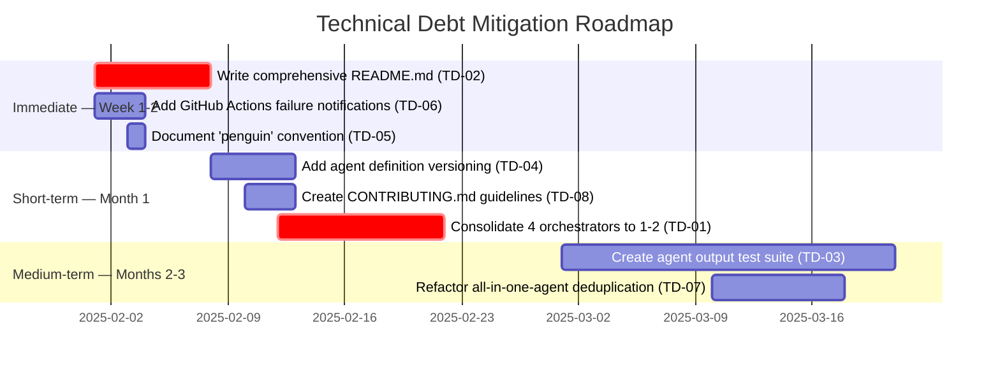

---

## 12. Glossary

| Term | Definition |
|------|-----------|
| **Agent** | A specialized, autonomous unit of analysis capability defined in a `.agent.md` Markdown file with YAML front-matter and a natural language system prompt. The system contains 13 agents. |
| **Agent Definition** | A Markdown file (`.agent.md`) in `.github/agents/` that specifies an agent's `name`, `description`, available `tools`, and full behavioral system prompt. |
| **Agent Log** | The shared audit trail file `analysis_output/agent-log.txt` where all agents append ISO-timestamped action records after every file operation. |
| **Agent Tool** | A capability granted to an agent by the GitHub Copilot platform: `read` (read files), `search` (search codebase), `edit` (write files), `todo` (task tracking), `agent` (invoke sub-agents). |
| **all-in-one-agent** | A monolithic alternative orchestrator agent that combines all 10 analysis capabilities in a single agent definition, suitable for simpler deployments. |
| **Analysis Run** | A single end-to-end execution of the analysis pipeline, triggered by a GitHub Issue label event. |
| **Arc42** | An open-source, pragmatic architecture documentation template with 12 standardized sections. Source: [arc42.org](https://arc42.org). |
| **AST (Abstract Syntax Tree)** | A tree representation of source code's syntactic structure, generated by the `ast-analyzer` agent as structured JSON. |
| **BPMN (Business Process Model and Notation)** | Standard notation for business process diagrams; in NotificationApp, implemented as Mermaid `flowchart` diagrams with swimlanes. |
| **Business Rule** | A domain-specific rule extracted from source code by `code-documentor` that governs valid states, transitions, or computational behaviors. |
| **code-analysis-orchestrator** | The primary orchestrator agent that coordinates all 10 specialized agents in explicit dependency order via `runSubagent()` calls. |
| **code-assessor** | The quality assessment agent that evaluates code complexity (0–10), identifies issues by type and criticality (1–5), and documents technical debt. |
| **code-documentor** | The foundation analysis agent that extracts business logic, classifies files, and generates `analysis_results.json` and `business_rules_extractor_analysis.json`. |
| **Configuration-as-Code** | The practice of defining system behavior in version-controlled configuration files; here, all agent behaviors are encoded in `.agent.md` Markdown files. |
| **copilot-needed** | The GitHub Issue label that triggers the analysis pipeline via the GitHub Actions `issues.labeled` event. |
| **Criticality** | A 1–5 severity rating for code issues identified by `code-assessor`: 5=Blocker, 4=Severe, 3=Normal, 2=Minor, 1=Trivial. |
| **DDL (Data Definition Language)** | SQL statements that define database schema structure; generated by the `ddl-generator` agent from code entity analysis. |
| **Dependency Order** | The prescribed agent execution sequence: `code-documentor` → `ast-analyzer` → `code-assessor` → `uml-generator` → `bpmn-generator` → `ddl-generator` → `architecture-analyzer` → `documentation-analyzer` → `executive-summary` → `arc42-documentor`. |
| **Event-Driven Architecture** | An architectural style where components react to events; NotificationApp is triggered by the `issues.labeled` GitHub webhook event. |
| **executive-summary** | The strategic synthesis agent that translates all technical analysis findings into business-level insights, health scores, and prioritized recommendations for non-technical stakeholders. |
| **GitHub Actions** | GitHub's CI/CD platform; `copilot.yml` uses `issues.labeled` webhook events to trigger the analysis pipeline. |
| **GitHub Copilot Runtime** | The execution environment provided by GitHub Copilot that loads `.agent.md` definitions and executes them with the declared tool set. |
| **Incremental Processing** | The pattern of processing files one at a time and writing partial results after each; prevents context window overflow for large codebases. |
| **Mermaid** | A JavaScript-based diagramming language using text syntax to render diagrams natively in GitHub Markdown. The sole permitted visualization technology in NotificationApp. |
| **NotificationApp** | The informal name for the `gs_test` system — a multi-agent code analysis and notification platform built on GitHub Copilot infrastructure. |
| **Orchestrator** | An agent that coordinates other specialized agents by invoking them sequentially via `runSubagent()`. Four orchestration variants exist. |
| **Priority** | A 1–5 urgency rating for enhancement recommendations from `code-assessor`: 5=Critical, 4=High, 3=Medium, 2=Low, 1=Optional. |
| **runSubagent()** | The `agent` tool call used by orchestrators to invoke a specialized agent as a coordinated sub-process. |
| **Self-Contained Documentation** | A documentation artifact (`ARC42_DOCUMENTATION.md`) that contains all content inline with embedded Mermaid diagrams — no external file references of any kind. |
| **Swimlane** | A visual grouping in BPMN flowcharts representing a participant's responsibility boundary; implemented as Mermaid `subgraph` blocks. |
| **Technical Debt** | Suboptimal implementation decisions that create future maintenance overhead; categorized as: code, design, test, documentation, or infrastructure debt. |
| **Template Method Pattern** | A design pattern where a base class defines an algorithm skeleton with steps implemented by subclasses; all NotificationApp agents follow: announce → read → process → write → log → return. |
| **Whitebox / Blackbox** | Arc42 terminology: *Whitebox* = component shown with its internal structure; *Blackbox* = component shown only via its interface (inputs/outputs). |
| **YAML Front-matter** | The YAML block delimited by `---` at the top of each `.agent.md` file that declares the `name`, `description`, and `tools` properties consumed by the Copilot runtime. |

---

*This document was generated by the **arc42-documentor** agent as part of the NotificationApp analysis pipeline.*  
*All diagrams are embedded as Mermaid code blocks — this document is fully self-contained.*  
*Source analyzed: `gs_test` repository — 13 `.agent.md` files + `copilot.yml` workflow*  
*Generation date: 2025-01-30 | Total embedded Mermaid diagrams: 17*