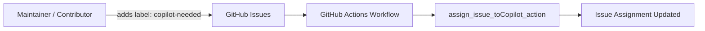
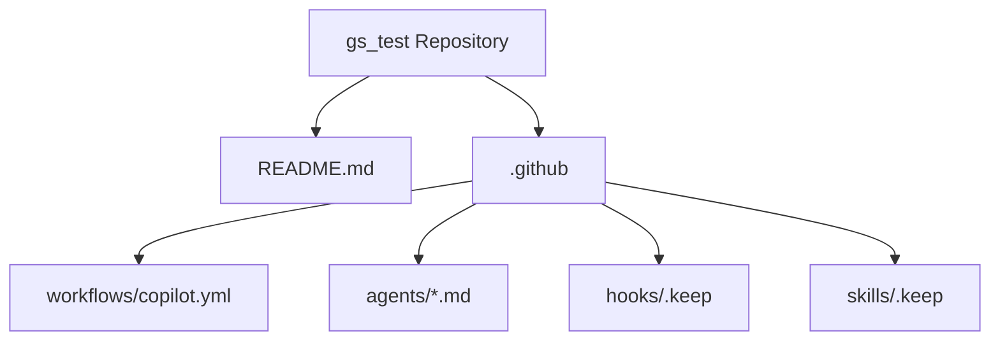
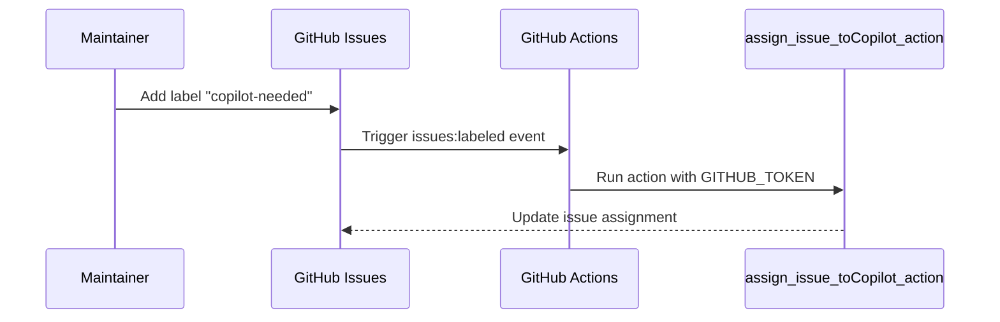
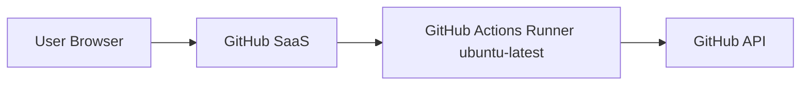

# Architecture Documentation (Arc42)

**Project**: gs_test  
**Version**: 0.1 (current repository state)  
**Date**: 2026-04-20

## 1. Introduction and Goals

This repository is currently a lightweight GitHub automation/configuration project.

Observed primary contents:

- `README.md` (minimal project description)
- `.github/workflows/copilot.yml` (issue-label-based automation)
- `.github/agents/*.md` (agent definition documents)
- `.github/hooks` and `.github/skills` placeholders (`.keep`)

## 2. Constraints

- Platform: GitHub repository with GitHub Actions.
- CI runner: `ubuntu-latest`.
- External action dependency: `otto-de/assign_issue_toCopilot_action@v1.0.1`.
- Auth mechanism: `${{ secrets.GITHUB_TOKEN }}`.
- Trigger constraint: issue label must be `copilot-needed`.

## 3. Context and Scope

## 4. Solution Strategy

- Prefer configuration over code (workflow + markdown definitions).
- Keep automation scope narrow and deterministic.
- Use GitHub-native platform features.

## 5. Building Block View

## 6. Runtime View

## 7. Deployment View

## 8. Crosscutting Concepts

- Security: token-based auth through `secrets.GITHUB_TOKEN`.
- Event-driven automation model.
- Documentation/config-first repository structure.

## 9. Architecture Decisions

### ADR-001: Use GitHub Actions for issue assignment

- Decision: implement assignment via workflow + third-party action.
- Rationale: minimal custom code and maintenance overhead.

### ADR-002: Keep repository minimal

- Decision: store mainly operational config and agent docs.
- Rationale: lightweight testing/orchestration environment.

## 10. Quality Requirements

- Simplicity
- Maintainability
- Reliability
- Security

## 11. Risks and Technical Debt

- Dependency on external action behavior and availability.
- Coupling to label name `copilot-needed`.
- No explicit tests for workflow behavior.

## 12. Glossary

- **Arc42**: Template for architecture documentation.
- **GitHub Actions**: Event-driven CI/CD and automation platform.
- **Workflow**: YAML definition of automation logic.
- **`GITHUB_TOKEN`**: Repository-scoped token provided by GitHub Actions.
