# Architecture Documentation (Arc42)

**Project**: GitHub Copilot Multi-Agent Code Analysis Platform  
**Issue**: LegacyFinApp-026 Insights  
**Version**: 1.0.0  
**Date**: 2025-01-30  
**Generated by**: Arc42 Documentation Generator (arc42-documentor agent)  
**Repository**: gs_test — GitHub Copilot Agent Test Repository  

---

> **About this Document**  
> This Arc42 architecture documentation describes the **GitHub Copilot Multi-Agent Code Analysis Platform** — a system of specialized AI agents orchestrated through GitHub Copilot to deliver comprehensive, automated code analysis and documentation generation. The documentation was triggered by issue *LegacyFinApp-026 Insights*, a representative analysis job for a legacy financial application.
>
> **Self-Contained**: This document contains all diagrams as embedded Mermaid code blocks. No external files or references are required.

---

## Table of Contents

1. [Introduction and Goals](#1-introduction-and-goals)
2. [Constraints](#2-constraints)
3. [Context and Scope](#3-context-and-scope)
4. [Solution Strategy](#4-solution-strategy)
5. [Building Block View](#5-building-block-view)
6. [Runtime View](#6-runtime-view)
7. [Deployment View](#7-deployment-view)
8. [Crosscutting Concepts](#8-crosscutting-concepts)
9. [Architecture Decisions](#9-architecture-decisions)
10. [Quality Requirements](#10-quality-requirements)
11. [Risks and Technical Debt](#11-risks-and-technical-debt)
12. [Glossary](#12-glossary)

---

## 1. Introduction and Goals

### 1.1 Purpose and Business Context

The **GitHub Copilot Multi-Agent Code Analysis Platform** (hereafter "the Platform") is an AI-powered, automated code intelligence system built natively on GitHub Copilot. It addresses the universal challenge faced by software engineering organisations: understanding, documenting, and assessing the quality of existing codebases — particularly **legacy financial applications** — quickly and at scale.

When an engineering team encounters a legacy codebase (such as *LegacyFinApp-026*), they face significant knowledge-discovery costs: reverse-engineering business rules, mapping architecture, identifying technical debt, and producing onboarding documentation. The Platform automates this entire pipeline through a coordinated network of specialised agents, transforming raw source code into a rich set of artefacts including Arc42 architecture documentation, UML diagrams, BPMN workflows, database schemas, code quality reports, and executive summaries.

The system is triggered automatically by GitHub's issue labelling mechanism (`copilot-needed`) and orchestrates all analysis in a deterministic, incremental fashion, ensuring reproducible results without ever modifying source code.

### 1.2 Key Business Goals

| # | Goal | Priority |
|---|------|----------|
| G-1 | Reduce the time to understand and document legacy codebases from weeks to hours | High |
| G-2 | Provide production-quality Arc42 architecture documentation automatically | High |
| G-3 | Extract business rules and workflows embedded in code with no manual effort | High |
| G-4 | Identify technical debt and security issues with actionable remediation guidance | High |
| G-5 | Generate visual artefacts (UML, BPMN, ER diagrams) using Mermaid exclusively | Medium |
| G-6 | Deliver executive-level summaries bridging technical findings to business impact | Medium |
| G-7 | Maintain a complete, auditable analysis log for full traceability | Low |

### 1.3 Quality Goals

The top quality attributes driving architectural decisions are:

| Priority | Quality Attribute | Scenario |
|----------|------------------|---------|
| 1 | **Accuracy** | Business rules and architecture extracted must faithfully represent the source code with no hallucinations |
| 2 | **Completeness** | Every Arc42 section, every analysis module, every diagram type must be populated |
| 3 | **Non-destructiveness** | Source code files must never be modified, executed, or tested |
| 4 | **Self-containment** | Final documentation artefacts must be standalone — no external file references |
| 5 | **Reproducibility** | Same source code always produces the same analysis in deterministic order |
| 6 | **Traceability** | Every output file is logged with ISO timestamp, agent name, and description |

### 1.4 Stakeholders

| Stakeholder | Role | Primary Concerns |
|-------------|------|-----------------|
| **Engineering Teams** | Primary consumers of analysis outputs | Code quality, technical debt, architecture clarity |
| **Engineering Managers** | Consume executive summaries | Business impact, remediation effort, risk exposure |
| **Architects** | Consume Arc42 documentation | Architectural patterns, decisions, constraints |
| **New Developers** | Use documentation for onboarding | Building block view, runtime scenarios, glossary |
| **Security Teams** | Review security assessments | Vulnerability findings, remediation priority |
| **Product Owners** | Consume business rule extractions | Feature completeness, workflow accuracy |
| **Database Administrators** | Use DDL outputs | Schema accuracy, index recommendations |
| **DevOps Teams** | Use deployment and architecture views | Infrastructure topology, deployment requirements |

---

## 2. Constraints

### 2.1 Technical Constraints

| Constraint | Description | Rationale |
|-----------|-------------|-----------|
| **TC-1: GitHub Copilot Runtime** | All agents execute exclusively within the GitHub Copilot agent execution environment | Platform is natively integrated with GitHub; no external compute is required |
| **TC-2: Mermaid-Only Diagrams** | All diagrams must use Mermaid syntax in fenced code blocks; PlantUML and ASCII art are strictly prohibited | GitHub renders Mermaid natively in Markdown files; ensures portability and version-control friendliness |
| **TC-3: No Code Execution** | Agents may never execute, compile, or test source code | Safety constraint to prevent unintended side-effects on target repositories |
| **TC-4: No Source Modification** | Agents may never write to or alter source code files | Preserves code integrity and ensures the platform is purely observational |
| **TC-5: Read-Only Analysis** | Analysis is performed on static files only; no runtime or dynamic analysis | Agents have only `read`, `search`, `edit` (for output files only), and `todo` tools |
| **TC-6: Sequential Output Writing** | Outputs must be written incrementally, file by file or section by section | Avoids context-limit issues in large codebases; enables progress visibility |
| **TC-7: JSON Intermediate Format** | Machine-readable inter-agent communication uses strict JSON (parseable by `json.loads()`) | Enables reliable handoff between agents without parsing ambiguity |
| **TC-8: UTF-8 Encoding** | All output files must be UTF-8 encoded | Cross-platform compatibility |

### 2.2 Organisational Constraints

| Constraint | Description |
|-----------|-------------|
| **OC-1: GitHub-Native Deployment** | The Platform operates entirely within GitHub's ecosystem (Copilot, Actions, Issues) with no external SaaS dependencies |
| **OC-2: Issue-Driven Activation** | Analysis jobs are triggered exclusively via GitHub issue labels (`copilot-needed`); no external schedulers or API triggers |
| **OC-3: Analysis-Only Mandate** | The Platform is strictly analytical — it never makes architectural decisions, only documents and recommends |
| **OC-4: Agent Specialisation** | Each agent has a single, well-defined responsibility; cross-cutting logic is handled by the orchestrator |
| **OC-5: Auditability** | Every file creation or modification must be logged to `analysis_output/agent-log.txt` with ISO timestamps |

### 2.3 Conventions

| Convention | Description |
|-----------|-------------|
| **CV-1: Output Directory Structure** | Each agent writes to its own subdirectory: `analysis_output/<agent-name>/` |
| **CV-2: Agent Naming** | Agents follow the pattern `<role>.agent.md` (e.g., `code-documentor.agent.md`) |
| **CV-3: Log Format** | `<ISO timestamp> | <agent-name> | created/updated | <relative-path> | <description>` |
| **CV-4: Diagram Styling** | Diagrams must apply colours and CSS classes to highlight key architectural elements |
| **CV-5: Language Agnosticism** | All agents must support any programming language without technology restrictions |

---

## 3. Context and Scope

### 3.1 Business Context

The Platform sits between a software engineering organisation and its codebase. It transforms raw source code into structured knowledge artefacts. The key external actors are:

- **Engineers / Architects** — Submit analysis requests via GitHub issues; consume all output artefacts
- **GitHub Issues System** — Triggers analysis via the `copilot-needed` label
- **GitHub Actions** — Executes the assignment workflow that routes issues to Copilot
- **GitHub Copilot** — Hosts and executes the agent runtime
- **Source Code Repository** — The target codebase being analysed (e.g., LegacyFinApp-026)
- **Analysis Output Store** — The `analysis_output/` directory where all artefacts are persisted

### 3.2 Business Context Diagram (C4 Level 1 — System Context)

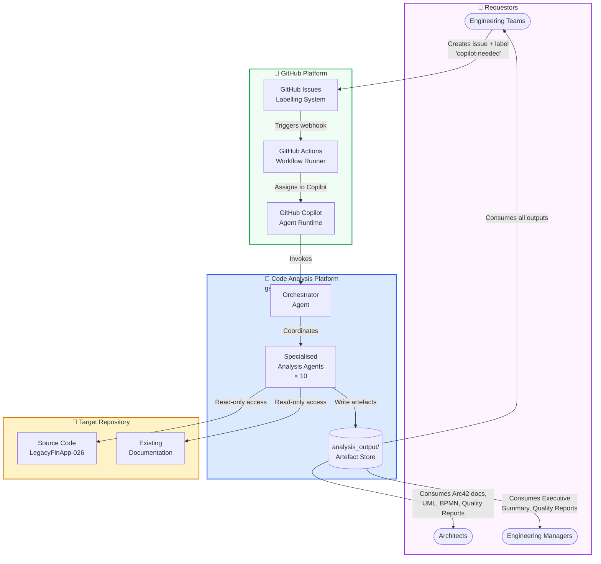

### 3.3 Technical Context

The Platform's technical interfaces are:

| Interface | Direction | Protocol / Format | Description |
|-----------|-----------|-----------------|-------------|
| GitHub Issue Label Event | Inbound | GitHub Webhook → GitHub Actions YAML | Triggers the analysis pipeline |
| Source Code Read | Inbound | File system (read-only) | Agents read source files for analysis |
| Documentation Read | Inbound | File system (read-only) | Agents read existing docs for comparison |
| Agent-Log Write | Outbound | Plain text (append) | Audit trail in `analysis_output/agent-log.txt` |
| JSON Artefacts Write | Outbound | Structured JSON | Machine-readable inter-agent handoffs |
| Markdown Artefacts Write | Outbound | Markdown with Mermaid | Human-readable analysis outputs |
| Arc42 Documentation Write | Outbound | Markdown with Mermaid | Final self-contained architecture document |

### 3.4 Technical Context Diagram

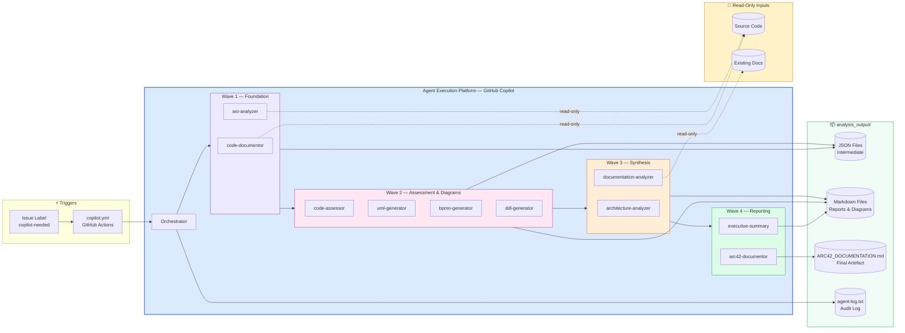

---

## 4. Solution Strategy

### 4.1 Core Strategic Decisions

| Decision | Strategy | Rationale |
|---------|----------|-----------|
| **Agent Specialisation** | Each concern is handled by a dedicated, single-responsibility agent | Enables independent evolution, parallel execution, and clear responsibility boundaries |
| **Orchestration Pattern** | A central orchestrator coordinates the full execution sequence | Provides a single entry point, manages inter-agent dependencies, communicates progress |
| **Incremental Output Writing** | Agents write outputs section-by-section, not all at once | Avoids context-limit overflows; enables progress visibility; allows recovery after interruption |
| **JSON as Lingua Franca** | Intermediate results exchanged as strict, parseable JSON | Enables reliable machine-to-machine handoffs; universally parseable |
| **Mermaid-Only Visualisation** | All diagrams use Mermaid syntax exclusively | GitHub-native rendering; version-control friendly; zero external rendering dependencies |
| **Analysis-Only Principle** | Agents never modify, execute, or test source code | Guarantees non-destructiveness; clear responsibility boundary |
| **Layered Execution Waves** | Agents execute in 4 dependency-ordered waves, with optional intra-wave parallelism | Respects data dependencies; Wave 1 foundations consumed by Wave 2, 3, and 4 |

### 4.2 Technology Decisions

| Domain | Choice | Rationale |
|--------|--------|-----------|
| **Execution Runtime** | GitHub Copilot Agent Framework | Native GitHub integration; zero infrastructure overhead |
| **Trigger Mechanism** | GitHub Actions + Issue Labels | Event-driven; low coupling; native GitHub developer experience |
| **Diagram Format** | Mermaid (exclusively) | GitHub renders Mermaid natively in Markdown; no external tools required |
| **Data Exchange** | JSON (strict, parseable by `json.loads()`) | Universal, language-agnostic, human-readable intermediate format |
| **Documentation Format** | Markdown (UTF-8) | Universal readability; version-control compatible; GitHub native preview |
| **Architecture Documentation** | Arc42 Template | Industry-standard; comprehensive; widely understood by architects |

### 4.3 Decomposition Approach

The system is decomposed along two axes:

1. **Functional Axis** (by analysis concern): Each agent handles one analysis domain.
2. **Temporal Axis** (by execution wave): Agents are grouped in 4 waves where each wave depends on the outputs of the previous.

```mermaid
flowchart LR
    subgraph W1["Wave 1 — Foundation"]
        direction TB
        CD[code-documentor\nanalysis_results.json\nbusiness_rules.json]
        AS[ast-analyzer\nAST JSON files]
    end
    subgraph W2["Wave 2 — Assessment & Diagrams"]
        direction TB
        CA[code-assessor\nQuality + Debt]
        UG[uml-generator\nClass/Sequence/UseCase]
        BG[bpmn-generator\nProcess Workflows]
        DG[ddl-generator\nSQL DDL + ER]
    end
    subgraph W3["Wave 3 — Synthesis"]
        direction TB
        AA[architecture-analyzer\nArchitecture Diagrams]
        DA[documentation-analyzer\nDoc Quality Report]
    end
    subgraph W4["Wave 4 — Reporting"]
        direction TB
        ES[executive-summary\nStrategic Insights]
        ARC[arc42-documentor\nARC42_DOCUMENTATION.md]
    end

    W1 -->|"JSON outputs\nfoundation data"| W2
    W2 -->|"Enriched outputs\ndiagrams + assessment"| W3
    W3 -->|"All outputs\ncomplete analysis"| W4

    style W1 fill:#ede9fe,stroke:#7c3aed,stroke-width:2px
    style W2 fill:#fce7f3,stroke:#db2777,stroke-width:2px
    style W3 fill:#ffedd5,stroke:#ea580c,stroke-width:2px
    style W4 fill:#dcfce7,stroke:#16a34a,stroke-width:2px
```

### 4.4 Approaches to Quality Goals

| Quality Goal | Architectural Approach |
|-------------|----------------------|
| **Accuracy** | Agents perform static analysis only; business rules reflect only what exists in the source code |
| **Completeness** | Orchestrator ensures all 10 agents run; Arc42 fills all 12 sections with placeholders for missing data |
| **Non-destructiveness** | Tool set restricted: `read`, `search`, `edit` (output files only), `todo` — no shell execution |
| **Self-containment** | Arc42 doc embeds all Mermaid diagram source directly; zero external file references |
| **Reproducibility** | Files processed deterministically in a consistent order |
| **Traceability** | Every file write appends to shared `agent-log.txt` with ISO timestamps |

---

## 5. Building Block View

### 5.1 Level 1 — System Overview

The Platform consists of a **Trigger Layer**, an **Orchestration Layer**, a **Specialised Agent Layer**, and an **Artefact Store**.

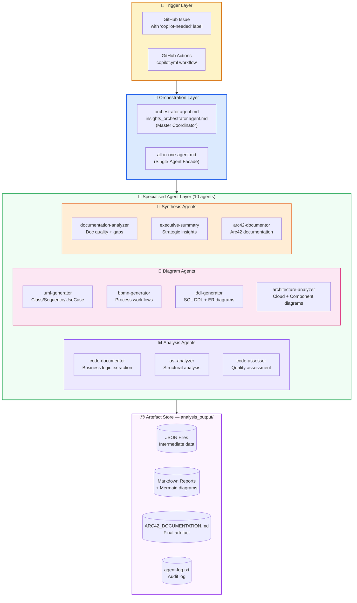

### 5.2 Level 2 — Agent Catalogue

#### 5.2.1 Orchestration Agents

| Agent | File | Responsibility | Key Outputs |
|-------|------|----------------|-------------|
| **orchestrator** | `orchestrator.agent.md` | Master coordinator; routes requests to specialised agents; manages execution order | Execution plan, progress updates, delegation |
| **insights-orchestrator** | `insights_orchestrator.agent.md` | Extended orchestrator with explicit parallel/sequential strategy per wave | Same as above with explicit wave management |
| **all-in-one-agent** | `all-in-one-agent.md` | Single-agent fallback combining all 10 analysis capabilities | All artefact types in a single execution |

#### 5.2.2 Analysis Agents

| Agent | File | Input | Output |
|-------|------|-------|--------|
| **code-documentor** | `code-documentor.agent.md` | Source code files | `analysis_results.json`, `business_rules_extractor_analysis.json`, `application_summary.json`, `package_summary.json` |
| **ast-analyzer** | `ast-analyzer.agent.md` | Source code files | `[ClassName]_AST.json`, `AST_Analysis_Summary.md` |
| **code-assessor** | `code-assessor.agent.md` | `analysis_results.json` + AST outputs | `assessment_summary.json`, `COMPREHENSIVE_ASSESSMENT_REPORT.md` |

#### 5.2.3 Diagram Agents

| Agent | File | Input | Output |
|-------|------|-------|--------|
| **uml-generator** | `uml-generator.agent.md` | `analysis_results.json` + AST | Markdown with Mermaid class/sequence/use-case diagrams |
| **bpmn-generator** | `bpmn-generator.agent.md` | `business_rules_extractor_analysis.json` + AST | Markdown with Mermaid process flowcharts |
| **ddl-generator** | `ddl-generator.agent.md` | Field analysis + workflow analysis | `.sql` DDL files, `schema_summary.json`, Mermaid ER diagrams |
| **architecture-analyzer** | `architecture-analyzer.agent.md` | All Wave 1+2 outputs | `ARCHITECTURE_SUMMARY.md` with Mermaid architecture diagrams |

#### 5.2.4 Synthesis Agents

| Agent | File | Input | Output |
|-------|------|-------|--------|
| **documentation-analyzer** | `documentation-analyzer.agent.md` | Existing docs + all analysis outputs | `documentation_analysis.json`, `DOCUMENTATION_QUALITY_REPORT.md` |
| **executive-summary** | `executive-summary.agent.md` | All analysis outputs | `executive-summary.md` |
| **arc42-documentor** | `arc42-documentor.agent.md` | All analysis outputs + executive summary | `ARC42_DOCUMENTATION.md` |

### 5.3 Level 3 — Agent Class Structure

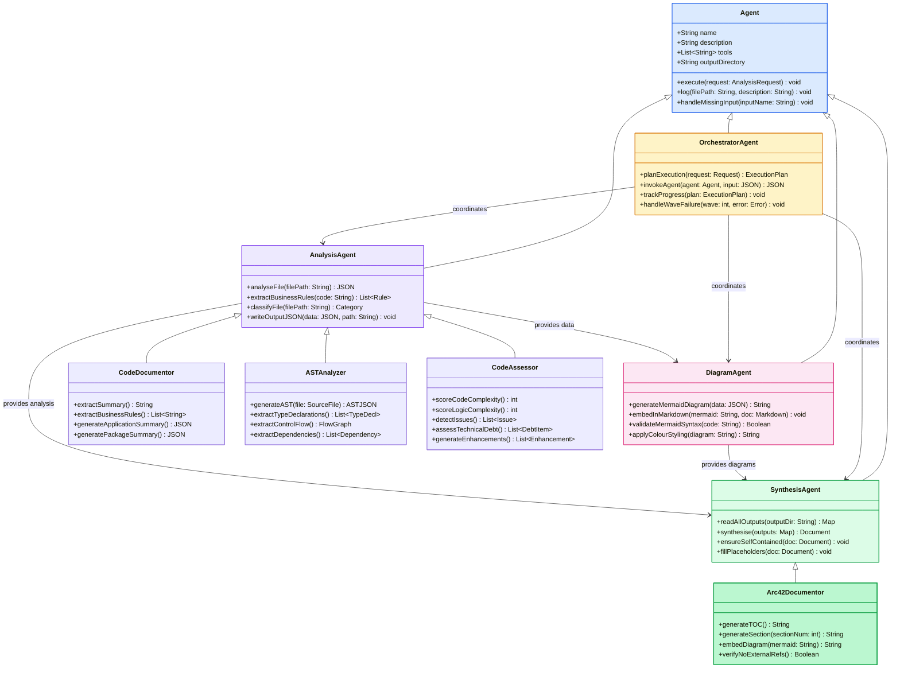

### 5.4 Output Directory Structure

```mermaid
graph TD
    ROOT["📁 analysis_output/"]
    ROOT --> LOG["📄 agent-log.txt\nAudit log"]
    ROOT --> CD_DIR["📁 code-documentor/"]
    ROOT --> AST_DIR["📁 ast-analyzer/"]
    ROOT --> CA_DIR["📁 code-assessor/"]
    ROOT --> UML_DIR["📁 uml-generator/"]
    ROOT --> BPMN_DIR["📁 bpmn-generator/"]
    ROOT --> DDL_DIR["📁 ddl-generator/"]
    ROOT --> AA_DIR["📁 architecture-analyzer/"]
    ROOT --> DA_DIR["📁 documentation-analyzer/"]
    ROOT --> ES_DIR["📁 executive-summary/"]
    ROOT --> ARC_DIR["📁 arc42-documentor/"]

    CD_DIR --> CD1["analysis_results.json"]
    CD_DIR --> CD2["business_rules_extractor_analysis.json"]
    CD_DIR --> CD3["application_summary.json"]
    CD_DIR --> CD4["package_summary.json"]

    AST_DIR --> AST1["[ClassName]_AST.json"]
    AST_DIR --> AST2["AST_Analysis_Summary.md"]

    CA_DIR --> CA1["assessment_summary.json"]
    CA_DIR --> CA2["COMPREHENSIVE_ASSESSMENT_REPORT.md"]

    UML_DIR --> UML1["class_diagrams.md"]
    UML_DIR --> UML2["sequence_diagrams.md"]
    UML_DIR --> UML3["use_case_diagrams.md"]

    BPMN_DIR --> BPMN1["process_workflows.md"]

    DDL_DIR --> DDL1["schema.sql"]
    DDL_DIR --> DDL2["schema_summary.json"]
    DDL_DIR --> DDL3["er_diagram.md"]

    AA_DIR --> AA1["ARCHITECTURE_SUMMARY.md"]

    DA_DIR --> DA1["documentation_analysis.json"]
    DA_DIR --> DA2["comparison_report.json"]
    DA_DIR --> DA3["DOCUMENTATION_QUALITY_REPORT.md"]

    ES_DIR --> ES1["executive-summary.md"]

    ARC_DIR --> ARC1["ARC42_DOCUMENTATION.md ⭐"]

    style ROOT fill:#dbeafe,stroke:#2563eb,stroke-width:2px
    style LOG fill:#fef3c7,stroke:#d97706
    style ARC1 fill:#bbf7d0,stroke:#16a34a,stroke-width:2px
```

---

## 6. Runtime View

### 6.1 Scenario 1 — Full Analysis Pipeline (Happy Path)

This scenario shows the complete execution flow triggered by issue *LegacyFinApp-026 Insights* labelled `copilot-needed`.

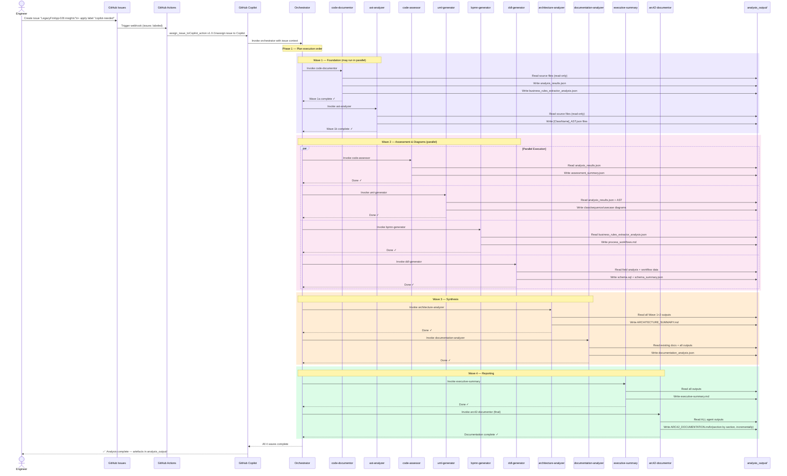

### 6.2 Scenario 2 — Incremental Arc42 Document Generation

The arc42-documentor writes documentation section-by-section to avoid context overflow:

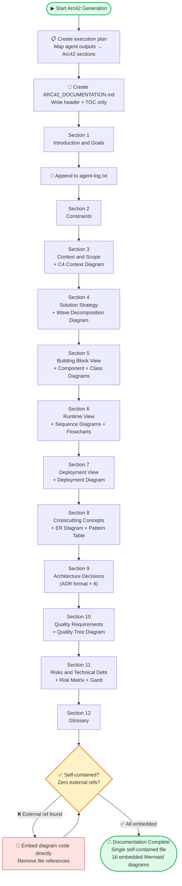

### 6.3 Scenario 3 — Code Quality Assessment Workflow

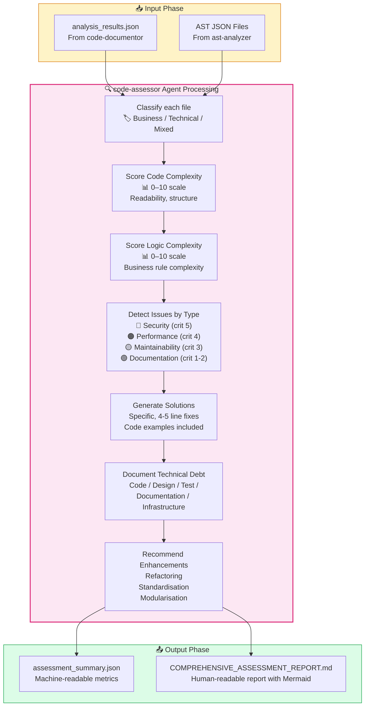

### 6.4 Scenario 4 — Error Handling and Recovery

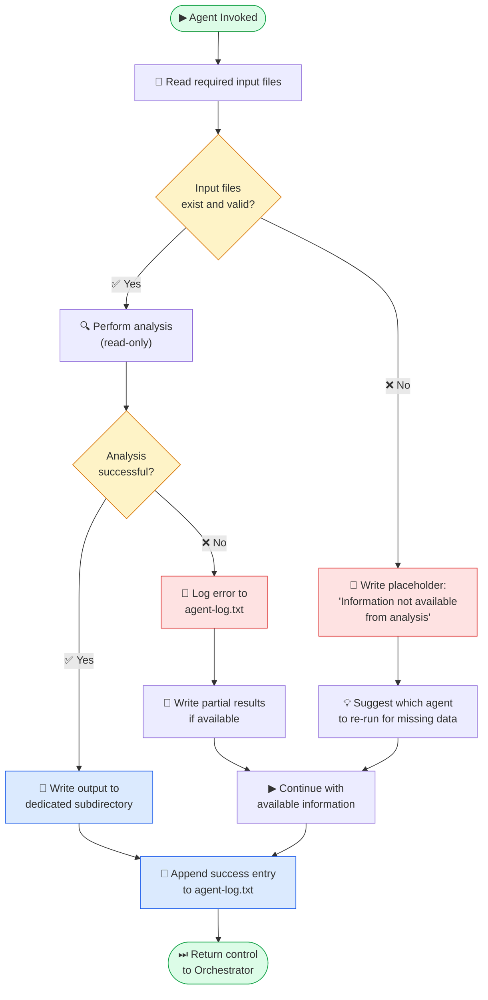

---

## 7. Deployment View

### 7.1 Infrastructure Overview

The Platform has zero dedicated infrastructure requirements. It operates entirely within GitHub's managed platform services.

| Component | Hosting | Managed By |
|-----------|---------|------------|
| Agent Definitions (`.agent.md` files) | GitHub Repository (`.github/agents/`) | Repository owners |
| Workflow Definition (`copilot.yml`) | GitHub Repository (`.github/workflows/`) | Repository owners |
| Agent Execution Runtime | GitHub Copilot (fully managed LLM) | GitHub |
| Workflow Execution | GitHub Actions (fully managed) | GitHub |
| Artefact Storage (`analysis_output/`) | Git repository file system | Repository owners |
| Audit Log (`agent-log.txt`) | Git repository file system | Repository owners |

### 7.2 Deployment Topology

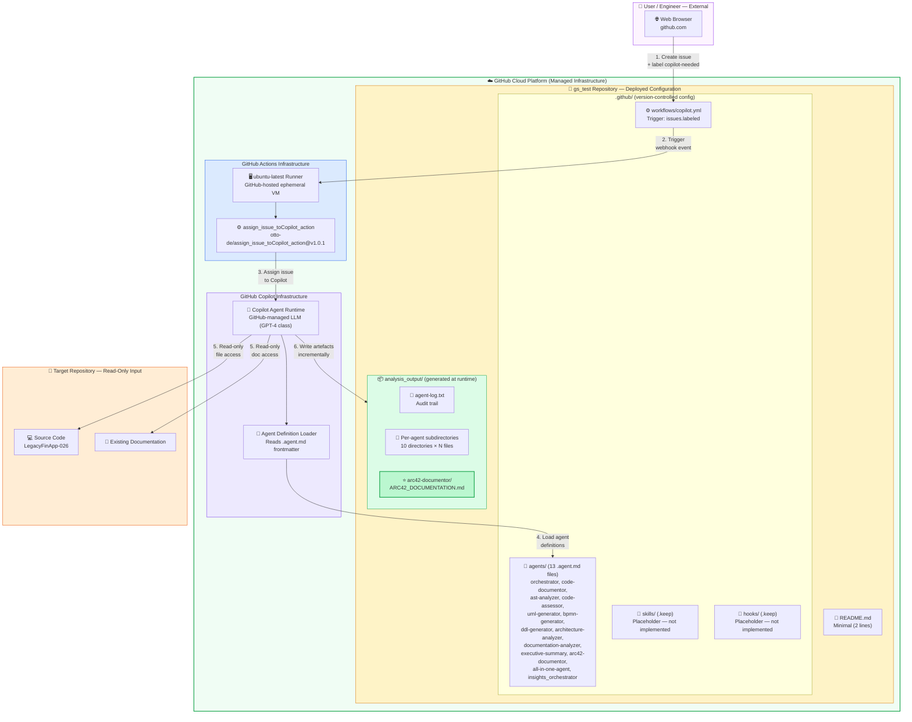

### 7.3 GitHub Actions Workflow Configuration

The complete deployment configuration is a single 16-line YAML file:

```yaml
# .github/workflows/copilot.yml
name: Assign Issue to Copilot

on:
  issues:
    types: [labeled]

jobs:
  assign-to-copilot:
    # Only trigger when 'copilot-needed' label is applied
    if: contains(github.event.issue.labels.*.name, 'copilot-needed')
    runs-on: ubuntu-latest
    steps:
      - name: Assign Issue to Copilot
        uses: otto-de/assign_issue_toCopilot_action@v1.0.1
        with:
          github_token: ${{ secrets.GITHUB_TOKEN }}
```

**Workflow characteristics:**
- **Trigger**: Issues labelled with `copilot-needed`
- **Runner**: GitHub-hosted `ubuntu-latest`
- **Action**: `otto-de/assign_issue_toCopilot_action@v1.0.1`
- **Authentication**: `GITHUB_TOKEN` — auto-provisioned, repository-scoped, short-lived
- **Infrastructure cost**: Zero (GitHub Actions free tier minutes)

### 7.4 Scaling and Capacity

| Characteristic | Description |
|----------------|-------------|
| **Horizontal Scaling** | Not applicable — GitHub Copilot manages its own LLM infrastructure elastically |
| **Concurrent Analyses** | Bounded by GitHub Copilot capacity; multiple issues can be processed concurrently |
| **Storage Growth** | Linear with analysis jobs; each job adds ~10–50 MB to `analysis_output/` |
| **Stateless Execution** | Each analysis job is fully stateless; agents read inputs and write outputs to files |
| **Context Limits** | Mitigated by incremental, file-by-file processing per agent |

---

## 8. Crosscutting Concepts

### 8.1 Logging and Auditability

Every agent shares a **universal logging contract**. After creating or modifying any output file, the agent appends a log entry to `analysis_output/agent-log.txt`:

**Log Entry Format:**
```
<ISO 8601 timestamp> | <agent-name> | created/updated | <relative-path> | <short description>
```

**Example entries:**
```
2025-01-30T14:23:01Z | code-documentor | created | analysis_output/code-documentor/analysis_results.json | File-by-file code analysis results for LegacyFinApp-026
2025-01-30T14:23:45Z | ast-analyzer | created | analysis_output/ast-analyzer/UserService_AST.json | AST for UserService.java
2025-01-30T14:25:12Z | code-assessor | created | analysis_output/code-assessor/assessment_summary.json | Code quality assessment summary
2025-01-30T14:31:00Z | arc42-documentor | created | analysis_output/arc42-documentor/ARC42_DOCUMENTATION.md | Complete Arc42 architecture documentation — LegacyFinApp-026
```

This provides: **traceability** (who created what), **debuggability** (last log entry before failure), **auditability** (complete pipeline audit trail).

### 8.2 Error Handling Strategy

All agents implement a uniform four-level error handling strategy:

| Level | Trigger | Agent Response |
|-------|---------|---------------|
| **Level 1** | Missing input file | Write `[Information not available from analysis]` placeholder; suggest re-run agent; continue |
| **Level 2** | Partial input available | Use available data; mark incomplete sections; log warning |
| **Level 3** | Analysis error on a single file | Log error with file path; skip file; process remaining files |
| **Level 4** | Context overflow on large file | Write partial results; note truncation; resume from checkpoint |

### 8.3 Domain Data Model

The Platform handles four distinct data domains flowing through the pipeline:

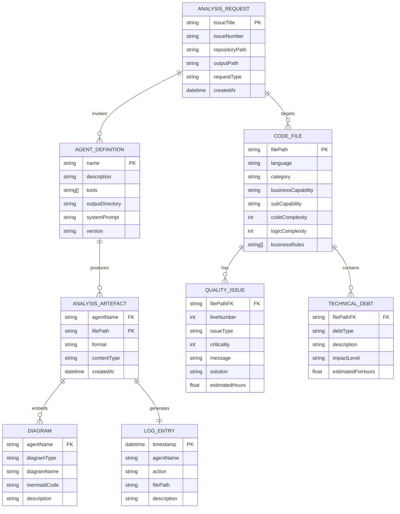

### 8.4 Design Patterns Applied

| Pattern | Applied In | Rationale |
|---------|-----------|-----------|
| **Agent Pattern** | All 10 specialised agents | Autonomous units with defined responsibility, input, and output contracts |
| **Orchestrator Pattern** | `orchestrator.agent.md` | Central coordinator without modifying specialised agents |
| **Pipe and Filter** | Wave 1 → 2 → 3 → 4 | Data flows and is enriched through sequential processing stages |
| **Template Method** | Arc42 12-section structure | Fixed structural template with variable content; ensures completeness |
| **Facade Pattern** | `all-in-one-agent.md` | Single simplified entry point wrapping all 10 agent capabilities |
| **Strategy Pattern** | Language analysis in all agents | Analysis adapts to detected technology stack without changing agent interface |
| **Observer Pattern** | `agent-log.txt` | Passive audit observer notified of all agent file operations |
| **Factory Method** | Diagram generation in diagram agents | Each agent produces Mermaid diagram code for its specific domain |

### 8.5 Security Concepts

| Concept | Implementation |
|---------|---------------|
| **Least Privilege** | Agent tools restricted to: `read`, `search`, `edit` (output only), `todo` — no shell, no network |
| **Non-destructiveness** | Source code files are strictly read-only; never written to |
| **Secret Handling** | Only `GITHUB_TOKEN` used; auto-provisioned, short-lived, repo-scoped; never logged |
| **Output Isolation** | All writes confined to `analysis_output/`; never to source directories |
| **No Code Execution** | Agents never compile, run, or test code — eliminates supply-chain attack surface |
| **Action Pinning** | GitHub Actions workflow should use commit SHA pinning (current: version tag — see TD-5) |

### 8.6 Internationalisation

| Aspect | Approach |
|--------|----------|
| **Output Language** | All documentation generated in English |
| **Source Code Language** | Any human language in comments and identifiers is supported |
| **Programming Language** | All agents are language-agnostic (Java, Python, JS, C#, Go, Rust, etc.) |
| **Encoding** | All outputs use UTF-8 |

---

## 9. Architecture Decisions

### ADR-001: Mermaid-Only Diagram Policy

| | |
|-|-|
| **Status** | ✅ Accepted |
| **Date** | 2025-01-30 |
| **Context** | The Platform generates visual architecture diagrams. Options: PlantUML, Mermaid, ASCII art, draw.io exports. |
| **Decision** | Use **Mermaid exclusively** for all diagrams. PlantUML and ASCII art are strictly prohibited. |
| **Rationale** | GitHub renders Mermaid natively in Markdown; version-control friendly; no external rendering dependencies; supports all required diagram types (flowchart, classDiagram, sequenceDiagram, erDiagram, graph, quadrantChart, gantt). |
| **Consequences** | ✅ Zero diagram infrastructure; ✅ Diagrams reviewable in PRs; ✅ Self-contained docs; ⚠️ Mermaid has syntax limitations for very complex diagrams |

---

### ADR-002: Analysis-Only, No Source Modification

| | |
|-|-|
| **Status** | ✅ Accepted |
| **Date** | 2025-01-30 |
| **Context** | Agents analyse codebases including production legacy systems. Risk: agents attempt to "fix" or "improve" code. |
| **Decision** | All agents are prohibited from modifying source files. Read-only access only. All writes go to `analysis_output/`. |
| **Rationale** | Prevents unintended changes to production code; maintains engineering trust; clear responsibility boundary; eliminates supply-chain risk. |
| **Consequences** | ✅ Zero code corruption risk; ✅ Safe on production repos; ✅ Clear mandate; ⚠️ Cannot auto-fix issues (by design) |

---

### ADR-003: Wave-Based Sequential Execution with Intra-Wave Parallelism

| | |
|-|-|
| **Status** | ✅ Accepted |
| **Date** | 2025-01-30 |
| **Context** | Agents have strict data dependencies (code-assessor needs `analysis_results.json` from Wave 1). Some agents within a wave can run in parallel. |
| **Decision** | 4 sequential waves. Within each wave, agents may execute in parallel. Waves are strictly sequential. |
| **Rationale** | Respects all data dependencies; maximises throughput via parallelism; predictable, auditable execution order. |
| **Consequences** | ✅ Clear dependency management; ✅ Faster execution; ✅ Easy debugging; ⚠️ Wave boundaries are conservative |

---

### ADR-004: JSON as Intermediate Agent Communication Format

| | |
|-|-|
| **Status** | ✅ Accepted |
| **Date** | 2025-01-30 |
| **Context** | Agents pass analysis results to downstream agents. Options: JSON, YAML, XML, plain text, Markdown. |
| **Decision** | Strict JSON (parseable by `json.loads()`) for all machine-readable inter-agent communication. |
| **Rationale** | Universally parseable; strongly typed; no ambiguity; well understood by LLM agents; easy to debug. |
| **Consequences** | ✅ Reliable agent handoffs; ✅ Human-readable intermediate results; ⚠️ Verbose; ⚠️ No native comments |

---

### ADR-005: Self-Contained Arc42 Documentation

| | |
|-|-|
| **Status** | ✅ Accepted |
| **Date** | 2025-01-30 |
| **Context** | Arc42 doc could reference external diagram files and JSON reports from `analysis_output/`. |
| **Decision** | `ARC42_DOCUMENTATION.md` must be completely self-contained. All diagrams embedded as Mermaid code blocks. Zero external file references. |
| **Rationale** | Maximum portability; shareable as a single file; no broken references; one file for all stakeholders. |
| **Consequences** | ✅ Maximum portability; ✅ No dependency on directory structure; ⚠️ Larger single file; ⚠️ Diagram code duplicated |

---

### ADR-006: GitHub Issue Label as Analysis Trigger

| | |
|-|-|
| **Status** | ✅ Accepted |
| **Date** | 2025-01-30 |
| **Context** | Need a trigger mechanism. Options: manual, cron, PR trigger, webhook, issue labelling. |
| **Decision** | GitHub issue labelling (`copilot-needed`) via GitHub Actions as the trigger mechanism. |
| **Rationale** | Natural fit for knowledge-work requests; label provides explicit opt-in control; Actions provides secure, audited execution; issue context (title, body) informs the analysis. |
| **Consequences** | ✅ Zero infrastructure overhead; ✅ Native GitHub developer experience; ✅ Issue provides analysis context; ⚠️ Requires manual label application |

---

## 10. Quality Requirements

### 10.1 Quality Tree

```mermaid
graph TD
    ROOT["🎯 Quality Goals\nCode Analysis Platform"] --> FUNC["✅ Functional\nSuitability"]
    ROOT --> PERF["⚡ Performance\nEfficiency"]
    ROOT --> SEC["🔒 Security"]
    ROOT --> MAINT["🔧 Maintainability"]
    ROOT --> REL["🛡 Reliability"]
    ROOT --> PORT["📦 Portability"]

    FUNC --> F1["Accuracy\nExtracted rules = actual code rules\nTarget: 0 hallucinated facts"]
    FUNC --> F2["Completeness\nAll 12 Arc42 sections populated\nTarget: 12/12 always"]
    FUNC --> F3["Language Agnosticism\nSupport any tech stack\nTarget: no language exclusions"]
    FUNC --> F4["Diagram Correctness\nValid Mermaid syntax\nTarget: 0 syntax errors"]

    PERF --> P1["Incremental Writing\nNo context overflow\nMechanism: section-by-section"]
    PERF --> P2["Wave Parallelism\nFastest execution\nMechanism: intra-wave parallel"]
    PERF --> P3["Single Pass per File\nNo redundant reads\nTarget: 1 read per file per agent"]

    SEC --> S1["Non-Destructiveness\nZero source modifications\nTarget: 0 source writes"]
    SEC --> S2["Least Privilege\nRead-only source access\nTool set: read/search/edit-output"]
    SEC --> S3["Secret Safety\nNo credential logging\nMechanism: never expose tokens"]

    MAINT --> M1["Agent Independence\nSingle responsibility\nPattern: Agent Pattern"]
    MAINT --> M2["Auditability\nComplete log trail\nMechanism: agent-log.txt"]
    MAINT --> M3["Determinism\nConsistent output order\nMechanism: ordered file processing"]

    REL --> R1["Error Recovery\nContinue despite missing inputs\nMechanism: placeholder text"]
    REL --> R2["Partial Results\nAlways produce something useful\nMechanism: incremental writes"]
    REL --> R3["Self-Containment\nNo broken references\nTarget: 0 external refs in docs"]

    PORT --> PT1["GitHub-Native\nNo external infrastructure\nDeployment: GitHub.com only"]
    PORT --> PT2["UTF-8 Encoding\nCross-platform output\nAll output files: UTF-8"]
    PORT --> PT3["Markdown Output\nUniversally readable\nAll docs: .md format"]

    style ROOT fill:#dbeafe,stroke:#2563eb,stroke-width:2px
    style FUNC fill:#ede9fe,stroke:#7c3aed
    style PERF fill:#fce7f3,stroke:#db2777
    style SEC fill:#fee2e2,stroke:#dc2626
    style MAINT fill:#ffedd5,stroke:#ea580c
    style REL fill:#dcfce7,stroke:#16a34a
    style PORT fill:#fef3c7,stroke:#d97706
```

### 10.2 Quality Scenarios

| ID | Attribute | Stimulus | Response | Measure |
|----|-----------|---------|---------|---------|
| QS-1 | **Accuracy** | code-documentor analyses a Java class with 5 business rules | Extracted rules match all 5 actual rules | 100% extraction; 0 hallucinated rules |
| QS-2 | **Completeness** | arc42-documentor runs with no prior outputs | All 12 Arc42 sections present with placeholder text | 12/12 sections present |
| QS-3 | **Non-destructiveness** | Any agent processes 1,000 source files | Zero source files modified; zero test executions | 0 source writes |
| QS-4 | **Self-containment** | Engineer downloads ARC42_DOCUMENTATION.md | All diagrams render without other files | 0 external references |
| QS-5 | **Error Recovery** | ast-analyzer fails on a binary file | code-assessor still runs; final doc notes missing AST | Pipeline continues |
| QS-6 | **Traceability** | Stakeholder asks "which agent created the ERD?" | `agent-log.txt` has exact timestamp and agent name | 100% of outputs logged |
| QS-7 | **Diagram Validity** | uml-generator produces a class diagram | Mermaid syntax valid, renders in GitHub | 0 Mermaid errors |
| QS-8 | **Performance** | Full analysis on 10,000-line legacy app | Each agent completes within context window | No overflow; incremental writing used |

### 10.3 Current Platform Health Assessment

| Dimension | Score | Assessment | Notes |
|-----------|-------|-----------|-------|
| **Agent Specialisation** | 9/10 | 🟢 Excellent | 10 distinct agents, clear single-responsibility |
| **Diagram Policy** | 9/10 | 🟢 Excellent | Mermaid-only enforced consistently across all agents |
| **Error Handling** | 8/10 | 🟢 Good | Recovery strategy documented in every agent definition |
| **Auditability** | 8/10 | 🟢 Good | Consistent log format; shared log file |
| **Agent Documentation** | 8/10 | 🟢 Good | Comprehensive agent definitions; weak repository README |
| **Security Design** | 9/10 | 🟢 Excellent | Read-only; no execution; least privilege |
| **Deployment Simplicity** | 10/10 | 🟢 Excellent | Single 16-line YAML; zero infrastructure |
| **Technical Debt** | 6/10 | 🟡 Moderate | See Section 11; action pinning and validation gaps |

---

## 11. Risks and Technical Debt

### 11.1 Risk Matrix

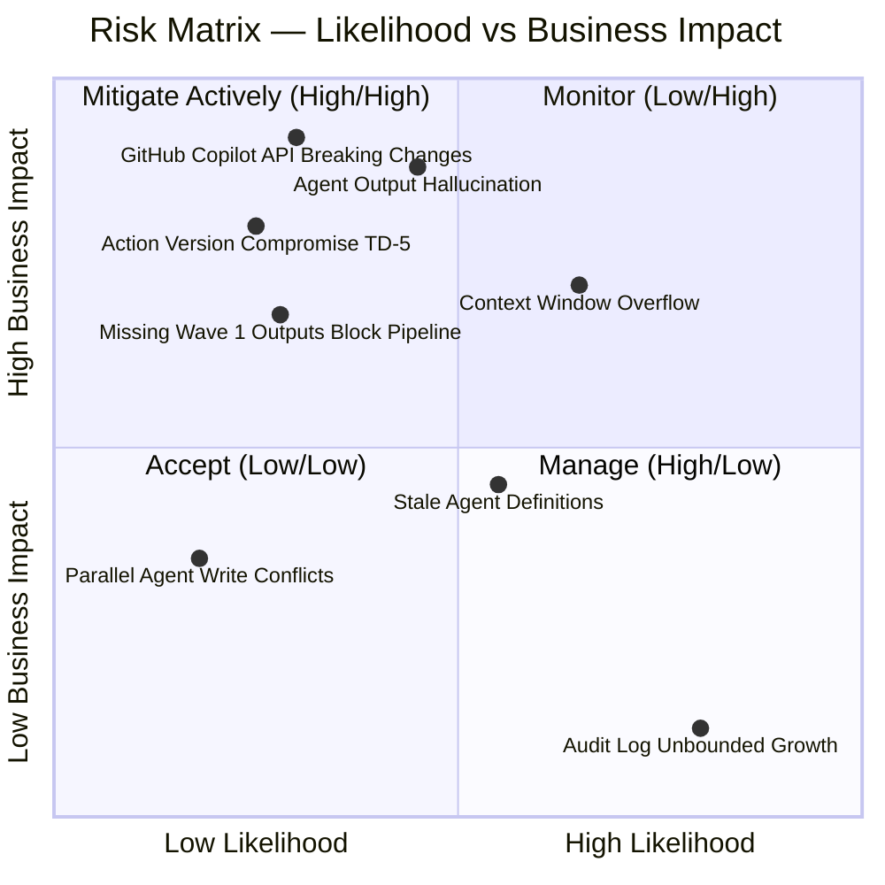

### 11.2 Risk Register

| ID | Risk | Likelihood | Impact | Mitigation Strategy |
|----|------|-----------|--------|-------------------|
| **R-1** | **Context Window Overflow** — Large codebases exceed LLM context limits during analysis | Medium | High | Incremental writing strategy; file-by-file processing; batching; section-by-section Arc42 generation |
| **R-2** | **Agent Output Hallucination** — LLM generates business rules or architecture claims not present in source code | Medium | High | Analysis-only principle enforced; agents document what EXISTS; human review of outputs recommended |
| **R-3** | **GitHub Copilot API Breaking Changes** — GitHub updates agent execution model, invalidating agent definitions | Low | Critical | Agent definitions use standard Markdown + YAML frontmatter; minimal API surface; monitor GitHub changelog |
| **R-4** | **Stale Agent Definitions** — Agent instructions become outdated as best practices evolve | Medium | Medium | Version-controlled definitions; schedule quarterly review; add version field to frontmatter (TD-4) |
| **R-5** | **Wave 1 Output Failure** — code-documentor or ast-analyzer fails, blocking all downstream agents | Low | High | Each downstream agent gracefully handles missing inputs; falls back to available data with placeholders |
| **R-6** | **Audit Log Unbounded Growth** — `agent-log.txt` grows across many analysis jobs | High | Low | Implement log rotation; consider per-job log files; archive policy |
| **R-7** | **Action Version Compromise** — `otto-de/assign_issue_toCopilot_action@v1.0.1` mutable version tag could be compromised | Low | High | Pin to commit SHA; implement Dependabot for Actions updates (see TD-5) |
| **R-8** | **Parallel Write Conflicts** — Two Wave 2 agents write to `agent-log.txt` simultaneously | Low | Low | Log entries are append-only; Git serialises filesystem writes; acceptable risk |

### 11.3 Technical Debt Inventory

| ID | Type | Description | Impact | Est. Fix |
|----|------|-------------|--------|---------|
| **TD-1** | Documentation Debt | `README.md` contains only 2 lines with no setup instructions, no agent descriptions, no usage guide | 🟡 Medium | 4 hours |
| **TD-2** | Validation Debt | No JSON Schema validation for inter-agent communication files; downstream agents assume valid JSON | 🟡 Medium | 8 hours |
| **TD-3** | Test Debt | No automated tests to verify agent outputs for known inputs; quality verified only manually | 🟠 High | 40+ hours |
| **TD-4** | Versioning Debt | Agent definitions have no version numbers; breaking changes cannot be detected programmatically | 🟡 Medium | 2 hours |
| **TD-5** | Security Debt | `copilot.yml` uses mutable version tag `@v1.0.1` instead of pinned commit SHA | 🟠 High | 0.5 hours |
| **TD-6** | Idempotency Debt | Re-running analysis may create duplicate `agent-log.txt` entries and overwrite output files | 🟢 Low | 4 hours |
| **TD-7** | Completeness Debt | `skills/` and `hooks/` directories contain only `.keep` files — incomplete feature implementation | 🟢 Low | 2 hours |
| **TD-8** | Contract Debt | No formal API contract (OpenAPI / JSON Schema) for `analysis_results.json` and other inter-agent files | 🟡 Medium | 8 hours |

### 11.4 Remediation Roadmap

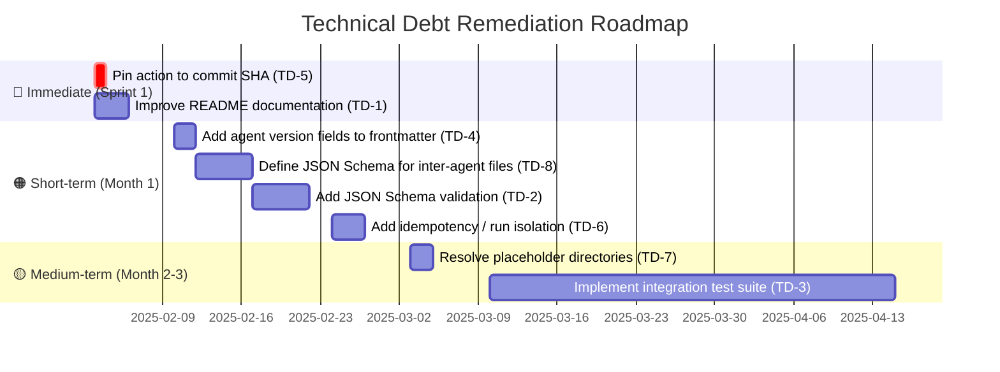

---

## 12. Glossary

### 12.1 Domain Terms

| Term | Definition |
|------|-----------|
| **Agent** | An autonomous AI specialist with a defined role, tool set, input contract, and output responsibility within the Platform |
| **Agent Definition** | A Markdown file (`.agent.md`) containing the system prompt, YAML frontmatter (name, description, tools), and behavioural instructions for a GitHub Copilot agent |
| **Analysis Pipeline** | The ordered sequence of 10 agent invocations from code-documentor (Wave 1) through arc42-documentor (Wave 4) |
| **Analysis Request** | A GitHub issue labelled `copilot-needed` that triggers the analysis pipeline; provides title, description, and contextual information to the orchestrator |
| **Artefact** | Any file produced by an agent: JSON data files, Markdown reports, SQL DDL files, or the final Arc42 document |
| **Audit Log** | The `analysis_output/agent-log.txt` file containing ISO-timestamped entries for every file created or modified by any agent |
| **Business Capability** | The primary functional area of the codebase that a source file addresses (e.g., Order Management, User Authentication, Risk Calculation) |
| **Business Rule** | A specific constraint, validation logic, calculation, or workflow step extracted from source code that represents domain knowledge |
| **copilot-needed** | The GitHub issue label that serves as the opt-in trigger for the analysis pipeline via GitHub Actions |
| **LegacyFinApp-026** | The issue title and reference for a legacy financial application analysis job; the 26th such analysis job in the series |
| **Orchestrator** | The master coordinator agent responsible for planning, sequencing, and communicating progress across all other agents |
| **Wave** | A temporal execution group of agents that share the same pipeline phase; agents within a wave may run in parallel; waves are strictly sequential |

### 12.2 Technical Terms

| Term | Definition |
|------|-----------|
| **ADR** | Architecture Decision Record — a document capturing a significant architectural decision, its context, rationale, consequences, and status |
| **AST** | Abstract Syntax Tree — a tree representation of the syntactic structure of source code, capturing all language constructs (classes, methods, statements, control flow) |
| **BPMN** | Business Process Model and Notation — an ISO standard for modelling business processes as graphical flowcharts with defined semantics |
| **C4 Model** | Context, Container, Component, Code — a hierarchical approach to software architecture diagrams at four levels of abstraction |
| **DDL** | Data Definition Language — the subset of SQL used to define and modify database structure (`CREATE TABLE`, `ALTER TABLE`, `DROP TABLE`, etc.) |
| **ER Diagram** | Entity-Relationship Diagram — a visual representation of database entities, their attributes, and the relationships between them |
| **GitHub Actions** | GitHub's CI/CD and automation platform; executes workflow YAML files in response to repository events |
| **GitHub Copilot** | GitHub's AI coding assistant; in this Platform context, the execution runtime that hosts and runs specialised analysis agents |
| **GITHUB_TOKEN** | An auto-provisioned, short-lived, repository-scoped access token issued by GitHub Actions for each workflow run |
| **JSON** | JavaScript Object Notation — a lightweight, text-based data interchange format; the lingua franca for inter-agent communication |
| **LLM** | Large Language Model — the AI model (GPT-4 class) powering GitHub Copilot and the analysis agents |
| **Mermaid** | A JavaScript-based diagramming tool that renders diagrams (flowcharts, class diagrams, sequence diagrams, ER diagrams, etc.) from text syntax; natively rendered by GitHub Markdown |
| **Orchestration Pattern** | An architectural pattern where a central component coordinates the activities of multiple participants in a defined sequence |
| **Pipe and Filter** | An architectural pattern where data flows through a series of independent processing stages connected by data channels |
| **PlantUML** | An alternative diagram-as-code tool; explicitly prohibited in this Platform in favour of Mermaid |
| **UML** | Unified Modelling Language — an ISO-standard visual modelling language for software systems including class, sequence, use case, component, and deployment diagrams |

### 12.3 Acronyms

| Acronym | Expansion |
|---------|----------|
| ADR | Architecture Decision Record |
| API | Application Programming Interface |
| AST | Abstract Syntax Tree |
| BPMN | Business Process Model and Notation |
| C4 | Context, Container, Component, Code |
| CI/CD | Continuous Integration / Continuous Delivery |
| DDL | Data Definition Language |
| ER | Entity-Relationship |
| JSON | JavaScript Object Notation |
| LLM | Large Language Model |
| SHA | Secure Hash Algorithm (used for commit pinning in GitHub Actions) |
| SQL | Structured Query Language |
| TOC | Table of Contents |
| UML | Unified Modelling Language |
| UTF-8 | Unicode Transformation Format — 8-bit |
| YAML | YAML Ain't Markup Language |

---

*— End of Arc42 Architecture Documentation —*

---

**Document Metadata**

| Attribute | Value |
|-----------|-------|
| **Document Version** | 1.0.0 |
| **Generated By** | arc42-documentor agent |
| **Issue Reference** | LegacyFinApp-026 Insights |
| **Source Repository** | gs_test — GitHub Copilot Agent Test Repository |
| **Arc42 Template Version** | 8.x |
| **Diagram Format** | Mermaid exclusively (16 embedded diagrams) |
| **Total Arc42 Sections** | 12 / 12 |
| **External References** | None — fully self-contained |
| **Encoding** | UTF-8 |
| **Last Updated** | 2025-01-30 |
