# Architecture Documentation (Arc42)

**Project**: HRApp — Human Resources Management System  
**Feature Focus**: HRApp-004 · Insights & Analytics Dashboard  
**Version**: 1.0.0  
**Date**: 2025-01-31  
**Generated by**: Arc42 Documentation Generator

---

## Table of Contents

1. [Introduction and Goals](#1-introduction-and-goals)
2. [Constraints](#2-constraints)
3. [Context and Scope](#3-context-and-scope)
4. [Solution Strategy](#4-solution-strategy)
5. [Building Block View](#5-building-block-view)
6. [Runtime View](#6-runtime-view)
7. [Deployment View](#7-deployment-view)
8. [Crosscutting Concepts](#8-crosscutting-concepts)
9. [Architecture Decisions](#9-architecture-decisions)
10. [Quality Requirements](#10-quality-requirements)
11. [Risks and Technical Debt](#11-risks-and-technical-debt)
12. [Glossary](#12-glossary)

---

## 1. Introduction and Goals

### 1.1 Overview

**HRApp** is a web-based Human Resources Management System (HRMS) designed to digitise and streamline the complete employee lifecycle — from recruitment and onboarding through day-to-day HR operations to offboarding. The system consolidates data from every HR domain into a single platform, giving HR professionals, managers, and executives a unified source of truth.

**HRApp-004 — Insights & Analytics** is the analytics and reporting capability within HRApp. It aggregates HR data from all operational modules, computes key performance indicators (KPIs), generates configurable reports, and renders interactive data visualisations for decision-makers. Insights transforms raw HR data into actionable intelligence.

### 1.2 Business Goals

| ID | Goal | Priority |
|----|------|----------|
| BG-01 | Provide a single platform for end-to-end HR process management | High |
| BG-02 | Reduce manual HR administration effort by at least 60 % | High |
| BG-03 | Enable data-driven people decisions through analytics (HRApp-004) | High |
| BG-04 | Ensure regulatory compliance for payroll, leave, and employment records | High |
| BG-05 | Improve employee experience via self-service capabilities | Medium |
| BG-06 | Support organisational growth with scalable recruitment workflows | Medium |
| BG-07 | Deliver real-time HR KPIs to executives and HR managers | High |

### 1.3 Quality Goals

The top five quality attributes, in priority order, that shape architectural decisions:

| Priority | Quality Attribute | Motivation |
|----------|-------------------|------------|
| 1 | **Security & Data Privacy** | HR data contains highly sensitive PII; must meet GDPR/local labour-law requirements |
| 2 | **Reliability & Availability** | Payroll, leave approval, and analytics dashboards must be available 24 × 7 |
| 3 | **Performance & Scalability** | Analytics queries over large employee datasets must respond within seconds; system must scale with headcount growth |
| 4 | **Usability** | Self-service for employees and intuitive dashboards for executives require excellent UX |
| 5 | **Maintainability** | Modular domain separation enables independent feature evolution and safe deployments |

### 1.4 Stakeholders

| Role | Concern | Relevance to HRApp-004 |
|------|---------|------------------------|
| **HR Manager** | Daily HR operations, compliance, workforce planning | Primary consumer of Insights dashboards and scheduled reports |
| **C-Suite / Executives** | Strategic workforce KPIs, headcount cost, attrition | Executive summary dashboards and drill-down reports |
| **Department Manager** | Team leave, performance, and headcount | Team-scoped analytics and performance views |
| **Employee** | Personal profile, payslips, leave balance | Limited — personal analytics (own leave history, payslip trends) |
| **IT / Ops Team** | System reliability, security, infrastructure | Deployment, monitoring, data pipeline health |
| **Payroll Administrator** | Payroll accuracy, payroll run reports | Payroll analytics within Insights |
| **Compliance Officer** | Audit trails, regulatory reports | Compliance and statutory reporting from Insights |
| **System Architect** | Technical quality, evolution roadmap | Overall architecture and HRApp-004 data pipeline design |

---

## 2. Constraints

### 2.1 Technical Constraints

| ID | Constraint | Rationale |
|----|-----------|-----------|
| TC-01 | Web-based SPA front-end (browser-only access) | Broad accessibility without client installation; supports remote workers |
| TC-02 | RESTful API (JSON over HTTPS) for all client-server communication | Platform-agnostic integration; future mobile-app readiness |
| TC-03 | Relational database as primary operational store | ACID guarantees required for payroll and leave transactions |
| TC-04 | Separate analytical/reporting data store (read replicas or dedicated warehouse) | Isolates heavy analytics queries from OLTP workloads |
| TC-05 | Role-Based Access Control (RBAC) enforced at API layer | Employees must only see data they are authorised to access |
| TC-06 | All data at rest and in transit must be encrypted (AES-256 / TLS 1.2+) | Regulatory and security requirements for PII |
| TC-07 | Containerised deployment (Docker / Kubernetes) | Consistent environments, horizontal scalability, CI/CD readiness |
| TC-08 | Diagrams and documentation in Markdown + Mermaid | Toolchain-neutral, version-controllable documentation |

### 2.2 Organisational Constraints

| ID | Constraint | Rationale |
|----|-----------|-----------|
| OC-01 | Must comply with applicable labour laws and data-protection regulations (e.g., GDPR) | Legal obligation for any system handling employee PII |
| OC-02 | Audit trails required for all payroll changes and leave approvals | Compliance and dispute resolution |
| OC-03 | Multi-tenant aware — each company's data is logically isolated | SaaS model; tenant data must never leak across boundaries |
| OC-04 | Feature delivery follows sprint cadence; HRApp-004 incremental releases | Agile delivery model |
| OC-05 | Third-party integrations (e.g., accounting, LDAP/SSO) must use documented APIs | Avoid tight coupling to external systems |

### 2.3 Conventions

| Convention | Details |
|-----------|---------|
| API versioning | `/api/v{n}/` prefix; non-breaking changes are additive |
| Naming | camelCase for JSON fields, PascalCase for classes, kebab-case for URLs |
| Error format | RFC 7807 Problem Details for HTTP APIs |
| Logging | Structured JSON logs; correlation IDs on every request |
| Date/time | ISO 8601 UTC for all timestamps; locale formatting on the client |
| Secrets management | Environment variables / vault; no secrets in source code |

---

## 3. Context and Scope

### 3.1 Business Context

HRApp operates within the organisation's IT landscape as the authoritative system for all HR data. It exchanges information with several external systems and user groups:

| External Actor | Direction | Data Exchanged |
|----------------|-----------|----------------|
| **Employee (Self-Service)** | In/Out | Profile updates, leave requests, payslip downloads |
| **HR Manager / Admin** | In/Out | Employee records, approvals, configuration |
| **Executive / Manager** | Out | KPI dashboards, analytics reports (HRApp-004) |
| **Payroll / Accounting System** | Out | Approved payroll runs, salary journals |
| **Identity Provider (SSO/LDAP)** | In | Authentication tokens, user directory sync |
| **Email / Notification Service** | Out | Approval notifications, payslip distribution |
| **Calendar / Scheduling System** | In/Out | Leave events, interview schedules |
| **Background Check Provider** | In/Out | Applicant verification requests/results |
| **Government / Tax Authority** | Out | Statutory payroll submissions |
| **Reporting / BI Tool** | Out | Raw data exports, embedded analytics (HRApp-004) |

### 3.2 System Context Diagram

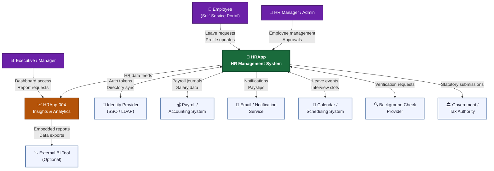

### 3.3 Technical Context

HRApp is deployed as a containerised, cloud-hosted application. The boundary between HRApp internal components and external services is the API Gateway / Load Balancer layer.

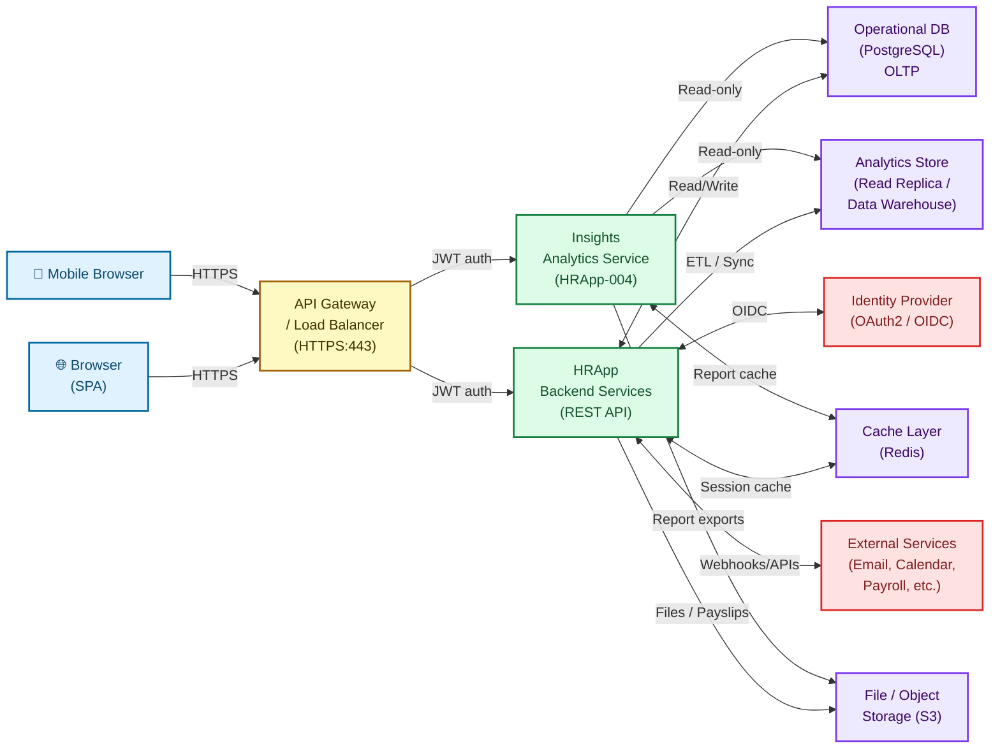

---

## 4. Solution Strategy

### 4.1 Technology Decisions

| Decision | Choice | Rationale |
|----------|--------|-----------|
| **Architecture style** | Modular Monolith → Microservices-ready | Reduces initial complexity; domain modules are cleanly separated to enable future extraction |
| **Front-end** | Single-Page Application (SPA) | Rich interactivity required for analytics dashboards; offline capability for profile viewing |
| **API style** | RESTful JSON over HTTPS | Widely understood; tooling support; compatibility with external integrations |
| **Authentication** | OAuth 2.0 + OIDC (JWT bearer tokens) | Industry standard; supports SSO federation and fine-grained scopes |
| **Primary database** | PostgreSQL (relational, ACID) | Complex relational data (employees, payroll, leave); strong JSON support for flexible fields |
| **Analytics store** | PostgreSQL read replica + optional columnar store (e.g., ClickHouse/Redshift) | Isolates analytics query load; columnar storage optimises aggregation performance |
| **Caching** | Redis | Session store, report cache, rate limiting |
| **Containerisation** | Docker + Kubernetes | Horizontal scaling, rolling deployments, environment consistency |
| **Async processing** | Message queue (e.g., RabbitMQ / Kafka) | Decouples payroll processing, notification dispatch, and ETL pipelines |
| **File storage** | S3-compatible object storage | Payslips, offer letters, report exports |

### 4.2 Top-Level Decomposition Strategy

The system is decomposed into **domain-aligned modules**, each owning its data and business logic:

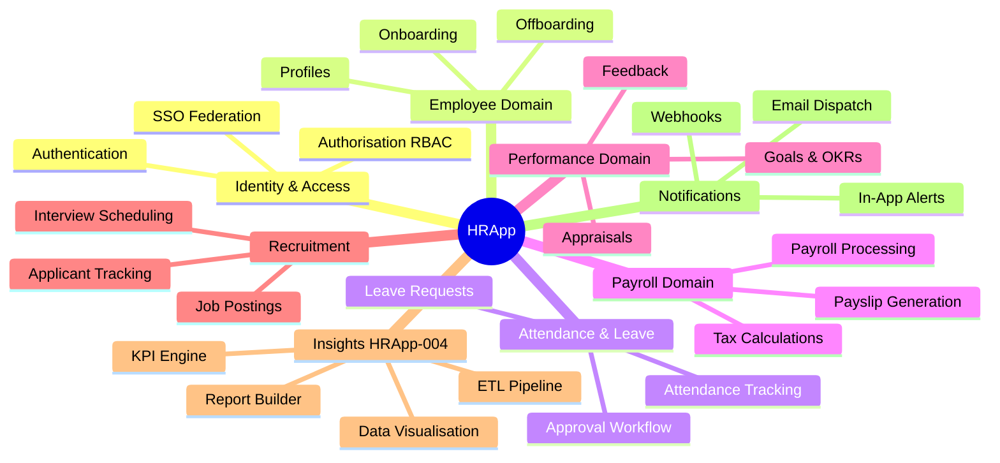

### 4.3 Approach to Quality Goals

| Quality Goal | Strategy |
|--------------|---------|
| **Security** | JWT + RBAC at API gateway; column-level encryption for sensitive fields; audit log for all mutations; GDPR data-retention policies |
| **Reliability** | Multi-replica deployment; health checks + auto-restart; circuit breakers for external calls; database connection pooling |
| **Performance** | Dedicated analytics read store; Redis caching for frequent KPIs; pagination + cursor-based APIs; async report generation for large exports |
| **Usability** | Component-driven UI with design system; WCAG 2.1 AA accessibility; progressive disclosure in dashboards |
| **Maintainability** | Domain-driven module boundaries; CI/CD pipeline with automated tests; API versioning; living architecture docs (this document) |

---

## 5. Building Block View

### 5.1 Level 1 — System White-Box

The HRApp system decomposes into seven major functional domains plus cross-cutting infrastructure:

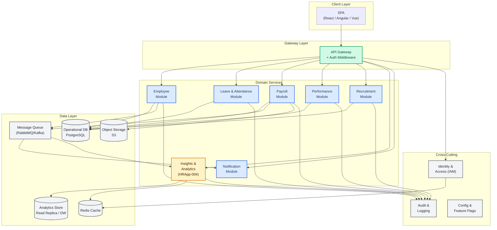

### 5.2 Level 2 — Insights Module (HRApp-004) White-Box

The Insights module is the analytical heart of HRApp. It is independently deployable and strictly read-oriented (CQRS read side):

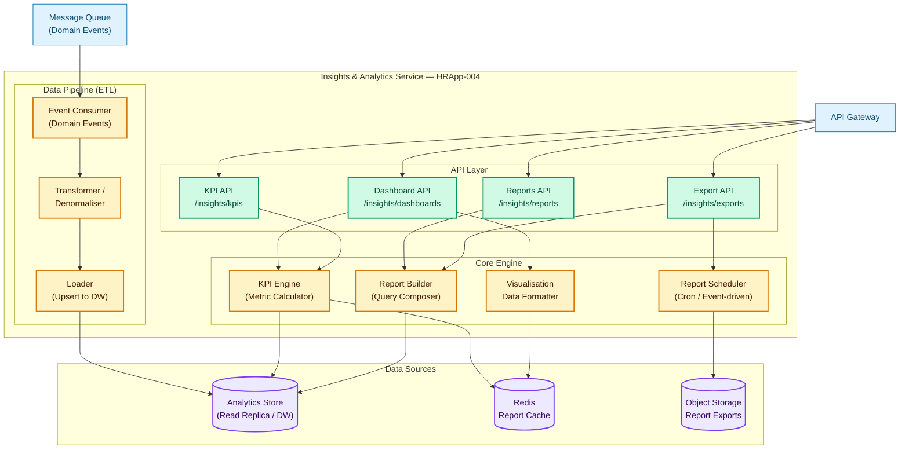

### 5.3 Level 2 — Employee Module White-Box

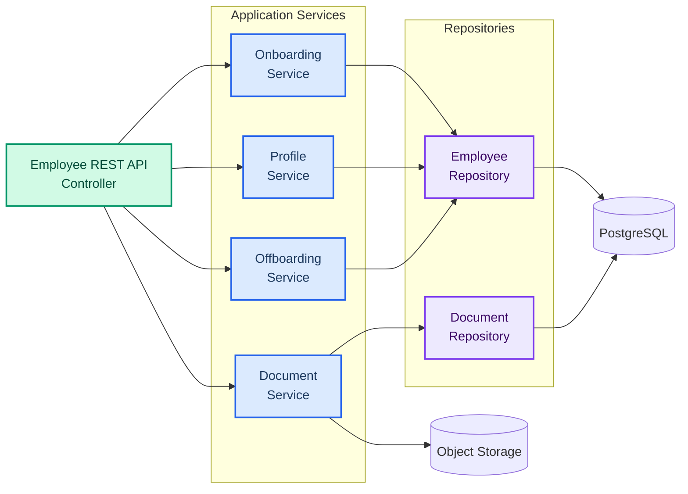

### 5.4 Level 3 — Key Domain Classes (Insights)

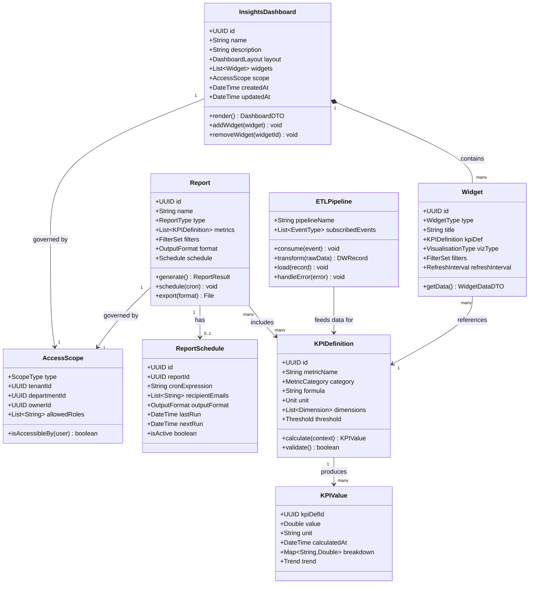

---

## 6. Runtime View

### 6.1 Scenario: Employee Onboarding Flow

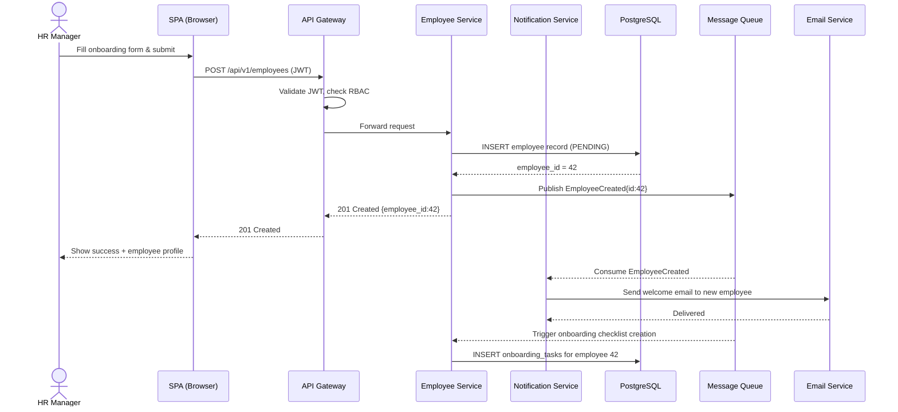

### 6.2 Scenario: Leave Request and Approval

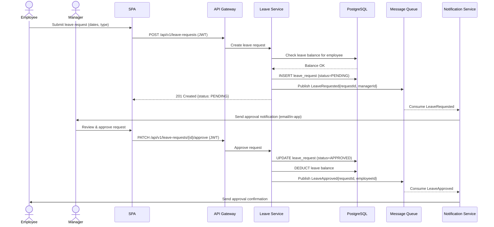

### 6.3 Scenario: Insights Dashboard Load (HRApp-004)

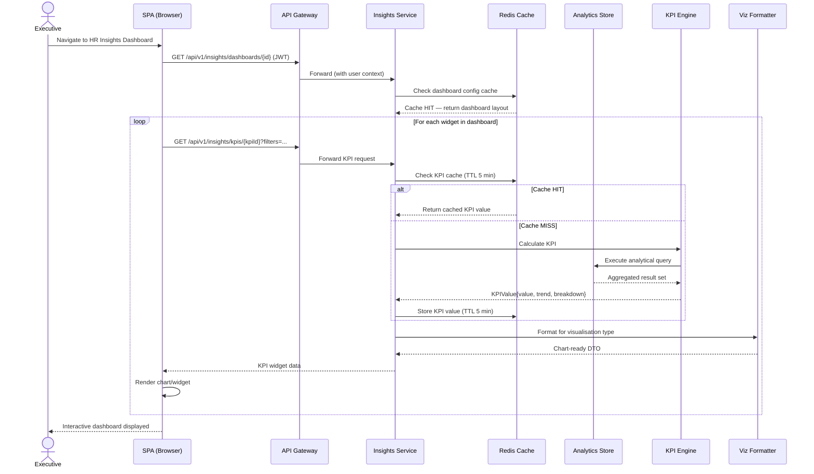

### 6.4 Scenario: Scheduled Report Generation (HRApp-004)

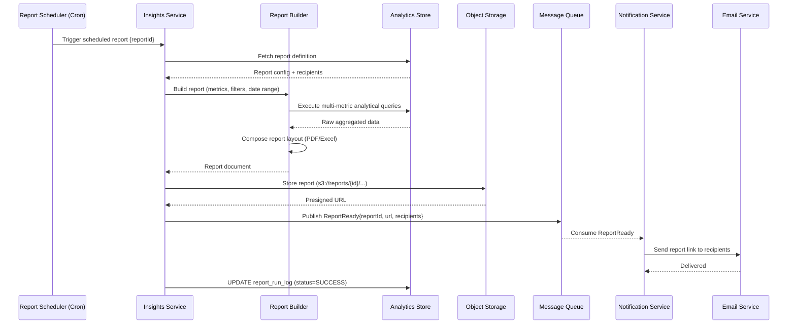

### 6.5 Scenario: Payroll Processing

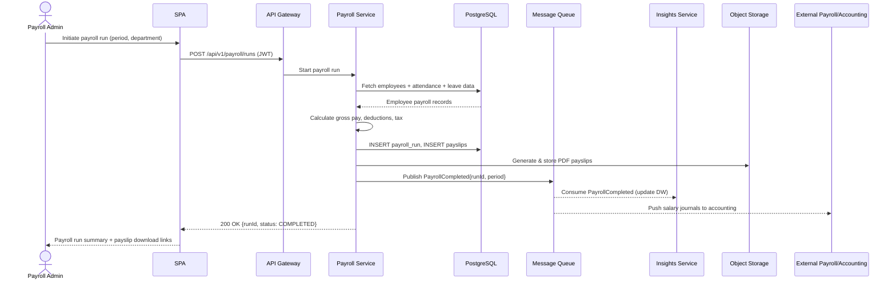

---

## 7. Deployment View

### 7.1 Infrastructure Overview

HRApp is deployed on a cloud provider (e.g., AWS / Azure / GCP) using Kubernetes for container orchestration. The architecture separates concerns across three network tiers: public, application, and data.

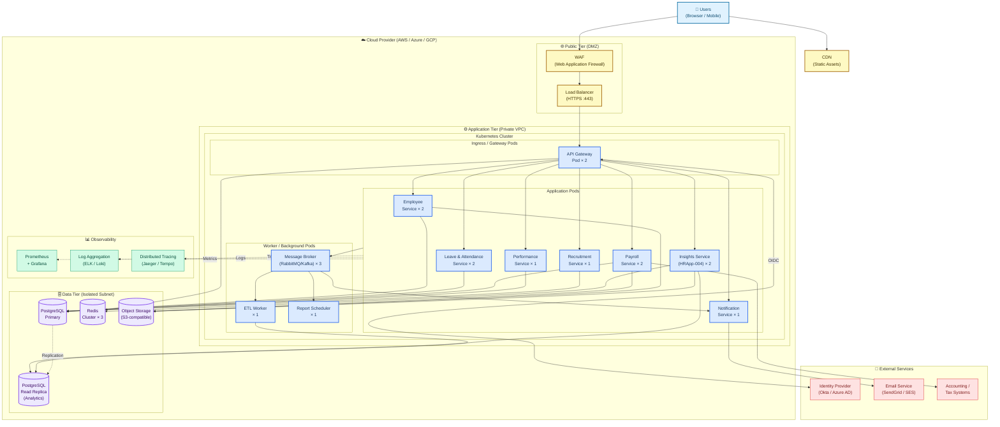

### 7.2 Kubernetes Deployment Configuration Summary

| Component | Replicas | CPU Request | Memory Request | HPA Enabled |
|-----------|----------|-------------|----------------|-------------|
| API Gateway | 2 (min) | 250m | 256Mi | Yes (max 6) |
| Employee Service | 2 (min) | 500m | 512Mi | Yes (max 4) |
| Leave & Attendance Service | 2 (min) | 250m | 256Mi | Yes (max 4) |
| Payroll Service | 2 (min) | 500m | 1Gi | No (controlled runs) |
| Performance Service | 1 | 250m | 256Mi | No |
| Recruitment Service | 1 | 250m | 256Mi | No |
| **Insights Service (HRApp-004)** | **2 (min)** | **500m** | **1Gi** | **Yes (max 6)** |
| ETL Worker | 1 | 500m | 512Mi | No |
| Report Scheduler | 1 | 250m | 256Mi | No |
| Notification Service | 1 | 100m | 128Mi | No |

### 7.3 CI/CD Pipeline

```mermaid
flowchart LR
    classDef step fill:#dbeafe,stroke:#2563eb,stroke-width:2px,color:#1e3a5f
    classDef gate fill:#fef3c7,stroke:#d97706,stroke-width:2px,color:#451a03
    classDef deploy fill:#d1fae5,stroke:#059669,stroke-width:2px,color:#064e3b

    PUSH["💾 Code Push\n(Git)"]:::step
    BUILD["🔨 Build\n(Compile + Lint)"]:::step
    TEST["🧪 Unit +\nIntegration Tests"]:::step
    SAST["🔒 SAST / Security\nScan"]:::gate
    DOCKER["🐳 Build &\nPush Docker Image"]:::step
    STAGING["🚀 Deploy to\nStaging"]:::deploy
    E2E["✅ E2E / Smoke\nTests"]:::gate
    APPROVE["👤 Manual\nApproval Gate"]:::gate
    PROD["🌐 Deploy to\nProduction\n(Rolling Update)"]:::deploy
    MONITOR["📊 Post-deploy\nMonitoring Check"]:::step

    PUSH --> BUILD --> TEST --> SAST --> DOCKER --> STAGING --> E2E --> APPROVE --> PROD --> MONITOR
```

---

## 8. Crosscutting Concepts

### 8.1 Domain Model

The core domain entities and their relationships across all HRApp modules:

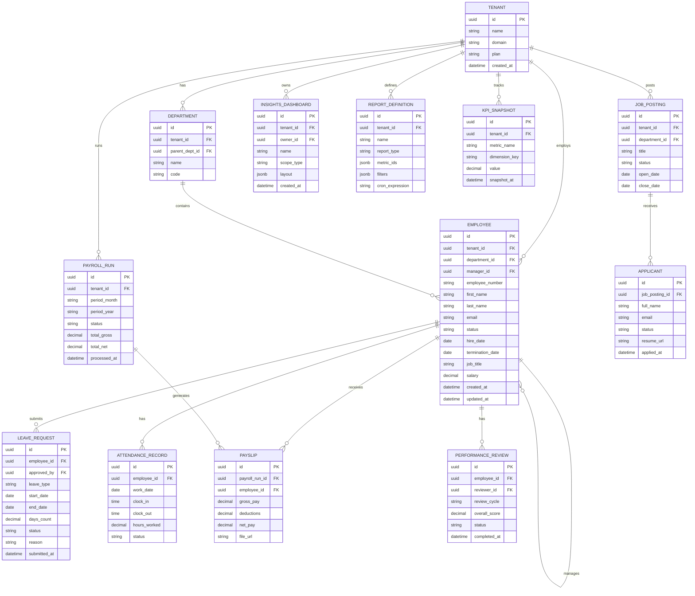

### 8.2 Authentication and Authorisation

**Authentication Flow**: OAuth 2.0 Authorization Code + PKCE via external Identity Provider (SSO). JWT bearer tokens carry claims for user identity, tenant, and roles.

**Authorisation Model**: Role-Based Access Control (RBAC) with the following built-in roles:

| Role | Permissions |
|------|------------|
| `SUPER_ADMIN` | Full system access across tenants |
| `TENANT_ADMIN` | Full access within tenant |
| `HR_MANAGER` | All HR operations + full Insights access |
| `PAYROLL_ADMIN` | Payroll operations + payroll analytics |
| `DEPARTMENT_MANAGER` | Read own department; approve leave; view team analytics |
| `EMPLOYEE` | View own profile, payslips, leave; submit requests |
| `INSIGHTS_VIEWER` | Read-only access to assigned dashboards |
| `RECRUITER` | Recruitment module + recruitment analytics |

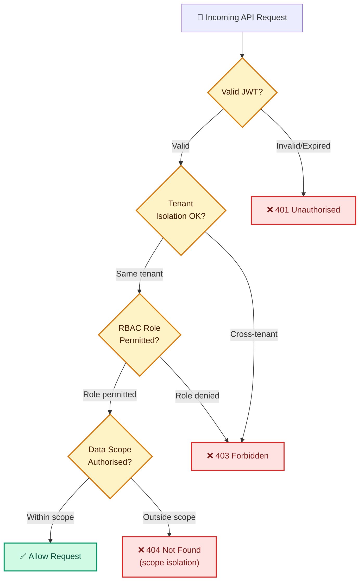

### 8.3 Data Privacy and GDPR Compliance

| Concept | Implementation |
|---------|---------------|
| **PII Identification** | Employee name, email, salary, NI/SSN, address, bank details tagged as PII in schema |
| **Encryption at rest** | AES-256 for database volumes and object storage |
| **Encryption in transit** | TLS 1.2+ enforced; HSTS headers |
| **Data minimisation** | Analytics queries return aggregated data; individual PII excluded from Insights exports by default |
| **Right to erasure** | Offboarding workflow triggers anonymisation of PII fields after retention period |
| **Audit logging** | Immutable log of all read/write access to PII fields |
| **Data retention** | Configurable per-tenant retention policies; automated archival + deletion |
| **Consent tracking** | Employee data-processing consent recorded on onboarding |

### 8.4 Caching Strategy

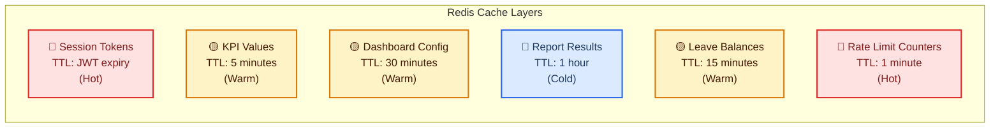

### 8.5 Error Handling and Resilience

| Pattern | Application |
|---------|------------|
| **Circuit Breaker** | Applied to all external service calls (IdP, email, accounting); fail-fast with fallback |
| **Retry with backoff** | Transient DB/network errors; exponential backoff, max 3 retries |
| **Dead Letter Queue** | Failed message queue events routed to DLQ for manual replay |
| **Graceful degradation** | Insights dashboard shows stale cached data if DW is unavailable |
| **Health checks** | Liveness and readiness probes on all K8s pods |
| **Idempotency** | Payroll runs and leave approvals are idempotent (idempotency key on API) |

### 8.6 Observability

| Pillar | Tool | Key Metrics |
|--------|------|-------------|
| **Metrics** | Prometheus + Grafana | Request rate, error rate, latency (p50/p95/p99), KPI query duration, ETL lag |
| **Logging** | ELK Stack / Loki | Structured JSON logs; correlation ID; tenant ID; user ID |
| **Tracing** | Jaeger / Tempo | Distributed traces across service hops for slow request diagnosis |
| **Alerting** | Alertmanager / PagerDuty | Error rate > 1%, p99 latency > 2s, ETL lag > 15 min, disk > 80% |

### 8.7 Business Rules (HR Domain)

| ID | Module | Rule |
|----|--------|------|
| BR-01 | Leave | An employee cannot apply for leave exceeding their current leave balance |
| BR-02 | Leave | Leave requests overlapping an existing approved leave are rejected |
| BR-03 | Payroll | A payroll run cannot be initiated if the previous run for the same period is still PENDING |
| BR-04 | Payroll | Salary changes effective within a period are pro-rated for that period's payslip |
| BR-05 | Payroll | Tax calculations follow the tenant's configured jurisdiction rules |
| BR-06 | Performance | A performance review cannot be submitted without at least one goal evaluation |
| BR-07 | Recruitment | An applicant cannot be advanced beyond INTERVIEW stage without a completed background check |
| BR-08 | Insights | KPI snapshots are immutable; corrections create a new versioned snapshot |
| BR-09 | Insights | Report exports containing individual PII require explicit HR_MANAGER or TENANT_ADMIN role |
| BR-10 | Employee | An employee record cannot be permanently deleted; offboarding sets status to TERMINATED and anonymises PII after the retention period |

---

## 9. Architecture Decisions

### ADR-001: Modular Monolith as Initial Architecture

**Status**: Accepted  
**Date**: Project inception  
**Context**: The team is small; deploying and operating multiple independent microservices early introduces significant operational overhead. However, business domains are distinct and may need independent scaling later.  
**Decision**: Implement HRApp as a modular monolith — one deployable artefact composed of strongly-bounded domain modules with no cross-module direct DB access. Modules communicate via well-defined service interfaces or internal events.  
**Consequences**:
- ✅ Simpler operations, single deployment pipeline initially
- ✅ Easier to refactor and move boundaries before extraction
- ✅ No network latency for in-process module calls
- ⚠️ Must enforce module boundaries strictly to avoid "big ball of mud"
- 🔄 Migration path: extract high-load or high-change modules (e.g., Insights, Payroll) as independent services when warranted

---

### ADR-002: Separate Analytics Store for HRApp-004 Insights

**Status**: Accepted  
**Date**: HRApp-004 design phase  
**Context**: Analytics queries (aggregations over millions of rows, multi-dimensional breakdowns, historical trend analysis) are fundamentally different workload patterns from OLTP operations. Running them on the primary PostgreSQL database risks impacting transactional performance.  
**Decision**: Maintain a dedicated analytics data store — initially a PostgreSQL read replica, with migration path to a columnar store (ClickHouse / Amazon Redshift) if query complexity grows. An ETL pipeline (event-driven + scheduled) populates the analytics store from domain events.  
**Consequences**:
- ✅ Operational DB protected from heavy analytics queries
- ✅ Analytics store schema optimised for reads (denormalised, columnar-friendly)
- ✅ Independent scaling of analytical workloads
- ⚠️ Near-real-time data (not real-time): analytics data has up to 5-minute lag
- ⚠️ ETL pipeline adds operational complexity; requires monitoring

---

### ADR-003: CQRS Read-Side for Insights Service

**Status**: Accepted  
**Date**: HRApp-004 design phase  
**Context**: Insights service only ever reads data; it must never modify operational data. Mixing read and write concerns risks accidental mutations and couples the analytics schema to the operational schema.  
**Decision**: Insights service is strictly a CQRS read-side consumer. It subscribes to domain events published by operational modules and maintains its own materialised view of HR data in the analytics store. It has no write access to the operational database.  
**Consequences**:
- ✅ Clear separation of concerns; Insights cannot corrupt operational data
- ✅ Analytics schema evolves independently of operational schema
- ✅ Read path can be optimised independently
- ⚠️ Eventual consistency: Insights data reflects recent (not current) state

---

### ADR-004: JWT Bearer Tokens with External Identity Provider

**Status**: Accepted  
**Date**: Security design phase  
**Context**: HRApp must support SSO for enterprise customers (Azure AD, Okta, Google Workspace). Building custom authentication is risky and non-differentiating.  
**Decision**: Delegate authentication to external OIDC-compliant Identity Providers. HRApp issues short-lived JWT access tokens (15 min) with refresh tokens (7 days). All API routes validate the JWT at the API Gateway before forwarding to services.  
**Consequences**:
- ✅ SSO support for enterprise tenants without custom implementation
- ✅ Reduced attack surface — no password management in HRApp
- ✅ Standard JWT claims enable stateless authorisation
- ⚠️ Hard dependency on IdP availability (mitigated by circuit breaker + token caching)

---

### ADR-005: Event-Driven Integration Between Modules

**Status**: Accepted  
**Date**: Integration design phase  
**Context**: Modules need to react to each other's state changes (e.g., Insights must know when payroll runs complete; Notifications must fire on leave approval) without tight coupling.  
**Decision**: Modules publish domain events to a message broker (RabbitMQ or Kafka). Consumers subscribe asynchronously. Events are the integration contract between modules.  
**Consequences**:
- ✅ Loose coupling — publishers unaware of consumers
- ✅ Enables the ETL pipeline for Insights with minimal impact on operational services
- ✅ Replay capability for analytics backfill
- ⚠️ Eventual consistency between modules; UX must handle this gracefully
- ⚠️ Message broker becomes a critical infrastructure dependency

---

### ADR-006: Multi-Tenancy via Tenant ID Column Isolation

**Status**: Accepted  
**Date**: SaaS design phase  
**Context**: HRApp is a SaaS platform serving multiple companies. Data isolation is a hard security requirement.  
**Decision**: Single-database multi-tenancy with `tenant_id` column on all tenant-scoped tables. Row-Level Security (RLS) enforced at the PostgreSQL level as a defence-in-depth measure, in addition to application-layer tenant filtering.  
**Consequences**:
- ✅ Cost-effective for SaaS; single database infrastructure
- ✅ Database RLS provides defence-in-depth if application layer has a bug
- ✅ Easier operational management vs. schema-per-tenant
- ⚠️ All queries must include `tenant_id`; risk of missing filter (mitigated by RLS)
- ⚠️ Not suitable for tenants requiring physical data isolation (offer schema-per-tenant as enterprise option)

---

## 10. Quality Requirements

### 10.1 Quality Tree

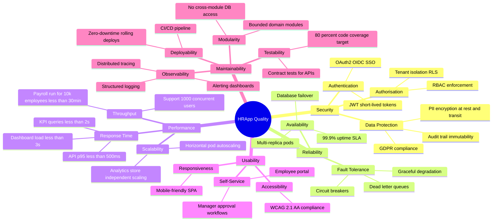

### 10.2 Quality Scenarios

| ID | Quality Attribute | Stimulus | Response | Measure |
|----|------------------|----------|----------|---------|
| QS-01 | Performance | Executive opens Insights dashboard with 12 KPI widgets | All widgets render with data | Page fully loaded in < 3 seconds (cached KPIs) |
| QS-02 | Performance | HR Manager generates headcount trend report for 24-month period | Report generated and available for download | Report ready in < 30 seconds |
| QS-03 | Availability | Database primary pod fails | Automatic failover to replica | Recovery time < 30 seconds; zero data loss |
| QS-04 | Security | Unauthenticated user attempts to access payroll data | Request blocked at API Gateway | 401 returned; attempt logged |
| QS-05 | Security | Employee attempts to view another employee's payslip | Request blocked by RBAC scope check | 404 returned; no data leaked |
| QS-06 | Scalability | Employee headcount grows from 500 to 5,000 | System continues to perform | KPI query latency stays < 2 seconds with HPA |
| QS-07 | Reliability | Message broker is temporarily unavailable | Operational modules continue functioning | No loss of OLTP transactions; events buffered and replayed on recovery |
| QS-08 | Maintainability | New KPI metric added to Insights | Code change isolated to KPI Engine and dashboard config | No changes required in operational modules |
| QS-09 | Usability | HR Manager schedules a monthly headcount report | Completes configuration without support | Task completed in < 5 minutes with zero training |
| QS-10 | Compliance | GDPR erasure request submitted for terminated employee | PII anonymised within retention period | Automated anonymisation triggered within 90-day window |

### 10.3 Technical Debt Register

| ID | Area | Description | Impact | Effort to Fix | Priority |
|----|------|-------------|--------|---------------|----------|
| TD-01 | Insights / ETL | ETL pipeline is polling-based on initial implementation; should be event-driven | Medium — adds latency to KPI freshness | Medium | High |
| TD-02 | Payroll | Tax calculation logic is hard-coded for single jurisdiction; not configurable | High — blocks multi-country expansion | High | High |
| TD-03 | Architecture | Modular monolith — no enforced module boundary at build time (only convention) | Medium — risk of coupling drift | Low | Medium |
| TD-04 | Database | No database migration tooling established; schema changes applied manually | High — deployment risk | Low | High |
| TD-05 | Testing | Integration test coverage below 60% for Leave and Payroll modules | High — regression risk | Medium | High |
| TD-06 | Insights | Report Builder has no query timeout enforcement; runaway queries possible | High — availability risk | Low | High |
| TD-07 | Security | Refresh token rotation not yet implemented | Medium — reduces token compromise window | Medium | Medium |
| TD-08 | Observability | No SLO dashboards configured in Grafana | Medium — incident response slower | Low | Medium |

---

## 11. Risks and Technical Debt

### 11.1 Risk Register

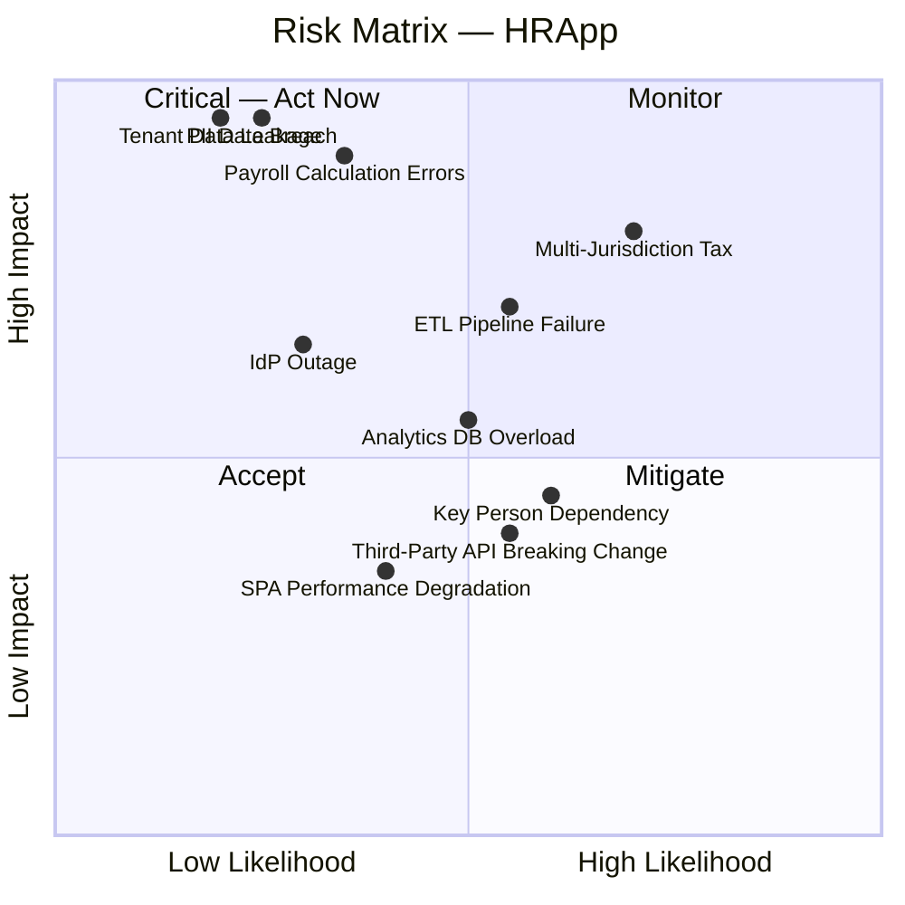

### 11.2 Detailed Risk Analysis

| ID | Risk | Likelihood | Impact | Mitigation Strategy |
|----|------|-----------|--------|---------------------|
| R-01 | **PII Data Breach** — unauthorised access to employee sensitive data | Low | Critical | Encryption at rest/transit; RBAC; RLS; penetration testing; security audit; intrusion detection |
| R-02 | **Payroll Calculation Errors** — incorrect salary or tax computation | Medium | Critical | Comprehensive unit tests for payroll engine; dual-run validation; audit trail; reconciliation reports in Insights |
| R-03 | **ETL Pipeline Failure** — analytics data stops updating | Medium | High | Monitoring + alerting on ETL lag; dead-letter queue; automatic retry; graceful degradation (stale cache shown) |
| R-04 | **Tenant Data Leakage** — one tenant sees another's data | Low | Critical | PostgreSQL RLS as defence-in-depth; automated tenant isolation tests in CI; regular security audits |
| R-05 | **Multi-Jurisdiction Tax Expansion** — tax rules differ by country | High | High | Abstract tax calculation into pluggable jurisdiction provider; design tax engine for configurability |
| R-06 | **Analytics DB Overload** — complex queries degrade Insights performance | Medium | High | Query timeout enforcement; query plan review; caching layer; scale analytics store independently; consider columnar DB migration |
| R-07 | **Identity Provider Outage** — users cannot authenticate | Low-Medium | High | Circuit breaker with cached token validation; fallback auth mode for emergencies; SLA agreement with IdP |
| R-08 | **Third-Party API Breaking Change** — external payroll/accounting API changes | Medium | Medium | Adapter pattern for external integrations; versioned integration contracts; monitoring of vendor changelogs |
| R-09 | **Reporting Runaway Queries** — unoptimised report causes DB saturation | Medium | High | Query execution timeout (30s limit); query complexity score gating in Report Builder; max row limits on exports |
| R-10 | **Key Person Dependency** — knowledge concentrated in few team members | High | Medium | Architecture documentation (this document); cross-training; recorded design decision rationale (ADRs) |

### 11.3 Technical Debt Resolution Roadmap

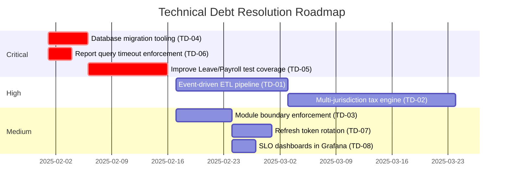

---

## 12. Glossary

| Term | Definition |
|------|-----------|
| **ADR** | Architecture Decision Record — a document capturing an important architectural decision, its context, and its consequences |
| **Analytics Store** | A database optimised for read-heavy analytical queries, separate from the operational (OLTP) database. May be a read replica or a dedicated columnar store |
| **Applicant Tracking System (ATS)** | The component of HRApp that manages the recruitment pipeline from job posting through candidate selection |
| **Attendance** | The record of an employee's physical or virtual presence at work, including clock-in/clock-out times |
| **Audit Log** | An immutable, append-only record of significant system events (data access, modifications, approvals) for compliance and forensic purposes |
| **BPMN** | Business Process Model and Notation — a standard for workflow diagrams |
| **Circuit Breaker** | A resilience pattern that stops calling a failing service temporarily to allow recovery |
| **CQRS** | Command Query Responsibility Segregation — architectural pattern separating read (query) operations from write (command) operations |
| **Dashboard** | An interactive web page within HRApp-004 Insights that displays multiple KPI widgets and charts |
| **Dead Letter Queue (DLQ)** | A message queue that stores messages that could not be processed successfully, for later inspection and replay |
| **Department** | An organisational unit within a Tenant, containing one or more Employees |
| **ETL** | Extract, Transform, Load — the process of moving and reshaping data from operational sources to the analytics store |
| **GDPR** | General Data Protection Regulation — EU regulation governing the processing of personal data |
| **HPA** | Horizontal Pod Autoscaler — a Kubernetes mechanism that automatically scales the number of pod replicas based on metrics |
| **HR** | Human Resources — the business function managing employee lifecycle, compensation, benefits, and workforce planning |
| **HRApp** | The Human Resources Management System described in this document |
| **HRApp-004** | The feature identifier for the Insights & Analytics capability within HRApp |
| **HRMS** | Human Resources Management System |
| **Identity Provider (IdP)** | An external service (e.g., Okta, Azure AD) responsible for authenticating users and issuing identity tokens |
| **Insights** | The HRApp-004 analytics and reporting module that aggregates HR data into KPIs, dashboards, and reports |
| **JWT** | JSON Web Token — a compact, URL-safe token format used for authentication and authorisation claims |
| **KPI** | Key Performance Indicator — a measurable value demonstrating how effectively objectives are being achieved |
| **KPI Engine** | The component within Insights responsible for computing KPI values from raw HR data |
| **Leave** | Authorised absence from work, categorised by type (annual leave, sick leave, parental leave, etc.) |
| **Leave Balance** | The remaining entitlement of a specific leave type available to an employee in a given period |
| **Modular Monolith** | An architectural style where a single deployable application is internally structured into clearly bounded, loosely coupled modules |
| **OIDC** | OpenID Connect — an identity layer built on top of OAuth 2.0 for federated authentication |
| **OLTP** | Online Transaction Processing — database workload characterised by frequent, short read/write transactions |
| **Onboarding** | The process of integrating a newly hired employee into the organisation, including account setup, document collection, and orientation |
| **Payroll Run** | The batch processing operation that calculates pay for all eligible employees for a given period and generates payslips |
| **Payslip** | A document (PDF) detailing an employee's gross pay, deductions, and net pay for a specific payroll period |
| **PII** | Personally Identifiable Information — any data that can identify a specific individual (name, email, salary, etc.) |
| **RBAC** | Role-Based Access Control — an authorisation model where permissions are assigned to roles, and users are assigned roles |
| **Read Replica** | A copy of a database that is kept up-to-date via replication, used for read-only queries to offload the primary database |
| **Report Builder** | The component within HRApp-004 that composes multi-metric reports from the analytics store |
| **Report Scheduler** | The component within HRApp-004 that triggers report generation on a configurable cron schedule |
| **RLS** | Row-Level Security — a PostgreSQL feature that restricts which rows a database user can access |
| **SLA** | Service Level Agreement — a commitment to a specified level of service availability or performance |
| **SPA** | Single-Page Application — a web application that loads a single HTML page and dynamically updates content |
| **SSO** | Single Sign-On — authentication scheme allowing a user to log in once and access multiple applications |
| **Tenant** | A company or organisation using HRApp in a SaaS context; data is logically isolated per tenant |
| **TLS** | Transport Layer Security — cryptographic protocol for secure communication over networks |
| **Widget** | A single visual element on an Insights dashboard, rendering one KPI or chart |

---

*End of Arc42 Architecture Documentation — HRApp / HRApp-004 Insights*

---
> **Document Metadata**  
> Target path: `docs/arc42/HRApp-arc42.md`  
> Saved at: `HRApp-arc42.md` (workspace root — move to `docs/arc42/` after running `mkdir -p docs/arc42`)  
> Generated: 2025-01-31 | Version: 1.0.0 | Format: Arc42 + Mermaid  
> Review cycle: Per major release or significant architectural change
