# Architecture Documentation (Arc42)

**Project**: GitHub Copilot Multi-Agent Code Analysis Platform (`gs_test`)
**Version**: 1.0.0
**Date**: 2025-07-14
**Generated by**: Arc42 Documentation Generator (arc42-documentor agent)
**Output path note**: Saved to repository root. Target path `docs/arc42/` could not be auto-created. To move: `mkdir -p docs/arc42 && mv arc42-architecture-documentation.md docs/arc42/`

---

> **About this document**: This Arc42 architecture documentation was generated by analyzing the repository structure, all agent definition files in `.github/agents/`, and the GitHub Actions workflow configuration. It documents the design and architecture of the GitHub Copilot Multi-Agent Code Analysis Platform — a system of specialized AI agents orchestrated to perform comprehensive source code analysis and documentation generation.

---

## Table of Contents

1. [Introduction and Goals](#1-introduction-and-goals)
2. [Architecture Constraints](#2-architecture-constraints)
3. [System Scope and Context](#3-system-scope-and-context)
4. [Solution Strategy](#4-solution-strategy)
5. [Building Block View](#5-building-block-view)
6. [Runtime View](#6-runtime-view)
7. [Deployment View](#7-deployment-view)
8. [Cross-cutting Concepts](#8-cross-cutting-concepts)
9. [Architecture Decisions](#9-architecture-decisions)
10. [Quality Requirements](#10-quality-requirements)
11. [Risks and Technical Debt](#11-risks-and-technical-debt)
12. [Glossary](#12-glossary)

---

## 1. Introduction and Goals

### 1.1 Purpose and Business Context

The **GitHub Copilot Multi-Agent Code Analysis Platform** is a repository (`gs_test`) that serves as a demonstration and operational framework for a suite of specialized AI agents built on top of GitHub Copilot. The platform's primary purpose is to enable automated, comprehensive analysis and documentation of software codebases without human intervention in the analysis workflow.

The system solves a critical pain point in software engineering: the time-consuming, inconsistent, and often incomplete process of manually generating architecture documentation, quality assessments, UML diagrams, business process models, and other technical artifacts. By orchestrating a pipeline of specialized agents, the platform produces a full complement of analysis outputs — from raw AST representations to polished Arc42 architecture documentation — on demand.

**Key Business Goals:**
- Reduce time-to-documentation from days/weeks to minutes
- Ensure consistent, comprehensive code analysis across projects
- Enable non-technical stakeholders to understand technical architecture via executive summaries
- Provide actionable technical debt identification and remediation guidance
- Generate living documentation that reflects actual code state

### 1.2 Quality Goals

| Priority | Quality Goal | Description | Measurable Scenario |
|----------|-------------|-------------|-------------------|
| 1 | **Completeness** | All Arc42 sections populated; all 12 agent types produce output | Every analysis run results in a complete documentation set with no missing sections |
| 2 | **Consistency** | Unified Mermaid-only diagram standard across all agents | Zero PlantUML or ASCII art diagrams in any agent output |
| 3 | **Traceability** | Every finding references its source agent and file | Each recommendation includes source agent, file path, and line number where applicable |
| 4 | **Extensibility** | New agents can be added without modifying existing ones | A new agent can be integrated by adding a single `.agent.md` file |
| 5 | **Auditability** | All agent actions logged to `analysis_output/agent-log.txt` | Full audit trail recoverable from log file for any analysis run |

### 1.3 Stakeholders

| Stakeholder | Role | Expectations |
|-------------|------|-------------|
| **Software Architects** | Primary consumer of Arc42 documentation | Comprehensive, accurate architectural documentation with diagrams |
| **Engineering Teams** | Consumers of code quality reports and UML diagrams | Actionable technical debt items, clear class/sequence diagrams |
| **Technical Managers / Leads** | Consumers of executive summary | Strategic recommendations, risk assessment, effort estimates |
| **Product Owners / Business Analysts** | Consumers of BPMN diagrams | Business process documentation in understandable notation |
| **Database Administrators** | Consumers of DDL generator output | Production-ready SQL DDL with indexes and constraints |
| **New Developers (Onboarding)** | Consumers of code documentation | Clear explanations of business logic and system structure |
| **GitHub Copilot Platform** | Execution environment | Valid agent `.md` file format; proper tool declarations |
| **Repository Maintainers** | Curators of agent definitions | Easy-to-update agent prompt files in standard Markdown format |

---

## 2. Architecture Constraints

### 2.1 Technical Constraints

| ID | Constraint | Rationale |
|----|-----------|-----------|
| TC-01 | **GitHub Copilot Agent Runtime** | All agents must be defined as `.agent.md` files conforming to the GitHub Copilot agent specification (YAML front-matter with `name`, `description`, `tools` fields) |
| TC-02 | **Mermaid-Only Diagrams** | All diagrams must use Mermaid syntax in ` ```mermaid ` code blocks. PlantUML and ASCII art are explicitly prohibited across all agents |
| TC-03 | **Read-Only Analysis** | No agent may modify, edit, or delete source code files. All agents are strictly analytical — they read and document, never transform |
| TC-04 | **No Code Execution** | Agents do not execute, compile, or test source code. Analysis is static only |
| TC-05 | **File-based Inter-agent Communication** | Agents communicate exclusively through files written to the `analysis_output/` directory. No direct agent-to-agent API calls |
| TC-06 | **Markdown Output Format** | All human-readable outputs must be in Markdown format for compatibility with GitHub rendering and version control |
| TC-07 | **JSON for Structured Data** | Machine-readable intermediate outputs must be valid JSON parsable by Python's `json.loads()` — no code block markers or extra text |
| TC-08 | **Sequential Execution Dependency Chain** | The orchestrator enforces a defined execution order; downstream agents depend on outputs from upstream agents |
| TC-09 | **GitHub Actions Workflow Integration** | The `copilot.yml` workflow uses `otto-de/assign_issue_toCopilot_action@v1.0.1` — a third-party action pinned to a specific version |
| TC-10 | **Tool Availability** | Agents declare required tools in YAML front-matter (`read`, `search`, `edit`, `todo`, `agent`). The `agent` tool (for sub-agent invocation) is restricted to the orchestrator |

### 2.2 Organizational Constraints

| ID | Constraint | Rationale |
|----|-----------|-----------|
| OC-01 | **GitHub Repository Structure** | Agent definitions live exclusively in `.github/agents/` following GitHub Copilot conventions |
| OC-02 | **Label-Triggered Automation** | Issue automation is triggered only when the `copilot-needed` label is applied — no other trigger mechanism |
| OC-03 | **Agent Naming Convention** | Agent filenames follow the pattern `<agent-name>.agent.md`; the orchestrator uses `orchestrator.agent.md` |
| OC-04 | **Output Directory Convention** | Each agent writes to its own subdirectory under `analysis_output/<agent-name>/` and logs to the shared `analysis_output/agent-log.txt` |
| OC-05 | **No Secrets in Agent Definitions** | Agent prompt files may not contain credentials, API keys, or secrets — all sensitive data must use GitHub Secrets |

### 2.3 Conventions

| Convention | Description |
|-----------|-------------|
| **Agent Log Format** | `<ISO timestamp> \| <agent-name> \| created/updated \| <relative-path> \| short description` |
| **Agent Front-matter** | Required fields: `name`, `description`, `tools` (array of strings) |
| **Diagram Standard** | Mermaid only; styled with colors/CSS classes for readability |
| **Analysis-only Principle** | Every agent definition explicitly states it never modifies source code |
| **Incremental Output** | All agents are designed to produce outputs incrementally (file by file, section by section) to avoid context limit issues |

---

## 3. System Scope and Context

### 3.1 Business Context

The platform operates within the GitHub ecosystem, receiving input (source code repositories) and producing output (analysis documentation). External actors interact with the system through GitHub's native interfaces (Issues, Pull Requests, labels).

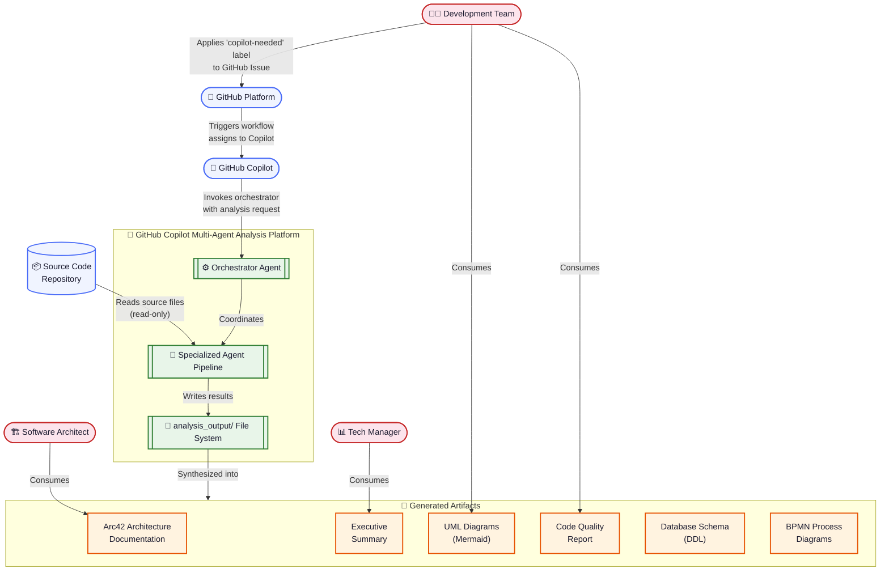

### 3.2 Technical Context

The platform is deployed exclusively within the GitHub cloud infrastructure. The technical interfaces are all file-based, with the GitHub Actions workflow providing the entry-point trigger.

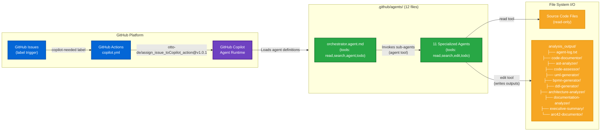

### 3.3 External Interfaces

| Interface | Type | Direction | Description |
|-----------|------|-----------|-------------|
| GitHub Issues API | Event-driven | Inbound | Triggers analysis when `copilot-needed` label applied |
| GitHub Actions | Workflow | Inbound | `copilot.yml` assigns issue to Copilot via third-party action |
| `otto-de/assign_issue_toCopilot_action@v1.0.1` | GitHub Action | Outbound | Bridges GitHub Issues to Copilot agent invocation |
| Source Code File System | File I/O | Inbound | Agents read source files for analysis (read-only) |
| `analysis_output/` File System | File I/O | Outbound | Agents write all analysis results to this directory tree |
| GitHub Secrets (`GITHUB_TOKEN`) | Secret | Inbound | Auto-provisioned by GitHub Actions for workflow authentication |

---

## 4. Solution Strategy

### 4.1 Core Strategy: Specialized Agent Pipeline

The platform adopts a **pipeline architecture with specialization** rather than a single monolithic analysis agent. Each analysis concern (documentation, quality, AST, UML, BPMN, DDL, architecture, etc.) is handled by a dedicated agent with focused expertise and responsibilities.

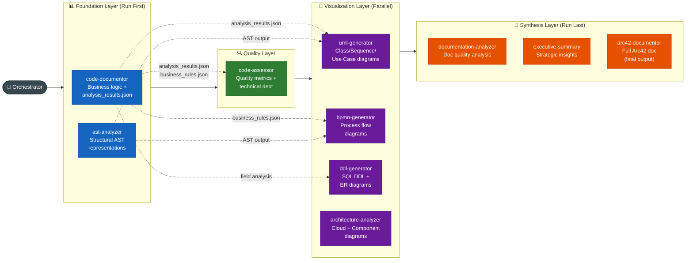

### 4.2 Technology Decisions

| Decision | Choice | Rationale |
|----------|--------|-----------|
| **Agent Definition Format** | GitHub Copilot `.agent.md` with YAML front-matter | Native GitHub Copilot agent standard; version-controllable as code |
| **Diagram Format** | Mermaid (exclusive) | Native rendering in GitHub Markdown; no external tooling required; version-controllable |
| **Inter-agent Communication** | File-based via `analysis_output/` | Decoupled, auditable, persistent between runs; no runtime dependencies |
| **Structured Data Format** | JSON (strict, no code block markers) | Machine-parsable; compatible with Python `json.loads()` for downstream tooling |
| **Human-readable Format** | Markdown | Universal, renders in GitHub, version-controllable |
| **Trigger Mechanism** | GitHub Issues label (`copilot-needed`) | Low-friction user interface; no CLI required |
| **Architecture Pattern** | Agent Pipeline (Sequential + Parallel phases) | Clear dependencies; enables parallelism where possible; easy to extend |

### 4.3 Quality Goal Strategies

| Quality Goal | Strategy |
|-------------|---------|
| **Completeness** | Orchestrator mandates execution of all 10+ agents; arc42-documentor uses placeholder text for missing inputs rather than omitting sections |
| **Consistency** | Explicit `CRITICAL DIAGRAM FORMAT REQUIREMENT` section in every agent definition enforces Mermaid-only standard |
| **Traceability** | Shared `agent-log.txt` with standardized format; output files organized by agent in subdirectories |
| **Extensibility** | New agents added as `.agent.md` files; orchestrator updated to reference them in execution order |
| **Auditability** | ISO timestamp logging mandated; log entry required after every file creation/modification |

---

## 5. Building Block View

### 5.1 Level 1: High-Level System Decomposition

The system consists of three major subsystems: the **Trigger & Orchestration Layer**, the **Agent Pipeline**, and the **Output Filesystem**.

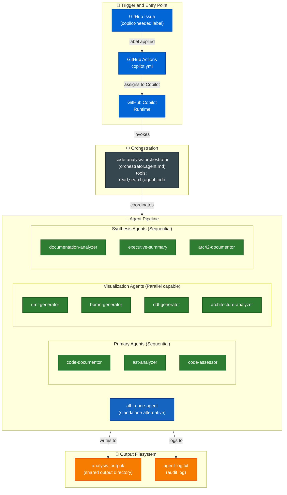

### 5.2 Level 2: Agent Module Responsibilities

Each agent in the pipeline is a self-contained module with defined inputs, outputs, and responsibilities.

| Agent | Input Sources | Primary Outputs | Responsibility |
|-------|--------------|-----------------|----------------|
| **code-documentor** | Source code files | `analysis_results.json`, `business_rules_extractor_analysis.json`, `package_summary.json`, `application_summary.json` | Foundation: business logic extraction, method documentation |
| **ast-analyzer** | Source files + `analysis_results.json` | `[FileName]_AST.json`, `AST_Analysis_Summary.md` | Structural: type declarations, control flow, dependency graph |
| **code-assessor** | `analysis_results.json`, `business_rules.json`, AST outputs | `assessment_summary.json`, `COMPREHENSIVE_ASSESSMENT_REPORT.md` | Quality: complexity, issues (criticality 1-5), technical debt |
| **uml-generator** | `analysis_results.json`, AST outputs | `class-diagrams.md`, `sequence-diagrams.md`, `use-case-diagrams.md` | Visualization: class/sequence/use-case Mermaid diagrams |
| **bpmn-generator** | `business_rules.json`, AST outputs | `[process]-workflow.md` (Mermaid flowcharts) | Visualization: business workflow modeling |
| **ddl-generator** | Field analysis, workflow analysis, business rules | `schema.sql`, `schema_summary.json`, ER diagram (Mermaid) | Visualization: SQL DDL generation, ER diagram |
| **architecture-analyzer** | All previous agent outputs | `ARCHITECTURE_SUMMARY.md`, cloud/component diagrams | Visualization: cloud and component architecture |
| **documentation-analyzer** | Existing docs + all agent outputs | `documentation_analysis.json`, `DOCUMENTATION_QUALITY_REPORT.md` | Synthesis: doc quality assessment, gap analysis |
| **executive-summary** | All agent outputs | `executive-summary.md` | Synthesis: strategic insights, risk assessment, ROI |
| **arc42-documentor** | All agent outputs + executive summary | `ARC42_DOCUMENTATION.md` | Synthesis: complete self-contained Arc42 documentation |
| **all-in-one-agent** | Source code files (direct) | All of the above | Alternative: single-agent full analysis for simpler usage |

### 5.3 Level 3: Orchestrator and Agent Class Structure

```mermaid
classDiagram
    class OrchestratorAgent {
        <<GitHub Copilot Agent>>
        +name: String = "code-analysis-orchestrator"
        +tools: String[] = [read, search, agent, todo]
        +understandRequest() void
        +planExecution() ExecutionPlan
        +communicatePlan() void
        +coordinateAgents() void
        +delegateFinalSynthesis() void
    }

    class SpecializedAgent {
        <<abstract>>
        +name: String
        +description: String
        +tools: String[]
        +outputDir: String
        +analyze() void
        +writeOutput() void
        +logAction(timestamp, action, path, description) void
    }

    class CodeDocumentor {
        +name = "code-documentor"
        +outputDir = "analysis_output/code-documentor/"
        +classifyFile(file) String
        +extractBusinessRules(file) String[]
        +analyzeMethod(method) MethodBreakdown
        +generateAnalysisResults() void
        +generateBusinessRulesJSON() void
    }

    class ASTAnalyzer {
        +name = "ast-analyzer"
        +outputDir = "analysis_output/ast-analyzer/"
        +parseTypeDeclarations(file) TypeDeclaration[]
        +analyzeMethods(class) MethodAST[]
        +extractStatements(method) Statement[]
        +generateASTJSON(file) void
    }

    class CodeAssessor {
        +name = "code-assessor"
        +outputDir = "analysis_output/code-assessor/"
        +rateCodeComplexity() int
        +rateLogicComplexity() int
        +detectIssues() Issue[]
        +assessTechnicalDebt() TechnicalDebt[]
        +generateEnhancements() Enhancement[]
    }

    class UMLGenerator {
        +name = "uml-generator"
        +outputDir = "analysis_output/uml-generator/"
        +generateClassDiagram() String
        +generateSequenceDiagram() String
        +generateUseCaseDiagram() String
    }

    class BPMNGenerator {
        +name = "bpmn-generator"
        +outputDir = "analysis_output/bpmn-generator/"
        +mapCodeConstructToBPMN(construct) String
        +generateWorkflowDiagram(workflow) String
        +addSwimLanes(diagram, participants) String
    }

    class DDLGenerator {
        +name = "ddl-generator"
        +outputDir = "analysis_output/ddl-generator/"
        +identifyEntities() Entity[]
        +generateTableDDL(entity) String
        +generateIndexes(table) String
        +generateConstraints(rules) String
        +generateERDiagram() String
    }

    class ArchitectureAnalyzer {
        +name = "architecture-analyzer"
        +outputDir = "analysis_output/architecture-analyzer/"
        +detectArchitecturePattern() String
        +generateCloudDiagram() String
        +generateComponentDiagram() String
    }

    class DocumentationAnalyzer {
        +name = "documentation-analyzer"
        +outputDir = "analysis_output/documentation-analyzer/"
        +scoreDocumentQuality(doc) QualityScore
        +identifyGaps() Gap[]
        +generateComparisonReport() void
    }

    class ExecutiveSummary {
        +name = "executive-summary"
        +outputDir = "analysis_output/executive-summary/"
        +generateApplicationOverview() String
        +assessTechnicalHealth() HealthScore[]
        +generateStrategicRecommendations() Recommendation[]
        +generateRiskAssessment() Risk[]
    }

    class Arc42Documentor {
        +name = "arc42-documentor"
        +outputDir = "analysis_output/arc42-documentor/"
        +generateSection(sectionNum) String
        +embedMermaidDiagram(code) String
        +ensureSelfContained() bool
        +generateCompleteDocument() void
    }

    OrchestratorAgent --> SpecializedAgent : "coordinates via\nagent tool"
    SpecializedAgent <|-- CodeDocumentor
    SpecializedAgent <|-- ASTAnalyzer
    SpecializedAgent <|-- CodeAssessor
    SpecializedAgent <|-- UMLGenerator
    SpecializedAgent <|-- BPMNGenerator
    SpecializedAgent <|-- DDLGenerator
    SpecializedAgent <|-- ArchitectureAnalyzer
    SpecializedAgent <|-- DocumentationAnalyzer
    SpecializedAgent <|-- ExecutiveSummary
    SpecializedAgent <|-- Arc42Documentor

    CodeDocumentor ..> ASTAnalyzer : "provides analysis_results.json"
    CodeDocumentor ..> CodeAssessor : "provides business_rules.json"
    CodeDocumentor ..> UMLGenerator : "provides method breakdown"
    CodeDocumentor ..> BPMNGenerator : "provides workflows"
    CodeDocumentor ..> DDLGenerator : "provides field analysis"
    ASTAnalyzer ..> UMLGenerator : "provides AST structure"
    ASTAnalyzer ..> BPMNGenerator : "provides control flow"
    ExecutiveSummary ..> Arc42Documentor : "provides strategic context"
```

---

## 6. Runtime View

### 6.1 Full Analysis Pipeline — Nominal Flow

This sequence diagram shows the complete end-to-end workflow from GitHub Issue label application through to final Arc42 documentation generation.

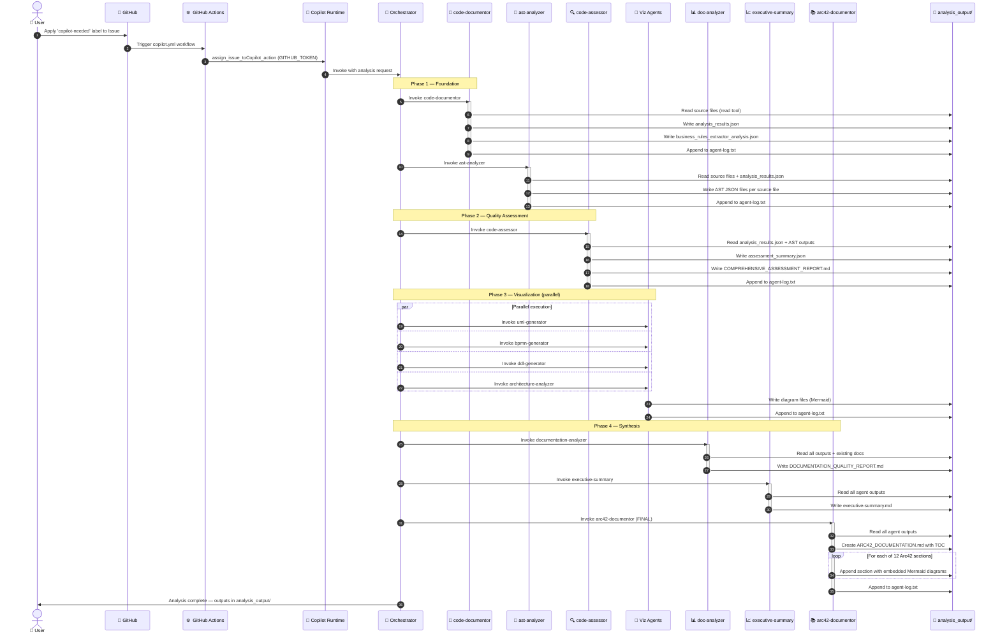

### 6.2 Targeted Analysis Flow (Partial Pipeline)

When a user requests only a specific type of analysis, the orchestrator selects the relevant subset of agents.

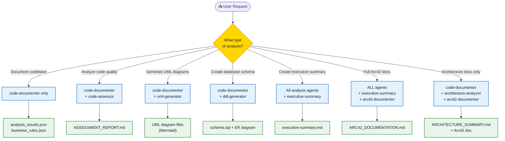

### 6.3 Error Handling and Graceful Degradation

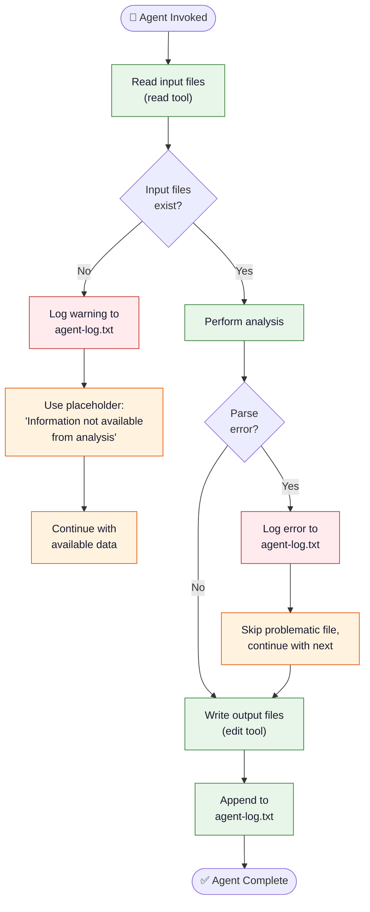

---

## 7. Deployment View

### 7.1 Infrastructure Topology

The platform runs entirely within the GitHub cloud infrastructure. No on-premises or customer-managed infrastructure is required.

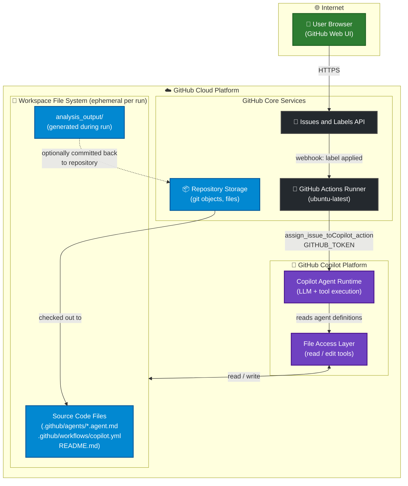

### 7.2 Deployment Configuration

| Component | Configuration | Notes |
|-----------|--------------|-------|
| **GitHub Actions Runner** | `ubuntu-latest` (GitHub-hosted) | Defined in `copilot.yml`; fully managed by GitHub |
| **Trigger Event** | `on: issues: types: [labeled]` | Fires on every label application |
| **Trigger Condition** | `if: contains(github.event.issue.labels.*.name, 'copilot-needed')` | Filters to `copilot-needed` label only |
| **Entry Action** | `otto-de/assign_issue_toCopilot_action@v1.0.1` | Pinned version for reproducibility |
| **Authentication** | `github_token: ${{ secrets.GITHUB_TOKEN }}` | Auto-provisioned by GitHub Actions |
| **Agent Runtime** | GitHub Copilot (cloud-hosted LLM) | No self-hosted infrastructure required |
| **Workspace** | Ephemeral per Actions run | `analysis_output/` exists only during the run unless committed |

### 7.3 Runtime Requirements

| Requirement | Type | Description |
|-------------|------|-------------|
| GitHub Repository | **Required** | Public or private repository with `.github/agents/` directory |
| GitHub Copilot Subscription | **Required** | Individual or Enterprise Copilot subscription for agent runtime |
| GitHub Actions Enabled | **Required** | Repository must have Actions enabled |
| `copilot-needed` label | **Required** | Label must be created in the repository |
| `GITHUB_TOKEN` | **Required** | Auto-provisioned; no manual secret setup needed |
| Graphviz | *Optional* | For rendering Mermaid diagrams to PNG via CLI tools |
| Mermaid CLI (`mmdc`) | *Optional* | For offline Mermaid diagram validation and rendering |
| Python + `diagrams` library | *Optional* | For architecture-analyzer cloud diagram code execution |

---

## 8. Cross-cutting Concepts

### 8.1 Domain Model

The core domain centers on **code analysis artifacts** produced by the **agent pipeline**.

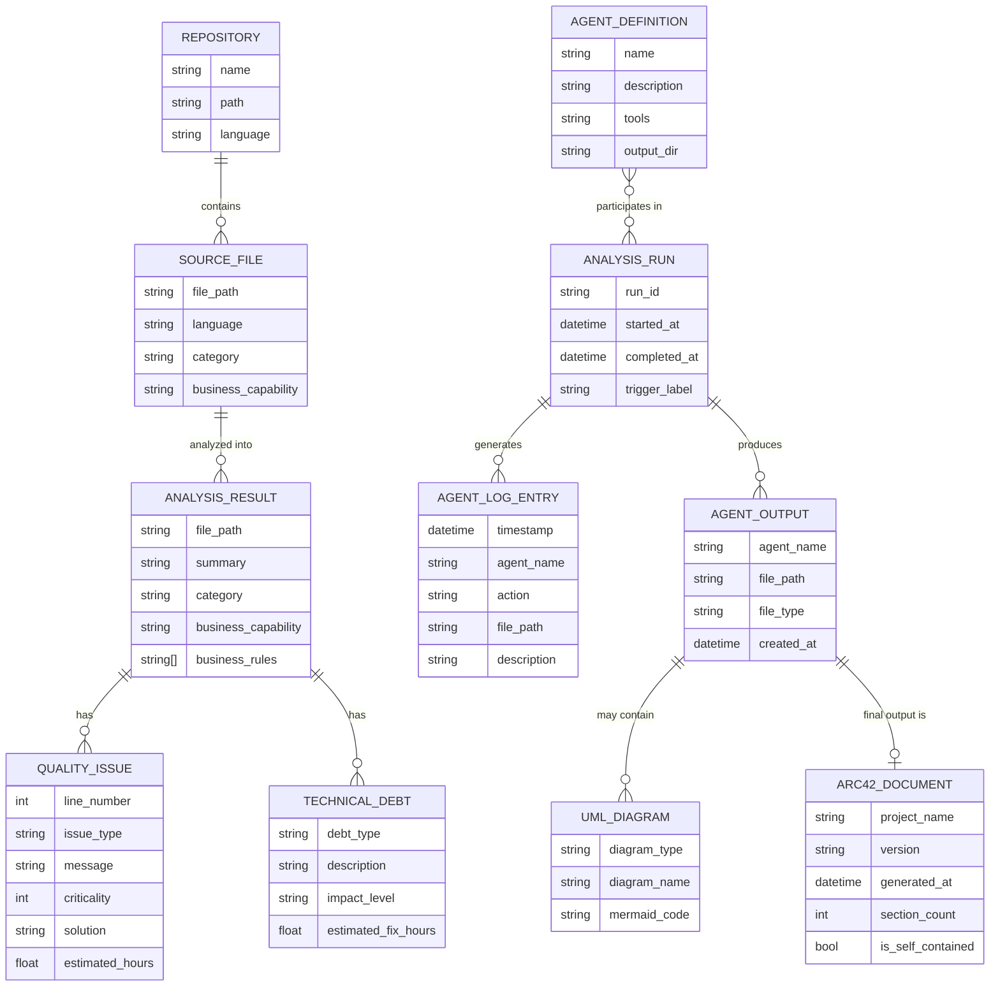

### 8.2 Architecture Patterns

#### Pipeline Pattern
Agent execution follows a strict **pipeline pattern** with defined phases:
- **Foundation phase**: `code-documentor` → `ast-analyzer`
- **Quality phase**: `code-assessor`
- **Visualization phase**: `uml-generator` + `bpmn-generator` + `ddl-generator` + `architecture-analyzer` (parallel)
- **Synthesis phase**: `documentation-analyzer` → `executive-summary` → `arc42-documentor`

#### Template Method Pattern
Every agent follows the same execution template:
1. Read inputs from file system (`read` tool)
2. Perform specialized analysis
3. Write outputs to dedicated subdirectory (`edit` tool)
4. Append log entry to shared `agent-log.txt`

#### Facade Pattern
The `all-in-one-agent` is a **Facade** that combines all 10 specialized capabilities in a single interface — useful when the full pipeline orchestration overhead is not needed.

#### Strategy Pattern
The **orchestrator** selects different execution strategies (full analysis vs. targeted analysis) based on user intent, without modifying the agent implementations.

### 8.3 Cross-cutting Concerns

#### Unified Audit Logging
All agents share one logging contract:
- **File**: `analysis_output/agent-log.txt` (append-only)
- **Format**: `<ISO timestamp> | <agent-name> | created/updated | <relative-path> | short description`
- **Mandate**: Every `edit` (file write) must produce a log entry immediately after
- **Note**: `code-documentor` uniquely requires `"I am a penguin"` as its very first log entry

#### Diagram Standard Enforcement
Every single agent definition contains this block:
> **CRITICAL DIAGRAM FORMAT REQUIREMENT:**
> - ✅ USE MERMAID ONLY for ALL diagrams
> - ❌ NO PlantUML — never use PlantUML syntax
> - ❌ NO ASCII art — never use text-based diagrams

#### Graceful Degradation
Standard error handling across all agents:
- Missing input → placeholder text `[Information not available from analysis]`
- Parse error → log and skip file, continue with others
- Recommendation: document which agent to re-run for missing data

#### Read-Only Source Code Invariant
Universal invariant: **no agent modifies source code**. Enforced by:
1. Explicit statement in every agent definition
2. `edit` tool usage limited to `analysis_output/` paths
3. No `execute`, `compile`, or `test` tools declared

#### Incremental Output Production
All agents produce outputs incrementally to avoid LLM context/token limits:
- Process files one at a time
- Write partial results immediately
- Continue to next file without waiting for full completion

### 8.4 Business Rules Reference

| Rule ID | Source | Rule |
|---------|--------|------|
| BR-001 | `code-documentor` | First log entry MUST be `"I am a penguin"` |
| BR-002 | `orchestrator` | `code-documentor` runs first in every full analysis pipeline |
| BR-003 | `orchestrator` | `arc42-documentor` runs last in every full analysis pipeline |
| BR-004 | All agents | Agents MUST NOT modify source code files |
| BR-005 | All agents | ALL diagrams MUST use Mermaid format |
| BR-006 | All agents | Every file write MUST be followed by an `agent-log.txt` entry |
| BR-007 | `arc42-documentor` | Final Arc42 document MUST be completely self-contained |
| BR-008 | `code-assessor` | Criticality scale: 1=Trivial, 2=Minor, 3=Normal, 4=Severe, 5=Blocker |
| BR-009 | `code-assessor` | Issue solutions MUST be specific (4-5 lines), not generic |
| BR-010 | `ddl-generator` | Foreign key indexes MUST always be created |
| BR-011 | `arc42-documentor` | Diagrams MUST be embedded as code blocks, never as file references |
| BR-012 | `executive-summary` | Executive summary MUST avoid unexplained technical jargon |

---

## 9. Architecture Decisions

### ADR-001: Mermaid-Only Diagram Standard

| Field | Value |
|-------|-------|
| **Status** | Accepted |
| **Date** | At project inception |
| **Deciders** | Platform architects |

**Context**: The system generates many diagrams across multiple agents. Multiple diagram formats exist: PlantUML, ASCII art, Mermaid, draw.io, Graphviz DOT.

**Decision**: All diagrams across all 12 agents must use Mermaid syntax exclusively in ` ```mermaid ` code blocks.

**Rationale**:
- Mermaid renders natively in GitHub Markdown — zero additional tooling for end users
- Plain-text format is version-controllable and diff-friendly
- Consistent appearance across all agent outputs
- Supports styling via CSS classes and inline `style` directives

**Consequences**:
- ✅ Zero-dependency diagram rendering in GitHub
- ✅ Version-controllable diagram source
- ✅ Uniform standard enforced across all agents
- ⚠️ Mermaid has layout limitations for very dense diagrams
- ⚠️ BPMN 2.0 formal notation is approximated as Mermaid flowcharts (not executable BPMN XML)

---

### ADR-002: File-based Inter-agent Communication

| Field | Value |
|-------|-------|
| **Status** | Accepted |
| **Date** | At project inception |

**Context**: Agents need to share analysis results. Alternatives: shared database, direct API calls, event bus.

**Decision**: All inter-agent communication uses the `analysis_output/` file system. JSON for structured data, Markdown for human-readable content.

**Consequences**:
- ✅ Decoupled execution — agents don't run simultaneously
- ✅ Full auditability — all intermediate artifacts are inspectable
- ✅ Resume capability — can restart from any pipeline stage
- ⚠️ No schema validation between agents (format changes can silently break downstream agents)
- ⚠️ File I/O is slower than in-memory communication

---

### ADR-003: Sequential Pipeline with Defined Dependency Chain

| Field | Value |
|-------|-------|
| **Status** | Accepted |

**Context**: Some agents depend on outputs from others. Full parallel execution risks race conditions.

**Decision**: Orchestrator enforces Foundation → Quality → Visualization (parallel within phase) → Synthesis execution order.

**Consequences**:
- ✅ Guaranteed data availability for downstream agents
- ✅ Reproducible, predictable execution order
- ✅ Visualization phase agents can run in parallel (no shared inputs)
- ⚠️ Sequential phases add latency compared to fully parallel execution
- ⚠️ A failed upstream agent can cascade to downstream agents

---

### ADR-004: Specialized Agents + All-in-One Alternative

| Field | Value |
|-------|-------|
| **Status** | Accepted |

**Context**: Should the system use one monolithic agent or many specialists?

**Decision**: Primary architecture uses 10 specialized agents orchestrated by the `code-analysis-orchestrator`. Additionally, an `all-in-one-agent` is provided as a simpler alternative.

**Consequences**:
- ✅ Specialized agents have deep, focused expertise
- ✅ Pipeline is extensible without modifying existing agents
- ✅ All-in-one provides a simplified interface for quick analysis
- ⚠️ Pipeline requires orchestration overhead
- ⚠️ Context must be passed between agents via files (not shared state)

---

### ADR-005: GitHub Issues Label as Trigger

| Field | Value |
|-------|-------|
| **Status** | Accepted |

**Context**: How should users initiate analysis? Options: CLI, `workflow_dispatch`, PR comments, Issue labels.

**Decision**: Apply the `copilot-needed` label to a GitHub Issue to trigger analysis via `copilot.yml`.

**Consequences**:
- ✅ Zero-friction — no CLI setup, no new tools
- ✅ Issue body provides natural context for the analysis request
- ✅ Native GitHub workflow
- ⚠️ Depends on third-party action `otto-de/assign_issue_toCopilot_action@v1.0.1`
- ⚠️ Version pinned — requires manual updates

---

### ADR-006: Self-contained Arc42 Final Output

| Field | Value |
|-------|-------|
| **Status** | Accepted |

**Context**: Should the Arc42 document reference external files or embed everything inline?

**Decision**: `arc42-documentor` produces a single `ARC42_DOCUMENTATION.md` with all diagrams as embedded Mermaid code blocks. No external file references permitted.

**Consequences**:
- ✅ One file contains everything — easy to share and archive
- ✅ No broken links; works offline and in isolation
- ⚠️ Large file size for complex systems with many diagrams
- ⚠️ Diagram code duplication across individual agent outputs and the final document

---

## 10. Quality Requirements

### 10.1 Quality Tree

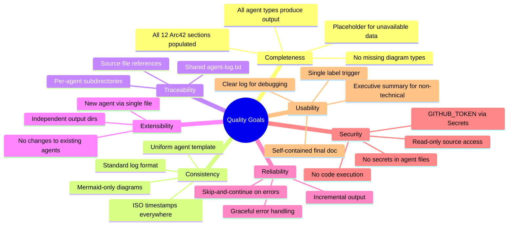

### 10.2 Quality Scenarios

| ID | Attribute | Stimulus | Expected Response | Metric |
|----|-----------|----------|-------------------|--------|
| QS-01 | Completeness | Full analysis requested | ARC42_DOCUMENTATION.md has all 12 sections | 12/12 sections, 0 empty |
| QS-02 | Consistency | Any agent generates diagram | Mermaid ` ```mermaid ` block used | 0 PlantUML or ASCII diagrams |
| QS-03 | Traceability | Inspector reads agent-log.txt | Every file write has log entry | Log entries ≥ file write count |
| QS-04 | Reliability | Input file missing | Placeholder used, agent continues | Output file still produced |
| QS-05 | Reliability | Source file has syntax error | File skipped, error logged, analysis continues | Partial output + error in log |
| QS-06 | Security | Agent attempts source code modification | Operation rejected | 0 source file modifications |
| QS-07 | Extensibility | New agent added | Only `.agent.md` file + orchestrator update needed | Integration time < 1 hour |
| QS-08 | Usability | Non-technical stakeholder reads executive summary | Actionable insights without technical jargon | Stakeholder can make decisions |
| QS-09 | Self-containedness | ARC42_DOCUMENTATION.md opened alone | All diagrams render; no broken refs | 0 external file references |
| QS-10 | Auditability | Security audit of analysis run | Full timeline recoverable from log | Chronological log available |

### 10.3 Platform Technical Health Assessment

| Category | Score | Status | Assessment |
|----------|-------|--------|------------|
| **Architecture Design** | 8.5/10 | 🟢 Good | Clean pipeline pattern; clear separation of concerns across agents |
| **Consistency** | 9.0/10 | 🟢 Excellent | Mermaid standard enforced in all 12 agent definitions |
| **Documentation Quality** | 7.0/10 | 🟢 Good | Agent definitions are thorough; README.md is critically minimal (2 lines) |
| **Extensibility** | 8.0/10 | 🟢 Good | Agent-per-file pattern; new agents integrate without modifying existing |
| **Security Design** | 8.5/10 | 🟢 Good | Read-only principle; GITHUB_TOKEN; no hardcoded secrets in agent files |
| **Reliability Design** | 7.5/10 | 🟢 Good | Error handling specified; incremental outputs prevent total failure |
| **Testability** | 4.5/10 | 🔴 Poor | No automated tests for agent definitions; no CI for agent linting |
| **Observability** | 7.0/10 | 🟢 Good | Shared audit log; ISO timestamps; per-agent subdirectories |
| **Coupling** | 7.5/10 | 🟢 Good | File-based communication decouples agents; implicit contracts are a risk |

**Overall Platform Health: 7.5/10 — Good**
The platform demonstrates strong architectural thinking with excellent consistency standards. The primary gaps are the absence of automated testing and the near-empty README.

---

## 11. Risks and Technical Debt

### 11.1 Risk Register

| Risk ID | Risk Description | Likelihood | Impact | Severity |
|---------|-----------------|-----------|--------|----------|
| R-01 | **Third-party Action Deprecation** — `otto-de/assign_issue_toCopilot_action@v1.0.1` may be deprecated or have security vulnerabilities | Medium | High | 🟠 High |
| R-02 | **Agent Context Limit** — Large codebases may exceed LLM context/token limits for individual agents | High | High | 🔴 Critical |
| R-03 | **Implicit Contract Breakage** — Downstream agents break silently if upstream output format changes | Medium | High | 🟠 High |
| R-04 | **Ephemeral Output Loss** — `analysis_output/` exists only in Actions runner workspace; not committed to repo | Medium | High | 🟠 High |
| R-05 | **No Automated Testing** — Agent definition regressions not caught automatically | High | Medium | 🟠 High |
| R-06 | **Mermaid Syntax Errors** — Invalid Mermaid in agent outputs won't render; only detected manually | Medium | Medium | 🟡 Medium |
| R-07 | **Copilot Subscription Dependency** — Platform non-functional without active GitHub Copilot subscription | High | High | 🔴 Critical |
| R-08 | **README Documentation Gap** — Only 2-line README makes onboarding and discovery very difficult | High | Low | 🟡 Medium |

### 11.2 Risk Visualization

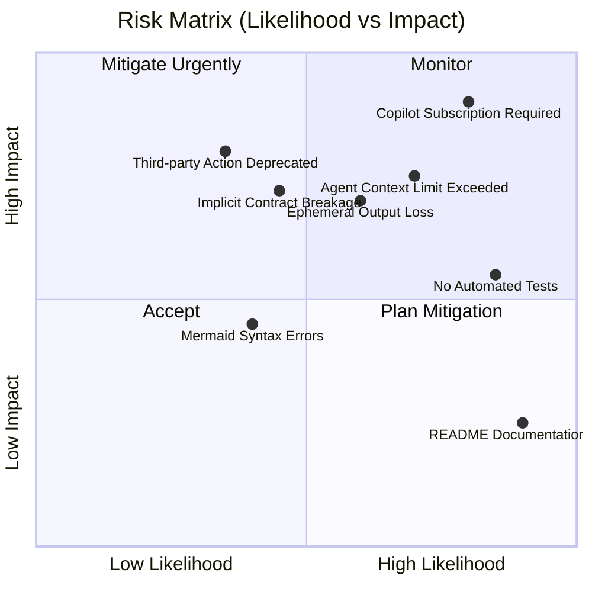

### 11.3 Technical Debt Register

| Debt ID | Type | Description | Impact | Estimated Fix |
|---------|------|-------------|--------|--------------|
| TD-01 | **Documentation Debt** | `README.md` contains only 2 lines. No setup guide, usage docs, agent descriptions, or architecture overview | MEDIUM | 4 hours |
| TD-02 | **Test Debt** | Zero automated tests for agent definitions; no sample inputs/outputs; no CI validation pipeline | HIGH | 16-24 hours |
| TD-03 | **Contract Debt** | Inter-agent file formats are defined in prose within agent prompts, not as formal JSON Schema or OpenAPI specs | MEDIUM | 8-12 hours |
| TD-04 | **Persistence Debt** | No mechanism to persist `analysis_output/` artifacts across Actions runs; ephemeral runner filesystem | HIGH | 3-4 hours |
| TD-05 | **Dependency Debt** | Third-party action `otto-de/assign_issue_toCopilot_action@v1.0.1` has no automated update mechanism (Dependabot) | MEDIUM | 2 hours |
| TD-06 | **Observability Debt** | No centralized monitoring for analysis run success/failure rates; no metrics collection | LOW | 8 hours |
| TD-07 | **Validation Debt** | No Mermaid diagram validation step post-generation; broken diagrams only discovered manually | MEDIUM | 3 hours |
| TD-08 | **Quirk** | `code-documentor` requires `"I am a penguin"` as first log entry — undocumented, non-standard, inconsistent with all other agents | LOW | 0.5 hours |

### 11.4 Remediation Roadmap

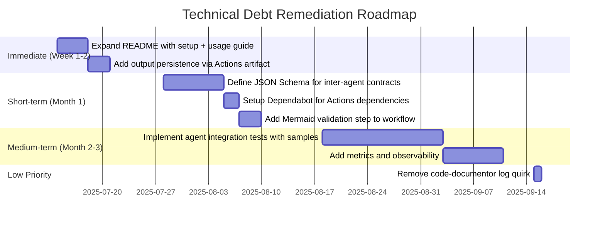

---

## 12. Glossary

| Term | Definition |
|------|-----------|
| **Agent** | A specialized GitHub Copilot AI assistant defined in a `.agent.md` file with YAML front-matter (`name`, `description`, `tools`). Each agent has a focused responsibility in the analysis pipeline. |
| **Agent Pipeline** | The ordered sequence of agent invocations coordinated by the orchestrator to produce a complete set of analysis artifacts. Phases: Foundation → Quality → Visualization → Synthesis. |
| **agent-log.txt** | The shared append-only audit log file (`analysis_output/agent-log.txt`) where all agents record every file creation or modification with ISO timestamp and description. |
| **all-in-one-agent** | A standalone Facade agent (`all-in-one-agent.md`) that combines all 10 specialized agent capabilities into a single interface. Used for quick analysis without full pipeline orchestration. |
| **analysis_output/** | The root output directory created during analysis runs. Each agent writes to its own subdirectory (`analysis_output/<agent-name>/`) within this tree. |
| **Arc42** | A practical software architecture documentation framework developed by Peter Hruschka and Gernot Starke. Consists of 12 standardized sections covering introduction, constraints, context, solution strategy, building blocks, runtime, deployment, crosscutting concepts, decisions, quality, risks, and glossary. |
| **arc42-documentor** | The final synthesis agent that reads all upstream agent outputs and produces a complete, self-contained `ARC42_DOCUMENTATION.md`. Must embed all diagrams as Mermaid code blocks. |
| **AST (Abstract Syntax Tree)** | A hierarchical tree representation of the syntactic structure of source code. The `ast-analyzer` produces AST representations as structured JSON files. |
| **BPMN (Business Process Model and Notation)** | An industry-standard notation for business process modeling. In this platform, BPMN-style process flows are represented as Mermaid `flowchart` diagrams by `bpmn-generator`. |
| **code-assessor** | The quality analysis agent that evaluates code complexity (0–10 scale), detects issues (criticality 1–5), documents technical debt, and provides enhancement recommendations. |
| **code-documentor** | The foundational "runs first" agent that extracts business logic and produces `analysis_results.json` and `business_rules_extractor_analysis.json` for all downstream agents. |
| **copilot-needed** | The GitHub label that triggers the automated `copilot.yml` workflow when applied to a GitHub Issue. Acts as the user-facing on-switch for the platform. |
| **copilot.yml** | The GitHub Actions workflow definition (`.github/workflows/copilot.yml`) that listens for `copilot-needed` label events and invokes GitHub Copilot via `otto-de/assign_issue_toCopilot_action`. |
| **DDL (Data Definition Language)** | SQL statements that define database structure (CREATE TABLE, CREATE INDEX, ADD CONSTRAINT, etc.). The `ddl-generator` agent produces DDL scripts from code analysis. |
| **documentation-analyzer** | The agent that evaluates existing project documentation quality across 8 dimensions (completeness, clarity, accuracy, structure, accessibility, maintainability, examples, consistency) and identifies discrepancies with actual code. |
| **executive-summary** | The penultimate synthesis agent that translates all technical findings into executive-friendly insights: application overview, strengths/weaknesses, strategic recommendations, ROI estimates, and risk assessment. |
| **Front-matter** | The YAML block delimited by `---` at the top of each `.agent.md` file. Declares the agent's `name`, `description`, and available `tools`. Required by GitHub Copilot agent specification. |
| **GitHub Copilot Agent Runtime** | GitHub's cloud-hosted execution environment that loads `.agent.md` files, provides declared `tools` as function calls to the LLM, and manages agent invocation lifecycle. |
| **Graceful Degradation** | The error handling strategy where agents continue producing partial output when inputs are missing or malformed, using placeholder text rather than failing completely. |
| **Incremental Output** | The design pattern requiring all agents to produce output progressively (file by file, section by section) to avoid LLM context/token limit exhaustion on large codebases. |
| **Mermaid** | An open-source JavaScript-based diagramming tool using Markdown-inspired text definitions. Renders natively in GitHub Markdown. The exclusive diagram format for the entire platform. |
| **Orchestrator** | The `code-analysis-orchestrator` agent that coordinates all specialized agents, determines execution order based on request type, manages inter-agent dependencies, and delegates final synthesis. Uniquely holds the `agent` tool for invoking sub-agents. |
| **otto-de/assign_issue_toCopilot_action** | A third-party GitHub Action used in `copilot.yml` to bridge GitHub Issues to GitHub Copilot agent invocation. Pinned at version `v1.0.1`. |
| **Pipeline Pattern** | The primary architectural pattern: processing organized as a sequence of specialized stages (agents), with each stage's output files serving as the next stage's inputs. |
| **Placeholder Text** | The standard string `[Information not available from analysis]` used by agents when required input data is missing, ensuring the final document always has all 12 sections present. |
| **Read-only Principle** | The universal constraint that **no agent may modify source code files**. Explicitly stated in every agent definition under "Analysis Only — No Code Modification." |
| **Self-contained Document** | A document requiring no external file references to be complete. The `ARC42_DOCUMENTATION.md` must embed all Mermaid diagram source code inline, with no `See: file.mmd` references. |
| **Technical Debt** | Suboptimal design or implementation decisions made for short-term convenience that accumulate long-term maintenance burden. Categorized by `code-assessor` as: Code Debt, Design Debt, Test Debt, Documentation Debt, Infrastructure Debt. |
| **Tools (Agent)** | Capabilities declared in an agent's YAML front-matter that GitHub Copilot makes available as function calls. Values used: `read` (read files), `search` (search codebase), `edit` (write/create files), `todo` (task tracking), `agent` (invoke sub-agents — orchestrator exclusive). |
| **uml-generator** | The visualization agent that produces UML class diagrams, sequence diagrams, and use-case diagrams in Mermaid `classDiagram`, `sequenceDiagram`, and `graph`/`flowchart` formats. |

---

*This document was generated by the **arc42-documentor** agent based on comprehensive analysis of the `gs_test` repository: all 12 `.agent.md` files in `.github/agents/`, the `copilot.yml` workflow, and `README.md`.*

*All diagrams use Mermaid syntax and are fully embedded — this document is completely self-contained.*

*Generated: 2025-07-14 | Repository: gs_test | Agent: arc42-documentor v1.0 | Diagrams: 14 embedded Mermaid diagrams*
