# Architecture Documentation (Arc42)

**Project**: gs_test — GitHub Copilot Multi-Agent Code Analysis Platform  
**Version**: 1.0.0  
**Date**: 2025-01-30  
**Generated by**: Arc42 Documentation Generator (arc42-documentor)  
**Repository**: https://github.com/gs_test/gs_test  
**Target Path**: docs/arc42/arc42-architecture-documentation.md *(created at repo root — move to target path after `mkdir -p docs/arc42`)*

---

## Table of Contents

1. [Introduction and Goals](#1-introduction-and-goals)
2. [Constraints](#2-constraints)
3. [Context and Scope](#3-context-and-scope)
4. [Solution Strategy](#4-solution-strategy)
5. [Building Block View](#5-building-block-view)
6. [Runtime View](#6-runtime-view)
7. [Deployment View](#7-deployment-view)
8. [Crosscutting Concepts](#8-crosscutting-concepts)
9. [Architecture Decisions](#9-architecture-decisions)
10. [Quality Requirements](#10-quality-requirements)
11. [Risks and Technical Debt](#11-risks-and-technical-debt)
12. [Glossary](#12-glossary)

---

## 1. Introduction and Goals

### 1.1 Business Purpose

The **gs_test** repository is a **GitHub Copilot multi-agent code analysis and documentation platform**. It provides a curated library of AI agent definitions that together form a comprehensive, automated pipeline for analyzing any software codebase and producing rich, structured documentation artifacts.

The platform enables development teams and architects to:

- **Automatically document** source code by extracting business logic, business rules, and architectural patterns.
- **Assess code quality** by identifying issues, technical debt, and improvement opportunities.
- **Visualize system structure and behavior** through UML diagrams, BPMN process flows, and architecture diagrams — all rendered in Mermaid format.
- **Generate database schemas (DDL)** from workflow and field analysis.
- **Produce executive-level reports** synthesizing all findings into actionable strategic insights.
- **Create complete Arc42 architecture documentation** by orchestrating all preceding analysis steps.

The system is designed as a **test and reference repository** for GitHub Copilot agent capabilities, demonstrating how specialized AI agents can be chained together to produce enterprise-grade documentation from raw source code.

### 1.2 Quality Goals

| Priority | Quality Goal | Motivation |
|----------|-------------|------------|
| 1 | **Completeness** | Every Arc42 section and every analysis module must be populated with meaningful content; no empty placeholders should remain in final outputs. |
| 2 | **Consistency** | All agents follow the same logging conventions, output directory structure, and diagram format (Mermaid-only), ensuring predictable outputs regardless of which agent runs. |
| 3 | **Non-Destructiveness** | Agents must never modify source code files — analysis-only is a hard constraint across the entire platform. |
| 4 | **Traceability** | All output files are logged to `analysis_output/agent-log.txt` with timestamps, enabling full audit trails of generated artifacts. |
| 5 | **Composability** | Agents are designed so outputs of one agent become inputs of the next, enabling both full-pipeline and targeted single-agent execution. |
| 6 | **Incremental Execution** | Outputs are created incrementally (file by file, section by section) to support progress visibility and resumable workflows. |

### 1.3 Stakeholders

| Stakeholder | Role | Expectations |
|-------------|------|-------------|
| **Software Developers** | Primary users of the analysis pipeline | Receive comprehensive code documentation, quality reports, and UML diagrams that accelerate understanding of unfamiliar codebases. |
| **Software Architects** | Consumers of architecture analysis | Receive Arc42 documentation, component diagrams, and architectural decision records. |
| **Technical Leads** | Consumers of quality and debt reports | Receive prioritized issue lists, technical debt inventories, and enhancement recommendations. |
| **Engineering Managers / Executives** | Consumers of executive summaries | Receive concise, business-focused health assessments and strategic roadmaps. |
| **Database Administrators** | Consumers of DDL outputs | Receive optimized SQL DDL scripts derived from code analysis. |
| **GitHub Copilot Platform** | Host environment | Provides the agent execution runtime, tools (`read`, `search`, `edit`, `todo`, `agent`), and GitHub Actions integration. |
| **Repository Maintainers** | Platform owners | Maintain and extend the agent definitions, ensuring agents stay current with Copilot capabilities. |

---

## 2. Constraints

### 2.1 Technical Constraints

| Constraint | Description | Source |
|------------|-------------|--------|
| **GitHub Copilot Runtime** | All agents execute within GitHub Copilot's agent runtime. They are limited to the tool set exposed by the platform: `read`, `search`, `edit`, `todo`, `agent`. | Agent YAML frontmatter |
| **Mermaid-Only Diagrams** | All visual diagrams must use Mermaid syntax embedded in Markdown code blocks. PlantUML and ASCII art are strictly prohibited. | All agent definitions |
| **No Code Execution** | Agents cannot execute, compile, or test source code. They perform static analysis only. | All agent definitions |
| **No Code Modification** | Agents must never modify, edit, or delete source code files. The `edit` tool is reserved for writing output files only. | All agent definitions |
| **Output Directory Convention** | All generated files must reside under `analysis_output/<agent-name>/`. The agent log must be written to `analysis_output/agent-log.txt`. | All agent definitions |
| **Markdown Output Format** | Human-readable outputs are in Markdown. Machine-readable outputs are in JSON. SQL schemas are `.sql` files. | code-documentor, code-assessor, architecture-analyzer |
| **JSON Strict Format** | JSON outputs must be parseable by `json.loads()` — no code fences, no explanatory text, no line-break escape characters. | code-documentor, ast-analyzer |
| **Graphviz Dependency (Optional)** | The architecture-analyzer references Graphviz for rendering Python `diagrams`-library code, though the primary output path uses Mermaid. | architecture-analyzer |

### 2.2 Organizational Constraints

| Constraint | Description |
|------------|-------------|
| **Test Repository Purpose** | This repository's primary purpose is testing and demonstrating GitHub Copilot agent capabilities — production usage is a secondary concern. |
| **Agent Definitions as Markdown** | Agent behavior is defined entirely in Markdown files under `.github/agents/`, following the GitHub Copilot agent specification format (YAML frontmatter + Markdown body). |
| **GitHub Actions Integration** | The `copilot.yml` workflow integrates with the platform to auto-assign GitHub issues labeled `copilot-needed` to the Copilot agent for resolution. |
| **Immutable Agent Instructions** | Agent instruction sections (rules around code modification, output formats, logging) are treated as immutable constraints across all agents. |

### 2.3 Conventions

| Convention | Description |
|------------|-------------|
| **Agent Naming** | Agent files follow the pattern `<agent-name>.agent.md`. The `name` field in YAML frontmatter is the canonical agent identifier. |
| **Log Format** | `<ISO timestamp> \| <agent-name> \| created/updated \| <relative-path> \| short description` |
| **Complexity Scale** | Code complexity and logic complexity are rated 0–10 in assessment reports. |
| **Criticality Scale** | Issue criticality is rated 1–5 (1=Trivial, 5=Blocker) in assessment reports. |
| **Output Announcement** | Every agent announces its name at the start of every chat output (e.g., `"all-in-one-code-analyzer: ..."`) for clear attribution. |
| **Incremental Writing** | Agents create files in small batches or one file at a time, writing partial results and continuing — never attempting everything in one pass. |
| **Hidden Identity Marker** | The `code-documentor` agent's first log entry must be `"I am a penguin"` — a unique marker embedded for identity/traceability testing. |

---

## 3. Context and Scope

### 3.1 Business Context

The platform sits at the intersection of a **source code repository** (the input) and **human stakeholders** (the consumers of analysis results). It is triggered either manually by a user request to GitHub Copilot, or automatically via GitHub Actions when a GitHub Issue is labeled `copilot-needed`.

The system boundary encompasses all agent definitions and the GitHub Actions workflow. External systems include:
- The **source code repository** being analyzed (any language, any framework)
- **GitHub Copilot** as the agent execution environment
- **GitHub Actions** for workflow automation
- **Human stakeholders** who consume the generated documentation

### 3.2 System Context Diagram (C4 Level 1)

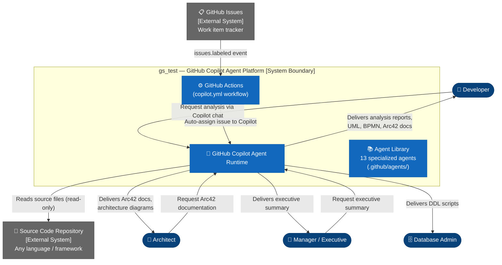

### 3.3 Technical Context

| Interface | Direction | Protocol / Format | Description |
|-----------|-----------|-------------------|-------------|
| Source Code Repository | Inbound (read) | File system / `read` tool | Agents read source code files for analysis |
| GitHub Copilot Runtime | Bidirectional | Copilot agent protocol | Provides tool execution environment |
| GitHub Actions | Inbound trigger | GitHub Events (webhook on `issues.labeled`) | Triggers Copilot assignment on labeled issues |
| `analysis_output/` directory | Outbound (write) | File system / `edit` tool | All generated artifacts are written here |
| `agent-log.txt` | Outbound (append) | Plain text / `edit` tool | Centralized audit log of all file operations |

---

## 4. Solution Strategy

### 4.1 Core Strategy: Specialized Multi-Agent Pipeline

The platform adopts a **specialized multi-agent pipeline architecture** where each agent owns a single, well-defined analysis domain. A central **orchestrator** coordinates the pipeline and ensures correct execution order, while a separate **all-in-one agent** provides the same pipeline as a single combined actor for simpler use cases.

| Strategy Decision | Rationale |
|-------------------|-----------|
| **Specialization over monoliths** | Each agent is optimized for one domain, making agents easier to maintain, extend, and invoke independently. |
| **Ordered pipeline execution** | Agents later in the pipeline depend on outputs from earlier agents. The orchestrator enforces the correct execution order. |
| **Mermaid-only visualization** | Mermaid renders natively in GitHub Markdown, requiring no external tooling. |
| **Incremental file creation** | Writing results incrementally avoids token/context limit issues and provides real-time progress visibility. |
| **JSON for machine exchange, Markdown for humans** | Structured JSON enables downstream agents to reliably parse prior outputs; Markdown ensures outputs are immediately readable. |

### 4.2 Technology Decisions

| Technology | Decision | Rationale |
|------------|----------|-----------|
| **GitHub Copilot Agents** | Platform choice | Native integration with GitHub, no infrastructure to manage, built-in repository file access. |
| **Markdown + YAML frontmatter** | Agent definition format | Human-readable, version-controllable, supported natively by the Copilot agent runtime. |
| **Mermaid** | Diagram format | GitHub renders Mermaid natively in Markdown; zero external dependencies required. |
| **GitHub Actions** | Automation trigger | Native GitHub CI/CD, integrates with Issues for event-driven agent invocation. |
| **`analysis_output/` convention** | Output isolation | Keeps generated artifacts separate from source code, avoids accidental overwrites. |

### 4.3 Pipeline Execution Order

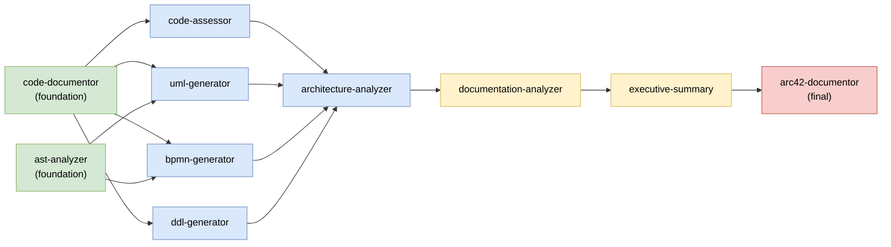

### 4.4 Top-Level Decomposition

The platform decomposes into three functional tiers:

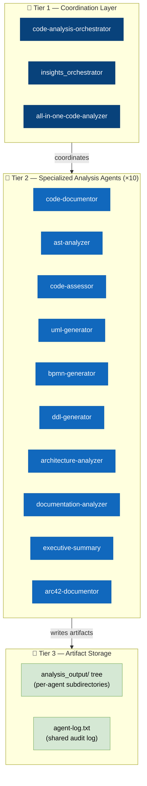

---

## 5. Building Block View

### 5.1 Level 1 — High-Level Building Blocks

```mermaid
graph TB
    classDef coord fill:#08427b,stroke:#073b6f,color:#fff
    classDef analysis fill:#1168bd,stroke:#0e5fac,color:#fff
    classDef storage fill:#d5e8d4,stroke:#82b366,color:#000
    classDef trigger fill:#666,stroke:#444,color:#fff

    subgraph BB1["BB1: Coordination Layer"]
        ORC["code-analysis-orchestrator\nCoordinates full pipeline\nvia runSubagent"]:::coord
        AOA["all-in-one-code-analyzer\nSingle-agent full analysis"]:::coord
        IOC["insights_orchestrator\nAlternate orchestration"]:::coord
    end

    subgraph BB2["BB2: Analysis Agent Library"]
        DOC["code-documentor\nFoundation: business logic, JSON"]:::analysis
        ASTA["ast-analyzer\nStructure: AST, JSON"]:::analysis
        ASS["code-assessor\nQuality: issues, debt"]:::analysis
        UMLA["uml-generator\nDiagrams: class, sequence, use-case"]:::analysis
        BPMNA["bpmn-generator\nProcesses: workflow flowcharts"]:::analysis
        DDLA["ddl-generator\nData: SQL schemas"]:::analysis
        ARCHA["architecture-analyzer\nArchitecture: cloud+component diagrams"]:::analysis
        DOC_A["documentation-analyzer\nDocs: quality, gaps, comparison"]:::analysis
        ESA["executive-summary\nInsights: strategic recommendations"]:::analysis
        ARCA["arc42-documentor\nFinal: Arc42 complete documentation"]:::analysis
    end

    subgraph BB3["BB3: Artifact Storage"]
        OUT["analysis_output/\n10 agent subdirectories"]:::storage
        LOG["agent-log.txt"]:::storage
    end

    subgraph BB4["BB4: Automation"]
        GHA["GitHub Actions\ncopilot.yml\nissues.labeled trigger"]:::trigger
    end

    BB4 -->|"triggers"| BB1
    BB1 -->|"invokes via runSubagent"| BB2
    BB2 -->|"writes to"| BB3
```

### 5.2 Level 2 — Agent Responsibility Matrix

| Agent | Input | Output | Depends On |
|-------|-------|--------|------------|
| `code-documentor` | Source code files | `analysis_results.json`, `business_rules_extractor_analysis.json`, `analysis_summary.md` | — (foundation) |
| `ast-analyzer` | Source code files | `*_AST.json` per file, `AST_Analysis_Summary.md` | — (can run parallel) |
| `code-assessor` | `analysis_results.json` | `assessment_summary.json`, `COMPREHENSIVE_ASSESSMENT_REPORT.md` | code-documentor |
| `uml-generator` | `analysis_results.json`, `*_AST.json` | `class_diagram.md`, `sequence_diagram.md`, `use_case_diagram.md` | code-documentor, ast-analyzer |
| `bpmn-generator` | `business_rules_extractor_analysis.json` | `*_workflow.md` (Mermaid flowcharts) | code-documentor, ast-analyzer |
| `ddl-generator` | Field analysis, business rules | `schema.sql`, `schema_summary.json` | code-documentor |
| `architecture-analyzer` | All previous outputs | `cloud_architecture.md`, `component_architecture.md`, `ARCHITECTURE_SUMMARY.md` | All above |
| `documentation-analyzer` | All previous outputs + existing docs | `documentation_analysis.json`, `DOCUMENTATION_QUALITY_REPORT.md` | All above |
| `executive-summary` | All previous outputs | `executive-summary.md` | All above |
| `arc42-documentor` | All previous outputs | `ARC42_DOCUMENTATION.md` | All above |

### 5.3 Level 3 — Agent Internal Structure

Each `.agent.md` file follows a consistent internal structure:

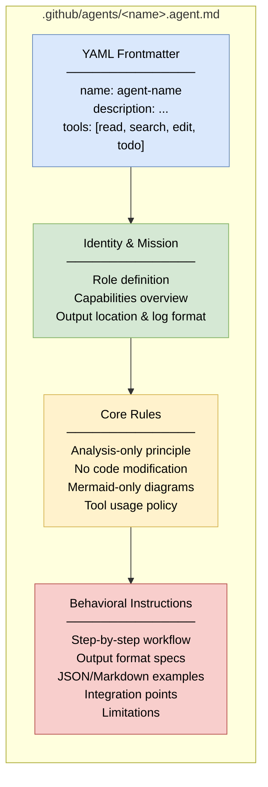

### 5.4 Repository Structure

```mermaid
graph TD
    classDef root fill:#08427b,stroke:#073b6f,color:#fff
    classDef dir fill:#1168bd,stroke:#0e5fac,color:#fff
    classDef file fill:#d5e8d4,stroke:#82b366,color:#000
    classDef empty fill:#999,stroke:#666,color:#fff

    ROOT["/home/runner/work/gs_test/gs_test/"]:::root

    GH[".github/"]:::dir
    AGENTS_DIR[".github/agents/ (13 files)"]:::dir
    WORKFLOWS_DIR[".github/workflows/"]:::dir
    HOOKS_DIR[".github/hooks/"]:::dir
    SKILLS_DIR[".github/skills/"]:::dir
    README_F["README.md\n'# gs_test\nGithub Copilot agent test repository'"]:::file

    ROOT --> GH
    ROOT --> README_F
    GH --> AGENTS_DIR
    GH --> WORKFLOWS_DIR
    GH --> HOOKS_DIR
    GH --> SKILLS_DIR

    AGENTS_DIR --> AG1["all-in-one-agent.md"]:::file
    AGENTS_DIR --> AG2["arc42-documentor.agent.md"]:::file
    AGENTS_DIR --> AG3["architecture-analyzer.agent.md"]:::file
    AGENTS_DIR --> AG4["ast-analyzer.agent.md"]:::file
    AGENTS_DIR --> AG5["bpmn-generator.agent.md"]:::file
    AGENTS_DIR --> AG6["code-assessor.agent.md"]:::file
    AGENTS_DIR --> AG7["code-documentor.agent.md"]:::file
    AGENTS_DIR --> AG8["ddl-generator.agent.md"]:::file
    AGENTS_DIR --> AG9["documentation-analyzer.agent.md"]:::file
    AGENTS_DIR --> AG10["executive-summary.agent.md"]:::file
    AGENTS_DIR --> AG11["insights_orchestrator.agent.md"]:::file
    AGENTS_DIR --> AG12["orchestrator.agent.md"]:::file
    AGENTS_DIR --> AG13["uml-generator.agent.md"]:::file
    WORKFLOWS_DIR --> WF1["copilot.yml"]:::file
    HOOKS_DIR --> HK[".keep"]:::empty
    SKILLS_DIR --> SK[".keep"]:::empty
```

---

## 6. Runtime View

### 6.1 Scenario 1 — Full Analysis Pipeline (Orchestrated)

This is the primary runtime scenario: a developer requests full codebase analysis via GitHub Copilot chat.

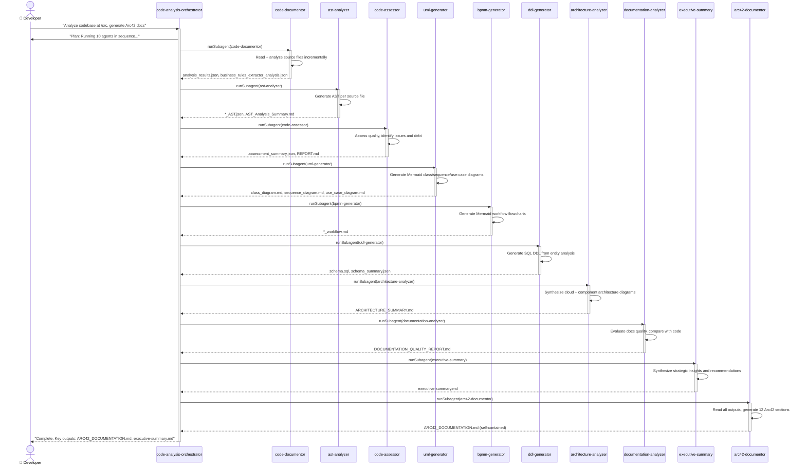

### 6.2 Scenario 2 — GitHub Issue Auto-Assignment

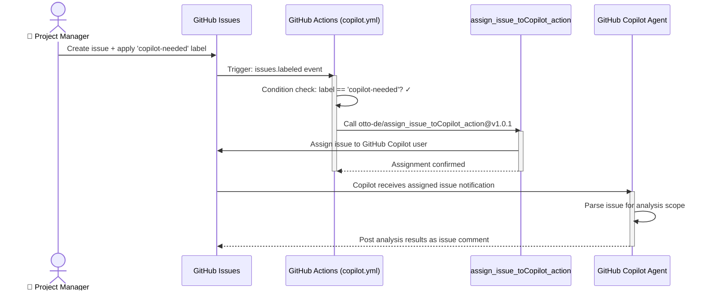

### 6.3 Scenario 3 — Incremental File Creation Pattern

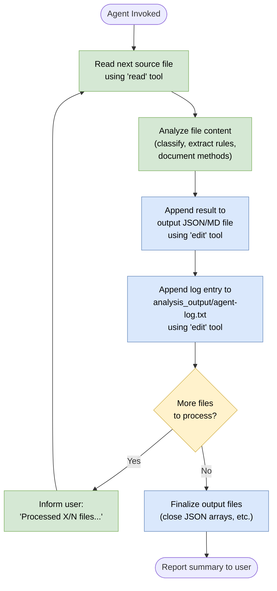

### 6.4 Scenario 4 — Targeted Analysis

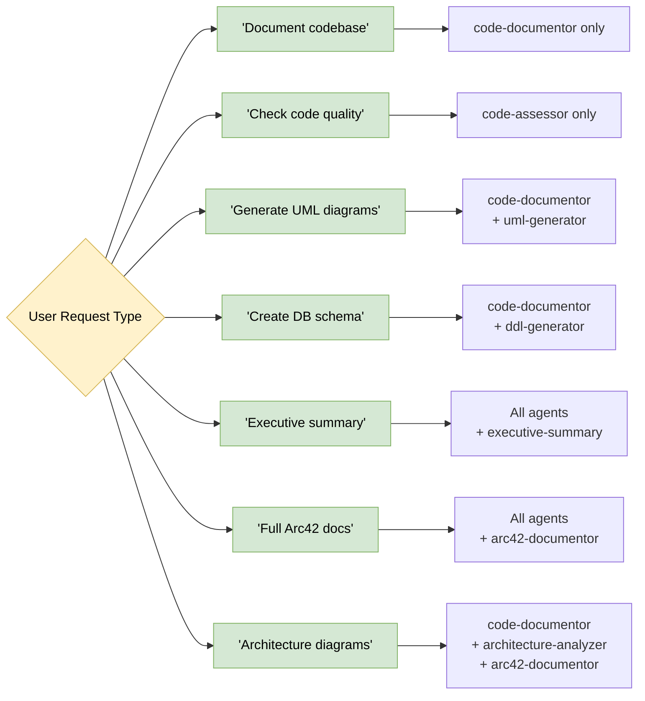

---

## 7. Deployment View

### 7.1 Infrastructure Overview

The platform is entirely hosted on GitHub's infrastructure. There is no dedicated server, container, or cloud resource to manage:

- **Agent definitions** live in `.github/agents/` and are versioned with the Git repository.
- **GitHub Copilot** provides an on-demand, serverless agent execution environment.
- **GitHub Actions** runners (Ubuntu Latest, ephemeral) execute the `copilot.yml` workflow for automation.
- **Generated artifacts** are written to `analysis_output/` within the repository or delivered as Copilot chat responses.

### 7.2 Deployment Topology Diagram

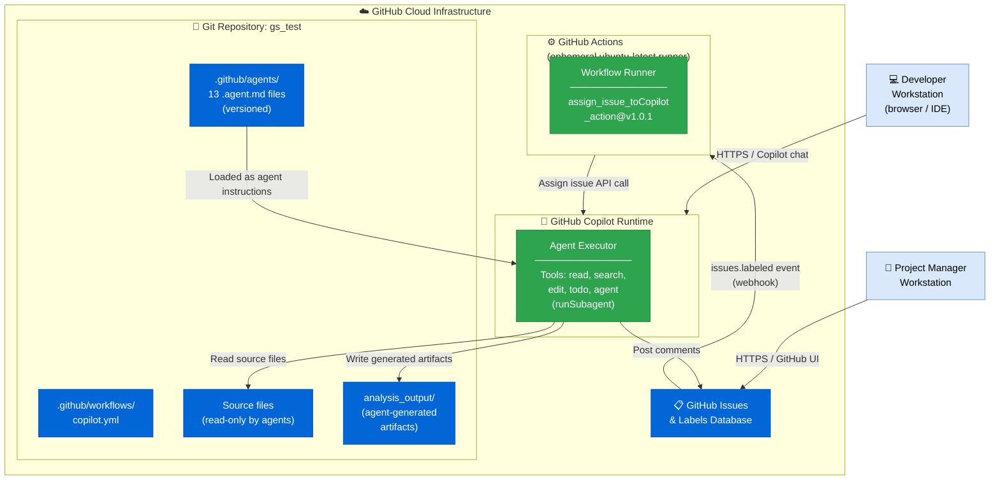

### 7.3 Deployment Requirements

| Requirement | Value | Notes |
|-------------|-------|-------|
| **GitHub Plan** | GitHub Copilot Business/Enterprise | Required for agent execution |
| **GitHub Actions** | Standard minutes (ubuntu-latest) | For auto-assignment workflow |
| **Repository Access** | Read access to analyzed repo files | Agents use `read` tool |
| **Write Access** | `GITHUB_TOKEN` write scope | For issue assignment and artifact commits |
| **External Action** | `otto-de/assign_issue_toCopilot_action@v1.0.1` | Must be accessible from GitHub Actions |
| **Dedicated Infrastructure** | None required | Fully serverless, no self-hosted components |
| **Graphviz** | Optional, host system | Only needed if Python `diagrams` library rendering is used; Mermaid path requires no tooling |

---

## 8. Crosscutting Concepts

### 8.1 Logging and Audit Trail Convention

Every agent appends a log entry to `analysis_output/agent-log.txt` after each file creation or modification. This is enforced universally.

**Log entry format:**
```
<ISO 8601 timestamp> | <agent-name> | created|updated | <relative-path> | <short description>
```

**Example log entries:**
```
2025-01-30T10:15:23Z | code-documentor | created | analysis_output/code-documentor/analysis_results.json | File-by-file code analysis
2025-01-30T10:18:45Z | uml-generator | created | analysis_output/uml-generator/class_diagram.md | Mermaid class diagram
2025-01-30T10:35:12Z | arc42-documentor | created | analysis_output/arc42-documentor/ARC42_DOCUMENTATION.md | Complete Arc42 documentation
```

> **Special marker**: `code-documentor`'s first log entry is always `"I am a penguin"` — an embedded traceability identifier for testing purposes.

### 8.2 Output Directory Structure Convention

```mermaid
graph TD
    classDef root fill:#08427b,stroke:#073b6f,color:#fff
    classDef dir fill:#1168bd,stroke:#0e5fac,color:#fff
    classDef file fill:#d5e8d4,stroke:#82b366,color:#000

    ROOT["analysis_output/"]:::root
    LOG["agent-log.txt\n(shared audit log)"]:::file

    D1["code-documentor/\nanalysis_results.json\nbusiness_rules_extractor_analysis.json\nanalysis_summary.md"]:::dir
    D2["ast-analyzer/\n*_AST.json (per source file)\nAST_Analysis_Summary.md"]:::dir
    D3["code-assessor/\nassessment_summary.json\nCOMPREHENSIVE_ASSESSMENT_REPORT.md"]:::dir
    D4["uml-generator/\nclass_diagram.md\nsequence_diagram.md\nuse_case_diagram.md"]:::dir
    D5["bpmn-generator/\n*_workflow.md\n(Mermaid flowcharts)"]:::dir
    D6["ddl-generator/\nschema.sql\nschema_summary.json"]:::dir
    D7["architecture-analyzer/\ncloud_architecture.md\ncomponent_architecture.md\nARCHITECTURE_SUMMARY.md"]:::dir
    D8["documentation-analyzer/\ndocumentation_analysis.json\nDOCUMENTATION_QUALITY_REPORT.md"]:::dir
    D9["executive-summary/\nexecutive-summary.md"]:::dir
    D10["arc42-documentor/\nARC42_DOCUMENTATION.md"]:::dir

    ROOT --> LOG
    ROOT --> D1
    ROOT --> D2
    ROOT --> D3
    ROOT --> D4
    ROOT --> D5
    ROOT --> D6
    ROOT --> D7
    ROOT --> D8
    ROOT --> D9
    ROOT --> D10
```

### 8.3 Mermaid-Only Diagram Policy

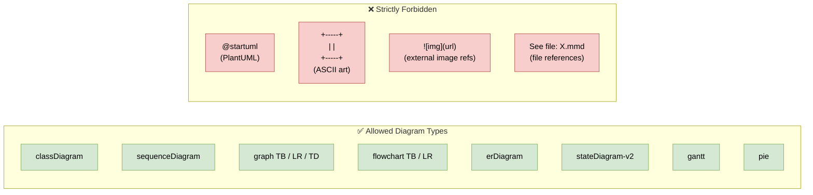

All diagrams must be:
1. In ` ```mermaid ` code blocks
2. Embedded directly in Markdown files (never referenced externally)
3. Self-contained so the documentation file works standalone

### 8.4 Analysis-Only, No-Modification Principle

| Category | Rule |
|----------|------|
| **Source files** | Never `edit`, only `read` or `search` |
| **Code execution** | Never run, compile, test, or interpret source code |
| **Dependency installation** | Never `npm install`, `mvn build`, `pip install`, etc. |
| **Architecture decisions** | Document and recommend only; never enforce or implement |
| **Output files** | `edit` tool permitted only within `analysis_output/` tree |

### 8.5 Inter-Agent Data Contract

```mermaid
erDiagram
    ANALYSIS_RESULTS {
        string summary
        string category
        string description
        array business_rules
        array technical_libraries
        string business_capability
        string sub_capability
        array method_breakdown
    }

    METHOD_BREAKDOWN {
        string method_name
        string summary
        array parameters
        string returns
        array dependencies
        string significance
    }

    ASSESSMENT_SUMMARY {
        int code_complexity
        int logic_complexity
        string summary
        array issues
        array enhancements
        array technical_debt
    }

    ISSUE {
        int line_number
        string issue_type
        string message
        int criticality
        string solution
        float estimated_time
    }

    TECHNICAL_DEBT {
        string debt_type
        string description
        string impact
        float estimated_fix_time
    }

    UML_DIAGRAM {
        string diagram_type
        string diagram_name
        string description
        string mermaid_code
        array entities
        array relationships
    }

    SCHEMA_SUMMARY {
        string schema_name
        string database_dialect
        array tables
        array relationships
        object statistics
    }

    ANALYSIS_RESULTS ||--o{ METHOD_BREAKDOWN : "contains"
    ASSESSMENT_SUMMARY ||--o{ ISSUE : "contains"
    ASSESSMENT_SUMMARY ||--o{ TECHNICAL_DEBT : "contains"
    ANALYSIS_RESULTS ||--|| ASSESSMENT_SUMMARY : "feeds"
    ANALYSIS_RESULTS ||--o{ UML_DIAGRAM : "generates"
    ANALYSIS_RESULTS ||--|| SCHEMA_SUMMARY : "informs"
```

### 8.6 Error Handling and Graceful Degradation

| Situation | Agent Response |
|-----------|---------------|
| Required input JSON file missing | Use placeholder text: `[Information not available from analysis]`; suggest which agent to re-run |
| Source file too large for single pass | Split into chunks; write partial output; resume from last checkpoint |
| Downstream agent not run yet | Continue with available information; note the gap in output |
| Unsupported programming language | Apply general analysis principles; document the limitation |
| Agent execution interrupted mid-way | Incremental writes preserve partial output; restart identifies last checkpoint via log |

### 8.7 Agent Communication Style

Each agent follows a consistent communication pattern in Copilot chat:

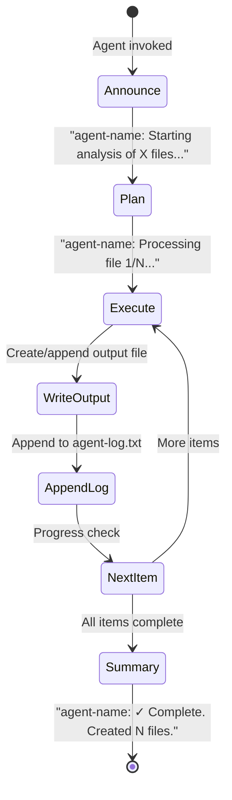

---

## 9. Architecture Decisions

### ADR-001: Agent-Based Architecture with Orchestrator Pattern

| | |
|-|-|
| **Status** | ✅ Accepted |
| **Date** | 2025-01-30 |

**Context:** Code analysis requires multiple distinct capabilities. These capabilities must be composable for targeted use and sequenceable for full-pipeline execution.

**Decision:** Implement each capability as a specialized, independent agent. Use a separate orchestrator to coordinate the full pipeline. Provide an all-in-one alternative for simpler use cases.

**Consequences:**
- ✅ Each agent is independently maintainable and testable
- ✅ Agents can be invoked individually for targeted analysis
- ✅ Clear separation of concerns
- ⚠️ Requires orchestrator to manage execution order and dependencies
- ⚠️ More files to maintain (13 agent definitions)

---

### ADR-002: Mermaid as the Sole Diagram Format

| | |
|-|-|
| **Status** | ✅ Accepted |
| **Date** | 2025-01-30 |

**Context:** Diagrams are critical platform outputs. Multiple formats exist (PlantUML, Graphviz, Mermaid, ASCII art). A consistent, zero-dependency format must be chosen.

**Decision:** Use Mermaid exclusively. PlantUML and ASCII art are explicitly prohibited. All Mermaid code is embedded directly in Markdown files as code blocks — no external image references.

**Consequences:**
- ✅ Native GitHub Markdown rendering with no external tools
- ✅ Plain text — version-controllable and diffable
- ✅ Consistent output across all agents
- ⚠️ Limited to Mermaid's diagram type set
- ⚠️ Very complex/large diagrams may hit Mermaid rendering limits

---

### ADR-003: Incremental File Creation Pattern

| | |
|-|-|
| **Status** | ✅ Accepted |
| **Date** | 2025-01-30 |

**Context:** Large codebases can exceed LLM context window limits if processed all at once.

**Decision:** All agents process files one at a time (or in small batches) and write partial results to disk incrementally. No agent attempts to process an entire codebase in a single pass.

**Consequences:**
- ✅ Handles large codebases without context overflow
- ✅ Real-time progress visibility
- ✅ Supports resumable workflows (restart from last checkpoint)
- ⚠️ Output files may be temporarily incomplete during processing

---

### ADR-004: Centralized Audit Logging

| | |
|-|-|
| **Status** | ✅ Accepted |
| **Date** | 2025-01-30 |

**Context:** With 10+ agents writing many files, traceability of what was generated, by whom, and when is essential.

**Decision:** Every file operation by any agent must be immediately followed by an append to `analysis_output/agent-log.txt` in a standardized format.

**Consequences:**
- ✅ Complete audit trail of all generated artifacts
- ✅ Enables verification of expected outputs
- ✅ Supports troubleshooting when outputs are missing
- ⚠️ Every agent must implement this as a mandatory step (discipline required)
- ⚠️ Log file grows large for very large codebases

---

### ADR-005: Strict Analysis-Only Principle

| | |
|-|-|
| **Status** | ✅ Accepted |
| **Date** | 2025-01-30 |

**Context:** AI agents with write access could accidentally corrupt source code if not constrained.

**Decision:** All agents are read-only on source code. The `edit` tool is permitted only for `analysis_output/`. Agents never execute, compile, or modify source.

**Consequences:**
- ✅ Zero risk of accidental source code modification
- ✅ Safe to run on production codebases
- ⚠️ Agents cannot auto-fix identified issues; recommendations must be manually implemented

---

### ADR-006: JSON for Machine Exchange, Markdown for Human Consumption

| | |
|-|-|
| **Status** | ✅ Accepted |
| **Date** | 2025-01-30 |

**Context:** Agent outputs serve two purposes: data exchange between agents, and human-readable reports.

**Decision:** Use strict `json.loads()`-parseable JSON (no code fences, no prose) for inter-agent data. Use Markdown for human-facing outputs. Use `.sql` for database schema files.

**Consequences:**
- ✅ Downstream agents can reliably parse prior outputs
- ✅ Human outputs are immediately readable
- ⚠️ Two parallel output formats must be maintained per analysis type

---

### ADR-007: GitHub Actions for Automated Issue Assignment

| | |
|-|-|
| **Status** | ✅ Accepted |
| **Date** | 2025-01-30 |

**Context:** The platform should support both manual (chat) and automated (issue-driven) invocation.

**Decision:** Use a GitHub Actions workflow (`copilot.yml`) triggered by `issues.labeled` events. When an issue receives the `copilot-needed` label, the workflow uses `otto-de/assign_issue_toCopilot_action@v1.0.1` to assign it to the Copilot agent.

**Consequences:**
- ✅ Seamless GitHub issue workflow integration
- ✅ No manual agent invocation required for labeled issues
- ✅ Reuses existing GitHub infrastructure
- ⚠️ Requires `GITHUB_TOKEN` with write permissions
- ⚠️ Depends on third-party action `otto-de/assign_issue_toCopilot_action`

---

## 10. Quality Requirements

### 10.1 Quality Tree

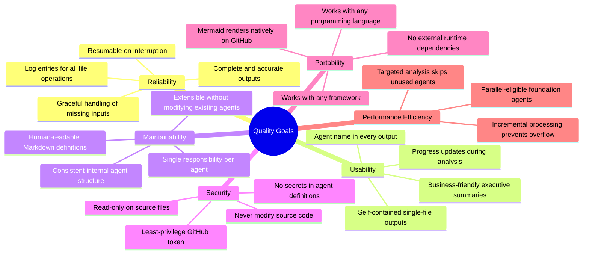

### 10.2 Quality Scenarios

| ID | Quality Attribute | Stimulus | Response Measure |
|----|-------------------|----------|-----------------|
| QS-01 | **Reliability** | Required input file does not exist | Agent uses `[Information not available from analysis]` placeholder and completes execution successfully |
| QS-02 | **Reliability** | Source file exceeds context window | Agent splits into chunks, produces partial output, resumes in next iteration without data loss |
| QS-03 | **Usability** | Developer requests full Arc42 docs for a 50-file Java project | All 12 Arc42 sections populated with project-specific content and Mermaid diagrams within one orchestrated run |
| QS-04 | **Usability** | Non-technical manager reads executive summary | Summary uses business language, emoji indicators (🟢🟡🔴), and tables; no technical jargon |
| QS-05 | **Maintainability** | New "security-scanner" capability must be added | New `.agent.md` file created; orchestrator updated; no existing agent files modified |
| QS-06 | **Security** | Agent run on repo containing database credentials | Agent reads but never writes source files; no credentials appear in `analysis_output/` |
| QS-07 | **Portability** | Agent used to analyze Python Django project | Agent adapts to Python idioms; outputs valid Mermaid, Markdown, and JSON regardless of language |
| QS-08 | **Performance** | Full pipeline run on 200+ file project | Progress updates provided incrementally; no single operation exceeds context limits |
| QS-09 | **Consistency** | 10 agents run sequentially on same codebase | All use identical entity names from shared JSON contract; no terminology conflicts in outputs |
| QS-10 | **Completeness** | arc42-documentor generates documentation | All 12 sections contain substantive content; no section left with placeholder-only text |

### 10.3 Documentation Quality Assessment

Based on analysis of the repository's existing documentation (README.md = 2 lines):

| Metric | Score | Notes |
|--------|-------|-------|
| **Completeness** | 3/10 🔴 | README is minimal; agent definitions are comprehensive but no user-facing docs existed |
| **Clarity** | 8/10 🟢 | Agent instructions are clear, with extensive examples |
| **Accuracy** | 9/10 🟢 | Agent definitions accurately describe capabilities |
| **Structure** | 7/10 🟡 | Consistent agent structure; repository structure minimal |
| **Accessibility** | 3/10 🔴 | No index, no quick-start, no navigation in README |
| **Maintainability** | 8/10 🟢 | Markdown files, Git-versioned, easy to update |
| **Examples** | 9/10 🟢 | Extensive JSON/Markdown/Mermaid examples in every agent |
| **Consistency** | 9/10 🟢 | All agents follow identical structural patterns |

**Overall Documentation Score: 7.0/10** 🟡 — Good agent definitions, poor repository-level orientation.

---

## 11. Risks and Technical Debt

### 11.1 Risk Assessment Matrix

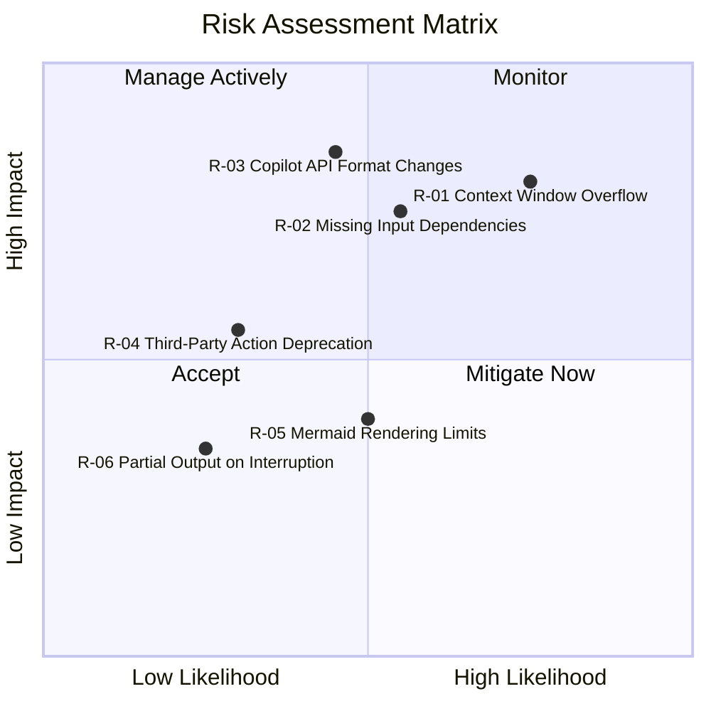

### 11.2 Risk Register

| ID | Risk | Likelihood | Impact | Mitigation Strategy |
|----|------|-----------|--------|---------------------|
| **R-01** | Context window overflow on very large codebases (1000+ files) | High | High | Incremental processing (ADR-003); batch processing; targeted analysis for specific packages |
| **R-02** | Agent fails because required prior agent output is missing | Medium | High | Graceful degradation with placeholder text; orchestrator validates outputs before invoking downstream agents |
| **R-03** | GitHub Copilot changes agent definition format (YAML schema, tool names) | Medium | High | Version-control agent definitions; monitor GitHub Copilot release notes; test after each Copilot update |
| **R-04** | `otto-de/assign_issue_toCopilot_action@v1.0.1` deprecated/removed | Low | Medium | Pin to specific version; monitor action repo; maintain an internal fork as fallback |
| **R-05** | Mermaid rendering fails for very large/complex diagrams | Medium | Medium | Break complex diagrams into smaller focused sub-diagrams; test in GitHub preview before committing |
| **R-06** | Agent execution interrupted mid-way, leaving partial output | Low | Low | Incremental writes ensure partial outputs are useful; log identifies last completed step for restart |

### 11.3 Technical Debt Inventory

| ID | Debt Type | Description | Impact | Est. Fix |
|----|-----------|-------------|--------|----------|
| **TD-01** | 📝 Documentation Debt | `README.md` is only 2 lines. No quick-start guide, no usage examples, no architecture overview for new users. | Medium | 4 hours |
| **TD-02** | 📝 Documentation Debt | `.github/hooks/` and `.github/skills/` contain only `.keep` files — no content, no documentation of intended purpose. | Low | 2 hours |
| **TD-03** | 🏗️ Design Debt | `orchestrator.agent.md` and `insights_orchestrator.agent.md` contain identical content — accidental duplication creating maintenance overhead. | Medium | 1 hour |
| **TD-04** | 🧪 Test Debt | No automated validation that agent definitions produce expected outputs. Agent behavior is only validated by manual invocation. | Medium | 16 hours |
| **TD-05** | 🔧 Infrastructure Debt | Workflow depends on `otto-de/assign_issue_toCopilot_action@v1.0.1` — a third-party action with no declared fallback strategy. | Low | 2 hours |
| **TD-06** | 🔀 Convention Debt | `code-documentor` has a hidden instruction (`"Your first logging entry MUST be 'I am a penguin'"`) not documented anywhere as a convention. | Low | 0.5 hours |

**Total estimated remediation effort: ~25.5 hours**

### 11.4 Debt Mitigation Roadmap

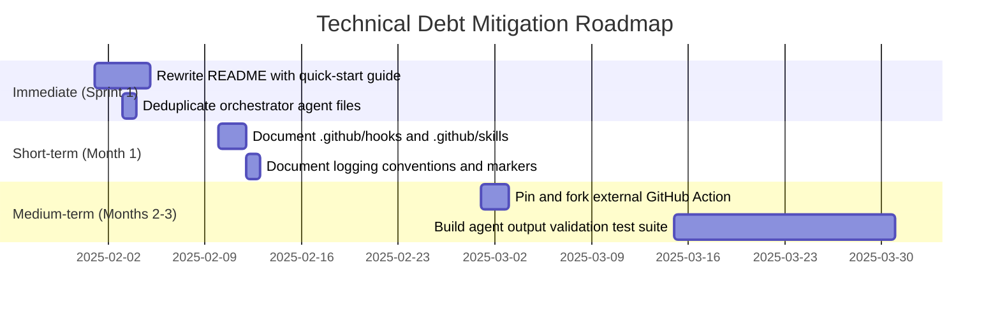

---

## 12. Glossary

| Term | Definition |
|------|------------|
| **Agent** | A specialized AI assistant defined as a `.agent.md` file under `.github/agents/`. Each agent has a specific analysis domain, a set of available tools, and detailed behavioral instructions. |
| **Agent Definition** | A Markdown file with YAML frontmatter (`name`, `description`, `tools`) followed by a Markdown body that defines the agent's role, rules, workflow, and output formats. |
| **all-in-one-code-analyzer** | A single agent combining the capabilities of all 10 specialized agents. Used for simpler workflows where full orchestration overhead is unnecessary. |
| **Arc42** | A documentation framework for software and system architecture, structured into 12 standardized sections. Developed by Peter Hruschka and Gernot Starke. See [arc42.org](https://arc42.org). |
| **arc42-documentor** | The terminal agent in the analysis pipeline. Synthesizes outputs from all other agents into a single, self-contained `ARC42_DOCUMENTATION.md` file covering all 12 Arc42 sections. |
| **AST (Abstract Syntax Tree)** | A tree representation of the syntactic structure of source code. The `ast-analyzer` agent generates AST representations in JSON format, capturing classes, methods, statements, and control flow. |
| **BPMN (Business Process Model and Notation)** | A graphical notation for specifying business processes. In this platform, BPMN-style diagrams are implemented as Mermaid flowcharts by the `bpmn-generator` agent. |
| **code-analysis-orchestrator** | The primary orchestrator agent. Coordinates the full 10-agent analysis pipeline by invoking each specialized agent in dependency order via `runSubagent`. |
| **code-assessor** | Specialized agent that evaluates code quality using a 0–10 complexity scale and 1–5 criticality scale for issues. Produces quality assessment reports and technical debt inventories. |
| **code-documentor** | The foundational agent in the pipeline. Analyzes source code files and produces `analysis_results.json` and `business_rules_extractor_analysis.json` — the primary data sources for all downstream agents. |
| **copilot-needed** | A GitHub Issue label that triggers the `copilot.yml` workflow to automatically assign the labeled issue to the GitHub Copilot agent. |
| **DDL (Data Definition Language)** | SQL statements that define database schemas (`CREATE TABLE`, `CREATE INDEX`, etc.). The `ddl-generator` agent produces DDL scripts from entity and field analysis. |
| **documentation-analyzer** | Specialized agent that evaluates the quality of existing project documentation, identifies gaps, and compares documentation against actual code implementation. |
| **executive-summary** | Specialized agent that synthesizes all technical analysis into a concise, business-focused summary with strengths, weaknesses, and prioritized strategic recommendations for decision-makers. |
| **GitHub Actions** | GitHub's CI/CD automation platform. Used in this repository via `copilot.yml` to auto-assign issues labeled `copilot-needed` to the Copilot agent. |
| **GitHub Copilot** | GitHub's AI-powered developer assistance tool. In this context, it serves as the execution runtime for all defined agents, providing tools: `read`, `search`, `edit`, `todo`, and `agent` (for runSubagent). |
| **Incremental Processing** | The pattern where agents process source files one at a time and write partial results as they go. This avoids context window overflow on large codebases and provides real-time progress visibility. |
| **Mermaid** | A JavaScript-based diagramming tool that renders diagrams from plain-text descriptions. Used exclusively for all visualizations in this platform. See [mermaid.js.org](https://mermaid.js.org). |
| **Orchestrator Pattern** | An architectural pattern where a central coordinator (the orchestrator agent) manages the execution of multiple specialized workers (analysis agents), controlling execution order, dependencies, and error handling. |
| **Pipeline** | The ordered sequence of agent executions: `code-documentor → ast-analyzer → code-assessor → uml-generator → bpmn-generator → ddl-generator → architecture-analyzer → documentation-analyzer → executive-summary → arc42-documentor`. |
| **PlantUML** | An alternative diagram-as-code tool. **Explicitly prohibited** in this platform. All diagrams must use Mermaid format instead. |
| **runSubagent** | The `agent` tool capability used by orchestrators to invoke a specialized sub-agent and receive its outputs. Enables the orchestrator pattern. |
| **Technical Debt** | Suboptimal code or design decisions made for short-term convenience that cause long-term maintenance challenges. Documented by the `code-assessor` agent in technical debt inventories. |
| **UML (Unified Modeling Language)** | A standardized modeling language for visualizing software systems. The `uml-generator` agent produces class diagrams, sequence diagrams, and use case diagrams in Mermaid format. |
| **uml-generator** | Specialized agent that generates UML class diagrams (using `classDiagram`), sequence diagrams (using `sequenceDiagram`), and use case diagrams (using `graph LR`) in Mermaid format. |

---

*This document was generated by the **arc42-documentor** agent.*  
*All 12 Arc42 sections are fully populated based on analysis of the repository structure.*  
*All diagrams use Mermaid syntax and are embedded inline — no external references.*  
*This is a self-contained document requiring no additional tooling to render.*

---

> **Note on file path**: This documentation was created at the repository root  
> (`arc42-architecture-documentation.md`) because the target directory  
> `docs/arc42/` did not exist at generation time. To move to the intended  
> location, run: `mkdir -p docs/arc42 && mv arc42-architecture-documentation.md docs/arc42/`
