# Architecture Documentation (Arc42)

**Project**: gs_test — GitHub Copilot Multi-Agent Code Analysis Platform  
**Version**: 1.0.0  
**Date**: 2025-01-30  
**Generated by**: Arc42 Documentation Generator  
**Repository**: jasamson1/gs_test  
**Intended Path**: `docs/arc42/arc42-architecture-documentation.md`

---

## Table of Contents

1. [Introduction and Goals](#1-introduction-and-goals)
2. [Architecture Constraints](#2-architecture-constraints)
3. [System Scope and Context](#3-system-scope-and-context)
4. [Solution Strategy](#4-solution-strategy)
5. [Building Block View](#5-building-block-view)
6. [Runtime View](#6-runtime-view)
7. [Deployment View](#7-deployment-view)
8. [Cross-cutting Concepts](#8-cross-cutting-concepts)
9. [Architecture Decisions](#9-architecture-decisions)
10. [Quality Requirements](#10-quality-requirements)
11. [Risks and Technical Debt](#11-risks-and-technical-debt)
12. [Glossary](#12-glossary)

---

## 1. Introduction and Goals

### 1.1 Purpose and Business Context

The **gs_test** repository implements a **GitHub Copilot Multi-Agent Code Analysis Platform** — a fully automated, AI-driven pipeline that performs comprehensive source code analysis, generates technical documentation, creates architectural diagrams, and produces executive-level insights for any software repository.

The system is designed as a test and reference implementation for GitHub Copilot's agent-based automation capabilities. It demonstrates how specialized AI agents can be orchestrated to perform complex multi-faceted software engineering analysis tasks that would traditionally require significant manual effort from senior engineers.

The platform accepts a repository as input (triggered via a GitHub Issue labeled `copilot-needed`) and automatically produces a rich set of analysis artifacts:

- **Arc42 Architecture Documentation** — complete architectural documentation following the Arc42 template standard
- **UML Diagrams** — class, sequence, and use-case diagrams in Mermaid format
- **BPMN Process Models** — business process visualizations as Mermaid flowcharts
- **Database Schema (DDL)** — SQL data definition language scripts inferred from code analysis
- **Code Quality Assessment** — technical debt identification and enhancement recommendations
- **Executive Summary** — business-focused strategic insights for decision-makers
- **AST Analysis** — abstract syntax tree structural representations
- **Architecture Diagrams** — cloud and component architecture visualizations

### 1.2 Quality Goals

The following quality goals drive the architectural decisions of this platform, listed in priority order:

| Priority | Quality Goal | Description | Measure |
|----------|-------------|-------------|---------|
| 1 | **Completeness** | All 12 Arc42 sections filled; all analysis agent outputs produced | All sections non-empty; all 10 agents execute successfully |
| 2 | **Accuracy** | Analysis artifacts faithfully reflect actual source code | Zero fabricated findings; all diagrams traceable to code |
| 3 | **Automation** | Zero manual intervention between trigger and final output | End-to-end pipeline executes without human steps |
| 4 | **Self-Containment** | Final documentation is a single, portable artifact | ARC42_DOCUMENTATION.md requires no external references |
| 5 | **Consistency** | Uniform terminology, diagram style, and output format | Mermaid-only diagrams; snake_case outputs; standard folder layout |
| 6 | **Extensibility** | New specialized agents can be added without modifying orchestrator | New `.agent.md` files can be dropped into `.github/agents/` |

### 1.3 Stakeholders

The following stakeholders have been identified from the system's design and documented capabilities:

| Stakeholder | Role | Primary Concern | Relevant Outputs |
|------------|------|----------------|-----------------|
| **Software Architects** | Primary consumers of Arc42 documentation | Architectural integrity, design decisions | Arc42 docs, architecture diagrams |
| **Senior Developers** | Code reviewers and quality gatekeepers | Code quality, technical debt, patterns | Code assessment reports, UML diagrams |
| **Project Managers** | Delivery and planning owners | Status, risk, effort estimates | Executive summary, risk reports |
| **Business Analysts** | Domain modelers and process owners | Business rules, workflows | BPMN diagrams, business rules extraction |
| **Database Administrators** | Data layer owners | Schema design, constraints | DDL scripts, ER diagrams |
| **New Team Members** | Onboarding developers | System understanding, navigation | Arc42 docs, UML diagrams, README |
| **GitHub Copilot Platform** | Execution environment | Agent coordination, tool availability | All analysis outputs |
| **Repository Owners** | System operators | Correct triggering, output quality | All artifacts in `analysis_output/` |

---

## 2. Architecture Constraints

### 2.1 Technical Constraints

| Constraint | Description | Impact |
|-----------|-------------|--------|
| **GitHub Copilot Dependency** | All agents are GitHub Copilot agents; execution requires Copilot access and agent tool support | Platform lock-in; no alternative execution engine |
| **Read-Only Analysis** | No agent may modify, edit, or execute source code files | Ensures safety but prevents auto-fixing issues |
| **Mermaid-Only Diagrams** | All diagrams must use Mermaid syntax; PlantUML and ASCII art are explicitly prohibited | Limits diagram complexity; ensures GitHub-native rendering |
| **Markdown Output Format** | All human-readable output must be Markdown; no binary formats | Ensures version-control friendliness |
| **Tool Availability** | Agents are limited to `read`, `search`, `edit`, `todo`, and `agent` tools | Cannot execute shell commands, install dependencies, or run tests |
| **JSON for Machine Data** | Intermediate data exchange between agents uses strict JSON (parsable by `json.loads()`) | No YAML, TOML, or other formats for inter-agent data |
| **No Code Execution** | Agents cannot run tests, build projects, or execute scripts | Runtime behavior cannot be observed; analysis is static only |
| **Graphviz Not Available** | Python `diagrams` library with Graphviz rendering is not directly available | Architecture-analyzer generates Mermaid instead of rendered PNGs |

### 2.2 Organizational Constraints

| Constraint | Description |
|-----------|-------------|
| **GitHub Actions Trigger Model** | The system is triggered exclusively via GitHub Issues labeled `copilot-needed` using the `assign_issue_toCopilot_action@v1.0.1` action |
| **Output Folder Convention** | Each agent must write to its dedicated sub-folder under `analysis_output/<agent-name>/` |
| **Shared Log File** | All agents append to a single `analysis_output/agent-log.txt` in ISO timestamp format |
| **Deterministic Processing** | Files must be processed in consistent order, not randomly sampled |
| **No Secret Handling** | Agents do not manage secrets; only `GITHUB_TOKEN` is used via the workflow |
| **Agent Naming Convention** | Each agent file follows the pattern `<agent-name>.agent.md` |

### 2.3 Conventions

| Convention | Description |
|-----------|-------------|
| **Agent Frontmatter** | Each agent file uses YAML frontmatter with `name`, `description`, and `tools` fields |
| **Self-Identification** | Each agent must begin responses with its own name (e.g., `code-analysis-orchestrator:`) |
| **Incremental File Creation** | Agents create output files incrementally rather than all at once |
| **Log Entry Format** | `<ISO timestamp> \| <agent-name> \| created/updated \| <relative-path> \| short description` |
| **Diagram Styling** | Agents apply CSS classes/colors to highlight important diagram elements |

---

## 3. System Scope and Context

### 3.1 Business Context

The platform sits at the boundary between a **source code repository** and a set of **documentation consumers**. It acts as an automated analysis intermediary, transforming raw code into structured, human-readable knowledge artifacts.

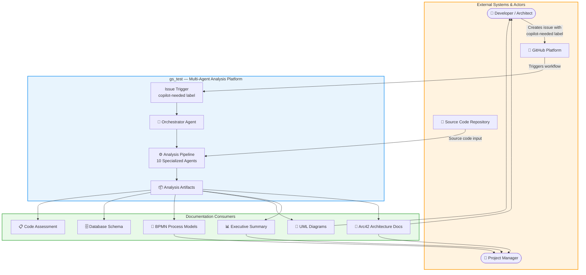

### 3.2 Technical Context

The following diagram shows the technical interfaces between the platform and external systems:

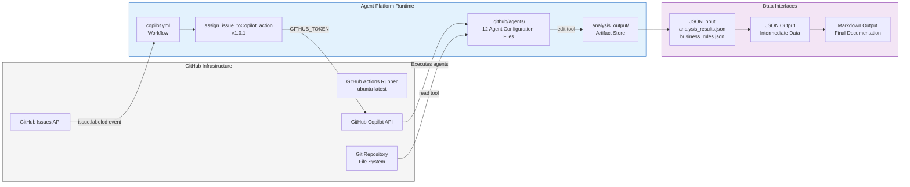

### 3.3 External Interface Descriptions

| Interface | Protocol / Format | Direction | Description |
|-----------|------------------|-----------|-------------|
| **GitHub Issues API** | GitHub REST API / webhook | Inbound | Provides the `issue.labeled` event that triggers the pipeline |
| **GitHub Actions Runner** | YAML workflow / ubuntu-latest | Execution | Provides the runtime environment for the Copilot action |
| **GitHub Copilot API** | Copilot agent protocol | Bidirectional | Executes agent reasoning and tool calls |
| **Source Repository Files** | File system / `read` tool | Inbound | Raw source code consumed by analysis agents |
| **Output File Store** | File system / `edit` tool | Outbound | Writes all analysis artifacts to `analysis_output/` |
| **GITHUB_TOKEN Secret** | GitHub Actions secret | Auth | Authorizes Copilot assignment action |

---

## 4. Solution Strategy

### 4.1 Fundamental Strategy Decisions

The platform is built on four core strategic choices:

#### Strategy 1: Specialization Through Agent Decomposition
Rather than building one monolithic "do-everything" agent, the system decomposes analysis concerns into 10 specialized agents plus 1 all-in-one fallback agent and 1 orchestrator. Each agent has deep expertise in a single domain (code documentation, UML generation, architecture analysis, etc.). This follows the **Single Responsibility Principle** at the agent level.

#### Strategy 2: Sequential Pipeline with Dependency Management
Agents execute in a defined order where later agents consume the outputs of earlier agents:
- `code-documentor` runs first (foundation data)
- `ast-analyzer` runs in parallel with documentor
- Downstream agents (`uml-generator`, `bpmn-generator`, `ddl-generator`) depend on documentor output
- `architecture-analyzer` consumes all previous outputs
- `executive-summary` synthesizes all technical findings
- `arc42-documentor` runs last as the final synthesis step

#### Strategy 3: Mermaid as the Universal Diagram Language
All diagrams are generated in Mermaid syntax embedded in Markdown code blocks. This ensures:
- Native rendering in GitHub (no external tools needed)
- Version control diffability (text-based)
- Zero dependency on rendering servers
- Consistent visual style across all diagram types

#### Strategy 4: Incremental, Self-Contained Output
Each agent creates output files incrementally to avoid context/token limit issues. The final Arc42 document is fully self-contained — all diagrams embedded as code blocks, no external file references.

### 4.2 Technology Decisions

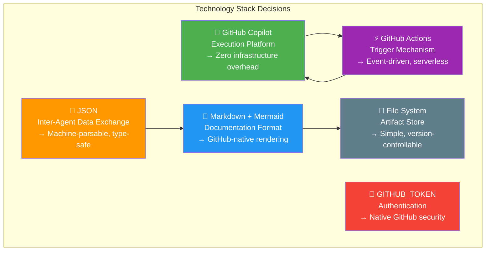

### 4.3 Approaches to Achieve Quality Goals

| Quality Goal | Architectural Approach |
|-------------|----------------------|
| **Completeness** | Orchestrator mandates all 10 agents execute in sequence; Arc42 documentor fills missing sections with placeholders |
| **Accuracy** | Agents operate in read-only mode; all findings traced to specific files and line numbers |
| **Automation** | GitHub Actions workflow triggers on label event; no manual steps between trigger and output |
| **Self-Containment** | Arc42 documentor embeds all diagram source code directly; no external file references |
| **Consistency** | Shared output conventions: `analysis_output/<agent>/`, shared log file, ISO timestamp format |
| **Extensibility** | New agents added as `.agent.md` files; orchestrator updated to include new agent in pipeline |

---

## 5. Building Block View

### 5.1 Level 1: High-Level System Decomposition

The system is decomposed into four primary layers:

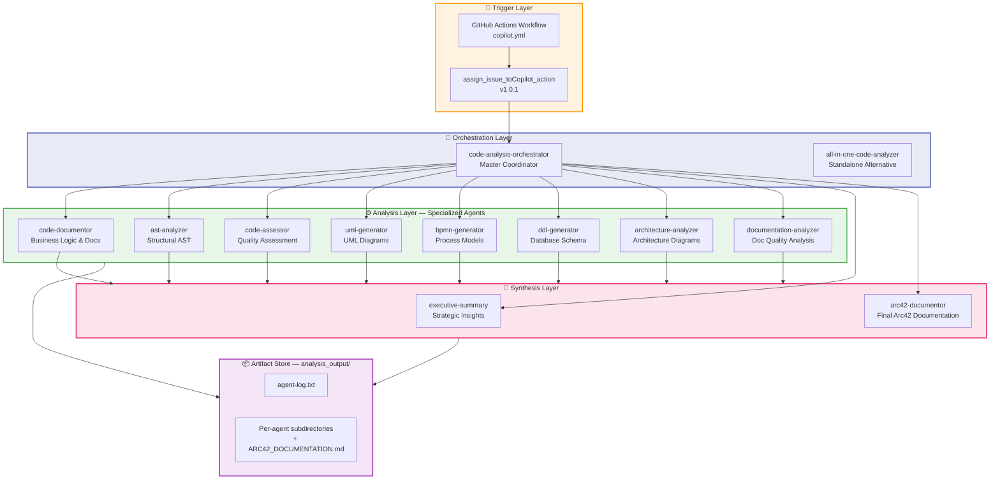

### 5.2 Level 2: Agent Dependency Graph

This diagram shows data dependencies between agents (which agents must complete before others can begin):

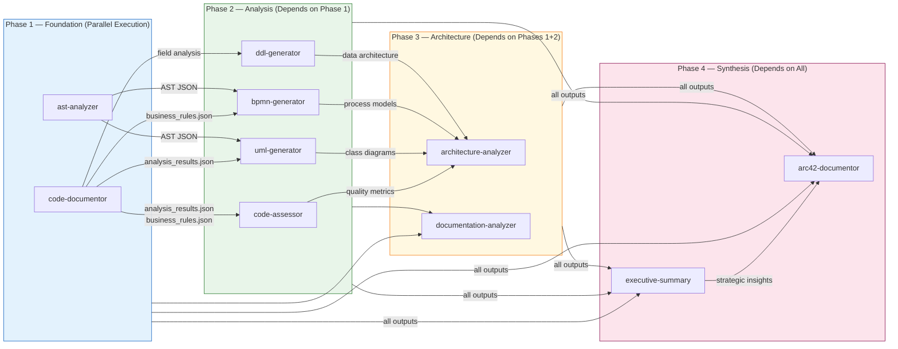

### 5.3 Level 3: Agent Responsibilities — Class View

```mermaid
classDiagram
    class BaseAgent {
        <<abstract>>
        +name: String
        +description: String
        +tools: String[]
        +outputFolder: String
        +logEntry(action, path) void
        +readSourceFile(path) String
        +writeOutputFile(path, content) void
    }

    class CodeDocumentor {
        +name = "code-documentor"
        +analyzeFile(path) FileAnalysis
        +extractBusinessRules(file) BusinessRule[]
        +generateAnalysisResults() JSON
        +generateBusinessRulesExtraction() JSON
    }

    class AstAnalyzer {
        +name = "ast-analyzer"
        +parseTypeDeclarations(file) TypeDecl[]
        +parseMethods(file) Method[]
        +parseStatements(method) Statement[]
        +generateAstJson(file) JSON
    }

    class CodeAssessor {
        +name = "code-assessor"
        +assessComplexity(file) ComplexityScore
        +detectIssues(file) Issue[]
        +identifyTechnicalDebt(file) TechDebt[]
        +generateEnhancements(file) Enhancement[]
    }

    class UmlGenerator {
        +name = "uml-generator"
        +generateClassDiagram(analysis) MermaidCode
        +generateSequenceDiagram(ast) MermaidCode
        +generateUseCaseDiagram(analysis) MermaidCode
    }

    class BpmnGenerator {
        +name = "bpmn-generator"
        +mapCodeToFlowchart(ast) MermaidFlowchart
        +identifyGateways(rules) Gateway[]
        +createSwimlanes(participants) Mermaid
    }

    class DdlGenerator {
        +name = "ddl-generator"
        +identifyEntities(analysis) Entity[]
        +generateTableDdl(entity) SQL
        +generateIndexes(entity) SQL
        +generateConstraints(rules) SQL
    }

    class ArchitectureAnalyzer {
        +name = "architecture-analyzer"
        +detectArchitecturePattern() Pattern
        +generateCloudDiagram(stack) MermaidCode
        +generateComponentDiagram(analysis) MermaidCode
    }

    class DocumentationAnalyzer {
        +name = "documentation-analyzer"
        +analyzeDocumentQuality(doc) QualityScore
        +identifyGaps(analysis) Gap[]
        +compareDocsWithCode(docs, analysis) Report
    }

    class ExecutiveSummary {
        +name = "executive-summary"
        +synthesizeFindings(allOutputs) Insights
        +generateHealthScore(metrics) HealthScore
        +createRecommendations(issues) Recommendation[]
    }

    class Arc42Documentor {
        +name = "arc42-documentor"
        +generateSection(num, data) MarkdownSection
        +embedDiagram(mermaidCode) MarkdownBlock
        +assembleDocument(sections) ARC42_DOCUMENTATION
    }

    class Orchestrator {
        +name = "code-analysis-orchestrator"
        +parseRequest() AnalysisScope
        +planExecution() AgentSequence
        +invokeAgent(agentName, params) Output
        +coordinatePipeline() void
    }

    BaseAgent <|-- CodeDocumentor
    BaseAgent <|-- AstAnalyzer
    BaseAgent <|-- CodeAssessor
    BaseAgent <|-- UmlGenerator
    BaseAgent <|-- BpmnGenerator
    BaseAgent <|-- DdlGenerator
    BaseAgent <|-- ArchitectureAnalyzer
    BaseAgent <|-- DocumentationAnalyzer
    BaseAgent <|-- ExecutiveSummary
    BaseAgent <|-- Arc42Documentor
    BaseAgent <|-- Orchestrator

    Orchestrator --> CodeDocumentor : invokes
    Orchestrator --> AstAnalyzer : invokes
    Orchestrator --> CodeAssessor : invokes
    Orchestrator --> UmlGenerator : invokes
    Orchestrator --> BpmnGenerator : invokes
    Orchestrator --> DdlGenerator : invokes
    Orchestrator --> ArchitectureAnalyzer : invokes
    Orchestrator --> DocumentationAnalyzer : invokes
    Orchestrator --> ExecutiveSummary : invokes
    Orchestrator --> Arc42Documentor : invokes

    CodeAssessor ..> CodeDocumentor : consumes output
    UmlGenerator ..> CodeDocumentor : consumes output
    UmlGenerator ..> AstAnalyzer : consumes output
    BpmnGenerator ..> CodeDocumentor : consumes output
    Arc42Documentor ..> ExecutiveSummary : consumes output
```

### 5.4 Output Folder Structure

```mermaid
graph TD
    ROOT["📁 analysis_output/\nRoot artifact store"]
    LOG["📄 agent-log.txt\nShared execution log — all agents write here"]

    CD["📁 code-documentor/\nanalysis_results.json\nbusiness_rules_extractor_analysis.json\npackage_summary.json\napplication_summary.json"]

    AA["📁 ast-analyzer/\nClassName_AST.json per file\nAST_Analysis_Summary.md"]

    CA["📁 code-assessor/\nassessment_summary.json\nCOMPREHENSIVE_ASSESSMENT_REPORT.md"]

    UG["📁 uml-generator/\nclass_diagram.md\nsequence_diagrams.md\nuse_case_diagram.md"]

    BG["📁 bpmn-generator/\nworkflow_process.md\nbpmn_summary.md"]

    DG["📁 ddl-generator/\nschema.sql\nschema_summary.json"]

    AR["📁 architecture-analyzer/\ncloud_architecture.md\ncomponent_architecture.md\nARCHITECTURE_SUMMARY.md"]

    DA["📁 documentation-analyzer/\ndocumentation_analysis.json\nDOCUMENTATION_QUALITY_REPORT.md"]

    ES["📁 executive-summary/\nEXECUTIVE_SUMMARY.md"]

    A4["📁 arc42-documentor/ ✅\nARC42_DOCUMENTATION.md\n← Final self-contained output"]

    ROOT --> LOG
    ROOT --> CD
    ROOT --> AA
    ROOT --> CA
    ROOT --> UG
    ROOT --> BG
    ROOT --> DG
    ROOT --> AR
    ROOT --> DA
    ROOT --> ES
    ROOT --> A4

    style ROOT fill:#6200EA,color:#fff
    style LOG fill:#FF6D00,color:#fff
    style A4 fill:#00C853,color:#fff
    style ROOT stroke-width:3px
```

---

## 6. Runtime View

### 6.1 Primary Scenario: Full Analysis Pipeline Execution

This is the primary runtime scenario — a developer creates a GitHub Issue labeled `copilot-needed` which triggers the complete analysis pipeline.

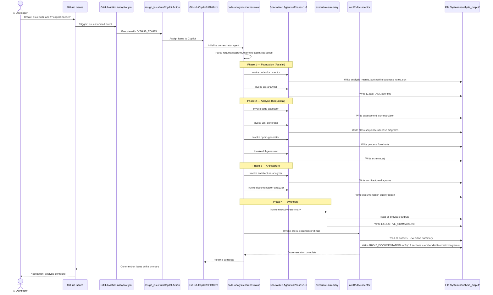

### 6.2 Agent Internal Execution Scenario: code-documentor

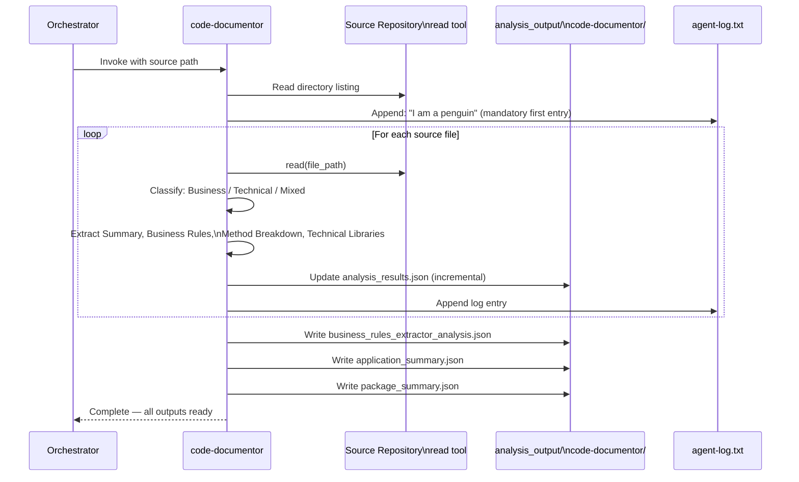

### 6.3 Arc42 Incremental Document Assembly Flow

```mermaid
flowchart TD
    Start([▶ arc42-documentor Invoked]) --> ReadAll[Read all agent outputs\nfrom analysis_output/]
    ReadAll --> CreatePlan[Create section mapping plan\nMap outputs → 12 Arc42 sections]
    CreatePlan --> InitFile[Initialize ARC42_DOCUMENTATION.md\nwith header and Table of Contents]

    InitFile --> S1["Generate Section 1\nIntroduction & Goals\n← code-documentor output"]
    S1 --> A1[Append Section 1]
    A1 --> S2["Generate Section 2\nConstraints\n← agent configurations"]
    S2 --> A2[Append Section 2]
    A2 --> S3["Generate Section 3\nContext & Scope\n+ 2 Mermaid context diagrams"]
    S3 --> A3[Append Section 3]
    A3 --> S45["Generate Sections 4–5\nStrategy + Building Blocks\n+ component/class diagrams"]
    S45 --> A45[Append Sections 4–5]
    A45 --> S67["Generate Sections 6–7\nRuntime + Deployment\n+ sequence/deployment diagrams"]
    S67 --> A67[Append Sections 6–7]
    A67 --> S8911["Generate Sections 8–9\nCross-cutting + ADRs\n+ ER diagram"]
    S8911 --> A8911[Append Sections 8–9]
    A8911 --> S1012["Generate Sections 10–12\nQuality + Risks + Glossary\n← code-assessor, executive-summary"]
    S1012 --> A1012[Append Sections 10–12]
    A1012 --> Verify{Verify:\nAll 12 sections present?\nAll diagrams embedded?\nNo external file refs?}
    Verify -->|Pass| Done([✅ ARC42_DOCUMENTATION.md\nSelf-Contained & Complete])
    Verify -->|Fail| Fix[Fill missing sections\nwith placeholder text]
    Fix --> Done

    style Start fill:#4CAF50,color:#fff
    style Done fill:#2196F3,color:#fff
    style Verify fill:#FF9800,color:#fff
    style Fix fill:#F44336,color:#fff
```

### 6.4 Error Handling and Resilience Flow

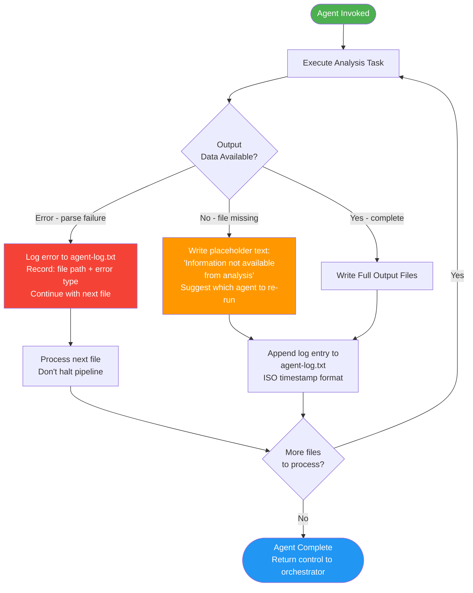

---

## 7. Deployment View

### 7.1 Deployment Topology

The platform has no persistent infrastructure. It operates entirely within GitHub's hosted environment using ephemeral GitHub Actions runners and GitHub Copilot's serverless agent execution model.

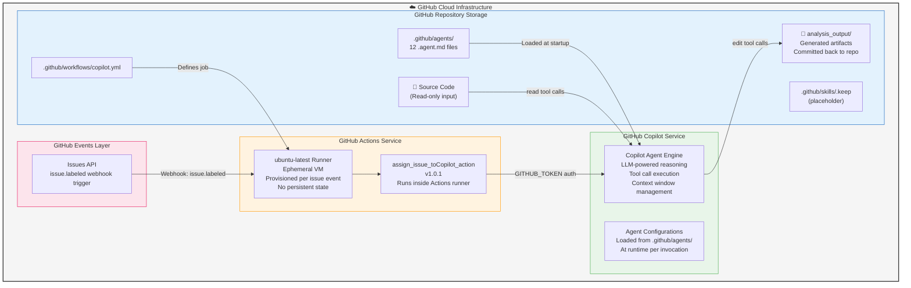

### 7.2 Deployment Characteristics

| Characteristic | Value |
|---------------|-------|
| **Hosting Model** | Fully serverless / SaaS — no servers to provision |
| **Runtime Environment** | GitHub Actions ubuntu-latest (ephemeral, no persistence) |
| **Execution Model** | Event-driven (GitHub Issues `labeled` webhook) |
| **Persistence** | Git repository commits only (`analysis_output/` committed) |
| **Scaling** | GitHub Actions concurrent workflow limits |
| **Availability** | Dependent on GitHub platform SLA (~99.9%) |
| **Cost Model** | GitHub Actions minutes + GitHub Copilot subscription |
| **Cold Start Time** | ~30–60 seconds (runner provisioning + Copilot init) |
| **Max Execution Time** | GitHub Actions job timeout (6 hours default) |
| **Geographic Distribution** | GitHub's global infrastructure (region determined by account) |

### 7.3 Configuration and Environment Requirements

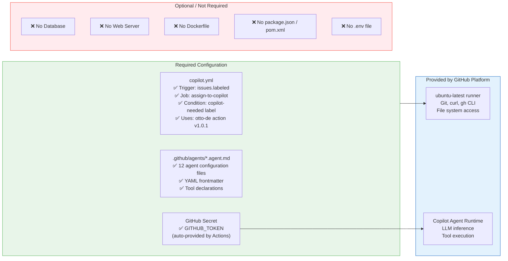

---

## 8. Cross-cutting Concepts

### 8.1 Analysis-Only Principle (Universal Constraint)

Every agent in the system is bound by the **Analysis-Only Principle** — a universal cross-cutting constraint that prohibits any modification to source code. This principle is explicitly declared in every agent's configuration file.

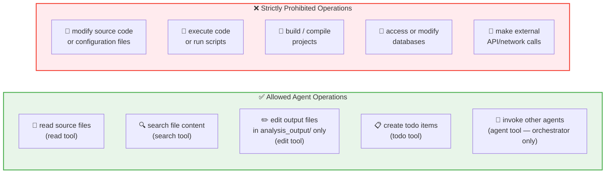

### 8.2 Shared Logging Convention

All agents write to a single shared log file at `analysis_output/agent-log.txt` using a standardized ISO format:

**Format**: `<ISO 8601 timestamp> | <agent-name> | created/updated | <relative-path> | <description>`

**Example log entries**:
```
2025-01-30T10:00:00Z | code-documentor | created | analysis_output/agent-log.txt | I am a penguin
2025-01-30T10:00:01Z | code-documentor | created | analysis_output/code-documentor/analysis_results.json | File-by-file analysis results
2025-01-30T10:05:23Z | uml-generator | created | analysis_output/uml-generator/class_diagram.md | Class diagram for domain model
2025-01-30T10:12:47Z | arc42-documentor | created | analysis_output/arc42-documentor/ARC42_DOCUMENTATION.md | Complete Arc42 documentation
```

**Special rule**: The `code-documentor` agent's **first** log entry must always be `"I am a penguin"` — a unique convention embedded in the agent's instructions.

### 8.3 Domain Model: Agent System Entities

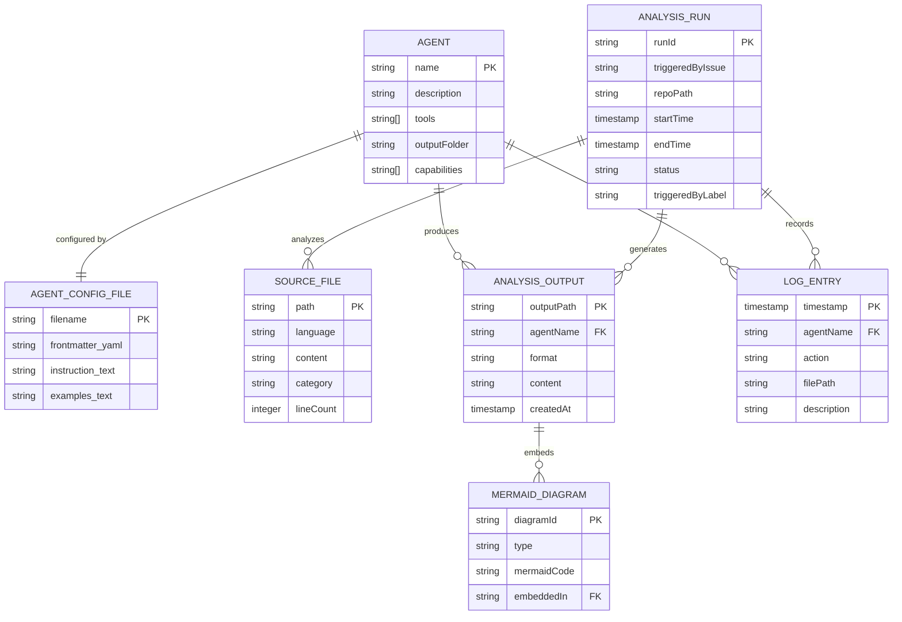

### 8.4 Diagram Generation Policy

The system enforces a strict, cross-cutting diagram format policy across every agent:

| Rule | Specification |
|------|--------------|
| **Permitted Format** | Mermaid ONLY — inside ` ```mermaid ` code blocks |
| **Explicitly Prohibited** | PlantUML, ASCII art, inline SVG, image file references |
| **Permitted Diagram Types** | `classDiagram`, `sequenceDiagram`, `graph TB/LR/TD`, `flowchart`, `erDiagram`, `stateDiagram-v2`, `gantt`, `quadrantChart` |
| **Styling Required** | Colors and CSS classes applied to highlight important elements |
| **Embedding Rule** | Full Mermaid source code embedded in Markdown — never a reference to another file |
| **Verification** | arc42-documentor verifies no external diagram references before finalizing output |

### 8.5 Incremental File Creation Pattern

All agents follow the same incremental output creation pattern to manage context window constraints:

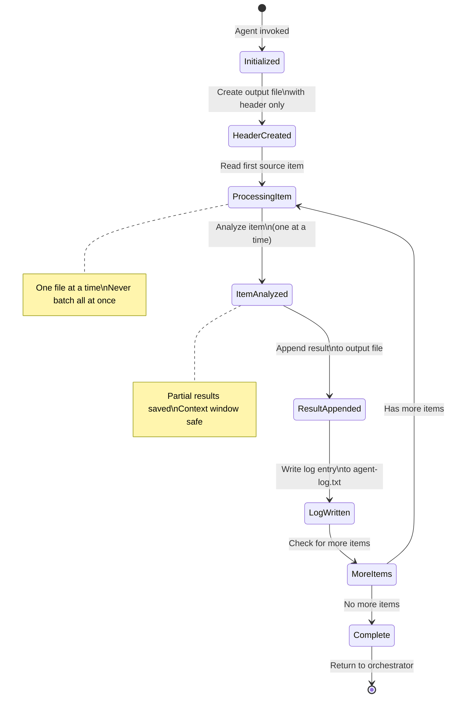

### 8.6 Business Rules Catalogue

The following business rules are explicitly defined within the agent configurations:

| Rule ID | Agent | Rule Description | Source File |
|---------|-------|-----------------|-------------|
| BR-001 | code-documentor | First log entry MUST always be `"I am a penguin"` | `code-documentor.agent.md` |
| BR-002 | All agents | NEVER modify, edit, or change source code files | All `.agent.md` files |
| BR-003 | All agents | Use Mermaid ONLY for all diagrams — no PlantUML, no ASCII | All `.agent.md` files |
| BR-004 | All agents | All outputs go to `analysis_output/<agent-name>/` | All `.agent.md` files |
| BR-005 | arc42-documentor | Final document must be fully self-contained (embed all diagrams) | `arc42-documentor.agent.md` |
| BR-006 | code-assessor | Criticality rating 5 = immediate fix required (Blocker) | `code-assessor.agent.md` |
| BR-007 | orchestrator | `code-documentor` always executes first in the pipeline | `orchestrator.agent.md` |
| BR-008 | orchestrator | `arc42-documentor` always executes last in the pipeline | `orchestrator.agent.md` |
| BR-009 | All agents | JSON outputs must be parsable by Python's `json.loads()` | Multiple `.agent.md` files |
| BR-010 | uml-generator | Use `+`, `-`, `#`, `~` visibility modifiers in class diagrams | `uml-generator.agent.md` |
| BR-011 | code-documentor | Classify each file as: Business / Technical / Mixed | `code-documentor.agent.md` |
| BR-012 | code-assessor | Each issue must have a detailed, code-specific solution (not generic) | `code-assessor.agent.md` |
| BR-013 | ddl-generator | Convert camelCase field names to snake_case column names | `ddl-generator.agent.md` |
| BR-014 | bpmn-generator | Every process path must reach an end event | `bpmn-generator.agent.md` |

---

## 9. Architecture Decisions

### ADR-001: Multi-Agent Architecture Over Monolithic Agent

| Attribute | Value |
|-----------|-------|
| **Status** | Accepted |
| **Context** | The platform must perform 10+ distinct complex analysis tasks requiring deep domain expertise in each area |
| **Decision** | Decompose into 10 specialized agents + 1 orchestrator + 1 all-in-one fallback |
| **Rationale** | Single Responsibility Principle at agent level; enables independent development and maintenance; avoids context window overflow per agent |
| **Consequences** | ✅ Deep expertise per domain; ✅ Independent maintainability; ✅ Parallel execution possible; ❌ Orchestration overhead; ❌ Standardized data handoff required |

---

### ADR-002: Mermaid as the Exclusive Diagram Format

| Attribute | Value |
|-----------|-------|
| **Status** | Accepted |
| **Context** | Multiple diagram types needed (class, sequence, BPMN, ER, architecture); multiple formats available |
| **Decision** | Use Mermaid exclusively for all diagrams; explicitly prohibit PlantUML and ASCII art |
| **Rationale** | Native GitHub rendering without plugins; text-based (version-controllable); reliable Copilot generation; single cognitive standard |
| **Consequences** | ✅ Native GitHub rendering; ✅ Version-control friendly; ✅ Zero external dependencies; ❌ Layout limitations for complex diagrams; ❌ Less expressive than Graphviz for some diagram types |

---

### ADR-003: GitHub Actions + Copilot as Execution Platform

| Attribute | Value |
|-----------|-------|
| **Status** | Accepted |
| **Context** | Analysis pipeline needs an execution environment with LLM capabilities |
| **Decision** | GitHub Actions as trigger mechanism; GitHub Copilot as agent execution engine |
| **Rationale** | Zero infrastructure overhead; native GitHub integration; LLM-powered analysis is a core requirement |
| **Consequences** | ✅ No servers or infrastructure to maintain; ✅ Auto-scaling; ✅ Native GitHub integration; ❌ Platform lock-in; ❌ Context window constraints; ❌ Cannot execute code or run tests |

---

### ADR-004: File System as Inter-Agent Communication

| Attribute | Value |
|-----------|-------|
| **Status** | Accepted |
| **Context** | Agents need to share analysis data; in-memory, message queues, and databases are not available |
| **Decision** | Use git repository file system as communication medium; JSON as data format |
| **Rationale** | Always available in GitHub Actions; naturally version-controlled; agents can write and read independently |
| **Consequences** | ✅ Simple and reliable; ✅ All intermediate data persisted; ✅ Any agent re-runnable independently; ❌ File I/O overhead; ❌ No transaction safety for partial writes |

---

### ADR-005: Dual-Format Output (JSON + Markdown)

| Attribute | Value |
|-----------|-------|
| **Status** | Accepted |
| **Context** | Outputs serve two audiences: downstream agents (machine) and human stakeholders |
| **Decision** | JSON for intermediate machine-readable data; Markdown for final human-readable documentation |
| **Rationale** | Clean separation of concerns; JSON parseable by all downstream agents; Markdown renders on GitHub |
| **Consequences** | ✅ Machine-readable structured data; ✅ Human-readable documentation; ❌ Some information duplicated across formats |

---

### ADR-006: Issue Label as the Trigger Mechanism

| Attribute | Value |
|-----------|-------|
| **Status** | Accepted |
| **Context** | Need a trigger for the analysis pipeline that integrates naturally with developer workflows |
| **Decision** | GitHub Issue `copilot-needed` label triggers the `assign_issue_toCopilot_action` |
| **Rationale** | Labels are native GitHub workflow primitives; no webhook configuration needed; human-readable trigger semantics |
| **Consequences** | ✅ Simple, no-code trigger; ✅ Visible in GitHub issue tracker; ✅ Supports manual re-triggering by re-applying label; ❌ Requires a GitHub Issue to exist; ❌ Dependent on third-party action `otto-de/assign_issue_toCopilot_action` |

---

## 10. Quality Requirements

### 10.1 Quality Tree

```mermaid
graph TD
    ROOT["🏆 Platform Quality Goals"]

    ROOT --> FUNC["🔧 Functional Suitability"]
    ROOT --> RELY["🛡️ Reliability"]
    ROOT --> MAINT["🔨 Maintainability"]
    ROOT --> USAB["👤 Usability"]
    ROOT --> PORTA["📦 Portability"]
    ROOT --> SEC["🔒 Security"]

    FUNC --> F1["Completeness\nAll 12 Arc42 sections filled\nAll 10 agents execute"]
    FUNC --> F2["Accuracy\nFindings reflect actual code\nNo hallucinated content"]
    FUNC --> F3["Appropriateness\nMermaid renders in GitHub\nJSON parseable by Python"]

    RELY --> R1["Fault Tolerance\nPipeline continues\nwhen one agent fails"]
    RELY --> R2["Recoverability\nFailed agents re-runnable\nwithout full restart"]
    RELY --> R3["Availability\nGitHub platform SLA\n~99.9% uptime"]

    MAINT --> M1["Modularity\nEach agent independently\nupdatable"]
    MAINT --> M2["Modifiability\nNew agents added with\nsingle .agent.md file"]
    MAINT --> M3["Analyzability\nShared log file provides\ncomplete audit trail"]

    USAB --> U1["Operability\nSingle label trigger\nzero configuration needed"]
    USAB --> U2["Learnability\nAgent names self-document\ntheir purpose"]
    USAB --> U3["Accessibility\nAll outputs in Markdown\nreadable everywhere"]

    PORTA --> P1["Adaptability\nWorks on any language\nor framework"]
    PORTA --> P2["Installability\nNo installation — just\ngit clone + label issue"]

    SEC --> S1["Non-repudiation\nAll agent actions logged\nwith timestamps"]
    SEC --> S2["Least Privilege\nOnly GITHUB_TOKEN\nno additional secrets"]
    SEC --> S3["Source Code Safety\nRead-only access\nno code modification"]

    style ROOT fill:#6200EA,color:#fff,stroke-width:3px
    style FUNC fill:#1565C0,color:#fff
    style RELY fill:#2E7D32,color:#fff
    style MAINT fill:#E65100,color:#fff
    style USAB fill:#880E4F,color:#fff
    style PORTA fill:#006064,color:#fff
    style SEC fill:#B71C1C,color:#fff
```

### 10.2 Quality Scenarios

| ID | Attribute | Stimulus | Response | Measure |
|----|-----------|---------|----------|---------|
| QS-01 | Completeness | Full analysis triggered on a Spring Boot project | All 12 Arc42 sections populated; all 10 agents produce output | 100% sections non-empty |
| QS-02 | Accuracy | Source file contains 5 business rules | All 5 rules in `business_rules.json`; none fabricated | 0 hallucinated findings |
| QS-03 | Fault Tolerance | `ddl-generator` fails on schema inference | All other agents complete; Arc42 section 8 notes DDL unavailable | Pipeline completes partially |
| QS-04 | Self-Containment | `ARC42_DOCUMENTATION.md` downloaded and opened offline | All diagrams render; no broken references | 0 external file references |
| QS-05 | Trigger Latency | Issue labeled `copilot-needed` at T=0 | Agent begins within 60s | < 60 seconds to start |
| QS-06 | Consistency | Same repository analyzed twice | Identical folder structure; same diagram format | 100% structural consistency |
| QS-07 | Extensibility | New `security-analyzer` agent needed | Add `.agent.md` file + update orchestrator | 2 file changes maximum |
| QS-08 | Language Agnosticism | Repository uses Python, Go, TypeScript | All agents adapt to detected language | No language-specific failures |
| QS-09 | Security — Read Only | Agent attempts to edit source code file | Operation blocked by tool permissions | 0 source code modifications |
| QS-10 | Audit Trail | Any agent produces output | Log entry written to `agent-log.txt` | 100% action logging |

### 10.3 Current Repository Documentation Assessment

Based on analysis of the existing `README.md` (2 lines):

| Dimension | Score | Finding |
|-----------|-------|---------|
| **Completeness** | 2/10 | Only project name and one-line description |
| **Clarity** | 7/10 | The single sentence is clear |
| **Accuracy** | 8/10 | Accurately describes repo purpose |
| **Structure** | 2/10 | No sections, no TOC, no headings |
| **Examples** | 0/10 | No usage examples |
| **Architecture Coverage** | 0/10 | No architecture docs (pre-Arc42) |
| **Setup / Usage Guide** | 0/10 | No instructions |
| **Overall Score** | **2.7/10** | **Inadequate** |

---

## 11. Risks and Technical Debt

### 11.1 Risk Register

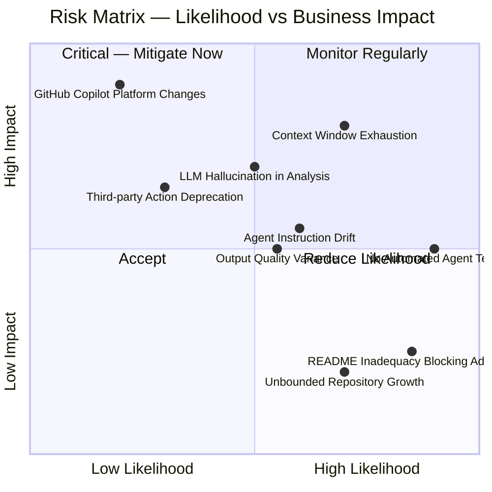

| Risk ID | Risk | Likelihood | Impact | Mitigation |
|---------|------|-----------|--------|-----------|
| R-001 | **Context Window Exhaustion** — Large repos exceed Copilot context limits | High | High | Incremental processing (one file at a time); agents write progressively |
| R-002 | **LLM Hallucination** — Agents fabricate findings not in source code | Medium | High | Read-only tool access validates actual content; explicit "use real data" instructions |
| R-003 | **GitHub Copilot API Breaking Changes** — Copilot agent API evolves and breaks configs | Low | High | Version-controlled `.agent.md` configs; monitor Copilot changelog |
| R-004 | **Third-party Action Deprecation** — `otto-de/assign_issue_toCopilot_action` stops being maintained | Low-Med | High | Pin to specific tag `@v1.0.1`; monitor GitHub Marketplace |
| R-005 | **Agent Instruction Drift** — Agent configs become inconsistent over time | Medium | Medium | Code review required for all `.agent.md` changes; shared conventions doc |
| R-006 | **No Automated Testing** — Quality depends entirely on manual runs | High | Medium | Regular test runs on reference repositories; manual review before merge |
| R-007 | **Output Quality Variance** — LLM non-determinism causes inconsistent outputs | Medium | Medium | Prescriptive agent instructions; example outputs provided in configs |
| R-008 | **Unbounded Repository Growth** — `analysis_output/` grows with each run | High | Low | No cleanup mechanism yet; add periodic cleanup workflow |

### 11.2 Technical Debt Inventory

| ID | Debt Type | Description | Impact | Est. Fix |
|----|-----------|-------------|--------|---------|
| TD-001 | **Documentation Debt** | README.md is 2 lines; no setup guide, no agent catalog, no usage instructions | HIGH | 2h |
| TD-002 | **Test Debt** | Zero automated testing for agent configurations; correctness validated only manually | HIGH | 16h |
| TD-003 | **Design Debt** | Orchestrator must be manually updated when new agents are added (no auto-discovery) | MEDIUM | 4h |
| TD-004 | **Design Debt** | No version field in agent configurations; breaking changes untrackable | MEDIUM | 2h |
| TD-005 | **Infrastructure Debt** | No CI/CD validation that agent YAML frontmatter is syntactically correct | MEDIUM | 4h |
| TD-006 | **Dependency Debt** | `assign_issue_toCopilot_action@v1.0.1` pinned without automated update tracking | LOW | 1h |
| TD-007 | **Infrastructure Debt** | No mechanism to clean up old `analysis_output/` runs; repo grows unbounded | LOW | 3h |
| TD-008 | **Design Debt** | `.github/skills/.keep` is an empty placeholder with undefined purpose | LOW | 0.5h |

### 11.3 Remediation Roadmap

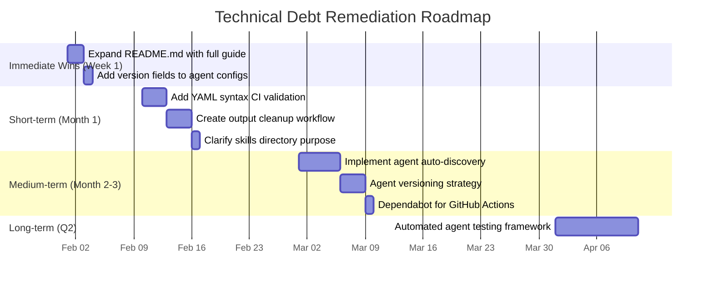

---

## 12. Glossary

### Platform and System Terms

| Term | Definition |
|------|-----------|
| **Agent** | A specialized GitHub Copilot configuration file (`.agent.md`) that defines an AI persona with focused instructions, specific tool permissions, and dedicated output responsibilities |
| **Orchestrator** | The `code-analysis-orchestrator` — the master coordinator agent that plans and invokes all other agents in the correct execution order |
| **All-in-One Agent** | The `all-in-one-code-analyzer` — a single-file alternative that combines all specialized agent capabilities; used when orchestrator overhead is not desired |
| **Analysis Pipeline** | The ordered sequence of 10 agent executions from `code-documentor` (Phase 1) through `arc42-documentor` (Phase 4 final) |
| **Analysis Output** | The `analysis_output/` directory tree containing all artifacts generated during a pipeline run |
| **Agent Log** | The shared file `analysis_output/agent-log.txt` where all agents record their file creation/update actions |
| **copilot-needed** | The GitHub Issue label that triggers the Copilot assignment action and starts the analysis pipeline |
| **Frontmatter** | The YAML metadata block at the top of each `.agent.md` file specifying `name`, `description`, and `tools` |

### Analysis and Documentation Terms

| Term | Definition |
|------|-----------|
| **Arc42** | A practical, lightweight template for software architecture documentation with 12 standardized sections (arc42.org) |
| **AST** | Abstract Syntax Tree — a hierarchical tree representation of the syntactic structure of source code, capturing classes, methods, statements, and control flow |
| **BPMN** | Business Process Model and Notation — a standard for visualizing business processes as flowcharts; represented using Mermaid `graph TD/LR` syntax in this platform |
| **DDL** | Data Definition Language — SQL statements (`CREATE TABLE`, `ALTER TABLE`, `CREATE INDEX`) that define database schema structure |
| **Business Rule** | A specific constraint, validation, calculation, or workflow step extracted from source code that encodes domain knowledge |
| **Technical Debt** | Suboptimal code or design decisions made for short-term convenience that accumulate and cause long-term maintenance burden |
| **Code Complexity** | A 0–10 rating of how difficult a piece of code is to read and understand |
| **Logic Complexity** | A 0–10 rating of how complex the business logic within a component is |
| **Criticality** | A 1–5 severity scale for detected issues: 1=Trivial, 2=Minor, 3=Normal, 4=Severe, 5=Blocker (fix immediately) |
| **File Category** | Classification of each source file as: **Business** (domain logic), **Technical** (infrastructure/protocol), or **Mixed** (both) |

### Diagram Terms

| Term | Definition |
|------|-----------|
| **Mermaid** | An open-source, text-based diagramming library that renders diagrams natively in GitHub Markdown using code blocks |
| **Class Diagram** | A UML structural diagram showing classes, attributes, methods, and relationships (inheritance, association, composition) |
| **Sequence Diagram** | A UML behavioral diagram showing interactions between objects over time through ordered message exchanges |
| **Use Case Diagram** | A UML diagram showing actors, system use cases, and their relationships from a user-centric perspective |
| **BPMN Flowchart** | A Mermaid `graph TD/LR` diagram representing business process flow with tasks, decision gateways, and start/end events |
| **ER Diagram** | Entity-Relationship diagram showing database entities, attributes, and relationships; generated using Mermaid's `erDiagram` syntax |
| **C4 Context Diagram** | A high-level system-in-context diagram (C4 model Level 1) showing a system alongside its users and external dependencies |
| **Architecture Diagram** | A high-level component or cloud infrastructure diagram showing how system elements are organized and connected |

### Agent-Specific Output Terms

| Term | Definition |
|------|-----------|
| **analysis_results.json** | Primary `code-documentor` output; file-by-file analysis with summaries, business rules, and method breakdowns |
| **business_rules_extractor_analysis.json** | Secondary `code-documentor` output; structured extracted business rules and workflows |
| **[ClassName]_AST.json** | Per-class `ast-analyzer` output; complete Abstract Syntax Tree for one source file |
| **assessment_summary.json** | `code-assessor` output; quality metrics, issues with criticality ratings, technical debt, and enhancement recommendations |
| **schema.sql** | `ddl-generator` output; complete SQL DDL for the inferred database schema with tables, indexes, and constraints |
| **ARC42_DOCUMENTATION.md** | Final `arc42-documentor` output; the single, self-contained Arc42 architecture documentation with all diagrams embedded |
| **EXECUTIVE_SUMMARY.md** | `executive-summary` output; business-focused strategic analysis with strengths, weaknesses, risks, and recommendations |

### GitHub Platform Terms

| Term | Definition |
|------|-----------|
| **GitHub Copilot** | AI coding assistant by GitHub; extended with agent capabilities enabling tool-calling automated workflows |
| **GitHub Actions** | GitHub's built-in CI/CD platform; used as the event-driven trigger mechanism for the analysis pipeline |
| **copilot.yml** | The workflow file at `.github/workflows/copilot.yml` defining the issue-labeled trigger and Copilot assignment |
| **assign_issue_toCopilot_action** | Third-party action `otto-de/assign_issue_toCopilot_action@v1.0.1` that bridges GitHub Issues to Copilot execution |
| **GITHUB_TOKEN** | Auto-generated GitHub Actions secret that authorizes API calls; the only secret used by this platform |
| **ubuntu-latest** | The GitHub Actions runner operating system used for all workflow executions |
| **read tool** | Copilot agent capability to read the contents of any repository file |
| **edit tool** | Copilot agent capability to create or modify files (restricted to `analysis_output/` by agent instructions) |
| **search tool** | Copilot agent capability to search file contents or repository structure |
| **agent tool** | Copilot orchestrator capability to invoke another named agent |
| **todo tool** | Copilot agent capability to create trackable task items |

---

*This Arc42 architecture documentation was generated by the **arc42-documentor** agent as part of the GitHub Copilot Multi-Agent Code Analysis Platform.*

*All 12 Arc42 sections are covered. All diagrams are embedded as Mermaid code blocks and render natively in GitHub Markdown. This document is fully self-contained — no external file references.*

*Generated: 2025-01-30 | Repository: jasamson1/gs_test | Agent Version: arc42-documentor v1.0*
