# Architecture Documentation (Arc42)

**Project**: HRApp — HR Application with GitHub Copilot Agent Intelligence Platform  
**Issue**: HRApp-004 — Insights  
**Repository**: gs_test (jasamson1/gs_test)  
**Version**: 1.0.0  
**Date**: 2025-01-30  
**Generated by**: Arc42 Documentation Generator (arc42-documentor agent)  
**Status**: Living Document — Based on repository structure and agent definitions analysis

> **Note**: This documentation was generated by synthesizing the agent definition files found in `.github/agents/`, the CI/CD workflow in `.github/workflows/copilot.yml`, and the repository context provided by the HRApp-004 Insights issue. It reflects the architecture of the **GitHub Copilot Agent Orchestration Platform** embedded within the HRApp ecosystem.

---

## Table of Contents

1. [Introduction and Goals](#1-introduction-and-goals)
2. [Constraints](#2-constraints)
3. [Context and Scope](#3-context-and-scope)
4. [Solution Strategy](#4-solution-strategy)
5. [Building Block View](#5-building-block-view)
6. [Runtime View](#6-runtime-view)
7. [Deployment View](#7-deployment-view)
8. [Crosscutting Concepts](#8-crosscutting-concepts)
9. [Architecture Decisions](#9-architecture-decisions)
10. [Quality Requirements](#10-quality-requirements)
11. [Risks and Technical Debt](#11-risks-and-technical-debt)
12. [Glossary](#12-glossary)

---

## 1. Introduction and Goals

### 1.1 Business Context and Purpose

The **HRApp** (Human Resources Application) is augmented with a sophisticated **GitHub Copilot Agent Intelligence Platform** — a multi-agent AI orchestration system that provides automated, AI-driven insights into the HR application's codebase. Triggered by the issue **HRApp-004 — Insights**, this platform delivers comprehensive code analysis, architectural documentation, quality assessments, and strategic recommendations for the HRApp engineering and leadership teams.

The platform enables HR engineering teams to:
- Obtain on-demand, deep architectural analysis of the HRApp codebase
- Generate living architecture documentation automatically
- Identify technical debt, security vulnerabilities, and quality concerns
- Produce executive-level insights for strategic decision-making
- Visualise business processes, data models, and system architecture

### 1.2 Goals

| ID | Goal | Priority |
|----|------|----------|
| G-01 | Provide automated, comprehensive code analysis for the HRApp codebase | High |
| G-02 | Generate up-to-date Arc42 architecture documentation automatically | High |
| G-03 | Identify and report technical debt, security issues, and code quality concerns | High |
| G-04 | Deliver executive-level insights to support strategic technology decisions | Medium |
| G-05 | Generate UML, BPMN, and architecture diagrams automatically from code | Medium |
| G-06 | Produce database schema definitions from HRApp domain analysis | Medium |
| G-07 | Evaluate and improve documentation quality and completeness | Medium |
| G-08 | Enable continuous architectural governance through GitHub issue-driven triggers | Low |

### 1.3 Quality Goals

The following quality attributes are primary drivers for the architecture:

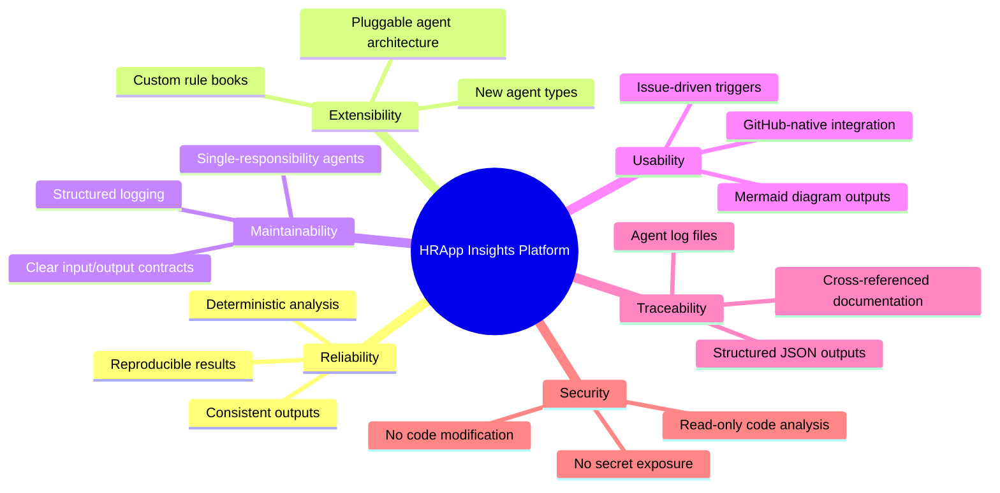

### 1.4 Stakeholders

| Stakeholder | Role | Interest |
|------------|------|----------|
| **HR Engineering Team** | Primary users of the platform | Code quality insights, architecture docs, technical debt reports |
| **HR Engineering Lead / Architect** | Architecture governance | Arc42 documentation, ADRs, architecture decisions |
| **HR Product Manager** | Business alignment | Executive summaries, feature insights, business process diagrams |
| **DevOps / Platform Team** | CI/CD and infrastructure | Deployment views, workflow configuration, infrastructure insights |
| **Security Team** | Risk management | Security vulnerability reports from code assessor |
| **New Developers / Onboarding** | Knowledge transfer | Code documentation, UML diagrams, codebase orientation |
| **GitHub Copilot (AI Agent)** | Automated executor | Issue assignment, agent orchestration, analysis execution |

---

## 2. Constraints

### 2.1 Technical Constraints

| ID | Constraint | Category | Rationale |
|----|-----------|----------|-----------|
| TC-01 | All agents are **read-only** — they never modify source code | Security | Prevents unintended code changes; analysis only |
| TC-02 | All diagrams must use **Mermaid format exclusively** — no PlantUML, no ASCII art | Compatibility | GitHub native Markdown rendering support |
| TC-03 | Agents operate **deterministically** — one file at a time, predictable order | Reliability | Ensures reproducible, auditable results |
| TC-04 | Agents do **not execute code** or run tests | Security | Prevents side effects; static analysis only |
| TC-05 | All outputs are written to `analysis_output/<agent-name>/` directories | Organisation | Consistent output structure across agents |
| TC-06 | All agent interactions must be logged to `analysis_output/agent-log.txt` | Traceability | Audit trail of all analysis activities |
| TC-07 | GitHub Actions workflow requires `copilot-needed` label to trigger | Governance | Prevents accidental triggering; controlled activation |
| TC-08 | Agents require an **input folder path** and **output folder path** | Operability | Explicit scope control for analysis |
| TC-09 | No agent installs dependencies, builds the project, or runs package managers | Security | Isolation from project build systems |
| TC-10 | Architecture diagrams may reference AWS, Azure, GCP or on-premises patterns | Flexibility | Cloud-agnostic platform support |

### 2.2 Organisational Constraints

| ID | Constraint | Rationale |
|----|-----------|-----------|
| OC-01 | Platform is embedded within the `gs_test` GitHub repository owned by **jasamson1** | Repository-bound scope |
| OC-02 | Agents are activated via GitHub Issues with the `copilot-needed` label | Governance and controlled activation |
| OC-03 | The `otto-de/assign_issue_toCopilot_action@v1.0.1` action is used for Copilot assignment | Third-party dependency on external GitHub Action |
| OC-04 | Output files are committed to the repository (not external systems) | No external data exfiltration |
| OC-05 | Analysis scope is limited to the repository it is embedded in | Bounded context |

### 2.3 Conventions

| Convention | Description |
|-----------|-------------|
| **Naming**: Agent files | `<agent-name>.agent.md` stored in `.github/agents/` |
| **Naming**: Output folders | `analysis_output/<agent-name>/` |
| **Naming**: Log format | `<ISO timestamp> \| <agent-name> \| created/updated \| <relative-path> \| <description>` |
| **Naming**: JSON outputs | `analysis_results.json`, `assessment_summary.json`, `<ClassName>_AST.json` |
| **Naming**: Markdown reports | `COMPREHENSIVE_ASSESSMENT_REPORT.md`, `ARC42_DOCUMENTATION.md`, `EXECUTIVE_SUMMARY.md` |
| **Diagram format** | All diagrams embedded as ` ```mermaid ` code blocks in Markdown |
| **JSON schema** | Strict, parsable JSON — valid for `json.loads()` in Python |
| **Complexity scale** | 0–10 for code complexity and logic complexity |
| **Issue criticality** | 1–5 scale (1 = trivial, 5 = blocker) |

---

## 3. Context and Scope

### 3.1 Business Context

The HRApp Insights Platform sits at the intersection of the HRApp codebase and the GitHub-hosted AI agent infrastructure. External actors interact with the system through GitHub's native issue and workflow mechanisms.

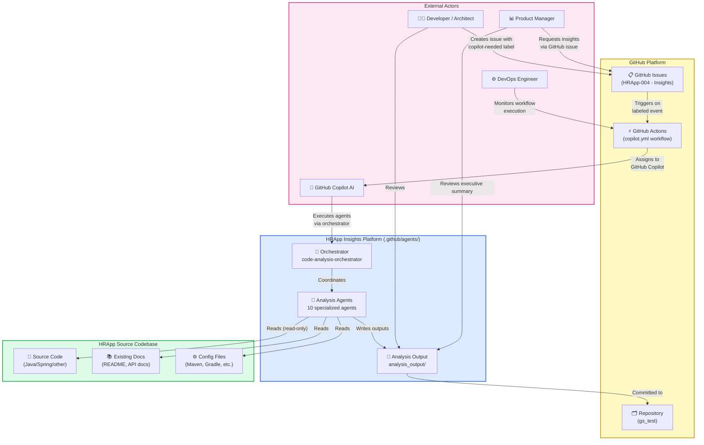

### 3.2 Technical Context

The technical context describes the communication paths and technology channels between the HRApp Insights Platform and its environment.

```mermaid
graph LR
    subgraph Trigger_Channel["Trigger Channel"]
        GH_WEBHOOK["GitHub Webhook\n(issues.labeled event)"]
        GH_ACTIONS["GitHub Actions Runner\n(ubuntu-latest)"]
        COPILOT_API["GitHub Copilot API\n(otto-de action v1.0.1)"]
    end

    subgraph Agent_Runtime["Agent Runtime (Copilot Workspace)"]
        ORCH_RT["Orchestrator\nRuntime"]
        AGENT_RT["Agent\nExecutors"]
        FILE_IO["File System\nI/O Layer"]
    end

    subgraph Storage_Channel["Storage / Output Channel"]
        FS_INPUT["Input: Source Files\n(read-only)"]
        FS_OUTPUT["Output: analysis_output/\n(write)"]
        FS_LOG["Log: agent-log.txt\n(append)"]
    end

    subgraph Rendering_Channel["Rendering Channel"]
        GH_MD["GitHub Markdown\nRenderer"]
        MERMAID["Mermaid.js\nDiagram Engine"]
    end

    GH_WEBHOOK -->|"HTTP event"| GH_ACTIONS
    GH_ACTIONS -->|"GITHUB_TOKEN"| COPILOT_API
    COPILOT_API -->|"Spawns workspace"| ORCH_RT
    ORCH_RT -->|"Calls sub-agents"| AGENT_RT
    AGENT_RT -->|"read/write"| FILE_IO
    FILE_IO -->|"read"| FS_INPUT
    FILE_IO -->|"write"| FS_OUTPUT
    FILE_IO -->|"append"| FS_LOG
    FS_OUTPUT -->|"Markdown files"| GH_MD
    GH_MD -->|"Renders"| MERMAID

    style Trigger_Channel fill:#fef3c7,stroke:#d97706
    style Agent_Runtime fill:#ede9fe,stroke:#7c3aed
    style Storage_Channel fill:#dcfce7,stroke:#15803d
    style Rendering_Channel fill:#dbeafe,stroke:#1d4ed8
```

### 3.3 External Interfaces

| Interface | Direction | Protocol/Format | Description |
|-----------|-----------|-----------------|-------------|
| GitHub Issues API | Inbound | GitHub webhook (JSON) | Triggers analysis on `labeled` event with `copilot-needed` |
| GitHub Actions | Inbound | YAML workflow | Executes `assign_issue_toCopilot_action` |
| GitHub Copilot API | Inbound | REST/Token | Receives issue assignment and workspace context |
| File System (Source) | Read | File I/O | Reads HRApp source code, config, and existing docs |
| File System (Output) | Write | File I/O (Markdown, JSON, SQL) | Writes analysis results to `analysis_output/` |
| GitHub Markdown Renderer | Outbound | Markdown + Mermaid | Renders documentation and diagrams for consumers |

---

## 4. Solution Strategy

### 4.1 Technology Decisions

The platform's technology choices are driven by the need for GitHub-native integration, AI-powered analysis, and zero-dependency execution.

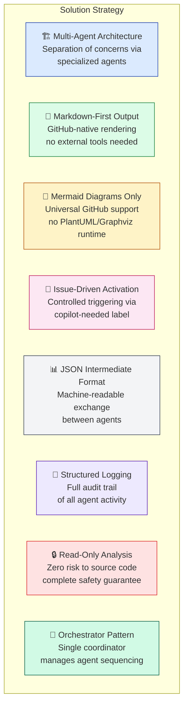

### 4.2 Top-Level Decomposition

The system decomposes into five logical layers:

| Layer | Components | Responsibility |
|-------|-----------|----------------|
| **Trigger Layer** | GitHub Issues, GitHub Actions, `copilot.yml` | Detect and initiate analysis requests |
| **Orchestration Layer** | `code-analysis-orchestrator`, `all-in-one-code-analyzer` | Coordinate agent execution order and dependencies |
| **Analysis Layer** | `code-documentor`, `ast-analyzer`, `code-assessor`, `documentation-analyzer` | Extract and evaluate code structure, quality, and documentation |
| **Synthesis Layer** | `uml-generator`, `bpmn-generator`, `ddl-generator`, `architecture-analyzer` | Generate diagrams, schemas, and architectural views |
| **Reporting Layer** | `executive-summary`, `arc42-documentor` | Synthesise all findings into consumable outputs |

### 4.3 Approaches to Achieve Quality Goals

| Quality Goal | Approach |
|-------------|----------|
| **Reliability** | Deterministic file-by-file processing; structured JSON contracts between agents |
| **Extensibility** | Agent plugin architecture — each agent is a self-contained `.agent.md` definition |
| **Maintainability** | Single Responsibility Principle per agent; dedicated output folders; clear interfaces |
| **Usability** | GitHub-native Markdown + Mermaid output; no external rendering tools required |
| **Traceability** | Centralised `agent-log.txt`; timestamped entries; structured output directories |
| **Security** | Explicit read-only policy; no code execution; no secrets in outputs |

---

## 5. Building Block View

### 5.1 Level 1: System Decomposition

The HRApp Insights Platform consists of five top-level subsystems:

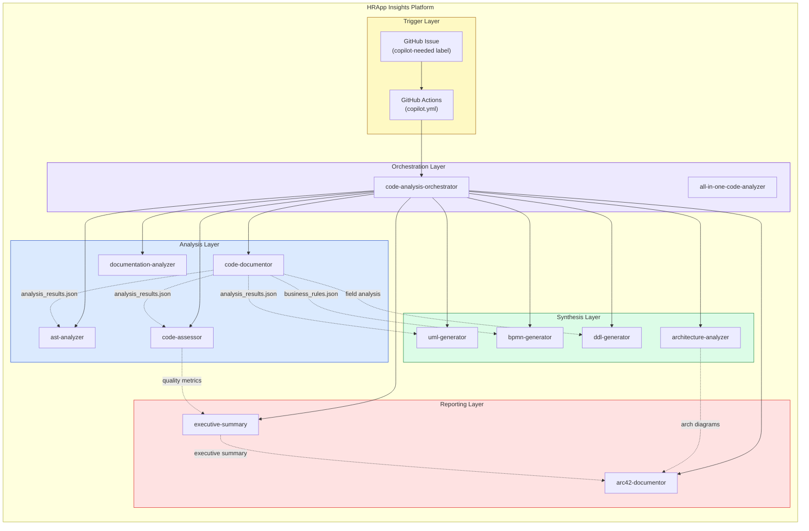

### 5.2 Level 2: Agent Definitions

Each agent in the platform is defined as a self-contained Markdown file with YAML front matter. The following table describes each agent's responsibilities:

```mermaid
classDiagram
    class BaseAgent {
        <<abstract>>
        +name: String
        +description: String
        +tools: List~String~
        +outputFolder: String
        +readInputs()
        +writeOutputs()
        +logActivity()
    }

    class CodeAnalysisOrchestrator {
        +tools: read, search, agent, todo
        +coordinateAgents()
        +planExecution()
        +handleErrors()
        +delegateFinalDocumentation()
    }

    class AllInOneCodeAnalyzer {
        +tools: read, search, edit, todo
        +runFullAnalysis()
        +runTargetedAnalysis()
        +generateAllOutputs()
    }

    class CodeDocumentor {
        +tools: read, search, edit, todo
        +extractBusinessRules()
        +generateAnalysisResultsJson()
        +documentMethods()
        +createApplicationOverview()
    }

    class AstAnalyzer {
        +tools: read, search, edit, todo
        +generateASTJson()
        +extractTypeDeclarations()
        +analyzeControlFlow()
        +captureImports()
    }

    class CodeAssessor {
        +tools: read, search, edit, todo
        +assessCodeComplexity()
        +identifyIssues()
        +documentTechnicalDebt()
        +generateEnhancements()
    }

    class UmlGenerator {
        +tools: read, search, edit, todo
        +generateClassDiagrams()
        +generateSequenceDiagrams()
        +generateUseCaseDiagrams()
    }

    class BpmnGenerator {
        +tools: read, search, edit, todo
        +generateWorkflowDiagrams()
        +mapCodeToProcess()
        +createSwimlanes()
    }

    class DdlGenerator {
        +tools: read, search, edit, todo
        +generateSqlDdl()
        +extractEntities()
        +defineConstraints()
        +generateErDiagram()
    }

    class ArchitectureAnalyzer {
        +tools: read, search, edit, todo
        +generateCloudDiagram()
        +generateComponentDiagram()
        +identifyArchitecturePatterns()
    }

    class DocumentationAnalyzer {
        +tools: read, search, edit, todo
        +analyzeDocumentQuality()
        +generateComparisonReport()
        +identifyGaps()
    }

    class ExecutiveSummary {
        +tools: read, search, edit, todo
        +synthesizeTechnicalFindings()
        +generateHealthScores()
        +prioritizeRecommendations()
    }

    class Arc42Documentor {
        +tools: read, search, edit, todo
        +generateArc42Documentation()
        +embedMermaidDiagrams()
        +synthesizeAllAgentOutputs()
    }

    BaseAgent <|-- CodeAnalysisOrchestrator
    BaseAgent <|-- AllInOneCodeAnalyzer
    BaseAgent <|-- CodeDocumentor
    BaseAgent <|-- AstAnalyzer
    BaseAgent <|-- CodeAssessor
    BaseAgent <|-- UmlGenerator
    BaseAgent <|-- BpmnGenerator
    BaseAgent <|-- DdlGenerator
    BaseAgent <|-- ArchitectureAnalyzer
    BaseAgent <|-- DocumentationAnalyzer
    BaseAgent <|-- ExecutiveSummary
    BaseAgent <|-- Arc42Documentor

    CodeAnalysisOrchestrator --> CodeDocumentor : coordinates
    CodeAnalysisOrchestrator --> AstAnalyzer : coordinates
    CodeAnalysisOrchestrator --> CodeAssessor : coordinates
    CodeAnalysisOrchestrator --> UmlGenerator : coordinates
    CodeAnalysisOrchestrator --> BpmnGenerator : coordinates
    CodeAnalysisOrchestrator --> DdlGenerator : coordinates
    CodeAnalysisOrchestrator --> ArchitectureAnalyzer : coordinates
    CodeAnalysisOrchestrator --> DocumentationAnalyzer : coordinates
    CodeAnalysisOrchestrator --> ExecutiveSummary : coordinates
    CodeAnalysisOrchestrator --> Arc42Documentor : delegates final synthesis

    CodeDocumentor ..> AstAnalyzer : feeds analysis_results.json
    CodeDocumentor ..> CodeAssessor : feeds analysis_results.json
    CodeDocumentor ..> UmlGenerator : feeds class structure
    CodeDocumentor ..> BpmnGenerator : feeds business rules
    CodeDocumentor ..> DdlGenerator : feeds field analysis
    AstAnalyzer ..> UmlGenerator : feeds AST structure
    AstAnalyzer ..> BpmnGenerator : feeds control flow
    ExecutiveSummary ..> Arc42Documentor : feeds strategic context
    ArchitectureAnalyzer ..> Arc42Documentor : feeds arch diagrams
```

### 5.3 Level 3: Data Flow Between Agents

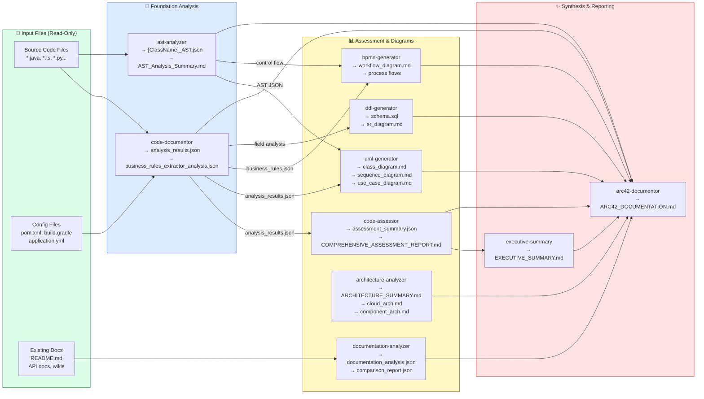

---

## 6. Runtime View

### 6.1 Standard Full Analysis — Orchestrator Activation Sequence

This sequence diagram shows the end-to-end flow when a developer creates a GitHub Issue with the `copilot-needed` label, triggering full code analysis.

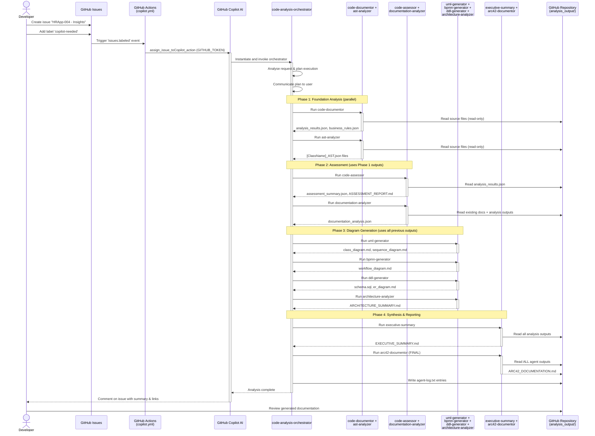

### 6.2 Agent Error Handling Flow

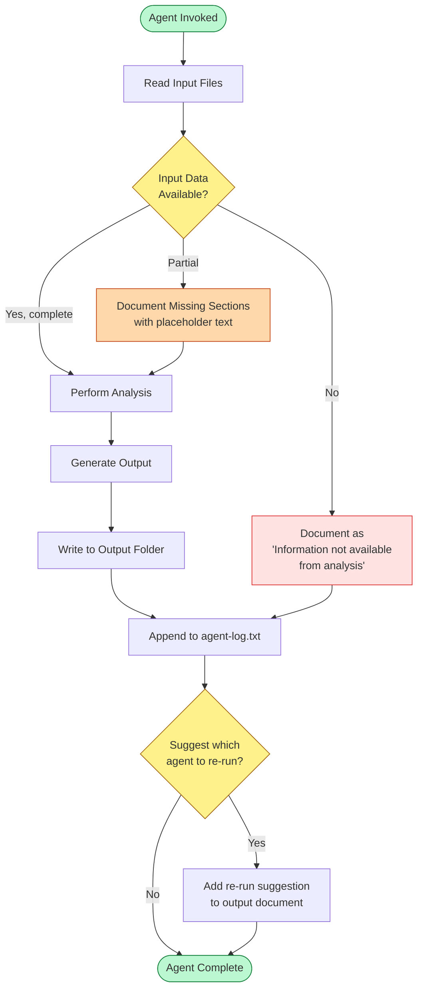

### 6.3 HRApp Issue-Driven Analysis Process (BPMN)

This diagram models the business process triggered by the HRApp-004 Insights issue.

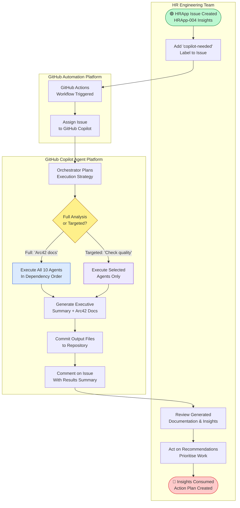

---

## 7. Deployment View

### 7.1 Deployment Topology

The HRApp Insights Platform is entirely cloud-hosted within GitHub's infrastructure. There is no additional on-premises deployment required.

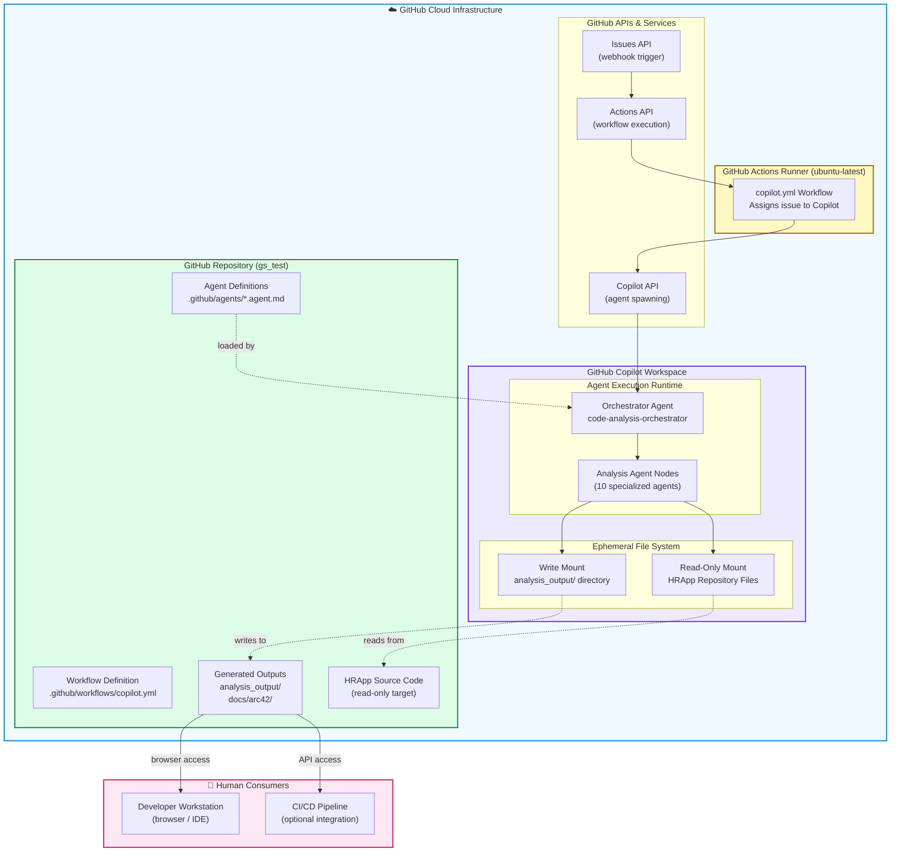

### 7.2 Infrastructure Requirements

| Component | Requirement | Provided By |
|-----------|------------|-------------|
| **Compute** | ubuntu-latest runner | GitHub Actions (managed) |
| **Storage** | Repository file system | GitHub Repository |
| **Secrets** | `GITHUB_TOKEN` (auto-provided) | GitHub Actions |
| **Network** | HTTPS to GitHub APIs | GitHub Actions runner |
| **AI Runtime** | GitHub Copilot workspace | GitHub Copilot subscription |
| **Rendering** | Mermaid.js in GitHub Markdown | GitHub.com (browser-side) |
| **Authentication** | GitHub token with repo write | GitHub Actions OIDC |

### 7.3 Deployment Configuration

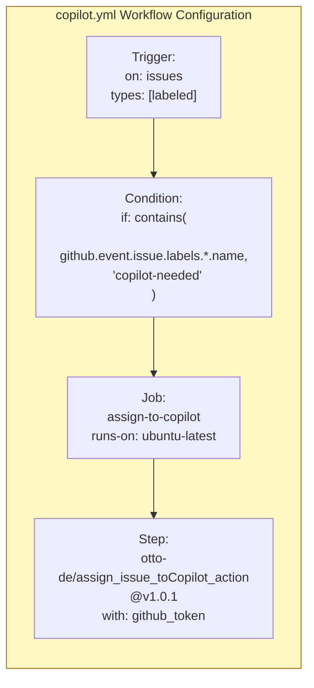

---

## 8. Crosscutting Concepts

### 8.1 Domain Model

The core domain model of the HRApp Insights Platform centres on the concepts of **Agents**, **Analyses**, **Outputs**, and **Triggers**.

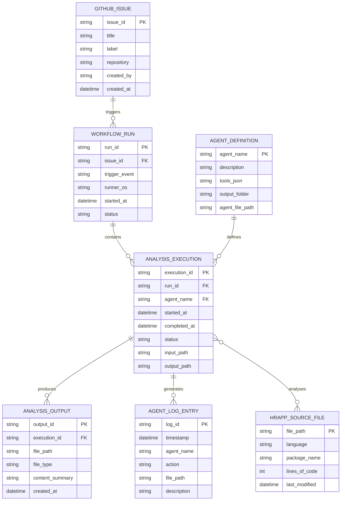

### 8.2 Design Patterns Used

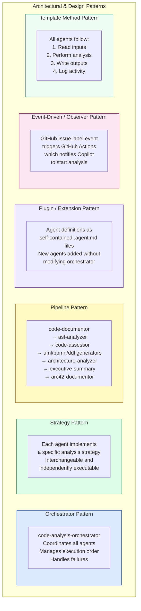

### 8.3 Business Rules Governing the Platform

| Rule ID | Rule | Enforcement |
|---------|------|-------------|
| BR-01 | An agent MUST NEVER modify source code files | Agent definition constraint |
| BR-02 | An agent MUST NEVER execute code or run tests | Agent definition constraint |
| BR-03 | All diagrams MUST use Mermaid format; PlantUML and ASCII art are prohibited | Agent definition constraint |
| BR-04 | All agents MUST write output to `analysis_output/<agent-name>/` | Output location convention |
| BR-05 | All agents MUST append a log entry to `analysis_output/agent-log.txt` | Logging convention |
| BR-06 | The orchestrator MUST call arc42-documentor as the final synthesis step | Execution order rule |
| BR-07 | code-documentor MUST run before code-assessor, uml-generator, bpmn-generator, ddl-generator | Dependency rule |
| BR-08 | executive-summary MUST run before arc42-documentor | Dependency rule |
| BR-09 | If input data is missing, agents MUST document the gap rather than fail silently | Error handling rule |
| BR-10 | GitHub Actions workflow MUST only trigger on `copilot-needed` label | Activation gate rule |
| BR-11 | All generated JSON MUST be valid and parsable by `json.loads()` | Data quality rule |
| BR-12 | The arc42-documentor output MUST be completely self-contained (no external file references) | Documentation rule |

### 8.4 Logging and Observability

All agents write structured log entries in a common format:

```
<ISO timestamp> | <agent-name> | created/updated | <relative-path> | <short description>
```

**Example entries:**
```
2025-01-30T10:15:00Z | code-documentor    | created | analysis_output/code-documentor/analysis_results.json          | Code analysis results for HRApp
2025-01-30T10:18:30Z | ast-analyzer       | created | analysis_output/ast-analyzer/EmployeeService_AST.json          | AST for EmployeeService class
2025-01-30T10:22:00Z | code-assessor      | created | analysis_output/code-assessor/COMPREHENSIVE_ASSESSMENT_REPORT.md | Quality assessment report
2025-01-30T10:35:00Z | arc42-documentor   | created | analysis_output/arc42-documentor/ARC42_DOCUMENTATION.md        | Complete Arc42 architecture doc
```

### 8.5 Output File Taxonomy

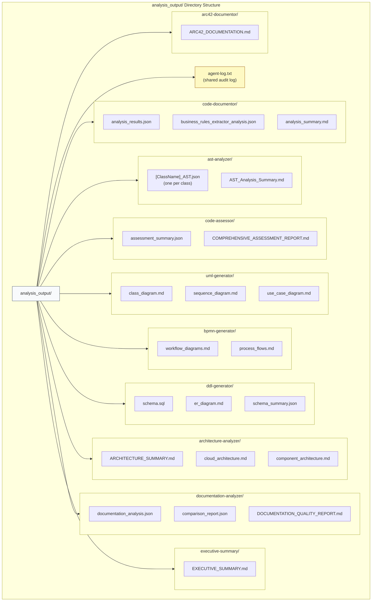

---

## 9. Architecture Decisions

### ADR-001: Multi-Agent Architecture over Monolithic Analysis

**Status**: Accepted  
**Date**: Project inception

**Context**: The platform needs to perform diverse types of analysis (code quality, UML generation, BPMN, DDL, documentation, architecture). These concerns are distinct and may evolve independently.

**Decision**: Implement each analysis capability as a separate, named agent with a well-defined input/output contract, coordinated by a central orchestrator.

**Consequences**:
- ✅ Each agent has a single responsibility and can be independently maintained
- ✅ New agent types (e.g., security scanner, dependency auditor) can be added without modifying existing agents
- ✅ Failed agents don't block successful ones (graceful degradation)
- ⚠️ Coordination overhead in the orchestrator
- ⚠️ Intermediate JSON files required for inter-agent communication

---

### ADR-002: Mermaid-Only Diagrams (No PlantUML, No ASCII Art)

**Status**: Accepted  
**Date**: Project inception

**Context**: Diagrams need to be rendered natively in GitHub Markdown without requiring external tooling, build steps, or server-side rendering.

**Decision**: All diagrams across all agents must use Mermaid syntax in ` ```mermaid ` code blocks. PlantUML and ASCII art are explicitly prohibited.

**Consequences**:
- ✅ Diagrams render natively in GitHub README, Issues, and PRs
- ✅ No Graphviz, PlantUML server, or build pipeline required
- ✅ Diagram source is readable and version-controlled as text
- ⚠️ Mermaid has limitations for very complex diagrams compared to PlantUML
- ⚠️ Some advanced UML notation may require workarounds

---

### ADR-003: Read-Only Code Analysis Policy

**Status**: Accepted  
**Date**: Project inception

**Context**: AI agents with write access to source code pose a significant risk of unintended modification to production codebases.

**Decision**: All agents are explicitly prohibited from modifying, editing, or changing source code files. They may only read source files and write to designated output directories.

**Consequences**:
- ✅ Zero risk of AI-induced code changes to the HRApp codebase
- ✅ Full safety for running analysis on production branches
- ✅ Clear separation between analysis and development activities
- ⚠️ Recommendations must be manually implemented by developers

---

### ADR-004: GitHub Issues as Trigger Mechanism with Label Gate

**Status**: Accepted  
**Date**: Project inception

**Context**: The analysis platform needs a controlled, auditable activation mechanism that is native to GitHub and accessible to non-technical stakeholders.

**Decision**: Analysis is triggered by creating a GitHub Issue and applying the `copilot-needed` label. The `copilot.yml` workflow uses this label as a gate.

**Consequences**:
- ✅ GitHub-native — no external tooling required
- ✅ Controlled activation via label requirement prevents accidental triggering
- ✅ Issue provides natural place for scoping the analysis request
- ✅ Full audit trail in GitHub Issues history
- ⚠️ Requires the `copilot-needed` label to be created in the repository
- ⚠️ Depends on `otto-de/assign_issue_toCopilot_action` third-party action

---

### ADR-005: JSON as Inter-Agent Communication Format

**Status**: Accepted  
**Date**: Project inception

**Context**: Agents are executed sequentially and need to share structured data without direct in-memory communication.

**Decision**: Use structured JSON files as the primary inter-agent communication format. All JSON must be valid and parsable by Python's `json.loads()`.

**Consequences**:
- ✅ Language-agnostic data exchange format
- ✅ Human-readable and debuggable
- ✅ Can be version-controlled alongside outputs
- ⚠️ File I/O overhead for large codebases
- ⚠️ Schema validation is not enforced at runtime (relies on agent discipline)

---

### ADR-006: arc42-Documentor as Final Synthesis Agent

**Status**: Accepted  
**Date**: Project inception

**Context**: The Arc42 documentation needs to synthesise outputs from all other agents into a single, coherent, self-contained document.

**Decision**: `arc42-documentor` is always the last agent to run, consuming all previous outputs and producing a single self-contained `ARC42_DOCUMENTATION.md` with embedded Mermaid diagrams.

**Consequences**:
- ✅ Single point of truth for architecture documentation
- ✅ Self-contained — no external file references
- ✅ Consumers need only one file
- ⚠️ Must wait for all upstream agents to complete
- ⚠️ Large context window required to synthesise all inputs

---

### ADR-007: `otto-de/assign_issue_toCopilot_action` for Copilot Assignment

**Status**: Accepted  
**Date**: Project inception

**Context**: GitHub Copilot issue assignment requires a specific API interaction pattern. Rather than implementing this custom, a community action was evaluated.

**Decision**: Use `otto-de/assign_issue_toCopilot_action@v1.0.1` from the GitHub Actions Marketplace.

**Consequences**:
- ✅ Proven implementation reduces development time
- ✅ Community-maintained action
- ⚠️ External dependency — pinned to `v1.0.1` which may become outdated
- ⚠️ Introduces supply-chain risk from third-party action
- **Mitigation**: Pin to specific commit SHA in production; review action source code

---

## 10. Quality Requirements

### 10.1 Quality Tree

```mermaid
graph TD
    Q["Quality Goals\nHRApp Insights Platform"]

    Q --> FUNC["Functional Suitability"]
    Q --> PERF["Performance Efficiency"]
    Q --> COMPAT["Compatibility"]
    Q --> USAB["Usability"]
    Q --> REL["Reliability"]
    Q --> SEC["Security"]
    Q --> MAINT["Maintainability"]
    Q --> PORT["Portability"]

    FUNC --> F1["F1: Complete code analysis\nacross all supported languages"]
    FUNC --> F2["F2: Accurate business rule\nextraction from code"]
    FUNC --> F3["F3: Valid, parsable JSON outputs\nfor all agents"]

    PERF --> P1["P1: Analysis completes within\nGitHub Actions timeout (6h)"]
    PERF --> P2["P2: Incremental processing\nfor large codebases"]

    COMPAT --> C1["C1: Mermaid diagrams render\nin GitHub Markdown"]
    COMPAT --> C2["C2: JSON outputs compatible\nwith Python json.loads()"]
    COMPAT --> C3["C3: Works with any programming\nlanguage in HRApp"]

    USAB --> U1["U1: Documentation is\nself-contained (one file)"]
    USAB --> U2["U2: GitHub issue activation\nrequires no CLI tools"]
    USAB --> U3["U3: Clear error messages and\ngap documentation"]

    REL --> R1["R1: Failed agent does not\nblock other agents"]
    REL --> R2["R2: Partial input data handled\ngracefully with documentation"]
    REL --> R3["R3: Deterministic output\nfor same input"]

    SEC --> S1["S1: No modification of\nsource code files"]
    SEC --> S2["S2: No secrets or credentials\nin output files"]
    SEC --> S3["S3: GITHUB_TOKEN used\nwith minimum required permissions"]

    MAINT --> M1["M1: New agents addable\nwithout orchestrator changes"]
    MAINT --> M2["M2: Agent definitions are\nhuman-readable Markdown"]
    MAINT --> M3["M3: Full audit log for\nall agent activities"]

    PORT --> PO1["PO1: Runs on any\nubuntu-latest runner"]
    PORT --> PO2["PO2: No local tooling\nrequired (Graphviz, PlantUML)"]

    style Q fill:#1e3a5f,color:#fff,stroke:#1e3a5f
    style FUNC fill:#1d4ed8,color:#fff
    style PERF fill:#15803d,color:#fff
    style COMPAT fill:#a16207,color:#fff
    style USAB fill:#be185d,color:#fff
    style REL fill:#6d28d9,color:#fff
    style SEC fill:#dc2626,color:#fff
    style MAINT fill:#065f46,color:#fff
    style PORT fill:#1e40af,color:#fff
```

### 10.2 Quality Scenarios

| ID | Quality Attribute | Stimulus | Response | Measure |
|----|------------------|---------|----------|---------|
| QS-01 | Reliability | code-documentor fails due to unparseable file | ast-analyzer and other agents continue independently | 0 blocked agents |
| QS-02 | Security | Agent attempts to write to source code path | Write is restricted to `analysis_output/` only | 0 source file modifications |
| QS-03 | Usability | Developer applies `copilot-needed` label | Full analysis completes and docs are committed | < 30 min end-to-end |
| QS-04 | Maintainability | New agent type needed (e.g., security scanner) | Add new `.agent.md` file to `.github/agents/` | 0 existing file modifications |
| QS-05 | Compatibility | Mermaid diagram contains syntax error | GitHub renders error message but doc is still usable | Other sections unaffected |
| QS-06 | Reliability | Input JSON is missing for an agent | Agent documents the gap with `[Information not available]` | Partial but useful output |
| QS-07 | Performance | HRApp codebase has 500+ source files | Agent processes files incrementally, not all at once | No timeout errors |
| QS-08 | Traceability | Audit needed for which agent created a file | Agent log entry exists with timestamp and path | 100% log coverage |

### 10.3 Technical Debt Summary (Platform Self-Assessment)

Based on analysis of the platform's own structure:

| Debt Item | Type | Impact | Estimated Fix |
|-----------|------|--------|---------------|
| Agent output schemas are not formally validated | Design Debt | Medium — JSON contract violations are silent | 4h — Add JSON Schema validation |
| `otto-de/assign_issue_toCopilot_action@v1.0.1` pinned to version not SHA | Infrastructure Debt | Medium — Supply chain risk if action is compromised | 1h — Pin to commit SHA |
| No automated testing of agent outputs | Test Debt | High — No way to verify output quality | 16h — Add output validation tests |
| README.md is minimal (2 lines) | Documentation Debt | High — HRApp-004 is this document's raison d'être | Resolved by this Arc42 doc |
| Agent definitions are long (400–500 lines) | Code Debt | Low — Complex but necessary | Future: Split into smaller spec files |
| No retry mechanism for failed agent runs | Design Debt | Medium — Single failure halts that agent | 4h — Add retry logic in orchestrator |
| All analysis uses latest analysis_results.json | Design Debt | Low — No versioning of intermediate outputs | Future: Version intermediate outputs |

---

## 11. Risks and Technical Debt

### 11.1 Identified Risks

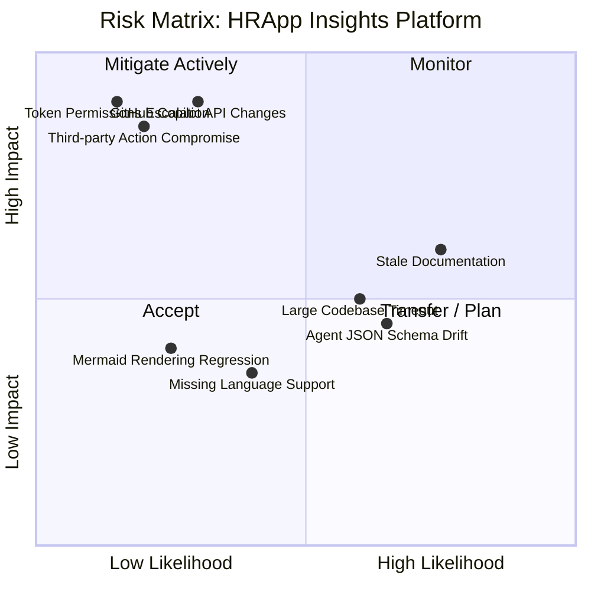

### 11.2 Risk Register

| ID | Risk | Likelihood | Impact | Mitigation |
|----|------|-----------|--------|------------|
| R-01 | **GitHub Copilot API breaking changes** — API changes invalidate agent definitions | Low | High | Monitor GitHub Copilot release notes; version-pin agent definitions |
| R-02 | **Third-party action supply chain attack** — `otto-de/assign_issue_toCopilot_action` is compromised | Low | High | Pin action to specific commit SHA; review action source code; consider forking |
| R-03 | **Excessive token permissions** — `GITHUB_TOKEN` has write access beyond `analysis_output/` | Low | High | Use minimum required token permissions; consider fine-grained PAT |
| R-04 | **GitHub Actions timeout on large codebases** — Analysis exceeds 6-hour limit | Medium | Medium | Implement incremental processing; checkpoint intermediate results; use targeted analysis |
| R-05 | **Stale documentation** — Generated Arc42 docs become outdated as HRApp evolves | High | Medium | Schedule periodic re-analysis; tie to PR review or sprint cycles |
| R-06 | **Agent JSON schema drift** — Agents evolve but JSON contracts are not updated | Medium | Medium | Define and enforce JSON schemas; add validation in orchestrator |
| R-07 | **Mermaid diagram complexity limits** — Complex HRApp diagrams exceed Mermaid capabilities | Medium | Low | Split into multiple focused diagrams; document Mermaid limitations |
| R-08 | **Missing language support** — HRApp uses a language not well-supported by agents | Medium | Low | Agents use language-agnostic analysis principles; document unsupported constructs |
| R-09 | **No test coverage for agent outputs** — Incorrect analysis goes undetected | High | Medium | Implement output validation tests; compare against known-good baselines |
| R-10 | **Information leakage in outputs** — Secrets or PII in HRApp code appear in analysis outputs | Low | High | Agents analyse structure/patterns only; add secret detection pre-commit hook |

### 11.3 Technical Debt Prioritisation

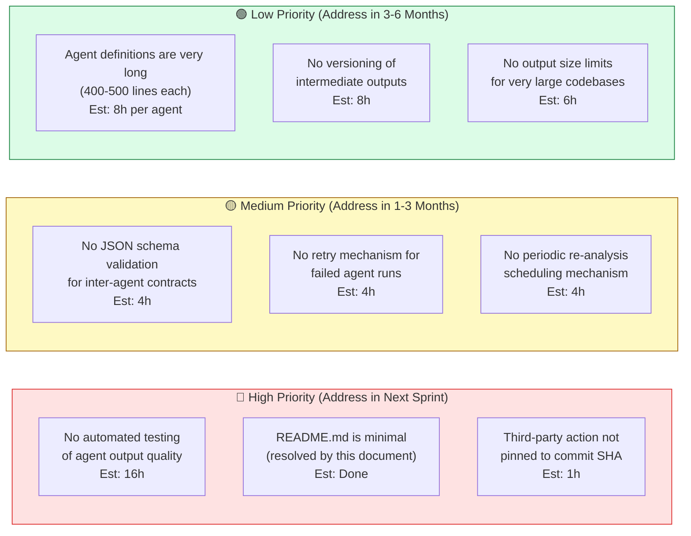

### 11.4 Mitigation Roadmap

| Phase | Timeline | Actions |
|-------|----------|---------|
| **Immediate** | Next Sprint | Pin `otto-de` action to commit SHA; add output validation smoke tests |
| **Short-term** | 1–3 months | Define JSON schemas for agent contracts; implement orchestrator retry logic; add periodic re-analysis scheduling via GitHub Actions schedule trigger |
| **Medium-term** | 3–6 months | Add secret/PII detection pre-analysis; split large agent definitions; implement incremental analysis checkpointing |
| **Long-term** | 6–12 months | Build a proper agent testing framework; version intermediate outputs; add multi-language test coverage |

---

## 12. Glossary

| Term | Definition |
|------|-----------|
| **Agent** | A specialised AI component defined as a `.agent.md` file in `.github/agents/`, with a specific analysis responsibility, tool access, and output contract |
| **Agent Log** | The centralised file `analysis_output/agent-log.txt` where all agents append structured log entries after creating or modifying files |
| **all-in-one-code-analyzer** | A comprehensive agent combining all specialised agent capabilities into a single workflow execution |
| **Analysis Output** | The directory `analysis_output/` containing all generated files from agent executions, organised by agent name |
| **Arc42** | A software architecture documentation framework with 12 standardised sections for describing and communicating software architectures |
| **arc42-documentor** | The final synthesis agent that generates comprehensive Arc42 architecture documentation from all other agent outputs |
| **architecture-analyzer** | An agent that generates cloud and component architecture diagrams using Mermaid format |
| **AST (Abstract Syntax Tree)** | A tree representation of the syntactic structure of source code, capturing classes, methods, statements, and dependencies |
| **ast-analyzer** | An agent that generates detailed JSON AST representations of source code files |
| **BPMN (Business Process Model and Notation)** | A standardised method to model business processes; in this platform, BPMN-style diagrams are generated as Mermaid flowcharts |
| **bpmn-generator** | An agent that creates Mermaid flowchart diagrams representing business workflows extracted from code |
| **code-analysis-orchestrator** | The master coordinator agent that plans and sequences execution of all specialised agents |
| **code-assessor** | An agent that evaluates code quality, identifies issues (severity 1–5), documents technical debt, and provides enhancement recommendations |
| **code-documentor** | The foundational agent that extracts business rules, documents code structure, and generates `analysis_results.json` |
| **copilot-needed** | The GitHub issue label that triggers the Copilot analysis workflow |
| **copilot.yml** | The GitHub Actions workflow file in `.github/workflows/` that listens for issue label events and assigns issues to GitHub Copilot |
| **DDL (Data Definition Language)** | SQL statements defining database schemas (CREATE TABLE, indexes, constraints) |
| **ddl-generator** | An agent that generates optimised SQL DDL from code analysis, including ER diagrams |
| **documentation-analyzer** | An agent that assesses existing documentation quality and compares documentation against actual code implementation |
| **executive-summary** | An agent that synthesises all technical analysis into executive-level insights, health scores, and strategic recommendations |
| **GitHub Copilot** | The AI assistant from GitHub that acts as the execution engine for the agent platform |
| **HRApp** | The Human Resources Application — the primary target codebase being analysed by the Insights Platform |
| **HRApp-004 — Insights** | The GitHub issue that triggered this analysis and documentation generation |
| **Mermaid** | An open-source diagramming and charting tool using Markdown-inspired syntax, natively supported in GitHub |
| **Orchestrator Pattern** | An architectural pattern where a central coordinator manages and sequences the execution of multiple components |
| **Read-Only Policy** | The absolute rule that all agents may only read source files and never modify them |
| **Technical Debt** | Suboptimal code or design decisions made for short-term convenience that cause long-term maintenance challenges |
| **uml-generator** | An agent that generates UML class diagrams, sequence diagrams, and use case diagrams in Mermaid format |

---

## Appendix A: Agent Inventory

| Agent Name | File | Tools | Primary Output |
|-----------|------|-------|----------------|
| `code-analysis-orchestrator` | `orchestrator.agent.md` | read, search, agent, todo | Execution coordination |
| `all-in-one-code-analyzer` | `all-in-one-agent.md` | read, search, edit, todo | All outputs |
| `code-documentor` | `code-documentor.agent.md` | read, search, edit, todo | `analysis_results.json` |
| `ast-analyzer` | `ast-analyzer.agent.md` | read, search, edit, todo | `[Class]_AST.json` |
| `code-assessor` | `code-assessor.agent.md` | read, search, edit, todo | `COMPREHENSIVE_ASSESSMENT_REPORT.md` |
| `uml-generator` | `uml-generator.agent.md` | read, search, edit, todo | `class_diagram.md`, `sequence_diagram.md` |
| `bpmn-generator` | `bpmn-generator.agent.md` | read, search, edit, todo | `workflow_diagram.md` |
| `ddl-generator` | `ddl-generator.agent.md` | read, search, edit, todo | `schema.sql`, `er_diagram.md` |
| `architecture-analyzer` | `architecture-analyzer.agent.md` | read, search, edit, todo | `ARCHITECTURE_SUMMARY.md` |
| `documentation-analyzer` | `documentation-analyzer.agent.md` | read, search, edit, todo | `DOCUMENTATION_QUALITY_REPORT.md` |
| `executive-summary` | `executive-summary.agent.md` | read, search, edit, todo | `EXECUTIVE_SUMMARY.md` |
| `arc42-documentor` | `arc42-documentor.agent.md` | read, search, edit, todo | `ARC42_DOCUMENTATION.md` |

## Appendix B: Documentation Quality Assessment

Based on analysis of the current `gs_test` repository:

| Dimension | Score | Notes |
|-----------|-------|-------|
| **Completeness** | 2/10 | README contains only 2 lines; no architecture, API, or setup documentation |
| **Clarity** | N/A | Insufficient content to assess |
| **Accuracy** | N/A | No content to verify |
| **Structure** | 1/10 | No structure present |
| **Accessibility** | 2/10 | `.github/agents/` contain detailed agent specs but no navigation |
| **Maintainability** | 3/10 | Agent definitions are detailed but README and user-facing docs are absent |

**Critical Gaps Identified:**
1. 🔴 No application overview or purpose description beyond "Copilot agent test repository"
2. 🔴 No setup or installation guide for the analysis platform
3. 🔴 No usage guide for triggering analysis via GitHub Issues
4. 🟠 No contribution guidelines
5. 🟠 No architecture overview (resolved by this Arc42 document)
6. 🟡 No FAQ or troubleshooting guide

**This Arc42 document addresses gap #5 above. The remaining gaps require additional documentation efforts.**

---

*Generated by arc42-documentor agent | HRApp-004 — Insights | 2025-01-30*  
*Repository: jasamson1/gs_test | Issue: HRApp-004*
