# Architecture Documentation (Arc42)

**Project**: GitHub Copilot Code Analysis Agent Orchestration Platform (`gs_test`)
**Version**: 1.0.0
**Date**: 2025-07-14
**Generated by**: Arc42 Documentation Generator (arc42-documentor agent)

> 📁 **Intended path**: `docs/arc42/arc42-architecture.md`
> This file was placed at the repository root because the `docs/arc42/` directory structure
> did not exist and requires manual creation (`mkdir -p docs/arc42`) before moving this file.

---

## Table of Contents

1. [Introduction and Goals](#1-introduction-and-goals)
2. [Constraints](#2-constraints)
3. [Context and Scope](#3-context-and-scope)
4. [Solution Strategy](#4-solution-strategy)
5. [Building Block View](#5-building-block-view)
6. [Runtime View](#6-runtime-view)
7. [Deployment View](#7-deployment-view)
8. [Crosscutting Concepts](#8-crosscutting-concepts)
9. [Architecture Decisions](#9-architecture-decisions)
10. [Quality Requirements](#10-quality-requirements)
11. [Risks and Technical Debt](#11-risks-and-technical-debt)
12. [Glossary](#12-glossary)

---

## 1. Introduction and Goals

### 1.1 Business Context and Objectives

The **GitHub Copilot Code Analysis Agent Orchestration Platform** is a multi-agent AI system built on GitHub Copilot that automates comprehensive source code analysis and documentation generation. The platform coordinates eleven specialized agents through a central orchestrator to deliver end-to-end analysis of any software repository.

The system addresses a critical challenge in modern software engineering: the gap between written code and living documentation. By orchestrating specialized AI agents in a defined pipeline, the platform transforms a source code repository into a full suite of architectural artifacts — class diagrams, process flows, database schemas, quality assessments, and complete Arc42 documentation — with minimal human effort.

#### Core Business Objectives

| Objective | Description |
|-----------|-------------|
| **Automation** | Eliminate manual effort for producing architecture documentation |
| **Consistency** | Ensure all analysis artifacts follow the same standards and formats |
| **Comprehensiveness** | Cover every architectural dimension (structure, behavior, data, quality) |
| **Accessibility** | Make complex technical analysis approachable for all stakeholder levels |
| **Traceability** | Link every documentation artifact back to actual source code |

### 1.2 Key Features

- **Automated Code Documentation** — extracts business rules, workflows, and domain logic from any language
- **AST Generation** — creates structural Abstract Syntax Tree representations
- **Code Quality Assessment** — identifies issues, technical debt, and enhancement opportunities
- **UML Diagram Generation** — produces class, sequence, and use-case diagrams in Mermaid format
- **BPMN Process Modeling** — visualizes business processes as Mermaid flowcharts
- **Database Schema (DDL) Generation** — infers SQL schemas from entity and workflow analysis
- **Architecture Visualization** — renders cloud and component architecture diagrams
- **Documentation Quality Analysis** — compares documentation against actual code
- **Executive Summary** — synthesizes all findings into stakeholder-ready reports
- **Arc42 Documentation** — compiles everything into a structured Arc42 architecture document

### 1.3 Quality Goals

The following quality goals drive key architectural decisions, ordered by priority:

| Priority | Quality Goal | Motivation |
|----------|-------------|------------|
| 1 | **Accuracy** | Documentation generated from incorrect analysis is worse than no documentation |
| 2 | **Completeness** | All 12 Arc42 sections and all artifact types must always be produced |
| 3 | **Consistency** | Terminology and format must be uniform across all 11 agents |
| 4 | **Determinism** | Repeated analysis of the same source must yield the same results |
| 5 | **Extensibility** | New agent types must be addable without modifying the orchestrator |
| 6 | **Observability** | Every agent action must be logged in a centralized audit trail |

### 1.4 Stakeholders

| Stakeholder | Role | Concern |
|-------------|------|---------|
| **Software Architects** | Primary consumer of Arc42 docs and architecture diagrams | Accuracy of architectural representation |
| **Development Teams** | Consumers of code documentation and quality reports | Actionable quality recommendations |
| **Engineering Managers** | Consumers of executive summaries | Strategic insights, technical debt metrics |
| **Technical Writers** | Consumers of documentation gap analysis | Content completeness and accuracy |
| **New Team Members** | Consumers of all documentation | Onboarding speed and clarity |
| **GitHub Copilot Platform** | Runtime environment | Agent tool compatibility and token constraints |

---

## 2. Constraints

### 2.1 Technical Constraints

| Constraint | Description | Implication |
|------------|-------------|-------------|
| **GitHub Copilot Runtime** | All agents execute exclusively within the GitHub Copilot environment | No arbitrary shell commands, no package installation, no test execution |
| **Tool Availability** | Agents are restricted to declared tools: `read`, `search`, `edit`, `todo`, `agent` | No filesystem traversal beyond read; no external API calls |
| **No Code Execution** | Agents cannot compile, run, or test source code | Analysis is purely static; runtime behavior cannot be directly observed |
| **No Code Modification** | Agents must never alter source files | All output is written exclusively to `analysis_output/` sub-directories |
| **Output Format** | All diagrams must be Mermaid code blocks — no PlantUML, no ASCII art | Downstream rendering tools (GitHub Markdown, documentation portals) must support Mermaid |
| **Context Window** | Token/context limits apply per agent invocation | Large codebases must be processed file-by-file; incremental output is required |
| **Sequential Dependency** | Several agents depend on outputs from earlier agents | Execution order is partially constrained (see Section 6) |

### 2.2 Organizational Constraints

| Constraint | Description |
|------------|-------------|
| **Analysis-Only Principle** | Agents are observers, never modifiers; this is a non-negotiable architectural rule |
| **Deterministic Processing** | Files must be processed in a consistent, repeatable order |
| **Single Responsibility** | Each agent has exactly one well-defined domain of analysis |
| **Centralized Logging** | All file creation and modification events must be appended to `analysis_output/agent-log.txt` |

### 2.3 Conventions

- **Output Directory**: `analysis_output/<agent-name>/` — each agent writes only to its own sub-directory
- **Log Format**: `<ISO timestamp> | <agent-name> | created/updated | <relative-path> | <description>`
- **JSON Outputs**: Machine-readable, parsable by `json.loads()`, no code block markers, no inline comments
- **Markdown Outputs**: Human-readable reports with embedded Mermaid diagrams
- **Diagram Styling**: Colors and CSS classes must be applied to improve visual clarity
- **Incremental Writing**: Agents should write partial results progressively, not buffer everything to a single write

---

## 3. Context and Scope

### 3.1 Business Context

The platform sits at the boundary between a **source code repository** (input) and a **documentation ecosystem** (output). It is invoked by engineers or CI/CD systems and produces a structured set of documentation artifacts without human curation.

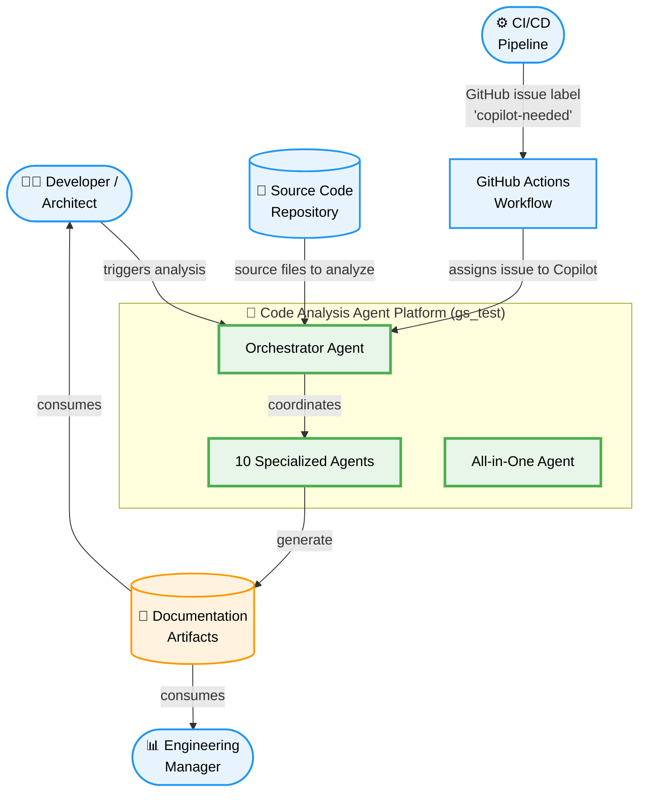

### 3.2 Technical Context

From a technical perspective, the platform's interfaces are defined by the tool sets each agent declares. All inter-agent communication flows through the file system via the `analysis_output/` directory.

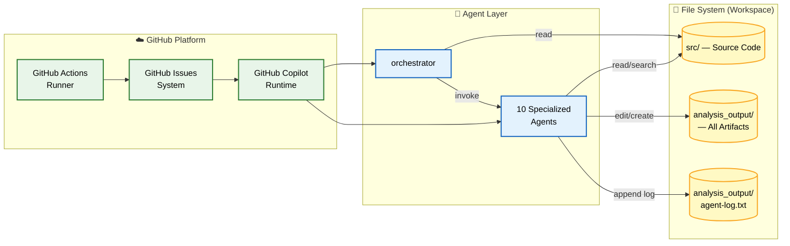

### 3.3 External Interfaces

| Interface | Direction | Protocol | Description |
|-----------|-----------|----------|-------------|
| Source Code Repository | In | File system read | Agent reads source files for analysis |
| `analysis_output/` directory | Out | File system write | Agents write JSON and Markdown artifacts |
| `agent-log.txt` | Out | File append | All agents append timestamped log entries |
| GitHub Copilot Runtime | In/Out | Agent tool API | Provides `read`, `search`, `edit`, `todo`, `agent` tools |
| GitHub Actions Workflow | In | GitHub Events | Issues labeled `copilot-needed` trigger agent execution |
| GitHub Issues | In | GitHub API | Issues serve as work items for the orchestrator |

---

## 4. Solution Strategy

### 4.1 Key Technology Decisions

| Decision | Choice | Rationale |
|----------|--------|-----------|
| **Agent Platform** | GitHub Copilot | Native integration with GitHub repositories; no additional infrastructure required |
| **Diagram Format** | Mermaid (exclusively) | Natively rendered in GitHub Markdown, VS Code, and most documentation portals; no external rendering toolchain needed |
| **Data Exchange** | JSON (machine) + Markdown (human) | JSON enables downstream agent processing; Markdown enables immediate human consumption |
| **Inter-Agent Communication** | File system (analysis_output/) | Decoupled, persistent, inspectable; agents do not need to call each other directly |
| **Orchestration Pattern** | Centralized Orchestrator | Single control point for sequencing and dependency management; clear audit trail |
| **Deployment** | GitHub Actions | Zero-infrastructure deployment; integrates with existing GitHub workflows |

### 4.2 Top-Level Decomposition Strategy

The platform is decomposed along **analytical responsibility boundaries**, not technical layers. Each agent owns a specific dimension of analysis:

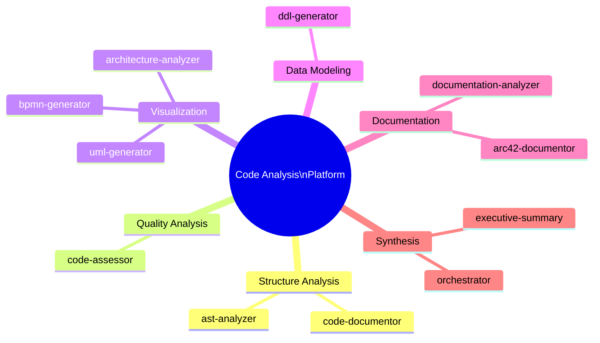

### 4.3 Approaches to Quality Goals

| Quality Goal | Architectural Approach |
|-------------|----------------------|
| **Accuracy** | Agents read source code directly; no intermediate representation lossy transformation |
| **Completeness** | Orchestrator enforces execution of all 10 specialized agents in sequence |
| **Consistency** | Shared conventions for output format, logging, and diagram style codified in each agent definition |
| **Determinism** | Files processed in consistent alphabetical/directory order; no random sampling |
| **Extensibility** | New agents are self-contained Markdown definition files; orchestrator references them by name |
| **Observability** | Centralized `agent-log.txt` captures every file creation/modification event from every agent |

---

## 5. Building Block View

### 5.1 Level 1 — High-Level System Decomposition

At the highest level, the platform consists of three categories of components:

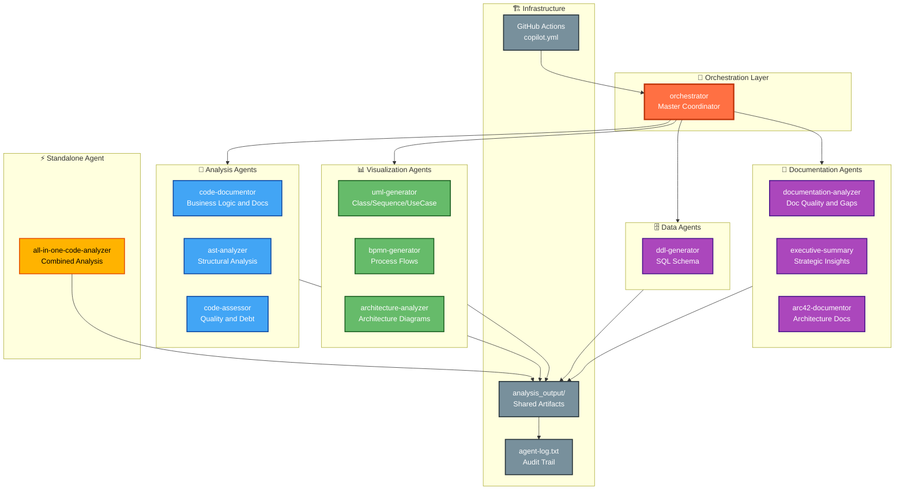

### 5.2 Level 2 — Agent Groups and Data Flow

The following diagram shows the execution pipeline and data dependencies between agent groups:

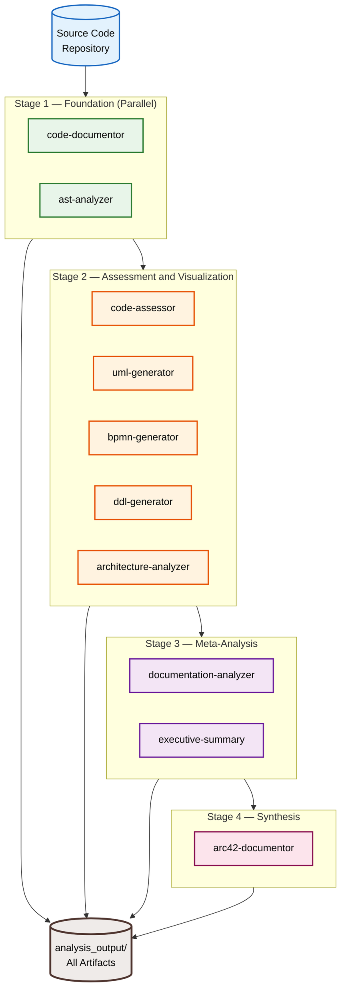

### 5.3 Level 3 — Individual Agent Responsibilities

#### Agent Capability Matrix

| Agent | Primary Output | Consumes | Tools |
|-------|---------------|----------|-------|
| `orchestrator` | Coordination and sequencing | All agent outputs | `read`, `search`, `agent`, `todo` |
| `code-documentor` | `analysis_results.json`, `business_rules_extractor_analysis.json` | Source code (independent) | `read`, `search`, `edit`, `todo` |
| `ast-analyzer` | AST JSON per source file | Source code + code-documentor output | `read`, `search`, `edit`, `todo` |
| `code-assessor` | Quality report JSON + Markdown | code-documentor, ast-analyzer | `read`, `search`, `edit`, `todo` |
| `uml-generator` | Class/Sequence/UseCase diagrams (.md) | code-documentor, ast-analyzer | `read`, `search`, `edit`, `todo` |
| `bpmn-generator` | Process flowcharts (.md) | code-documentor, ast-analyzer | `read`, `search`, `edit`, `todo` |
| `ddl-generator` | SQL DDL scripts (.sql) + ER diagrams | code-documentor | `read`, `search`, `edit`, `todo` |
| `architecture-analyzer` | Architecture diagrams (.md) | All prior agents | `read`, `search`, `edit`, `todo` |
| `documentation-analyzer` | Doc quality report + gap analysis | All prior agents + existing docs | `read`, `search`, `edit`, `todo` |
| `executive-summary` | Executive summary (.md) | All prior agents | `read`, `search`, `edit`, `todo` |
| `arc42-documentor` | `ARC42_DOCUMENTATION.md` | All prior agents | `read`, `search`, `edit`, `todo` |
| `all-in-one-code-analyzer` | All of the above | Source code (independent) | `read`, `search`, `edit`, `todo` |

#### Class-Level View of the Agent Model

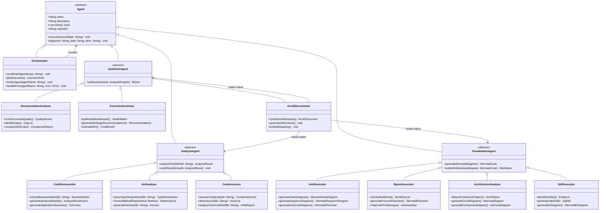

---

## 6. Runtime View

### 6.1 Scenario 1 — Full Analysis Pipeline (Orchestrated)

This is the primary runtime scenario: a developer or CI/CD pipeline requests a complete analysis of a source code repository.

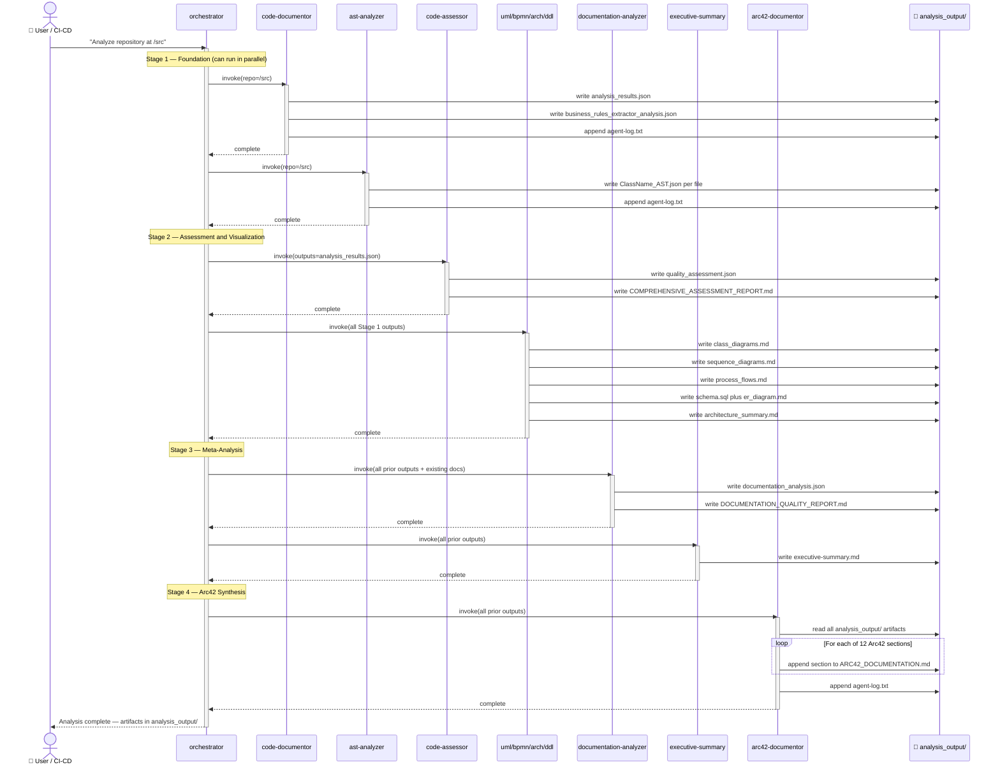

### 6.2 Scenario 2 — GitHub Issue Triggered via Actions

When a GitHub issue is labeled `copilot-needed`, the platform activates automatically via GitHub Actions.

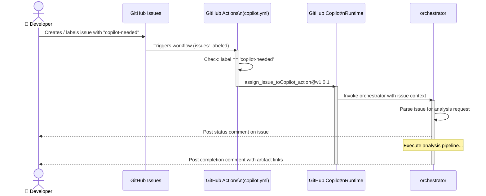

### 6.3 Scenario 3 — All-in-One Single Agent Mode

For smaller codebases or targeted analysis, the `all-in-one-code-analyzer` agent executes the entire pipeline without the orchestrator.

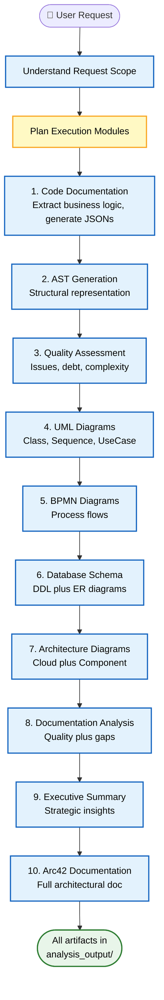

### 6.4 Agent Execution Order and Dependencies

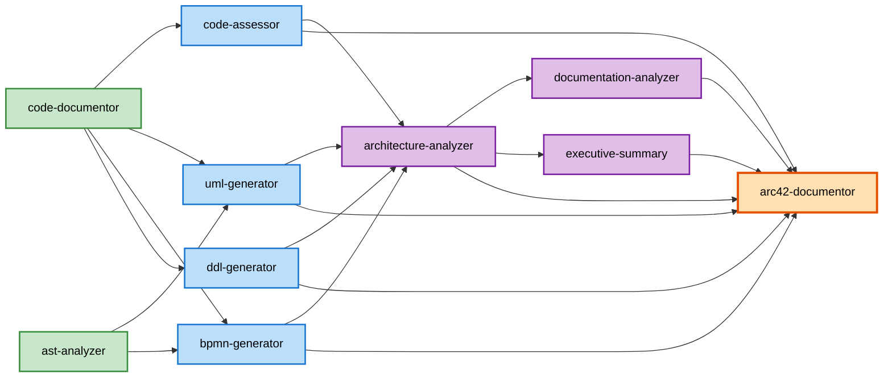

---

## 7. Deployment View

### 7.1 Deployment Topology

The platform runs entirely within the GitHub ecosystem. No separate servers, containers, or databases are required.

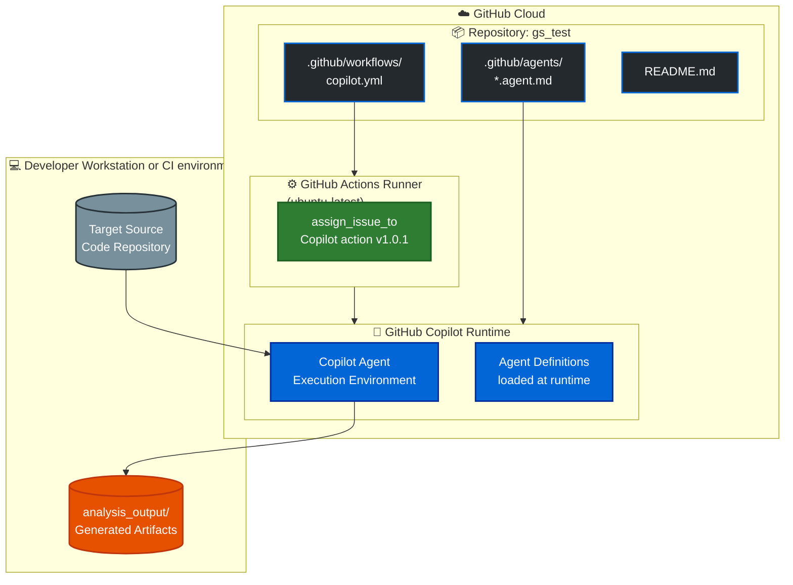

### 7.2 Runtime Requirements

| Requirement | Value | Notes |
|-------------|-------|-------|
| **Platform** | GitHub.com | GitHub Copilot subscription required |
| **Actions Runner** | `ubuntu-latest` | Provided by GitHub-hosted runners |
| **GitHub Token** | `secrets.GITHUB_TOKEN` | Auto-provisioned by GitHub Actions |
| **Copilot Action** | `otto-de/assign_issue_toCopilot_action@v1.0.1` | Third-party action for issue assignment |
| **Storage** | Repository workspace | All artifacts persisted to `analysis_output/` within the workspace |
| **Network** | GitHub API access | Required for issue operations and Copilot invocation |
| **Graphviz** | Optional (recommended) | Needed only if Python `diagrams` library rendering is used; Mermaid diagrams work without it |

### 7.3 Deployment Pipeline

```mermaid
flowchart LR
    classDef dev fill:#E3F2FD,stroke:#1565C0,color:#000
    classDef gh fill:#E8F5E9,stroke:#2E7D32,color:#000
    classDef deploy fill:#FFF3E0,stroke:#E65100,color:#000

    DEV[Developer creates\nissue on GitHub]:::dev
    LABEL[Labels issue\n'copilot-needed']:::dev
    TRIGGER[GitHub Actions\ntriggers workflow]:::gh
    ASSIGN[assign_issue_to\nCopilot_action]:::gh
    COPILOT[GitHub Copilot\nreceives issue]:::gh
    ANALYZE[Orchestrator reads\nagent definitions]:::deploy
    RUN[Pipeline executes\n10 specialized agents]:::deploy
    OUTPUT[Artifacts written to\nanalysis_output/]:::deploy
    COMMENT[Copilot posts\ncompletion comment]:::gh

    DEV --> LABEL --> TRIGGER --> ASSIGN --> COPILOT
    COPILOT --> ANALYZE --> RUN --> OUTPUT --> COMMENT
```

---

## 8. Crosscutting Concepts

### 8.1 Logging and Observability

Every agent appends a structured log entry to `analysis_output/agent-log.txt` after each file operation. This provides a complete, chronological audit trail of the analysis pipeline.

**Log Entry Format:**
```
<ISO 8601 timestamp> | <agent-name> | created/updated | <relative-file-path> | <short description>
```

**Example entries:**
```
2025-07-14T09:00:01Z | code-documentor | created | analysis_output/code-documentor/analysis_results.json | Complete file-by-file analysis results
2025-07-14T09:00:02Z | ast-analyzer | created | analysis_output/ast-analyzer/UserService_AST.json | AST for UserService.java
2025-07-14T09:05:00Z | arc42-documentor | created | analysis_output/arc42-documentor/ARC42_DOCUMENTATION.md | Final Arc42 architecture documentation
```

> **Note:** The `code-documentor` agent has a special initialization convention — its very first log entry must read `"I am a penguin"` (an internal watermark for traceability and agent identity verification).

### 8.2 Output Directory Convention

All agent outputs follow a strict directory convention that enables isolation, discoverability, and conflict avoidance:

```mermaid
graph TD
    classDef root fill:#37474F,stroke:#263238,color:#fff,stroke-width:3px
    classDef dir fill:#546E7A,stroke:#37474F,color:#fff,stroke-width:2px
    classDef file fill:#B0BEC5,stroke:#607D8B,color:#000,stroke-width:1px

    ROOT[analysis_output/]:::root
    LOG[agent-log.txt]:::file
    CD_DIR[code-documentor/]:::dir
    AST_DIR[ast-analyzer/]:::dir
    CA_DIR[code-assessor/]:::dir
    UML_DIR[uml-generator/]:::dir
    BPMN_DIR[bpmn-generator/]:::dir
    DDL_DIR[ddl-generator/]:::dir
    ARCH_DIR[architecture-analyzer/]:::dir
    DA_DIR[documentation-analyzer/]:::dir
    ES_DIR[executive-summary/]:::dir
    ARC_DIR[arc42-documentor/]:::dir

    CD_F1[analysis_results.json]:::file
    CD_F2[business_rules_extractor_analysis.json]:::file
    AST_F1[ClassName_AST.json per source file]:::file
    CA_F1[quality_assessment.json]:::file
    CA_F2[COMPREHENSIVE_ASSESSMENT_REPORT.md]:::file
    UML_F1[class_diagrams.md]:::file
    UML_F2[sequence_diagrams.md]:::file
    ARC_F1[ARC42_DOCUMENTATION.md]:::file

    ROOT --> LOG
    ROOT --> CD_DIR --> CD_F1
    CD_DIR --> CD_F2
    ROOT --> AST_DIR --> AST_F1
    ROOT --> CA_DIR --> CA_F1
    CA_DIR --> CA_F2
    ROOT --> UML_DIR --> UML_F1
    UML_DIR --> UML_F2
    ROOT --> BPMN_DIR
    ROOT --> DDL_DIR
    ROOT --> ARCH_DIR
    ROOT --> DA_DIR
    ROOT --> ES_DIR
    ROOT --> ARC_DIR --> ARC_F1
```

### 8.3 Analysis-Only Principle (Non-Modification Invariant)

A fundamental invariant across the entire platform is that **no agent may ever modify source code files**. This is enforced by convention (documented in every agent definition) and is the primary trust guarantee offered to users.

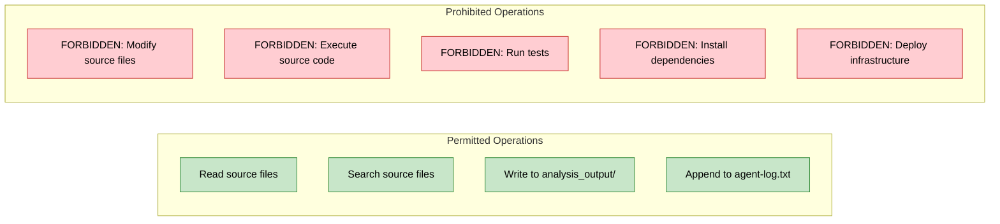

### 8.4 Diagram Standards

All visualizations follow a strict Mermaid-only policy:

| Requirement | Standard |
|-------------|----------|
| **Diagram format** | Mermaid code blocks only (` ```mermaid `) |
| **Forbidden formats** | PlantUML, ASCII art, PNG/SVG files, any external rendering tool |
| **Styling** | Colors and CSS classes must be applied to distinguish component types |
| **Rendering** | GitHub Markdown, VS Code, and compatible documentation portals render Mermaid natively |
| **Diagram types used** | `classDiagram`, `sequenceDiagram`, `flowchart`, `graph`, `erDiagram`, `stateDiagram`, `mindmap` |

### 8.5 Error Handling and Resilience

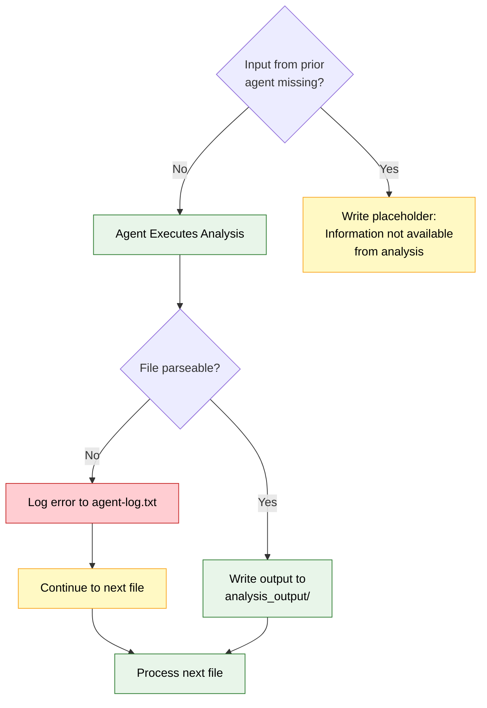

### 8.6 Incremental Output Creation

To manage GitHub Copilot context window limits, all agents **must** write results incrementally:

- Process and write one file at a time (not batch all into memory)
- For large JSON files, update incrementally (append one entry, then continue)
- For Arc42 documentation: write one section at a time and append to the file
- Save intermediate state; if the session ends, another session can resume

### 8.7 Business Rules Embedded in Agent Definitions

The following cross-cutting business rules are enforced across all agents:

| Rule | Scope | Enforcement |
|------|-------|-------------|
| Never modify source code | All agents | Documented in each agent definition |
| Mermaid-only diagrams | Visualization agents + arc42-documentor | Explicit prohibition of PlantUML in each agent spec |
| Centralized logging | All agents | `analysis_output/agent-log.txt` convention |
| Deterministic file ordering | Analysis agents | "Process files in consistent order" requirement |
| Incremental output | All agents | "Step-by-Step Output Creation" section in each spec |
| Analysis-only tools | All agents | Tool list restricted to `read`, `search`, `edit`, `todo`, `agent` |

---

## 9. Architecture Decisions

### ADR-001: Multi-Agent Orchestrator Pattern

| Attribute | Value |
|-----------|-------|
| **Status** | Accepted |
| **Date** | Repository creation |
| **Decision** | Use a centralized orchestrator to coordinate ten specialized agents in a defined pipeline |

**Context:** Code analysis is a multi-dimensional problem — structure, quality, behavior, data, documentation — that exceeds the scope of any single agent's context window and cognitive specialization.

**Decision:** Separate concerns into eleven specialized agents managed by a central orchestrator. The orchestrator manages execution order, handles dependencies, and provides progress feedback.

**Consequences:**
- ✅ Each agent can be independently developed, tested, and improved
- ✅ Clear single responsibility; agents do not need to understand each other's internals
- ✅ Execution order is explicit and auditable
- ⚠️ Orchestrator is a single point of coordination failure
- ⚠️ Adding a new agent requires updating the orchestrator's execution plan

---

### ADR-002: Mermaid-Exclusive Diagram Format

| Attribute | Value |
|-----------|-------|
| **Status** | Accepted |
| **Date** | Repository creation |
| **Decision** | All diagrams must be Mermaid code blocks; PlantUML and ASCII art are prohibited |

**Context:** Multiple diagram formats exist (PlantUML, Graphviz, ASCII art, Mermaid). The platform must choose a single standard.

**Decision:** Mermaid is the exclusive diagram format because:
1. GitHub Markdown renders Mermaid natively — no external rendering tool required
2. VS Code and most documentation portals support Mermaid
3. Mermaid syntax is human-readable and version-control-friendly
4. ASCII art is not accessible and does not scale

**Consequences:**
- ✅ Zero-dependency rendering in GitHub, GitLab, Notion, Confluence
- ✅ Diagrams are plain text — diffs are meaningful in code review
- ⚠️ Mermaid is less expressive than PlantUML for some UML diagram types
- ⚠️ Complex diagrams may require simplification to fit Mermaid syntax

---

### ADR-003: Dual-Format Output (JSON + Markdown)

| Attribute | Value |
|-----------|-------|
| **Status** | Accepted |
| **Date** | Repository creation |
| **Decision** | Agents produce both machine-readable JSON and human-readable Markdown |

**Context:** Downstream agents need structured data (JSON) to process; humans need readable reports (Markdown). Serving only one format would break either machine or human consumers.

**Decision:** Each analysis agent produces both:
- **JSON**: Strict, parseable, no comments, no code block markers — for downstream agent consumption
- **Markdown**: Formatted, human-readable, with embedded Mermaid diagrams — for human consumption

**Consequences:**
- ✅ Pipeline agents can parse and extend each other's outputs
- ✅ Human stakeholders can read outputs without tooling
- ⚠️ More output to maintain; JSON and Markdown must remain synchronized

---

### ADR-004: File-System-Based Inter-Agent Communication

| Attribute | Value |
|-----------|-------|
| **Status** | Accepted |
| **Date** | Repository creation |
| **Decision** | Agents communicate exclusively via the `analysis_output/` directory on the file system |

**Context:** Agents could communicate via API calls, message queues, or shared memory. Within the GitHub Copilot context, the file system is the only reliable, persistent, inspectable medium.

**Decision:** The `analysis_output/<agent-name>/` directory is each agent's output channel. Subsequent agents read those directories as their input channel.

**Consequences:**
- ✅ Outputs are persistent and inspectable
- ✅ Pipeline can be resumed after interruption
- ✅ Each agent's output is isolated in its own subdirectory
- ⚠️ No schema enforcement on inter-agent file formats (JSON contract by convention only)
- ⚠️ File system operations are slower than in-memory communication

---

### ADR-005: Analysis-Only / No-Modification Invariant

| Attribute | Value |
|-----------|-------|
| **Status** | Accepted — Non-negotiable |
| **Date** | Repository creation |
| **Decision** | No agent may ever modify, edit, or delete source code files |

**Context:** The platform analyzes production codebases. Any accidental modification to source files could corrupt production software, break builds, or introduce security vulnerabilities.

**Decision:** The no-modification invariant is enforced at the convention level in every agent definition. It is the primary trust guarantee.

**Consequences:**
- ✅ Zero risk of source code corruption from the analysis pipeline
- ✅ Developers can safely run the platform on any repository
- ⚠️ Agents cannot auto-fix identified issues (recommendations only)
- ⚠️ Relies on convention enforcement, not technical access control

---

### ADR-006: GitHub Actions for Pipeline Triggering

| Attribute | Value |
|-----------|-------|
| **Status** | Accepted |
| **Date** | Repository creation |
| **Decision** | Use GitHub Actions with the `copilot-needed` label convention to trigger agent execution |

**Context:** The platform needs a trigger mechanism that integrates with GitHub's developer workflow without requiring external infrastructure.

**Decision:** A GitHub Actions workflow (`copilot.yml`) watches for issues labeled `copilot-needed` and uses the `otto-de/assign_issue_toCopilot_action@v1.0.1` action to delegate to GitHub Copilot.

**Consequences:**
- ✅ Zero infrastructure; runs entirely on GitHub-hosted runners
- ✅ Integrates naturally with GitHub issue tracking workflow
- ✅ Auditable via GitHub Actions logs
- ⚠️ Dependency on third-party action `otto-de/assign_issue_toCopilot_action@v1.0.1`
- ⚠️ Triggered only by labeled issues; no direct API trigger without the Actions workflow

---

## 10. Quality Requirements

### 10.1 Quality Tree

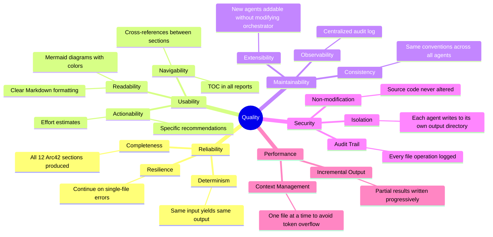

### 10.2 Quality Scenarios

| ID | Quality Attribute | Scenario | Response Measure |
|----|------------------|----------|-----------------|
| QS-01 | **Determinism** | Two runs on the same repository with no source changes | Identical output files (content and structure) |
| QS-02 | **Resilience** | A source file contains syntax errors that cannot be parsed | Agent logs the error, writes a placeholder, continues with next file |
| QS-03 | **Completeness** | Full pipeline executes on a Java Spring Boot project | All 12 Arc42 sections present; all 10 agent outputs produced |
| QS-04 | **Consistency** | Two different agents reference the same class name | Same name used in both outputs; terminology consistent |
| QS-05 | **Non-modification** | Agent attempts to edit a source file | Operation blocked by convention; agent writes only to analysis_output/ |
| QS-06 | **Diagram Compliance** | Visualization agent output reviewed for diagram types | Zero PlantUML or ASCII art blocks; 100% Mermaid |
| QS-07 | **Observability** | `agent-log.txt` reviewed after a pipeline run | Every file creation/modification event is present in the log |
| QS-08 | **Context Management** | Pipeline runs on a repository with 500+ source files | Each file processed individually; no context overflow errors |
| QS-09 | **Extensibility** | A new `test-analyzer` agent is added | Only the orchestrator's execution plan and the new agent definition file are changed |
| QS-10 | **Actionability** | A developer reads the code-assessor output | Each identified issue includes a specific multi-line solution and time estimate |

### 10.3 Current Documentation Quality Assessment

Based on the repository's current state, the following self-assessment applies to the platform's own documentation:

| Dimension | Score | Notes |
|-----------|-------|-------|
| **Completeness** | 6/10 | Agent definitions are comprehensive; no README architecture section |
| **Clarity** | 8/10 | Agent instructions are clear and detailed |
| **Accuracy** | 9/10 | Agent specs accurately describe intended behavior |
| **Structure** | 7/10 | Well-organized per-agent files; no cross-cutting document |
| **Examples** | 9/10 | Each agent definition has extensive code/JSON/Markdown examples |
| **Consistency** | 8/10 | Same conventions replicated across all agents |

**Overall: 7.8/10** — The platform's own documentation is well-structured and example-rich, but lacks a project-level README with architecture overview and onboarding guidance.

---

## 11. Risks and Technical Debt

### 11.1 Identified Risks

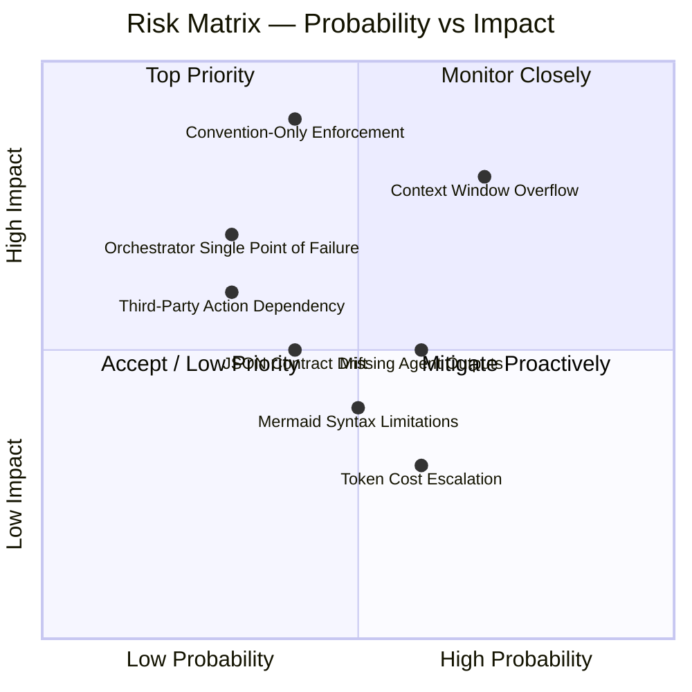

### 11.2 Risk Register

| ID | Risk | Probability | Impact | Severity | Mitigation |
|----|------|-------------|--------|----------|------------|
| R-01 | **Context Window Overflow** — Large codebases may exceed GitHub Copilot token limits | High | High | 🔴 Critical | Enforce incremental file-by-file processing; split large files; prioritize critical source files |
| R-02 | **Convention-Only No-Modification Enforcement** — No technical safeguard prevents agents from editing source files | Medium | Critical | 🔴 Critical | Add file system permission checks; add automated tests that verify source files are unmodified after pipeline run |
| R-03 | **Third-Party Action Dependency** — `otto-de/assign_issue_toCopilot_action@v1.0.1` may change API or become unavailable | Low | High | 🟠 High | Pin action to specific SHA; maintain a fork; document manual fallback procedure |
| R-04 | **Orchestrator Single Point of Failure** — If orchestrator agent fails, entire pipeline stalls | Low | High | 🟠 High | Design agents to be independently runnable; document standalone execution per agent |
| R-05 | **JSON Contract Drift** — Agents may evolve their output JSON schema incompatibly | Medium | Medium | 🟡 Medium | Document JSON schemas explicitly; add schema validation step in pipeline |
| R-06 | **Missing Prior Agent Outputs** — A downstream agent runs before its dependency agent completes | Medium | Medium | 🟡 Medium | Orchestrator verifies output file existence before invoking dependent agents |
| R-07 | **Mermaid Syntax Limitations** — Complex diagrams may be awkward to express in Mermaid | Medium | Low | 🟢 Low | Accept simplification; split complex diagrams into multiple focused ones |
| R-08 | **Token Cost Escalation** — Comprehensive analysis of large repositories may incur significant Copilot usage costs | High | Low | 🟢 Low | Offer targeted analysis modes (quality-only, docs-only); document cost expectations |

### 11.3 Technical Debt

| Debt Item | Type | Impact | Estimated Fix |
|-----------|------|--------|---------------|
| **No JSON Schema Definitions** — Agent output JSON formats are documented by example only | Design Debt | Medium | 8 hours to define and validate schemas for all 10 JSON output formats |
| **No Project-Level README Architecture** — Top-level README contains only one line | Documentation Debt | High | 2 hours to write a comprehensive README with quickstart and architecture overview |
| **No Unit Tests for Agent Logic** — No executable tests verifying agent behavior | Test Debt | High | 40+ hours to write evaluation harness for agent outputs |
| **Convention-Only Security** — No-modification invariant relies entirely on documented convention | Infrastructure Debt | Critical | 4 hours to add read-only file system mounting or pre/post-flight source file hash checks |
| **Third-Party Action Unpinned** — Action referenced by version tag, not SHA | Infrastructure Debt | Medium | 1 hour to pin to SHA and add Dependabot monitoring |
| **No Standalone Agent Documentation** — No quick-start instructions for manual execution without orchestrator | Documentation Debt | Low | 3 hours to add "Standalone Usage" section to each agent definition |
| **`all-in-one-code-analyzer` Duplication** — Duplicates all capabilities of 10 specialized agents | Code Debt | Medium | Refactor all-in-one to delegate to specialized agents rather than re-implement |

### 11.4 Recommended Improvement Roadmap

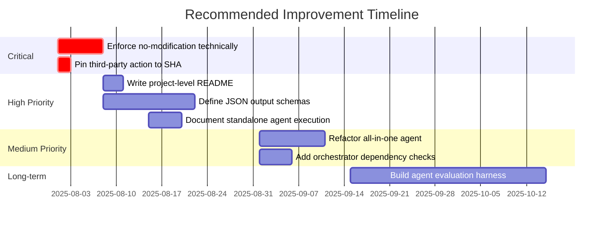

---

## 12. Glossary

| Term | Definition |
|------|------------|
| **Agent** | A specialized GitHub Copilot AI assistant defined by a Markdown file with a YAML front matter header specifying its name, description, and available tools. Each agent has a single analytical responsibility. |
| **Agent Definition File** | A `.agent.md` file in `.github/agents/` that configures an agent's identity, tool access, and behavioral instructions. |
| **Analysis-Only Principle** | The architectural invariant that all agents may only read source code and write to `analysis_output/`; source files are never modified. |
| **Arc42** | A software architecture documentation template with 12 standardized sections, widely used in European software engineering. See https://arc42.org. |
| **AST (Abstract Syntax Tree)** | A tree representation of the abstract syntactic structure of source code. Each node represents a construct in the source language. |
| **BPMN (Business Process Model and Notation)** | A standard notation for specifying business processes. In this platform, BPMN-style processes are rendered as Mermaid flowcharts. |
| **Copilot Runtime** | The execution environment provided by GitHub Copilot in which agents are invoked, have access to their declared tools, and operate on a repository's file system. |
| **DDL (Data Definition Language)** | A subset of SQL used to define and modify database schemas: `CREATE TABLE`, `ALTER TABLE`, `DROP TABLE`, etc. |
| **ER Diagram (Entity-Relationship Diagram)** | A visual representation of entities and their relationships in a data model. Generated using Mermaid's `erDiagram` syntax in this platform. |
| **Executive Summary** | A concise, stakeholder-friendly synthesis of all analysis findings, highlighting strengths, weaknesses, and strategic recommendations. |
| **GitHub Actions** | A CI/CD and automation platform built into GitHub. Used in this project to trigger Copilot on labeled issues via `copilot.yml`. |
| **GitHub Copilot** | An AI coding assistant from GitHub (powered by OpenAI models). In this platform, it serves as the execution runtime for all agents. |
| **Incremental Output** | The practice of writing partial analysis results to output files as they are produced, rather than buffering everything and writing once at completion. Required to stay within context window limits. |
| **Mermaid** | A JavaScript-based diagramming and charting tool that renders diagrams from a Markdown-like text syntax. Natively supported in GitHub Markdown. |
| **Orchestrator** | The master coordinator agent responsible for planning, sequencing, and invoking all specialized agents in the correct order. |
| **Pipeline** | The ordered sequence of agent executions: Stage 1 (Foundation) → Stage 2 (Assessment and Visualization) → Stage 3 (Meta-Analysis) → Stage 4 (Synthesis). |
| **PlantUML** | An alternative diagramming tool (text-based) that is explicitly **prohibited** in this platform. All diagrams must use Mermaid instead. |
| **Quality Gate** | A checkpoint in the analysis pipeline that verifies expected output files exist before invoking dependent agents. |
| **Single Responsibility** | The principle that each agent has exactly one domain of analysis responsibility, preventing scope creep and enabling independent evolution. |
| **Technical Debt** | Accumulated suboptimal design or implementation decisions that create maintenance burden, increase complexity, or hinder future development. |
| **Token Limit / Context Window** | The maximum number of tokens (roughly, words) that a single GitHub Copilot agent invocation can process. Large codebases must be analyzed incrementally to respect this constraint. |
| **UML (Unified Modeling Language)** | A standardized modeling language for software systems. This platform generates UML-style diagrams (class, sequence, use case) using Mermaid syntax. |
| **`analysis_output/`** | The root output directory for all generated artifacts. Each agent writes to its own sub-directory (`analysis_output/<agent-name>/`). |
| **`agent-log.txt`** | The centralized audit log file at `analysis_output/agent-log.txt`. Every agent appends a timestamped entry for each file it creates or modifies. |
| **`copilot-needed` label** | The GitHub issue label that triggers the automated analysis pipeline via the GitHub Actions workflow defined in `copilot.yml`. |
| **`all-in-one-code-analyzer`** | A standalone agent that combines all 10 specialized agents' capabilities in a single execution, suitable for smaller repositories or targeted analysis without the orchestrator. |

---

*Documentation generated by the **arc42-documentor** agent — part of the GitHub Copilot Code Analysis Agent Orchestration Platform.*

*All diagrams in this document use Mermaid syntax and are rendered natively in GitHub Markdown viewers.*

*To place this file at its intended location, run: `mkdir -p docs/arc42 && mv arc42-architecture.md docs/arc42/arc42-architecture.md`*
