# Architecture Documentation (Arc42)

**Project**: gs_test — GitHub Copilot Multi-Agent Code Analysis & Documentation Framework  
**Alias**: HRApp Copilot Agents Orchestration System  
**Version**: 1.0.0  
**Date**: 2025-01-30  
**Generated by**: Arc42 Documentation Generator (arc42-documentor agent)  
**Source Repository**: `/home/runner/work/gs_test/gs_test`

---

## Table of Contents

1. [Introduction and Goals](#1-introduction-and-goals)
2. [Architecture Constraints](#2-architecture-constraints)
3. [System Scope and Context](#3-system-scope-and-context)
4. [Solution Strategy](#4-solution-strategy)
5. [Building Block View](#5-building-block-view)
6. [Runtime View](#6-runtime-view)
7. [Deployment View](#7-deployment-view)
8. [Cross-cutting Concepts](#8-cross-cutting-concepts)
9. [Architecture Decisions](#9-architecture-decisions)
10. [Quality Requirements](#10-quality-requirements)
11. [Risks and Technical Debt](#11-risks-and-technical-debt)
12. [Glossary](#12-glossary)

---

## 1. Introduction and Goals

### 1.1 Overview

The **gs_test** repository is an AI-powered, multi-agent code analysis and documentation generation framework built on top of **GitHub Copilot**. The system orchestrates a suite of 12 specialized AI agents that collaboratively analyze source code repositories and produce comprehensive technical documentation artifacts — from raw code structure analysis all the way through to Arc42 architecture documentation, executive summaries, UML diagrams, BPMN process flows, and database schemas.

The system is designed to work on any target codebase (e.g., an HRApp — Human Resources Application) and is activated through GitHub Issues, triggering a fully automated analysis pipeline.

### 1.2 Business Goals

| # | Goal | Relevance |
|---|------|-----------|
| G1 | Automate comprehensive code documentation and architecture documentation generation | High |
| G2 | Reduce time-to-insight for new developers onboarding to large codebases | High |
| G3 | Detect code quality issues, technical debt, and security concerns automatically | High |
| G4 | Generate visual diagrams (UML, BPMN, ER, Architecture) from code without manual effort | High |
| G5 | Produce executive-level summaries and Arc42 architecture documents for stakeholders | Medium |
| G6 | Validate documentation accuracy against actual code implementation | Medium |
| G7 | Enable any GitHub repository to trigger AI-assisted code analysis via issue labeling | High |

### 1.3 Quality Goals

| Priority | Quality Goal | Scenario |
|----------|-------------|---------|
| 1 | **Accuracy** | All generated analysis must faithfully represent the actual source code without hallucination |
| 2 | **Completeness** | The pipeline covers all 12 analysis dimensions without gaps |
| 3 | **Traceability** | Each output artifact references its source agent and analysis step |
| 4 | **Extensibility** | New agents can be added to the pipeline without breaking existing flows |
| 5 | **Consistency** | All diagram outputs use Mermaid format exclusively — no PlantUML, no ASCII art |

### 1.4 Stakeholders

| Stakeholder | Role | Expectations |
|-------------|------|-------------|
| **Software Developers** | Primary consumers of analysis output | Accurate code documentation, UML diagrams, quality reports |
| **Software Architects** | Consumers of architecture analysis | Arc42 documentation, architecture diagrams, ADRs |
| **Engineering Managers / Executives** | Decision makers | Executive summaries, risk assessments, strategic recommendations |
| **Database Administrators** | Schema consumers | DDL scripts, ER diagrams, schema documentation |
| **Technical Writers** | Documentation quality consumers | Documentation gap analysis, comparison reports |
| **DevOps / Platform Engineers** | Infrastructure & deployment | Deployment views, infrastructure recommendations |
| **GitHub Copilot / AI Platform** | Runtime host | Well-formed agent definitions, tool declarations |
| **Repository Owners** | Trigger and receive analysis | Simple activation via issue labeling (`copilot-needed`) |

---

## 2. Architecture Constraints

### 2.1 Technical Constraints

| Constraint | Description | Rationale |
|-----------|-------------|-----------|
| **TC-01: GitHub Copilot Platform** | All agents must run within the GitHub Copilot agent execution environment | Platform dependency; agents are defined as `.agent.md` files |
| **TC-02: Mermaid-Only Diagrams** | All visual diagrams must use Mermaid format exclusively | No PlantUML, no ASCII art. Mermaid renders natively in GitHub Markdown |
| **TC-03: Read-Only Analysis** | Agents must never modify source code files | Safety constraint to prevent accidental code changes |
| **TC-04: Agent Tool Set** | Each agent is limited to declared tools: `read`, `search`, `edit`, `agent`, `todo` | Enforced by the Copilot agent runtime |
| **TC-05: Sequential Dependency Chain** | Most agents depend on outputs of upstream agents | `code-documentor` must run before `code-assessor`, `uml-generator`, etc. |
| **TC-06: Markdown Output Format** | All human-readable output must be in Markdown format | Compatibility with GitHub rendering and documentation tooling |
| **TC-07: JSON Intermediate Format** | All machine-readable intermediate data must be in strict JSON | Required for downstream agent consumption |
| **TC-08: GitHub Actions Trigger** | The workflow is activated only when an issue is labeled `copilot-needed` | Defined in `.github/workflows/copilot.yml` |

### 2.2 Organizational Constraints

| Constraint | Description |
|-----------|-------------|
| **OC-01: No Code Execution** | Agents analyze code statically; they do not build, run, or test code |
| **OC-02: No Secrets in Outputs** | Generated documentation must never contain credentials, secrets, or sensitive data |
| **OC-03: Output Isolation** | Each agent writes to its own dedicated subfolder under `analysis_output/` |
| **OC-04: Agent Logging Required** | Every file creation/modification must be logged to `analysis_output/agent-log.txt` |

### 2.3 Conventions

| Convention | Description |
|-----------|-------------|
| **CV-01: Agent Naming** | Agent files follow the pattern `<name>.agent.md` |
| **CV-02: Output Folder** | Each agent outputs to `analysis_output/<agent-name>/` |
| **CV-03: Log Format** | `<ISO timestamp> \| <agent-name> \| created/updated \| <relative-path> \| short description` |
| **CV-04: Agent Frontmatter** | All agent files include YAML frontmatter with `name`, `description`, and `tools` |

---

## 3. System Scope and Context

### 3.1 Business Context

The gs_test framework sits between **GitHub users/repository owners** and the **GitHub Copilot AI platform**. Users activate the system by labeling GitHub issues; the framework then autonomously performs multi-dimensional code analysis and delivers structured documentation artifacts.

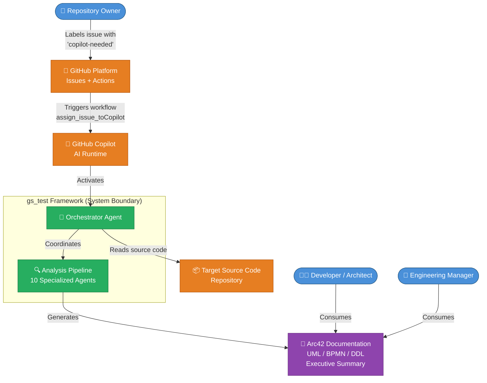

### 3.2 Technical Context

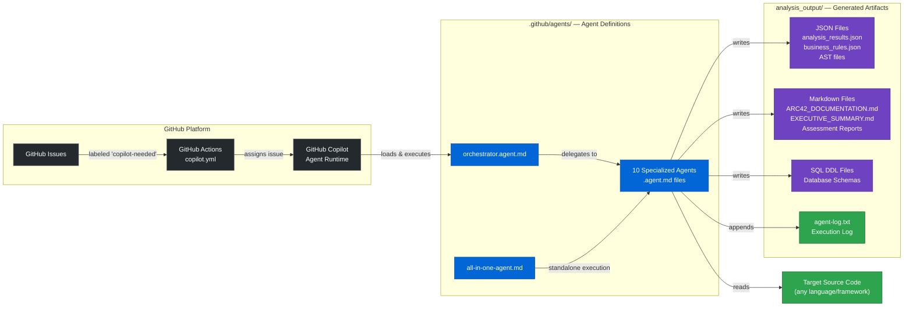

### 3.3 External Interfaces

| Interface | Direction | Protocol / Format | Description |
|-----------|-----------|-------------------|-------------|
| GitHub Issues | Inbound trigger | GitHub API / Issue event | `copilot-needed` label activates analysis |
| GitHub Actions | Outbound trigger | YAML workflow | `otto-de/assign_issue_toCopilot_action@v1.0.1` |
| GitHub Copilot Runtime | Execution host | Agent `.md` protocol | Hosts and executes agent definitions |
| Source Code Repository | Read | File system / `read` tool | Agents analyze source files |
| `analysis_output/` | Write | File system / `edit` tool | All agents write structured outputs |

---

## 4. Solution Strategy

### 4.1 Core Strategy Decisions

| Decision | Strategy | Rationale |
|----------|----------|-----------|
| **Agent-based architecture** | Each analysis concern is encapsulated in a dedicated, single-responsibility agent | Promotes separation of concerns, independent evolution, and parallel execution where possible |
| **Orchestrator pattern** | A master orchestrator agent coordinates all specialized agents | Centralizes workflow management, allows dependency tracking, and provides unified progress reporting |
| **Sequential pipeline with defined dependency order** | Agents execute in a defined sequence (documentor → AST → assessor → UML → BPMN → DDL → architecture → docs → executive → arc42) | Upstream outputs feed downstream agents, ensuring data coherence |
| **Mermaid-first visualization** | All diagrams in Mermaid format, embedded in Markdown | Mermaid renders natively in GitHub; no external rendering service required |
| **Structured JSON as intermediate format** | JSON for machine-readable data, Markdown for human-readable reports | JSON enables inter-agent data exchange; Markdown enables stakeholder consumption |
| **Read-only source code access** | Agents never modify the analyzed codebase | Prevents accidental code changes; maintains analysis-only contract |
| **Single GitHub Actions trigger** | One workflow that delegates to Copilot | Simplicity; leverages existing Copilot integration |
| **All-in-one fallback agent** | A combined agent that encapsulates all 10 analysis capabilities | Allows single-agent execution for simpler use cases without orchestration overhead |

### 4.2 Technology Stack

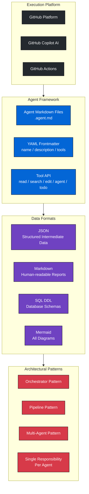

---

## 5. Building Block View

### 5.1 Level 1: High-Level System Decomposition

The system is composed of three top-level building blocks:

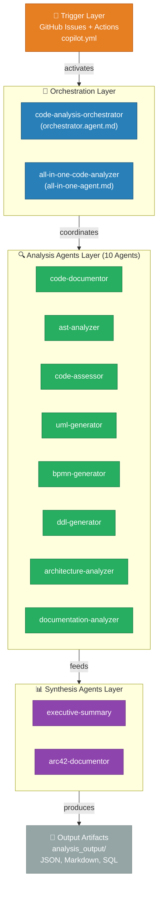

### 5.2 Level 2: Analysis Agent Dependency Graph

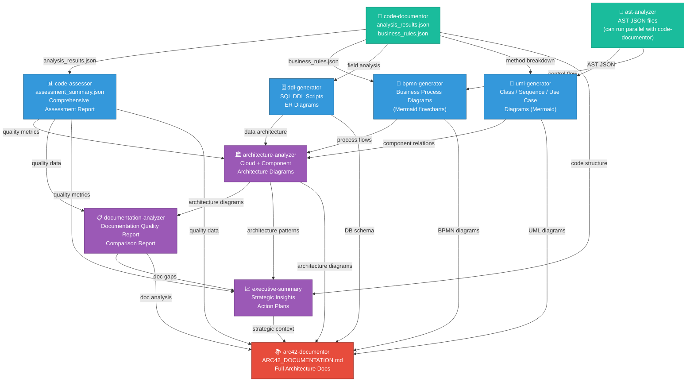

### 5.3 Level 3: Individual Agent Building Blocks

#### code-documentor
| Attribute | Value |
|-----------|-------|
| **Name** | `code-documentor` |
| **Responsibility** | Analyzes source code files, extracts business logic, classifies files (Business/Technical/Mixed), documents methods |
| **Tools** | `read`, `search`, `edit`, `todo` |
| **Inputs** | Source code files (any language/framework) |
| **Outputs** | `analysis_results.json`, `business_rules_extractor_analysis.json`, `package_summary.json`, `application_summary.json`, `analysis_summary.md` |
| **Position in Chain** | #1 — Foundation agent, no upstream dependencies |

#### ast-analyzer
| Attribute | Value |
|-----------|-------|
| **Name** | `ast-analyzer` |
| **Responsibility** | Generates detailed JSON Abstract Syntax Trees capturing class structure, method logic, control flow, dependencies |
| **Tools** | `read`, `search`, `edit`, `todo` |
| **Inputs** | Source code files; optionally `analysis_results.json` |
| **Outputs** | `[ClassName]_AST.json` per file, `AST_Analysis_Summary.md` |
| **Position in Chain** | #2 — Can run parallel with code-documentor |

#### code-assessor
| Attribute | Value |
|-----------|-------|
| **Name** | `code-assessor` |
| **Responsibility** | Evaluates code quality (complexity 0-10), identifies issues (criticality 1-5), documents technical debt, provides enhancement recommendations |
| **Tools** | `read`, `search`, `edit`, `todo` |
| **Inputs** | Source code, `analysis_results.json`, AST outputs |
| **Outputs** | `assessment_summary.json`, `COMPREHENSIVE_ASSESSMENT_REPORT.md` |
| **Position in Chain** | #3 |

#### uml-generator
| Attribute | Value |
|-----------|-------|
| **Name** | `uml-generator` |
| **Responsibility** | Generates Class Diagrams, Sequence Diagrams, and Use Case Diagrams in Mermaid format |
| **Tools** | `read`, `search`, `edit`, `todo` |
| **Inputs** | `analysis_results.json`, AST JSON files |
| **Outputs** | Markdown files with embedded Mermaid class/sequence/use-case diagrams |
| **Position in Chain** | #4 |

#### bpmn-generator
| Attribute | Value |
|-----------|-------|
| **Name** | `bpmn-generator` |
| **Responsibility** | Translates code workflows, control flow, and business rules into Mermaid flowchart process diagrams |
| **Tools** | `read`, `search`, `edit`, `todo` |
| **Inputs** | `business_rules_extractor_analysis.json`, AST JSON files |
| **Outputs** | Markdown files with embedded Mermaid BPMN-style flowcharts |
| **Position in Chain** | #5 |

#### ddl-generator
| Attribute | Value |
|-----------|-------|
| **Name** | `ddl-generator` |
| **Responsibility** | Generates SQL DDL scripts (CREATE TABLE, indexes, constraints, relationships) from entity/field analysis |
| **Tools** | `read`, `search`, `edit`, `todo` |
| **Inputs** | Field analysis, workflow analysis, business rules from code-documentor |
| **Outputs** | `.sql` DDL files, `schema_summary.json`, ER diagrams in Mermaid, schema documentation |
| **Position in Chain** | #6 |

#### architecture-analyzer
| Attribute | Value |
|-----------|-------|
| **Name** | `architecture-analyzer` |
| **Responsibility** | Generates Cloud Architecture Diagrams and Component Architecture Diagrams; maps code patterns to cloud services (AWS/Azure/GCP) |
| **Tools** | `read`, `search`, `edit`, `todo` |
| **Inputs** | All previous agent outputs (code-documentor, AST, assessor, UML, BPMN, DDL) |
| **Outputs** | Cloud architecture Mermaid diagrams, component architecture Mermaid diagrams, `ARCHITECTURE_SUMMARY.md` |
| **Position in Chain** | #7 |

#### documentation-analyzer
| Attribute | Value |
|-----------|-------|
| **Name** | `documentation-analyzer` |
| **Responsibility** | Assesses existing documentation quality (completeness, clarity, accuracy), compares docs vs actual code |
| **Tools** | `read`, `search`, `edit`, `todo` |
| **Inputs** | Existing docs (README, API docs, etc.), all previous analysis outputs |
| **Outputs** | `documentation_analysis.json`, `comparison_report.json`, `DOCUMENTATION_QUALITY_REPORT.md` |
| **Position in Chain** | #8 |

#### executive-summary
| Attribute | Value |
|-----------|-------|
| **Name** | `executive-summary` |
| **Responsibility** | Synthesizes all technical analysis into executive-level insights: strengths, weaknesses, strategic recommendations, cost-benefit analysis, risk assessment |
| **Tools** | `read`, `search`, `edit`, `todo` |
| **Inputs** | All previous agent outputs |
| **Outputs** | `executive-summary.md` |
| **Position in Chain** | #9 — Runs before arc42-documentor |

#### arc42-documentor
| Attribute | Value |
|-----------|-------|
| **Name** | `arc42-documentor` |
| **Responsibility** | Synthesizes all analysis outputs into a comprehensive Arc42 architecture documentation with all 12 sections and embedded Mermaid diagrams |
| **Tools** | `read`, `search`, `edit`, `todo` |
| **Inputs** | All previous agent outputs |
| **Outputs** | `ARC42_DOCUMENTATION.md` — self-contained, all sections, all diagrams embedded |
| **Position in Chain** | #10 — Final documentation agent |

#### orchestrator (code-analysis-orchestrator)
| Attribute | Value |
|-----------|-------|
| **Name** | `code-analysis-orchestrator` |
| **Responsibility** | Master coordinator that plans, sequences, and delegates to all 10 specialized agents. Handles dependencies and provides progress reporting |
| **Tools** | `read`, `search`, `agent`, `todo` |
| **Inputs** | User request specifying analysis scope and target paths |
| **Outputs** | Coordinates all agent outputs; provides unified summary |
| **Position in Chain** | Coordinator — activates all other agents |

#### all-in-one-code-analyzer
| Attribute | Value |
|-----------|-------|
| **Name** | `all-in-one-code-analyzer` |
| **Responsibility** | Combines all 10 analysis capabilities into a single agent for scenarios without multi-agent orchestration |
| **Tools** | `read`, `search`, `edit`, `todo` |
| **Inputs** | Source code files, input/output folder paths |
| **Outputs** | All artifacts from all 10 analysis modules |
| **Position in Chain** | Standalone alternative to full orchestration |

### 5.4 Agent Class Diagram

```mermaid
classDiagram
    class Agent {
        <<abstract>>
        +String name
        +String description
        +List~String~ tools
        +String outputFolder
        +execute(inputPath, outputPath) void
        +logOutput(filePath, description) void
    }

    class FoundationAgent {
        <<abstract>>
        +analyzeSourceCode(filePath) JSON
        +writeOutput(data, path) void
    }

    class SynthesisAgent {
        <<abstract>>
        +readAnalysisOutputs(outputDir) Map
        +synthesize(data) String
        +embedDiagrams(content) String
    }

    class CodeDocumentor {
        +extractBusinessRules() List
        +classifyFile() String
        +documentMethods() List
        +generateAnalysisResultsJSON() void
        +generateBusinessRulesJSON() void
    }

    class ASTAnalyzer {
        +parseTypeDeclarations() List
        +extractMethods() List
        +captureControlFlow() List
        +generateASTJSON() void
    }

    class CodeAssessor {
        +assessComplexity() Number
        +identifyIssues() List
        +documentTechnicalDebt() List
        +generateEnhancements() List
    }

    class UMLGenerator {
        +generateClassDiagram() String
        +generateSequenceDiagram() String
        +generateUseCaseDiagram() String
    }

    class BPMNGenerator {
        +extractWorkflows() List
        +mapToMermaidFlowchart() String
        +identifySwimLanes() List
    }

    class DDLGenerator {
        +identifyEntities() List
        +generateTableDDL() String
        +generateIndexes() String
        +generateERDiagram() String
    }

    class ArchitectureAnalyzer {
        +detectArchitecturePattern() String
        +generateCloudArchDiagram() String
        +generateComponentDiagram() String
    }

    class DocumentationAnalyzer {
        +assessDocQuality() Map
        +compareDocsVsCode() Map
        +identifyGaps() List
    }

    class ExecutiveSummary {
        +synthesizeStrengths() List
        +synthesizeWeaknesses() List
        +generateRecommendations() List
        +estimateCostBenefit() Map
    }

    class Arc42Documentor {
        +generateAllSections() void
        +embedDiagrams() void
        +createSelfContainedDoc() void
    }

    class Orchestrator {
        +planExecution() List
        +delegateToAgent(agentName) void
        +trackDependencies() Map
        +reportProgress() void
    }

    class AllInOneAnalyzer {
        +executeFullPipeline() void
        +executeTargetedAnalysis(modules) void
    }

    Agent <|-- FoundationAgent
    Agent <|-- SynthesisAgent
    FoundationAgent <|-- CodeDocumentor
    FoundationAgent <|-- ASTAnalyzer
    FoundationAgent <|-- CodeAssessor
    FoundationAgent <|-- UMLGenerator
    FoundationAgent <|-- BPMNGenerator
    FoundationAgent <|-- DDLGenerator
    FoundationAgent <|-- ArchitectureAnalyzer
    FoundationAgent <|-- DocumentationAnalyzer
    SynthesisAgent <|-- ExecutiveSummary
    SynthesisAgent <|-- Arc42Documentor
    Agent <|-- Orchestrator
    Agent <|-- AllInOneAnalyzer

    Orchestrator --> CodeDocumentor : delegates to
    Orchestrator --> ASTAnalyzer : delegates to
    Orchestrator --> CodeAssessor : delegates to
    Orchestrator --> UMLGenerator : delegates to
    Orchestrator --> BPMNGenerator : delegates to
    Orchestrator --> DDLGenerator : delegates to
    Orchestrator --> ArchitectureAnalyzer : delegates to
    Orchestrator --> DocumentationAnalyzer : delegates to
    Orchestrator --> ExecutiveSummary : delegates to
    Orchestrator --> Arc42Documentor : delegates to (final)

    CodeDocumentor ..> ASTAnalyzer : feeds analysis_results.json
    CodeDocumentor ..> CodeAssessor : feeds analysis_results.json
    CodeDocumentor ..> UMLGenerator : feeds method breakdown
    CodeDocumentor ..> BPMNGenerator : feeds business_rules.json
    CodeDocumentor ..> DDLGenerator : feeds field analysis
    ASTAnalyzer ..> UMLGenerator : feeds AST JSON
    ASTAnalyzer ..> BPMNGenerator : feeds control flow
    Arc42Documentor ..> ExecutiveSummary : consumes executive summary
```

---

## 6. Runtime View

### 6.1 Full Analysis Pipeline — Standard Execution

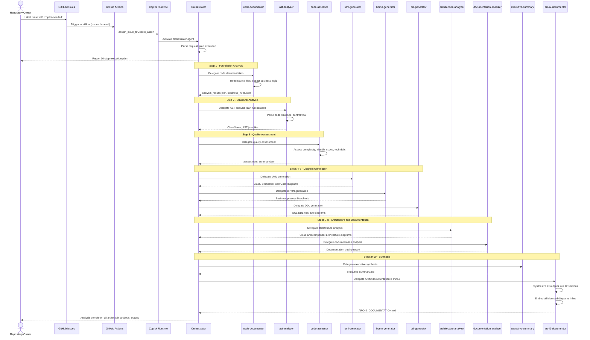

### 6.2 GitHub Actions Trigger Flow

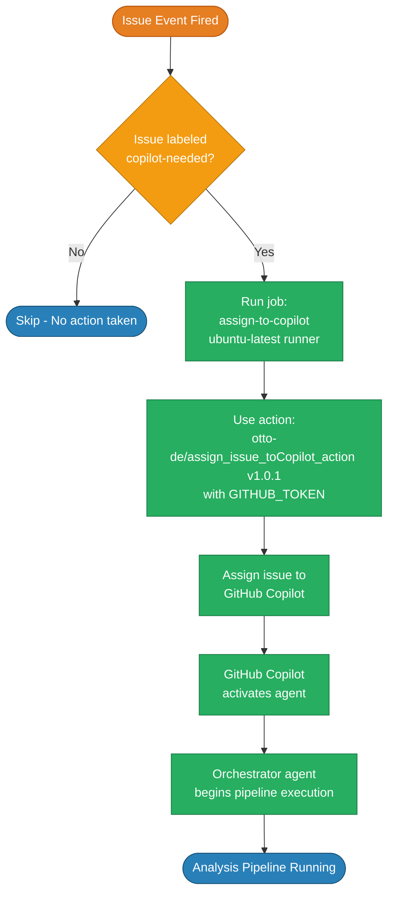

### 6.3 Targeted Analysis Scenarios

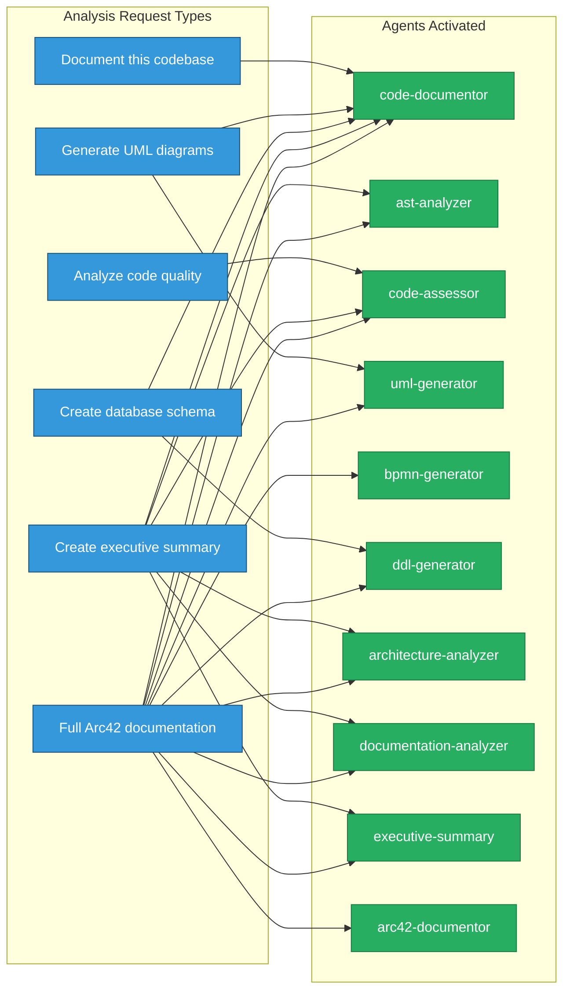

### 6.4 Agent Error Handling Flow

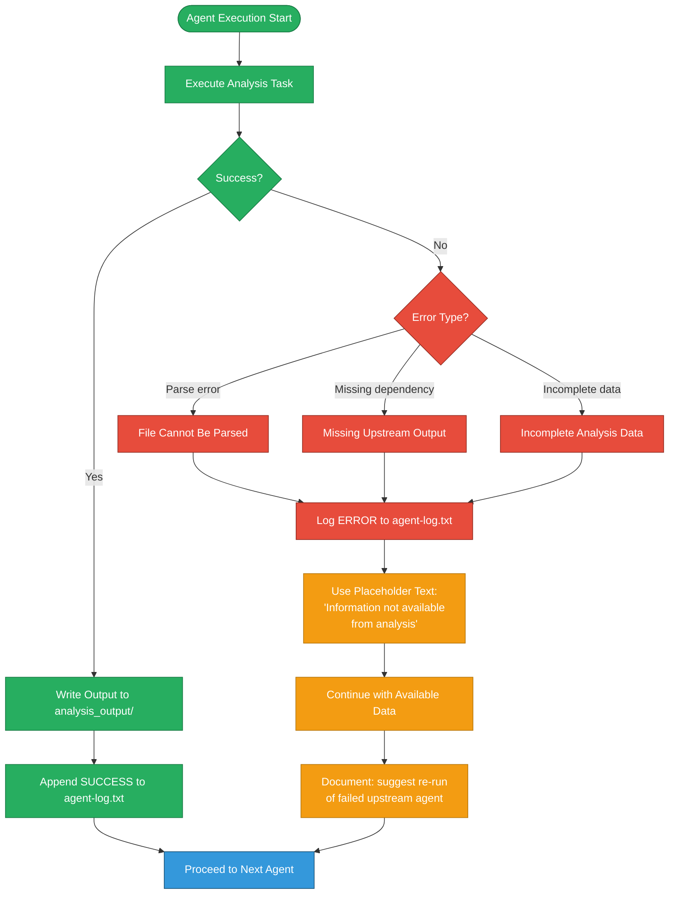

---

## 7. Deployment View

### 7.1 Deployment Topology

The entire system runs within the **GitHub cloud platform** — there is no on-premises deployment, no dedicated server, and no containerized infrastructure required by the framework itself.

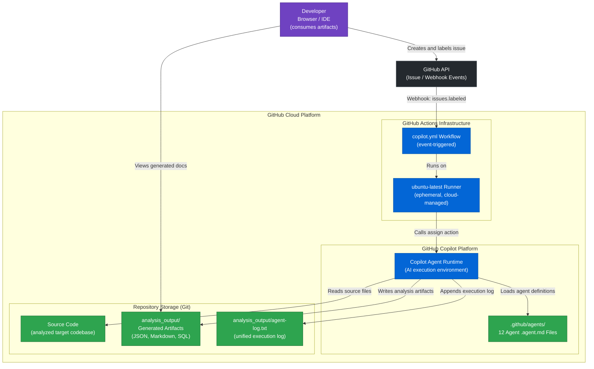

### 7.2 Infrastructure Requirements

| Requirement | Details |
|-------------|---------|
| **GitHub Repository** | Any GitHub repository with Copilot enabled |
| **GitHub Actions** | Enabled on the repository (free tier sufficient) |
| **GitHub Copilot** | GitHub Copilot subscription with agent capabilities |
| **GitHub Token** | `GITHUB_TOKEN` secret (automatically available in Actions) |
| **Compute** | `ubuntu-latest` GitHub Actions runner (ephemeral, cloud-managed) |
| **Storage** | Repository storage for `analysis_output/` artifacts (committed or artifact-uploaded) |
| **External Action** | `otto-de/assign_issue_toCopilot_action@v1.0.1` (third-party action) |

### 7.3 Deployment Variants

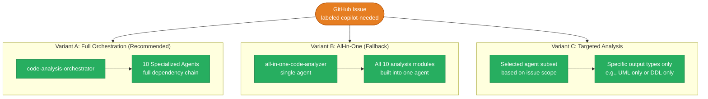

---

## 8. Cross-cutting Concepts

### 8.1 Logging and Observability

Every agent follows a **mandatory logging convention** that creates a unified audit trail across the entire pipeline.

**Log Entry Format:**
```
<ISO-8601 timestamp> | <agent-name> | created/updated | <relative-path> | <short description>
```

**Example Log File** (`analysis_output/agent-log.txt`):
```
2025-01-30T10:00:00Z | code-documentor | created | analysis_output/code-documentor/analysis_results.json | Code structure and business logic analysis
2025-01-30T10:00:01Z | code-documentor | created | analysis_output/code-documentor/business_rules_extractor_analysis.json | Extracted business rules and workflows
2025-01-30T10:05:00Z | ast-analyzer | created | analysis_output/ast-analyzer/UserService_AST.json | AST for UserService class
2025-01-30T10:10:00Z | code-assessor | created | analysis_output/code-assessor/assessment_summary.json | Quality metrics and issue report
2025-01-30T10:20:00Z | uml-generator | created | analysis_output/uml-generator/class-diagram.md | Class diagram (Mermaid)
2025-01-30T11:30:00Z | arc42-documentor | created | analysis_output/arc42-documentor/ARC42_DOCUMENTATION.md | Final Arc42 architecture documentation
```

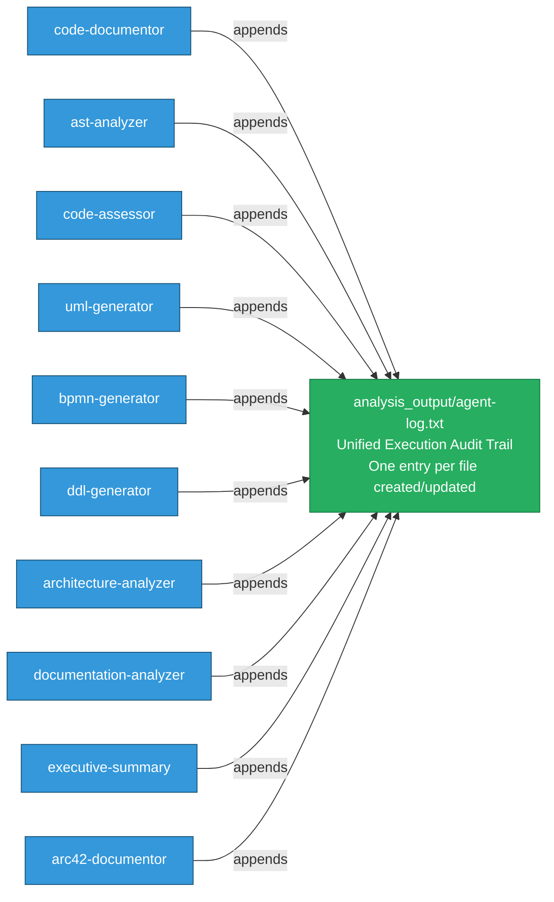

### 8.2 Output Folder Structure Convention

```mermaid
graph TD
    classDef root fill:#2C3E50,stroke:#1A252F,color:#fff
    classDef folder fill:#2980B9,stroke:#1A5276,color:#fff
    classDef file fill:#27AE60,stroke:#1A7A45,color:#fff

    Root["analysis_output/"]:::root

    Root --> LogFile["agent-log.txt"]:::file
    Root --> D1["code-documentor/\nanalysis_results.json\nbusiness_rules_extractor_analysis.json\napplication_summary.json\nanalysis_summary.md"]:::folder
    Root --> D2["ast-analyzer/\nClassName_AST.json (per file)\nAST_Analysis_Summary.md"]:::folder
    Root --> D3["code-assessor/\nassessment_summary.json\nCOMPREHENSIVE_ASSESSMENT_REPORT.md"]:::folder
    Root --> D4["uml-generator/\nclass-diagram.md\nsequence-diagram.md\nuse-case-diagram.md"]:::folder
    Root --> D5["bpmn-generator/\nprocess-workflow.md (per workflow)"]:::folder
    Root --> D6["ddl-generator/\nschema.sql\nschema_summary.json\nER-diagram.md"]:::folder
    Root --> D7["architecture-analyzer/\nARCHITECTURE_SUMMARY.md\ncloud-architecture.md\ncomponent-architecture.md"]:::folder
    Root --> D8["documentation-analyzer/\nDOCUMENTATION_QUALITY_REPORT.md\ndocumentation_analysis.json\ncomparison_report.json"]:::folder
    Root --> D9["executive-summary/\nexecutive-summary.md"]:::folder
    Root --> D10["arc42-documentor/\nARC42_DOCUMENTATION.md"]:::folder
```

### 8.3 Diagram Standardization Policy

All agents enforce a **Mermaid-only diagram policy** enforced at the agent prompt level:

| Rule | Enforcement | Example |
|------|-------------|---------|
| Use Mermaid exclusively | Stated in every agent definition | ` ```mermaid\ngraph TB\n... ` |
| No PlantUML | Explicitly prohibited in all agents | Never `@startuml` blocks |
| No ASCII art | Explicitly prohibited in all agents | Never `+---+` boxes |
| Apply styling | Recommended via `fill:`, `stroke:`, CSS classes | `classDef myStyle fill:#fff` |
| Embed in Markdown | Always wrapped in code blocks | Not file references |

### 8.4 Analysis-Only Contract

All agents operate under a strict **read-only source code contract**:

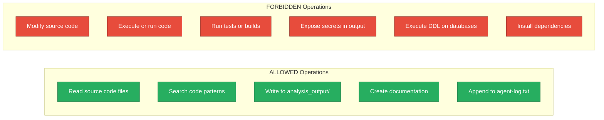

### 8.5 Quality Scoring Framework

The `code-assessor` agent applies standardized scoring scales:

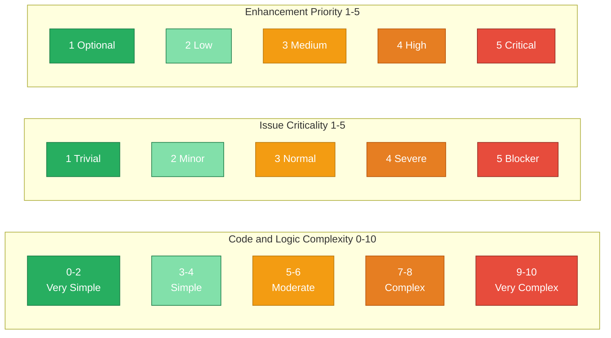

### 8.6 File Classification Convention

The `code-documentor` agent classifies every source file into one of three categories:

| Classification | Criteria | Examples |
|---------------|----------|---------|
| **Business** | Domain-specific logic, business rules, calculations, validations | `OrderService`, `PaymentProcessor`, `EmployeeManager`, `SalaryCalculator` |
| **Technical** | Infrastructure, protocols, file handling, database access, configuration | `DatabaseConfig`, `FileHandler`, `NetworkClient`, `SecurityConfig` |
| **Mixed** | Contains both business logic and technical infrastructure concerns | `UserController` (HTTP routing + business validation), `OrderRepository` (DB + business queries) |

### 8.7 Data Transformation Pipeline

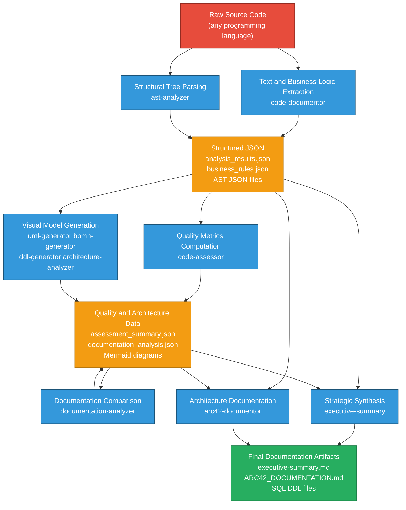

---

## 9. Architecture Decisions

### ADR-001: Multi-Agent Architecture over Monolithic Analysis Tool

| Attribute | Value |
|-----------|-------|
| **Status** | Accepted |
| **Context** | A code analysis system needs to cover 10 distinct analysis dimensions simultaneously |
| **Decision** | Use a multi-agent architecture where each analysis concern is encapsulated in a dedicated, single-responsibility agent |
| **Rationale** | Separation of concerns; each agent can evolve independently; agents can be composed in different sequences; partial analysis is possible |
| **Positive Consequences** | Modularity, extensibility, targeted analysis support, independent agent improvements, clear responsibility boundaries |
| **Negative Consequences** | Dependency management complexity; agents must agree on data exchange formats; more files to maintain |

---

### ADR-002: Orchestrator Pattern for Agent Coordination

| Attribute | Value |
|-----------|-------|
| **Status** | Accepted |
| **Context** | With 10 specialized agents, coordination and sequencing is required to manage inter-agent dependencies |
| **Decision** | Implement a dedicated `code-analysis-orchestrator` agent as the master coordinator |
| **Rationale** | Centralizes workflow logic; provides single entry point; allows different execution strategies (full vs. targeted) |
| **Positive Consequences** | Single entry point, unified progress reporting, flexible execution strategies, clear coordination |
| **Negative Consequences** | Single point of failure if orchestrator fails; additional cognitive overhead |
| **Alternatives Considered** | Peer-to-peer choreography (rejected: harder to reason about sequencing and dependencies) |

---

### ADR-003: All-in-One Agent as Fallback

| Attribute | Value |
|-----------|-------|
| **Status** | Accepted |
| **Context** | Not all GitHub Copilot environments may support multi-agent orchestration via the `agent` tool |
| **Decision** | Provide `all-in-one-code-analyzer` that embeds all 10 analysis capabilities in a single agent |
| **Rationale** | Resilience; ensures full analysis pipeline is accessible in single-agent execution mode |
| **Positive Consequences** | Fallback capability; simpler deployment for basic use cases; no orchestration dependency |
| **Negative Consequences** | Code duplication; larger agent definition (context window pressure); synchronization burden |

---

### ADR-004: Mermaid-Only Diagram Standard

| Attribute | Value |
|-----------|-------|
| **Status** | Accepted |
| **Context** | Multiple diagram format options exist: PlantUML, Graphviz, ASCII art, Mermaid |
| **Decision** | All diagrams must use Mermaid format exclusively, embedded as code blocks in Markdown |
| **Rationale** | Mermaid renders natively in GitHub Markdown (no external renderer); universally supported; no server required |
| **Positive Consequences** | No external tool dependencies; native GitHub rendering; consistent format; human-readable source |
| **Negative Consequences** | Some complex diagrams harder to express; no PNG/SVG export without additional tools |
| **Alternatives Rejected** | PlantUML (requires server), Graphviz (no GitHub rendering), ASCII art (not maintainable) |

---

### ADR-005: GitHub Actions + Copilot as Deployment Platform

| Attribute | Value |
|-----------|-------|
| **Status** | Accepted |
| **Context** | The analysis system needs managed execution without infrastructure setup |
| **Decision** | Use GitHub Actions workflow + GitHub Copilot agent runtime as the sole deployment platform |
| **Rationale** | Zero infrastructure management; native repository integration; leverage existing GitHub authentication |
| **Positive Consequences** | Zero infrastructure cost; automatic scaling; native GitHub integration; no servers to maintain |
| **Negative Consequences** | Platform lock-in to GitHub; subject to Copilot availability and quota limits |

---

### ADR-006: JSON as Intermediate Data Exchange Format

| Attribute | Value |
|-----------|-------|
| **Status** | Accepted |
| **Context** | Agents need to exchange structured data in a format that is parsable, storable, and human-readable |
| **Decision** | All inter-agent data exchange uses strict JSON format stored in `analysis_output/` files |
| **Rationale** | JSON is universally parsable; human-readable; supports complex nested structures; version-controllable |
| **Positive Consequences** | Language-agnostic consumption; clear data contracts; debuggable; easily versioned in Git |
| **Negative Consequences** | Large JSON files can be verbose; no built-in schema enforcement at runtime |

---

### ADR-007: GitHub Issue Label as Analysis Trigger

| Attribute | Value |
|-----------|-------|
| **Status** | Accepted |
| **Context** | A low-friction mechanism is needed to trigger analysis without code changes or workflow dispatch |
| **Decision** | Use GitHub Issue label `copilot-needed` as the single trigger event |
| **Rationale** | Simple UX; native GitHub feature; issue description carries natural context for analysis scope |
| **Positive Consequences** | Extremely low friction; any team member can trigger analysis; built-in audit trail via issues |
| **Negative Consequences** | Requires manual labeling; label could be accidentally applied; limited fine-grained scope control |

---

## 10. Quality Requirements

### 10.1 Quality Tree

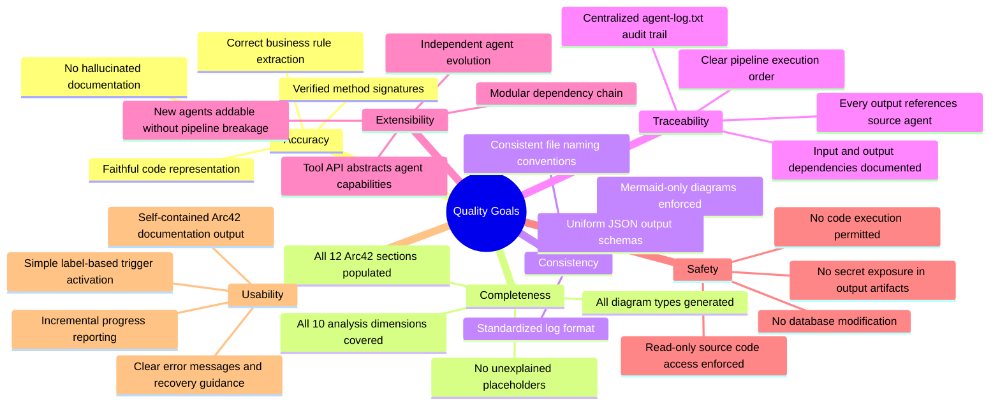

### 10.2 Quality Scenarios

| ID | Quality Attribute | Scenario | Expected Response |
|----|-----------------|---------|------------------|
| QS-01 | **Accuracy** | When analyzing a Java Spring Boot codebase, `code-documentor` extracts business rules | All business rules mentioned in method logic are captured; verified by `code-assessor` cross-check |
| QS-02 | **Completeness** | After full pipeline execution, `arc42-documentor` produces the final document | Document contains all 12 Arc42 sections; no `[Information not available]` placeholders where data was available |
| QS-03 | **Consistency** | Any agent generates a diagram | Diagram is a valid Mermaid code block; no PlantUML or ASCII art is ever produced |
| QS-04 | **Traceability** | Developer wants to understand which agent produced a file | Every file in `analysis_output/` has a corresponding entry in `agent-log.txt` with timestamp and description |
| QS-05 | **Extensibility** | A new `security-scanner` agent needs to be added | Agent is added as new `.agent.md` file; orchestrator includes it without modifying existing agents |
| QS-06 | **Safety** | An agent encounters a source code file during execution | Agent reads the file but does not write back to it; source code directory remains unchanged |
| QS-07 | **Resilience** | An upstream agent fails to produce expected JSON output | Downstream agents use `[Information not available from analysis]` placeholders and suggest re-running the failed agent |
| QS-08 | **Self-Containment** | Stakeholder opens `ARC42_DOCUMENTATION.md` in GitHub | Document renders completely with all Mermaid diagrams visible; no external file references needed |

### 10.3 Documentation Quality Assessment

Based on direct analysis of the repository's current documentation:

| Dimension | Score | Findings |
|-----------|-------|---------|
| **Completeness** | 2/10 | README is 2 lines only; no setup guide, usage examples, or contribution guidelines |
| **Clarity** | 3/10 | Agent definitions are detailed but the overall system is not explained for newcomers |
| **Accuracy** | 8/10 | Agent definitions accurately describe their behavior |
| **Structure** | 6/10 | Agent files are well-organized in `.github/agents/`; no higher-level documentation structure |
| **Accessibility** | 3/10 | No entry-point documentation for new users |
| **Examples** | 5/10 | Agent definitions contain good internal examples; no user-facing examples |
| **Overall** | **4.5/10** | **Poor — critical documentation gaps for onboarding and usage** |

---

## 11. Risks and Technical Debt

### 11.1 Risk Register

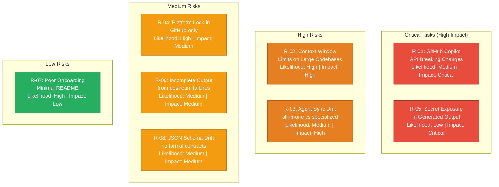

### 11.2 Detailed Risk Analysis

| ID | Risk | Likelihood | Impact | Mitigation Strategy |
|----|------|-----------|--------|-------------------|
| **R-01** | **GitHub Copilot API / Platform Changes** — Agent definition format, tool names, or frontmatter schema may change in future Copilot releases | Medium | Critical | Version-pin agent format; monitor GitHub Copilot release notes; maintain test suite for agent definitions |
| **R-02** | **Context Window Limits** — Very large codebases may exceed Copilot's context window during analysis, causing truncated or incomplete output | High | High | Agents already support incremental/file-by-file processing; add explicit chunking strategy documentation; process in batches |
| **R-03** | **Agent Synchronization Drift** — Changes to specialized agents are not reflected in `all-in-one-agent.md` | Medium | High | Establish sync process; consider auto-generating all-in-one from specialized definitions; add changelog tracking |
| **R-04** | **Platform Lock-in** — System is tightly coupled to GitHub Actions + GitHub Copilot | High | Medium | Document alternative execution paths; abstract platform-specific logic where possible; consider CLI wrapper |
| **R-05** | **Secret Exposure in Output** — Analyzed codebases may contain API keys or credentials that get included in generated documentation | Low | Critical | Add explicit secret-filtering in agent contracts; add documentation on what to redact; consider pre-analysis secret scan |
| **R-06** | **Incomplete Analysis Output** — Upstream agent failures leave downstream agents with incomplete input data | Medium | Medium | Mandatory error handling with `[placeholder]` fallbacks; clear error logging; fail-fast vs. continue-on-error strategy |
| **R-07** | **Poor Onboarding** — Minimal README makes it difficult for new users to set up and use the framework | High | Low | **Immediate action**: Expand README with setup guide, usage examples, and contribution guide |
| **R-08** | **JSON Schema Drift** — Without formal JSON schemas, inter-agent data exchange format may drift over time | Medium | Medium | Define and version JSON schemas (JSON Schema or OpenAPI); add validation step in pipeline |

### 11.3 Technical Debt Register

| ID | Type | Description | Impact | Estimated Fix |
|----|------|-------------|--------|--------------|
| **TD-01** | Documentation Debt | `README.md` has only 2 lines — no setup, usage, activation guide, or architecture overview | **HIGH** | 4-8 hours |
| **TD-02** | Test Debt | No automated tests for agent definitions, pipeline execution, or output validation | **HIGH** | 16-24 hours |
| **TD-03** | Code Duplication | All 10 specialized agent capabilities are fully duplicated in `all-in-one-agent.md` | **MEDIUM** | 8-12 hours |
| **TD-04** | Configuration Debt | Workflow pins to `assign_issue_toCopilot_action@v1.0.1` without documented update strategy | **LOW** | 1-2 hours |
| **TD-05** | Input Validation | No validation of issue content or user-provided paths before agent execution | **MEDIUM** | 4-8 hours |
| **TD-06** | Schema Debt | No formal JSON schema definitions for inter-agent exchange formats | **MEDIUM** | 6-10 hours |

### 11.4 Technical Debt Resolution Roadmap

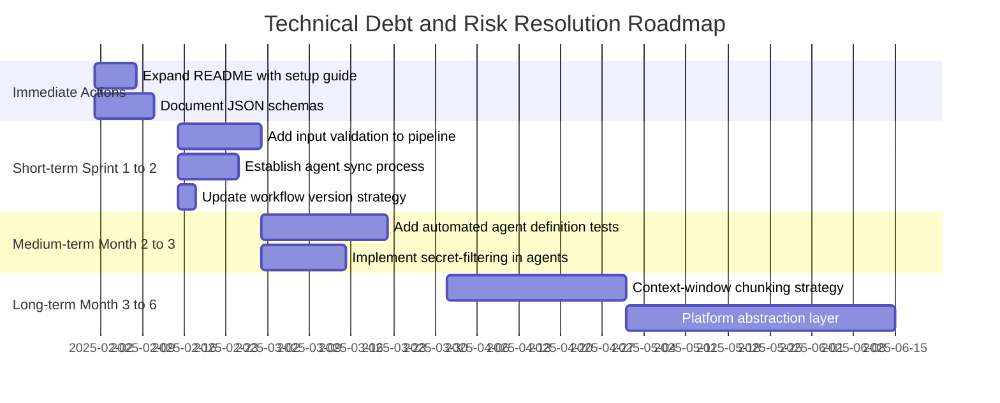

---

## 12. Glossary

| Term | Definition |
|------|-----------|
| **Agent** | A specialized AI component defined as a Markdown file (`.agent.md`) with YAML frontmatter, deployed on GitHub Copilot, responsible for one analysis domain |
| **Agent Frontmatter** | YAML block at the top of an `.agent.md` file containing `name`, `description`, and `tools` declarations |
| **all-in-one-agent** | Combined agent (`all-in-one-agent.md`) that embeds all 10 analysis capabilities without requiring multi-agent orchestration via the `agent` tool |
| **analysis_output/** | Root output directory for all generated artifacts; each agent writes to its own named subdirectory |
| **analysis_results.json** | Primary JSON output of `code-documentor`; contains file-by-file analysis of source code structure, classification, business rules, and method documentation |
| **Arc42** | Software architecture documentation framework with 12 standardized sections; the primary final output format produced by `arc42-documentor` |
| **AST (Abstract Syntax Tree)** | A structured tree representation of source code captured by `ast-analyzer`; includes type declarations, methods, control flow statements, and imports |
| **BPMN (Business Process Model and Notation)** | Standard for visualizing business processes; represented as Mermaid flowcharts by `bpmn-generator` |
| **Business Rules** | Domain-specific logic rules extracted from source code — validation rules, calculation formulas, decision criteria, workflow constraints |
| **business_rules_extractor_analysis.json** | JSON output of `code-documentor` focused on extracted business workflows, rules, and domain logic |
| **code-analysis-orchestrator** | Master coordinator agent (`orchestrator.agent.md`) that manages the sequencing, dependency resolution, and delegation of all 10 specialized agents |
| **Copilot Runtime** | The GitHub Copilot AI execution environment that loads, interprets, and runs agent definitions |
| **copilot-needed** | The GitHub Issue label that triggers the analysis pipeline via the `copilot.yml` GitHub Actions workflow |
| **DDL (Data Definition Language)** | SQL statements defining database structure (`CREATE TABLE`, indexes, constraints); generated by `ddl-generator` from entity/field analysis |
| **Dependency Chain** | The ordered agent execution sequence based on data dependencies: code-documentor → ast-analyzer → code-assessor → uml-generator → bpmn-generator → ddl-generator → architecture-analyzer → documentation-analyzer → executive-summary → arc42-documentor |
| **ER Diagram** | Entity-Relationship diagram showing database table relationships; generated in Mermaid `erDiagram` format by `ddl-generator` |
| **executive-summary** | Agent that synthesizes all technical findings into executive-level strategic insights including strengths, weaknesses, recommendations, and risk assessment |
| **GitHub Actions** | GitHub's CI/CD automation platform; the `copilot.yml` workflow triggers the Copilot agent assignment |
| **GitHub Copilot** | AI-powered developer tool extended to support specialized analysis agents through the agent definition framework |
| **gs_test** | Repository name for this GitHub Copilot multi-agent code analysis and documentation orchestration framework |
| **HRApp** | Human Resources Application; a target codebase type that this framework is designed to analyze (any application codebase can be analyzed) |
| **Mermaid** | Open-source diagramming tool using text-based syntax; the exclusive diagram format mandated for all agents in this framework |
| **Orchestrator Pattern** | Architectural pattern where a central coordinator manages the sequencing and coordination of multiple worker components (agents) |
| **Pipeline** | The sequential execution chain from code-documentor through arc42-documentor, where each agent's output feeds subsequent agents |
| **Single Responsibility** | Design principle applied to agents: each agent is responsible for exactly one analysis dimension |
| **Technical Debt** | Suboptimal code or design decisions creating future maintenance burden; identified and categorized by `code-assessor` |
| **Tool** | A capability granted to an agent by the Copilot runtime (e.g., `read` for reading files, `edit` for writing, `search` for searching, `agent` for calling sub-agents, `todo` for task management) |
| **UML (Unified Modeling Language)** | Standard visual language for software architecture; `uml-generator` produces Class, Sequence, and Use Case diagrams in Mermaid `classDiagram` and `sequenceDiagram` format |

---

*This Arc42 documentation was generated by the `arc42-documentor` agent.*  
*Source analyzed: `/home/runner/work/gs_test/gs_test`*  
*Agent definitions analyzed: 12 files in `.github/agents/`*  
*Generated: 2025-01-30*  
*Document contains: 12 Arc42 sections, 20+ embedded Mermaid diagrams*
