# Architecture Documentation (Arc42)

**Project**: PayrollApp — Enterprise Cloud-Native Payroll Processing System
**Version**: 1.0.0
**Date**: 2025-01-30
**Generated by**: Arc42 Documentation Generator
**Status**: Living Document — Updated with each major release

---

## Table of Contents

1. [Introduction and Goals](#1-introduction-and-goals)
2. [Constraints](#2-constraints)
3. [Context and Scope](#3-context-and-scope)
4. [Solution Strategy](#4-solution-strategy)
5. [Building Block View](#5-building-block-view)
6. [Runtime View](#6-runtime-view)
7. [Deployment View](#7-deployment-view)
8. [Crosscutting Concepts](#8-crosscutting-concepts)
9. [Architecture Decisions](#9-architecture-decisions)
10. [Quality Requirements](#10-quality-requirements)
11. [Risks and Technical Debt](#11-risks-and-technical-debt)
12. [Glossary](#12-glossary)

---

## 1. Introduction and Goals

### 1.1 Business Context and Objectives

PayrollApp is an enterprise-grade, cloud-native payroll processing platform designed to serve mid-to-large organizations (500–100,000+ employees). The system automates the complete payroll lifecycle — from time entry and HR data ingestion through gross-to-net calculation, tax withholding, benefits deduction, compliance reporting, and final payment disbursement via ACH direct deposit or printed checks.

**Primary Business Objectives:**

| # | Objective | Description |
|---|-----------|-------------|
| B1 | **Payroll Accuracy** | Achieve 99.99% calculation accuracy across all pay runs, eliminating costly manual corrections and regulatory penalties |
| B2 | **Processing Efficiency** | Reduce payroll processing cycle time by 60% compared to legacy batch systems, enabling same-day corrections |
| B3 | **Regulatory Compliance** | Maintain continuous compliance with IRS, DOL, ACA, FMLA, FLSA, and all 50 state payroll tax jurisdictions |
| B4 | **Employee Experience** | Provide employees self-service access to pay stubs, W-2s, benefit elections, and direct deposit management |
| B5 | **HR System Integration** | Enable real-time bidirectional sync with HRIS platforms (Workday, ADP, SAP SuccessFactors) to eliminate duplicate data entry |
| B6 | **Audit Readiness** | Maintain immutable, queryable audit trails for all payroll events to support SOC 2 Type II, internal audits, and regulatory inquiries |
| B7 | **Scalability** | Support payroll runs for up to 100,000 employees within a 5-minute SLA without degradation |

### 1.2 Quality Goals

The following quality attributes are architecturally significant and drive key design decisions throughout the system:

| Priority | Quality Goal | Motivation | Scenario |
|----------|-------------|------------|----------|
| 1 | **Accuracy** | Payroll errors cause employee dissatisfaction, regulatory fines, and reputational damage | Every gross-to-net calculation must match reference results to within $0.01 (penny rounding) |
| 2 | **Reliability** | Payroll must run on schedule — employees depend on timely compensation | System availability >= 99.9% uptime (less than 8.7 hours downtime/year); payroll engine >= 99.95% |
| 3 | **Security and Privacy** | PII (SSN, salary, bank account) and financial data require maximum protection | All sensitive fields encrypted at rest and in transit; RBAC enforced at every API boundary |
| 4 | **Compliance** | Failure to comply with tax law or labor regulations results in penalties and legal liability | System automatically applies updated tax tables within 24 hours of regulatory publication |
| 5 | **Performance** | Large-batch payroll runs must complete within defined SLA windows | Payroll run for 10,000 employees completes in less than 5 minutes end-to-end |
| 6 | **Auditability** | All state changes must be traceable for regulatory and internal review | Every payroll event is immutably logged with actor, timestamp, before/after state |
| 7 | **Maintainability** | Tax law and benefit rules change frequently; updates must be deployable with minimal risk | New tax jurisdiction can be added by configuration alone, without code changes |

### 1.3 Stakeholders

| Stakeholder | Role | Expectations / Concerns |
|-------------|------|--------------------------|
| **Payroll Administrator** | Operates payroll runs, corrects errors, manages pay schedules | Intuitive UI, clear error messages, ability to preview and approve before disbursement |
| **HR Manager** | Manages employee records, compensation, and benefits | Real-time sync between HRIS and payroll; accurate headcount and compensation reporting |
| **Employee** | Receives compensation; views pay stubs and tax documents | On-time payment, access to pay history, accurate W-2/1099, self-service portal |
| **CFO / Finance** | Oversees payroll budget, cash flow, and financial reporting | Accurate labor cost accruals, journal entry export, variance analysis, audit readiness |
| **IT Administrator** | Manages infrastructure, integrations, and system health | Kubernetes-native deployment, observability, secrets management, CI/CD pipelines |
| **Internal Auditor** | Reviews payroll for accuracy and policy compliance | Immutable audit logs, role-based access logs, reconciliation reports |
| **External Regulator** | IRS, DOL, SSA, state agencies | Accurate tax filings, timely reporting, ACA compliance, FLSA adherence |
| **Benefits Provider** | Health insurers, 401k administrators | Accurate and timely deduction remittances, EDI 834/835 file exchanges |
| **System Architect** | Designs and governs the technical platform | Clear architecture boundaries, ADR documentation, technology standards compliance |
| **Security Officer** | Enforces information security policies | SOC 2 Type II controls, encryption, access management, pen-test remediation |

---

## 2. Constraints

### 2.1 Technical Constraints

| ID | Constraint | Rationale |
|----|-----------|-----------|
| TC-01 | **Java 17 / Spring Boot 3.x** must be used for all backend services | Corporate standard; LTS support until 2029; extensive payroll domain library ecosystem |
| TC-02 | **React 18 + TypeScript** for all web front-end | Frontend platform standard; strong typing reduces runtime errors in financial UI |
| TC-03 | **AWS** is the mandated cloud provider | Existing enterprise agreements, MSP support contracts, and security posture established on AWS |
| TC-04 | **PostgreSQL 15** as the primary relational database | ACID compliance required for financial data; proven performance at scale; cost-effective on RDS |
| TC-05 | **Apache Kafka** for asynchronous event streaming | Event-driven payroll processing; decouples services; provides replay capability for audit |
| TC-06 | **Kubernetes (EKS)** for container orchestration | Container portability, auto-scaling, zero-downtime deployments |
| TC-07 | **OAuth 2.0 / OIDC** for authentication | Industry standard; integrates with corporate identity providers (Okta, Azure AD) |
| TC-08 | **GitHub Actions + ArgoCD** for CI/CD | Existing toolchain; GitOps deployment model required |
| TC-09 | **HashiCorp Vault** for secrets management | Centralized secrets rotation; audit logging of secret access |
| TC-10 | **OpenAPI 3.0** for all internal and external API contracts | Enables code generation, automated testing, and documentation |

### 2.2 Organizational Constraints

| ID | Constraint | Rationale |
|----|-----------|-----------|
| OC-01 | **SOC 2 Type II** compliance required | Customer contracts require annual SOC 2 audit; all controls must be documented and enforced |
| OC-02 | **GDPR and CCPA** data privacy compliance | Employee PII must support right-to-erasure, data export, and consent management |
| OC-03 | **Four-eyes principle** for payroll approval | No single user may both initiate and approve a payroll run; dual-control enforced by system |
| OC-04 | **Data residency** — US employee data must remain in US-East/US-West AWS regions | Legal requirement; no cross-border transfer of payroll data without explicit consent |
| OC-05 | **Change freeze windows** | No production deployments during payroll processing windows (typically Tuesday–Thursday) |
| OC-06 | **Disaster Recovery RPO <= 15 min, RTO <= 1 hour** | SLA commitment to enterprise customers |
| OC-07 | **Vendor lock-in avoidance** | Core payroll calculation logic must not depend on cloud-provider-specific services; portable to GCP/Azure if needed |

### 2.3 Regulatory Constraints

| ID | Constraint | Jurisdiction | Impact |
|----|-----------|-------------|--------|
| RC-01 | **IRS Publication 15 (Circular E)** — Federal income tax withholding tables | Federal | Tax-table updates must be applied within 30 days of IRS publication |
| RC-02 | **FICA** — Social Security (6.2%) and Medicare (1.45%) employer/employee matching | Federal | Precise percentage calculations; Additional Medicare Tax at $200k threshold |
| RC-03 | **FUTA/SUTA** — Federal and State Unemployment Tax | Federal + 50 states | State rates vary; wage base caps differ by state; quarterly reporting |
| RC-04 | **ACA Reporting** — Employer Shared Responsibility (Forms 1094-C, 1095-C) | Federal | Annual e-file with IRS; affordability and minimum value thresholds |
| RC-05 | **FLSA** — Overtime calculation for non-exempt employees | Federal | Time-and-a-half for hours over 40/week; fluctuating workweek rules |
| RC-06 | **State Payroll Tax Laws** | 50 states + DC | Unique withholding rules, filing frequencies, and wage bases per state |
| RC-07 | **NACHA Operating Rules** — ACH direct deposit | Banking | ACH file format compliance; prenote validation; return handling |
| RC-08 | **SOX Section 404** (if applicable) | Federal | Internal controls over financial reporting; change management documentation |

---

## 3. Context and Scope

### 3.1 Business Context

PayrollApp operates as the authoritative system of record for payroll computations and payment disbursements. It receives data from HR and timekeeping systems, processes payroll according to applicable rules and tax law, and produces payments, tax filings, and compliance reports.

**External Actors and Systems:**

| Actor / System | Interaction Type | Data Exchange |
|----------------|-----------------|---------------|
| **HR Administrator** | Human user via web portal | Employee lifecycle events, compensation changes, benefit elections |
| **Employee** | Human user via self-service portal | View pay stubs, update direct deposit, download W-2 |
| **HRIS (Workday / ADP / SAP)** | Bidirectional API integration | Employee master data, org hierarchy, job changes, terminations |
| **Time Tracking (Kronos / Workday Time)** | Inbound API / file import | Hours worked, overtime flags, PTO usage, shift differentials |
| **ACH / NACHA Network** | Outbound file transfer via bank | Direct deposit ACH files (IAT, PPD, CCD formats) |
| **IRS e-File Gateway** | Outbound API / SFTP | Forms 941, 944, W-2, W-3, 1094-C, 1095-C |
| **SSA** | Outbound file transfer | W-2 wage data (EFW2 format) |
| **Benefits Providers** | Outbound EDI / API | Premium deduction remittances; enrollment data (EDI 834) |
| **Corporate IdP (Okta / Azure AD)** | Inbound OAuth2 / OIDC | User authentication and authorization tokens |
| **Corporate ERP / GL System** | Outbound API / file | Journal entries, labor cost accruals |

### 3.2 System Context Diagram (C4 Level 1)

```mermaid
graph TB
    classDef person fill:#08427B,color:#fff,stroke:#073B6F
    classDef system fill:#1168BD,color:#fff,stroke:#0E5DA7,stroke-width:3px
    classDef external fill:#666666,color:#fff,stroke:#555555
    classDef boundary fill:#f0f4ff,color:#333,stroke:#1168BD,stroke-dasharray:5 5

    subgraph boundary["Enterprise Boundary"]
        PA["PayrollApp\nEnterprise Payroll Platform\n\nCore payroll processing,\ntax calculation, payments,\nand compliance reporting"]
        style PA fill:#1168BD,color:#fff,stroke:#0E5DA7,stroke-width:3px
        IDP["Corporate IdP\nOkta / Azure AD"]:::external
        ERP["ERP / GL System\nSAP / Oracle"]:::external
    end

    HR["HR\nAdministrator"]:::person
    EMP["Employee\nSelf-Service"]:::person
    PAY_ADMIN["Payroll\nAdministrator"]:::person
    CFO["CFO /\nFinance Team"]:::person
    AUDITOR["Internal /\nExternal Auditor"]:::person

    HRIS["HRIS\nWorkday / ADP / SAP SF"]:::external
    TIME["Time and Attendance\nKronos / Workday Time"]:::external
    ACH["ACH / NACHA\nNetwork (Bank)"]:::external
    IRS["IRS e-File\nGateway"]:::external
    SSA["SSA\nWage Reporting"]:::external
    BENEFITS["Benefits Providers\nHealth / 401k / FSA"]:::external

    HR -->|"Manage employees\nand compensation"| PA
    EMP -->|"Pay stubs, W-2\ndirect deposit"| PA
    PAY_ADMIN -->|"Initiate and approve\npayroll runs"| PA
    CFO -->|"Cost analytics\nJE export"| PA
    AUDITOR -->|"Audit logs\nreconciliation"| PA

    PA <-->|"Employee master data\nREST / Webhook"| HRIS
    TIME -->|"Hours and PTO data\nAPI / SFTP"| PA
    PA -->|"ACH direct deposit files\nNACHA format"| ACH
    PA -->|"Tax filings 941\nW-2, 1094-C"| IRS
    PA -->|"W-2 wage data\nEFW2 format"| SSA
    PA -->|"Deduction remittances\nEDI 834"| BENEFITS
    PA -->|"Journal entries\nlabor costs"| ERP
    IDP -->|"OAuth2 / OIDC tokens\nauthentication"| PA
```

### 3.3 Technical Context Diagram

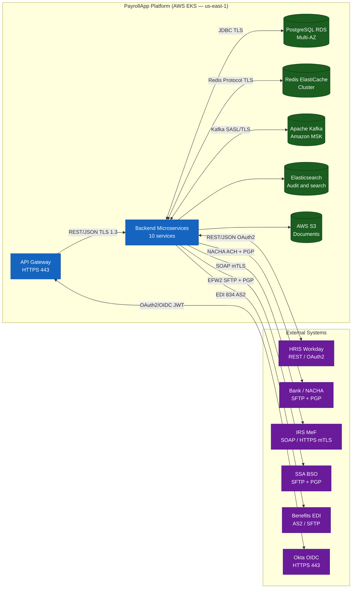

---

## 4. Solution Strategy

### 4.1 Core Architectural Strategy

| Strategy | Decision | Rationale |
|----------|---------|----|
| **Decomposition** | Domain-driven microservices (10 services) | Payroll subdomains (tax, benefits, payment) change at different rates and have distinct compliance boundaries; independent deployment reduces blast radius |
| **Communication** | Event-driven via Kafka for async flows; REST for sync queries | Payroll processing is a long-running pipeline; events enable replay, audit, and decoupled scaling |
| **Data Management** | Database-per-service (PostgreSQL); eventual consistency via Saga pattern | Prevents tight coupling; each service owns its schema; Saga for distributed transactions |
| **Deployment** | Cloud-native on AWS EKS with GitOps via ArgoCD | Auto-scaling for burst loads; immutable infrastructure; environment parity from dev to prod |
| **Security** | Zero-trust; mTLS everywhere; field-level encryption | Payroll PII and financial data require maximum protection at every layer |

### 4.2 Technology Decision Map

```mermaid
graph TD
    classDef goal fill:#1A237E,color:#fff,stroke:#0D1257
    classDef tech fill:#283593,color:#fff,stroke:#1A237E
    classDef benefit fill:#3949AB,color:#fff,stroke:#283593

    GOAL["PayrollApp Architectural Goals"]:::goal

    GOAL --> ACC["Accuracy Goal"]:::goal
    GOAL --> SCALE["Scalability Goal"]:::goal
    GOAL --> SEC["Security Goal"]:::goal
    GOAL --> COMP["Compliance Goal"]:::goal
    GOAL --> OPS["Operational Goal"]:::goal

    ACC --> JAVA["Java 17 + Spring Boot 3\nBigDecimal precision\nstrong typing"]:::tech
    ACC --> POSTGRES["PostgreSQL 15\nACID, NUMERIC 19-4\nrow-level security"]:::tech
    ACC --> IMMUTABLE["Immutable Payroll Runs\nAppend-only event log\nno overwrite after approval"]:::tech

    SCALE --> KAFKA["Apache Kafka MSK\nAsync parallel processing\nevent replay, partitioning"]:::tech
    SCALE --> K8S["Kubernetes EKS\nHPA auto-scaling\n20 pods during peak"]:::tech
    SCALE --> REDIS["Redis 7 ElastiCache\nTax table caching\n99 percent cache hit rate"]:::tech

    SEC --> OAUTH["OAuth2 / OIDC Okta\nZero-trust identity\nJWT short-lived tokens"]:::tech
    SEC --> VAULT["HashiCorp Vault\nField-level encryption\nSSN and bank tokenization"]:::tech
    SEC --> MTLS["Istio mTLS\nService mesh\nSPIFFE workload identity"]:::tech

    COMP --> AUDIT_ES["Elasticsearch\nImmutable audit index\n7-year retention"]:::tech
    COMP --> RULES["Tax Rule Engine\nConfig-driven\nno hardcoded rates"]:::tech
    COMP --> REPORT["Reporting Service\nACA, FLSA, W-2\nautomated templates"]:::tech

    OPS --> ARGOCD["ArgoCD GitOps\nDeclarative deployment\nenvironment parity"]:::tech
    OPS --> OTL["OpenTelemetry\nDistributed tracing\nmetrics, structured logs"]:::tech
```

### 4.3 Service Decomposition (DDD Bounded Contexts)

| Bounded Context | Service | Aggregate Root | Database Schema | Team Ownership |
|----------------|---------|---------------|-----------------|----------------|
| Employee Management | `employee-service` | `Employee` | `employee_db` | HR Platform Team |
| Payroll Calculation | `payroll-engine` | `PayrollRun` | `payroll_db` | Payroll Core Team |
| Tax Management | `tax-service` | `TaxWithholding` | `tax_db` | Tax and Compliance Team |
| Benefits and Deductions | `benefits-service` | `BenefitEnrollment` | `benefits_db` | Benefits Platform Team |
| Time and Attendance | `time-attendance-service` | `TimeRecord` | `timeattendance_db` | Workforce Team |
| Payment Processing | `payment-service` | `Payment` | `payment_db` | Payments Team |
| Reporting and Compliance | `reporting-service` | `ComplianceReport` | `reporting_db` | Compliance Team |
| Notifications | `notification-service` | `Notification` | `notification_db` | Platform Team |
| Audit and Logging | `audit-service` | `AuditEvent` | Elasticsearch | Security Team |
| API Edge | `api-gateway` | N/A | Redis (sessions) | Platform Team |

### 4.4 Quality Goal Achievement

| Quality Goal | Architectural Mechanism |
|-------------|------------------------|
| Accuracy | `BigDecimal` with scale-4 throughout; deterministic HALF_UP rounding; reconciliation job after every run |
| Reliability | Circuit breakers (Resilience4j); retry with exponential backoff; health checks + liveness/readiness probes |
| Security | mTLS between services; field-level encryption for SSN/bank accounts; RBAC via JWT claims |
| Performance | Parallel processing via Kafka partitions; Redis caching for tax tables; HPA on payroll-engine |
| Auditability | Every state change publishes an AuditEvent to Elasticsearch (write-once index) |
| Maintainability | Tax rules externalized to database/config; no hardcoded percentages in application code |

---

## 5. Building Block View

### 5.1 Level 1 — High-Level System Decomposition

The PayrollApp platform is organized into three major tiers: the **User Interface layer**, the **Platform Services layer** (microservices), and the **Data and Infrastructure layer**.

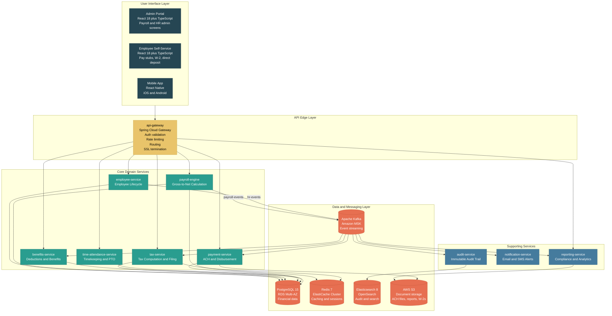

### 5.2 Level 2 — Service Decomposition and Event Flows

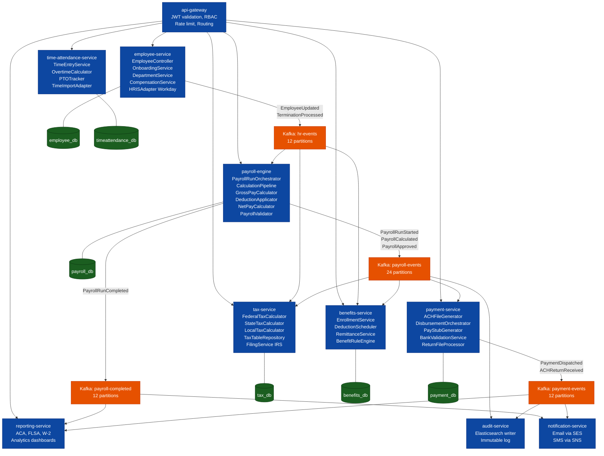

### 5.3 Level 3 — Payroll Engine Internal Structure

The `payroll-engine` implements a **pipeline / chain-of-responsibility** pattern for gross-to-net calculation:

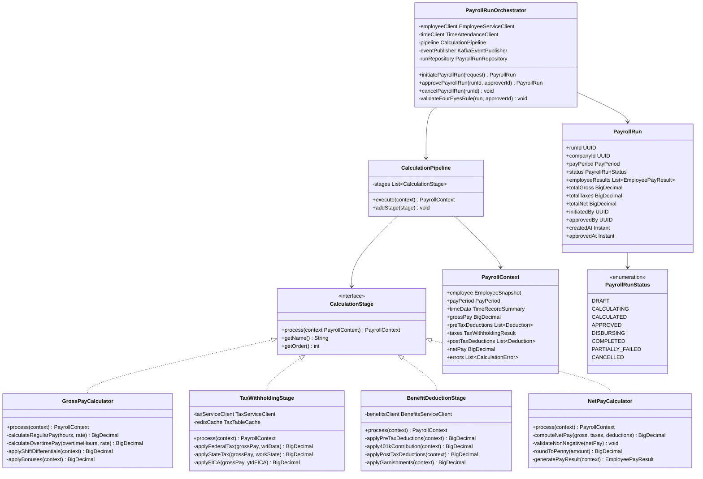

---

## 6. Runtime View

### 6.1 Payroll Run Processing — End-to-End Sequence

This scenario describes a standard semi-monthly payroll run for a 5,000-employee company from initiation through payment disbursement:

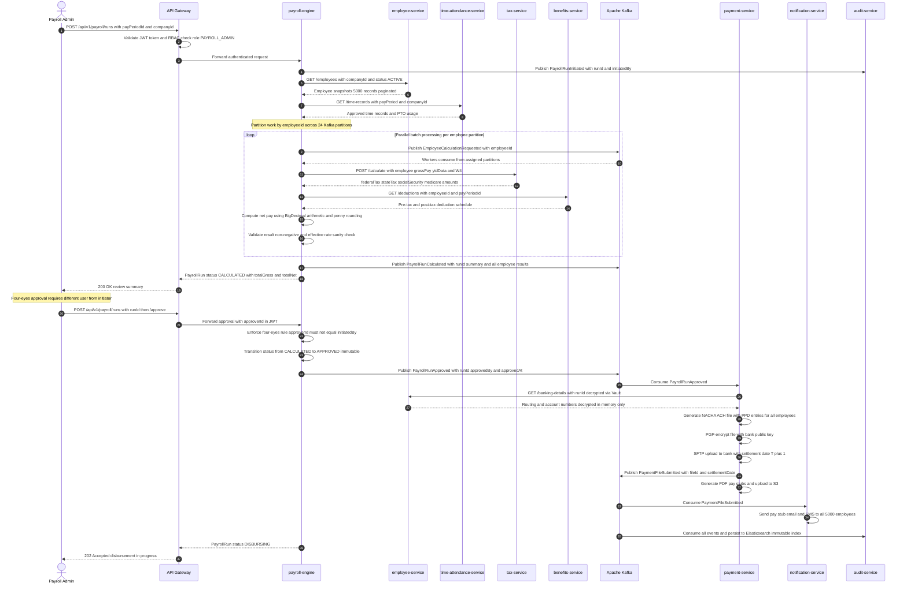

### 6.2 Tax Calculation Flow

```mermaid
flowchart TD
    classDef process fill:#0D47A1,color:#fff,stroke:#082B7A
    classDef decision fill:#B71C1C,color:#fff,stroke:#7F0000
    classDef data fill:#1B5E20,color:#fff,stroke:#0A3311
    classDef result fill:#4A148C,color:#fff,stroke:#2A0D5C

    START(["Tax Calculation Request\nemployeeId, grossPay\npayPeriod, workState, W4"])

    START --> LOAD_EMP["Load Employee W-4 Data\nFiling status, extra withholding\nclaims and adjustments"]:::process
    LOAD_EMP --> LOAD_YTD["Load YTD Accumulators\nYTD Gross, YTD FICA\nYTD State Taxes"]:::process
    LOAD_YTD --> CACHE_CHECK{"Tax Tables\ncached in Redis?"}:::decision

    CACHE_CHECK -->|"HIT 99 percent"| USE_CACHE["Use Cached Tax Tables\nTTL 24 hours"]:::data
    CACHE_CHECK -->|"MISS 1 percent"| LOAD_DB["Load from tax_db\nIRS Pub 15 plus State tables"]:::data
    LOAD_DB --> CACHE_STORE["Store in Redis\nTTL 24 hours"]:::data
    CACHE_STORE --> USE_CACHE

    USE_CACHE --> FIT["Calculate Federal Income Tax\n1 Annualize gross pay\n2 Apply standard deduction\n3 Look up tax bracket\n4 Compute annual tax\n5 De-annualize to pay period"]:::process

    FIT --> FICA_CHECK{"YTD Gross below\nSS Wage Base\n168600 in 2024?"}:::decision
    FICA_CHECK -->|"Yes wages covered"| APPLY_SS["Apply Social Security Tax\n6.2 percent of gross pay this period"]:::process
    FICA_CHECK -->|"No wage base exceeded"| SKIP_SS["Social Security equals zero\nWage base met for year"]:::process

    APPLY_SS --> APPLY_MED["Apply Medicare Tax\n1.45 percent of gross pay\nno wage base limit"]:::process
    SKIP_SS --> APPLY_MED

    APPLY_MED --> ADD_MED_CHECK{"YTD Gross above\n200000 threshold?"}:::decision
    ADD_MED_CHECK -->|"Yes"| ADD_MED["Apply Additional Medicare\nplus 0.9 percent on excess\nemployee only no employer match"]:::process
    ADD_MED_CHECK -->|"No"| STATE_TAX["Calculate State Income Tax\nPer employee work state\n50 state rule sets"]:::process
    ADD_MED --> STATE_TAX

    STATE_TAX --> LOCAL_CHECK{"Local Tax\nJurisdiction?"}:::decision
    LOCAL_CHECK -->|"Yes NYC Philly etc"| LOCAL_TAX["Apply Local or City Tax\nPer jurisdiction rate\nand wage base"]:::process
    LOCAL_CHECK -->|"No"| VALIDATE["Validate All Results\nNon-negative checks\nPenny rounding HALF UP\nEffective rate sanity 0 to 50 percent\nYTD accumulator update"]:::process
    LOCAL_TAX --> VALIDATE

    VALIDATE --> PASS_CHECK{"Validation\nPassed?"}:::decision
    PASS_CHECK -->|"Yes"| RESULT(["Return TaxWithholdingResult\nfederalIncomeTax\nstateTax\nsocialSecurity\nmedicare\nadditionalMedicare\nlocalTax\ntotalWithheld"])
    PASS_CHECK -->|"No"| ALERT["Raise TaxCalculationException\nLog to audit-service\nAlert Payroll Admin\nHold employee from payroll run"]:::process

    style START fill:#37474F,color:#fff
    style RESULT fill:#4A148C,color:#fff
```

### 6.3 Payment Disbursement Sequence

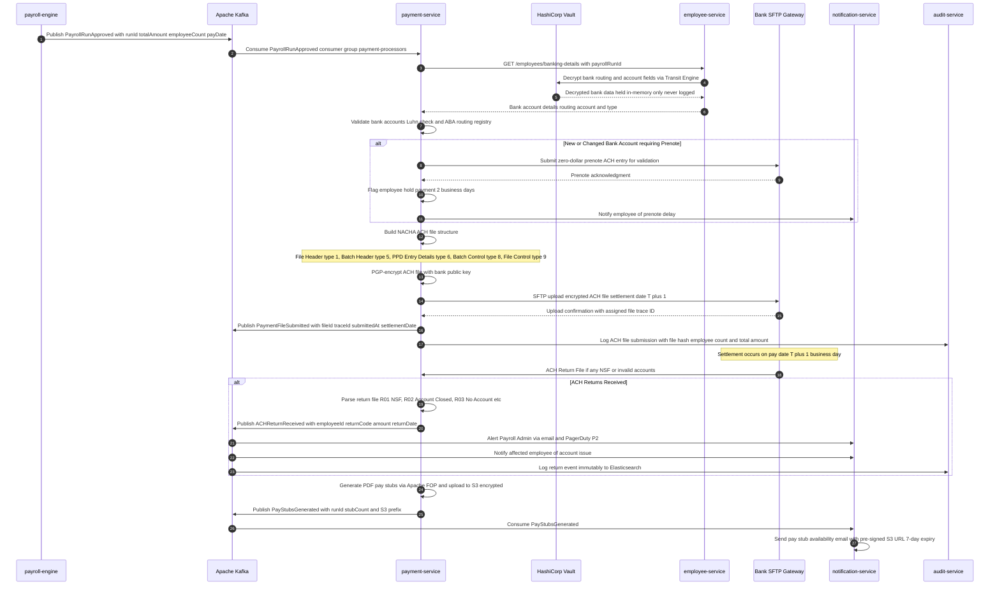

---

## 7. Deployment View

### 7.1 AWS Deployment Topology

```mermaid
graph TB
    classDef aws fill:#FF9900,color:#000,stroke:#CC7A00
    classDef k8s fill:#326CE5,color:#fff,stroke:#1A4FA8
    classDef db fill:#3F51B5,color:#fff,stroke:#283593
    classDef net fill:#00897B,color:#fff,stroke:#00695C
    classDef sec fill:#E53935,color:#fff,stroke:#B71C1C
    classDef cdn fill:#6D4C41,color:#fff,stroke:#4E342E
    classDef dr fill:#546E7A,color:#fff,stroke:#37474F

    subgraph INTERNET["Internet"]
        USERS["End Users\nBrowsers and Mobile Apps"]
        EXT_SYSTEMS["External Systems\nIRS, Banks, HRIS, SSA"]
    end

    subgraph AWS_EDGE["AWS Edge Services"]
        CF["CloudFront CDN\nReact SPA and Static Assets\nGlobal PoP caching"]:::cdn
        WAF["AWS WAF v2\nDDoS and OWASP rules\nBot mitigation"]:::sec
        R53["Route 53\nDNS failover\nHealth checks"]:::net
    end

    subgraph VPC_PRIMARY["VPC 10.0.0.0 slash 16 — us-east-1 Primary"]

        subgraph PUBLIC_SUBNETS["Public Subnets AZ-1a and AZ-1b"]
            ALB["Application Load Balancer\nHTTPS 443"]:::net
            NAT1["NAT Gateway AZ-1a"]:::net
            NAT2["NAT Gateway AZ-1b"]:::net
        end

        subgraph PRIVATE_APP["Private App Subnets 10.0.10.0 slash 23"]
            subgraph EKS_CLUSTER["EKS Cluster Kubernetes 1.29"]
                subgraph NS_PROD["Namespace payroll-prod"]
                    GW_POD["api-gateway 3 replicas"]:::k8s
                    EMP_POD["employee-service 3 replicas"]:::k8s
                    PAY_POD["payroll-engine 5 replicas HPA to 20"]:::k8s
                    TAX_POD["tax-service 3 replicas HPA to 10"]:::k8s
                    BEN_POD["benefits-service 3 replicas"]:::k8s
                    TIME_POD["time-attendance 2 replicas"]:::k8s
                    PMT_POD["payment-service 3 replicas"]:::k8s
                end
                subgraph NS_SUPPORT["Namespace payroll-support"]
                    RPT_POD["reporting-service 2 replicas"]:::k8s
                    NOTIF_POD["notification-service 2 replicas"]:::k8s
                    AUDIT_POD["audit-service 2 replicas"]:::k8s
                end
                subgraph NS_INFRA["Namespace infra"]
                    ISTIO["Istio Service Mesh\nmTLS and Observability"]:::k8s
                    VAULT_AG["Vault Agent Injector\nSidecar secrets"]:::k8s
                end
            end
        end

        subgraph PRIVATE_DATA["Private Data Subnets 10.0.20.0 slash 23"]
            RDS_P["Aurora PostgreSQL 15\nPrimary r6g.2xlarge\nMulti-AZ writer"]:::db
            RDS_R["Aurora Read Replica\nr6g.xlarge\nReporting queries"]:::db
            REDIS_C["ElastiCache Redis 7\nCluster mode\n3 shards times 2 replicas"]:::db
            MSK_C["Amazon MSK Kafka 3.6\n3 brokers m5.xlarge"]:::db
            OS_C["OpenSearch Service\n3 data nodes\nAudit and search"]:::db
        end

        subgraph STORAGE["Storage and Security"]
            S3_D["S3 payroll-documents\nPay stubs and W-2 PDFs"]:::aws
            S3_A["S3 ach-files\nEncrypted ACH archives"]:::aws
            S3_R["S3 compliance-reports\nACA and FLSA archives"]:::aws
            KMS["AWS KMS\nCMK per data class"]:::sec
            SM["Secrets Manager\n30-day auto-rotation"]:::sec
            CW["CloudWatch\nMetrics and Alarms"]:::aws
        end
    end

    subgraph VPC_DR["VPC — us-west-2 DR Warm Standby"]
        DR_EKS["EKS Cluster\n50 percent capacity standby"]:::dr
        DR_RDS["Aurora Global DB\nReplica lag below 1s"]:::dr
        DR_MSK["MSK Cluster\nMirrorMaker 2 replication"]:::dr
        DR_REDIS["ElastiCache\nRead-only replica"]:::dr
    end

    USERS --> CF --> WAF --> ALB
    EXT_SYSTEMS --> WAF
    R53 --> ALB
    ALB --> GW_POD
    GW_POD --> EMP_POD & PAY_POD & TAX_POD & BEN_POD & TIME_POD & PMT_POD & RPT_POD
    EMP_POD & PAY_POD & TAX_POD & BEN_POD & TIME_POD & PMT_POD --> RDS_P
    RPT_POD --> RDS_R
    PAY_POD & TAX_POD --> REDIS_C
    PAY_POD --> MSK_C
    AUDIT_POD --> OS_C
    PMT_POD & RPT_POD --> S3_D & S3_A & S3_R
    RDS_P -.->|"Global replication lag below 1s"| DR_RDS
    MSK_C -.->|"MirrorMaker 2"| DR_MSK
    REDIS_C -.->|"Async replication"| DR_REDIS
```

### 7.2 Kubernetes Resource Specifications

| Namespace | Service | Replicas Normal | Replicas Peak HPA | CPU Request / Limit | Memory Request / Limit |
|-----------|---------|-----------------|-------------------|---------------------|------------------------|
| payroll-prod | api-gateway | 3 | 8 | 500m / 1000m | 512Mi / 1Gi |
| payroll-prod | payroll-engine | 5 | 20 | 2000m / 4000m | 2Gi / 4Gi |
| payroll-prod | tax-service | 3 | 10 | 1000m / 2000m | 1Gi / 2Gi |
| payroll-prod | employee-service | 3 | 6 | 500m / 1000m | 512Mi / 1Gi |
| payroll-prod | payment-service | 3 | 6 | 1000m / 2000m | 1Gi / 2Gi |
| payroll-prod | benefits-service | 3 | 6 | 500m / 1000m | 512Mi / 1Gi |
| payroll-prod | time-attendance-service | 2 | 5 | 500m / 1000m | 512Mi / 1Gi |
| payroll-support | reporting-service | 2 | 4 | 1000m / 2000m | 2Gi / 4Gi |
| payroll-support | notification-service | 2 | 5 | 250m / 500m | 256Mi / 512Mi |
| payroll-support | audit-service | 2 | 4 | 500m / 1000m | 512Mi / 1Gi |

### 7.3 CI/CD Pipeline

```mermaid
flowchart LR
    classDef stage fill:#1A237E,color:#fff,stroke:#0D1257
    classDef gate fill:#B71C1C,color:#fff,stroke:#7F0000
    classDef env fill:#1B5E20,color:#fff,stroke:#0A3311
    classDef artifact fill:#E65100,color:#fff,stroke:#BF360C

    DEV["Developer\nFeature Branch Push"]:::stage
    PR["Pull Request\nCode Review\n2 approvals required"]:::stage
    CI["GitHub Actions CI\nUnit Tests JUnit 5\nIntegration Tests\nSAST SonarQube\nContainer Build\nImage Scan Trivy\nOpenAPI lint"]:::stage
    GATE1{"Quality Gate\nCoverage above 80 percent\nNo Critical CVEs\nSonar Quality Gate"}:::gate
    REG["Amazon ECR\nImage tagged SHA256\nplus Semver\nImmutable tags"]:::artifact
    DEV_ENV["ArgoCD DEV\nAuto-sync on merge\nSmoke tests"]:::env
    INT["Integration Tests\nPact contract tests\nAPI regression\nDB migration test"]:::stage
    GATE2{"Integration Gate\nAll contracts pass\nNo regression failures"}:::gate
    STG_ENV["ArgoCD STAGING\nBlue-Green deployment\nFull test suite"]:::env
    PERF["Performance Tests\nk6 load tests\n10k employees sim\nDAST OWASP ZAP"]:::stage
    GATE3{"Perf plus Security\np95 below 500ms\nNo new vulns"}:::gate
    APPROVAL["Manual Approval\nRelease Manager\nplus Change Ticket"]:::gate
    PROD_ENV["ArgoCD PROD\nBlue-Green deploy\n5 percent canary to 100\nNo deploy in freeze window"]:::env
    MONITOR["Post-Deploy\nDatadog SLO check\nPagerDuty integration\nAuto-rollback if error rate above 1 percent"]:::stage

    DEV --> PR --> CI --> GATE1
    GATE1 -->|"Pass"| REG --> DEV_ENV --> INT --> GATE2
    GATE1 -->|"Fail"| DEV
    GATE2 -->|"Pass"| STG_ENV --> PERF --> GATE3
    GATE2 -->|"Fail"| DEV
    GATE3 -->|"Pass"| APPROVAL --> PROD_ENV --> MONITOR
    GATE3 -->|"Fail"| DEV
```

---

## 8. Crosscutting Concepts

### 8.1 Domain Model (Entity-Relationship Diagram)

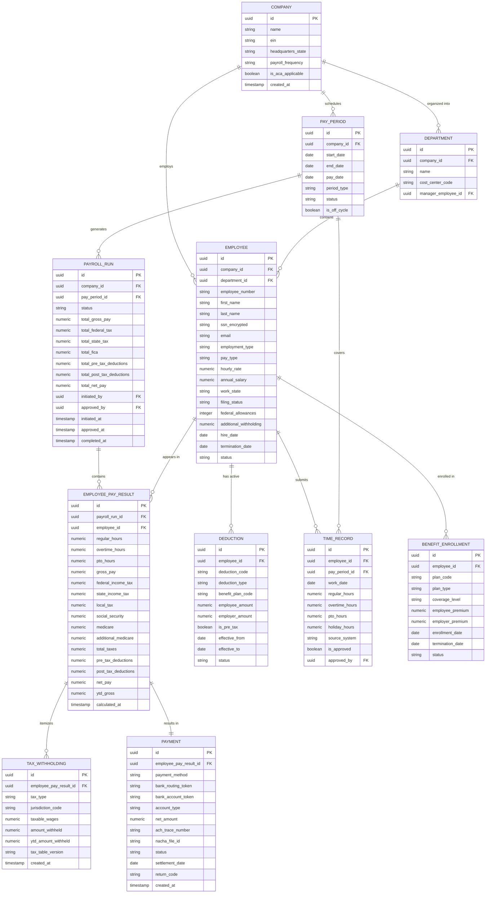

### 8.2 Security Architecture

PayrollApp implements a **defense-in-depth** security model with multiple independent protective layers.

#### Authentication and Authorization

| Layer | Mechanism | Details |
|-------|-----------|---------|
| **Identity Provider** | OAuth 2.0 / OIDC via Okta or Azure AD | All users authenticate via enterprise IdP; no local password storage in PayrollApp |
| **Token Format** | JWT signed with RS256 2048-bit key | Access tokens: 15-minute TTL; refresh tokens: 8-hour TTL; stored in httpOnly SameSite=Strict cookies |
| **Roles (RBAC)** | JWT `roles` claim enforced at API Gateway and service level | Roles: EMPLOYEE, PAYROLL_ADMIN, HR_ADMIN, FINANCE_VIEWER, SYSTEM_ADMIN, AUDITOR, TAX_ADMIN |
| **Service-to-Service** | Istio mTLS plus Kubernetes Service Accounts via SPIFFE/SPIRE | Each pod has a unique X.509 SVID; no shared secrets between pods |
| **MFA** | Enforced by IdP for PAYROLL_ADMIN and SYSTEM_ADMIN roles | TOTP or hardware key required; re-challenged for sensitive operations |

#### Data Protection

| Data Classification | Fields | Protection Mechanism |
|--------------------|--------|---------------------|
| **Top Secret** | SSN, Tax ID EIN | AES-256-GCM via Vault Transit Engine; never stored in plaintext; never logged |
| **Secret** | Bank routing and account numbers | Tokenized via Vault; only last-4 digits returned in API responses |
| **Confidential** | Salary, compensation history | Row-level security in PostgreSQL; field-level authorization in Spring Security |
| **Internal** | Gross and net pay, deduction amounts | RBAC-gated; employees see only their own records |
| **Audit Logs** | All system events | Write-once Elasticsearch index; no delete permissions; S3 Glacier after 1 year; retained 7 years |
| **ACH Files** | Bank payment files | PGP-encrypted with bank's public key before transmission; encrypted at rest in S3 via KMS |
| **Backups** | RDS snapshots, S3 exports | AES-256 via AWS KMS CMK; cross-account backup vault; immutable backup lock WORM |

### 8.3 Resilience Patterns

| Pattern | Library and Tool | Applied To | Configuration |
|---------|-----------------|-----------|---------------|
| **Circuit Breaker** | Resilience4j @CircuitBreaker | All synchronous inter-service REST calls | Open after 5 failures in 10s; half-open after 30s |
| **Retry with Backoff** | Resilience4j @Retry | External API calls IRS HRIS bank SFTP | Max 3 retries; exponential backoff 1s 2s 4s; jitter 20 percent |
| **Bulkhead** | Resilience4j @Bulkhead semaphore | tax-service and payment-service thread isolation | Max 25 concurrent calls per client; queue 10 |
| **Timeout** | Resilience4j @TimeLimiter | All outbound HTTP calls | Default 5s; payment-service SFTP uploads 120s |
| **Dead Letter Queue** | Kafka DLQ topics with .dlq suffix | Kafka consumer failures after 3 retries | Manual review via admin portal; retry or discard |
| **Idempotency** | Idempotency-Key header plus DB unique constraint | Payment submission and payroll run initiation | UUID idempotency key; 24-hour deduplication window |
| **Saga Choreography** | Kafka events plus compensating transactions | Payroll run to payment disbursement distributed flow | Compensating events: CancelPayrollRun, RefundPayment |
| **Read Replica** | Aurora PostgreSQL Read Replica | Reporting queries and audit log reads | Route all SELECT from reporting-service to replica |

### 8.4 Payroll Run State Machine

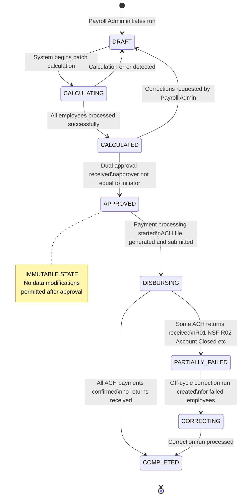

### 8.5 Observability and Audit

| Concern | Tool | Details |
|---------|------|---------|
| **Metrics** | Prometheus plus Grafana via kube-prometheus-stack | Per-service JVM metrics, payroll run duration histograms, Kafka consumer lag, HTTP error rates |
| **Structured Logging** | Logback ECS format to CloudWatch Logs and OpenSearch | JSON structured logs; correlation ID propagated via MDC and HTTP header X-Correlation-ID |
| **Distributed Tracing** | OpenTelemetry to AWS X-Ray | Full trace from API Gateway through all microservices; 10 percent sampling normal; 100 percent on errors |
| **Alerting** | PagerDuty plus CloudWatch Alarms | P1 Payroll run failure or payment error; P2 Service error rate above 1 percent; P3 SLA breach warning |
| **SLO Tracking** | Datadog SLO dashboards plus error budgets | 99.9 percent availability target; 30-day rolling window; burn-rate alerts at 2x and 5x |
| **Audit Trail** | Elasticsearch write-once index plus S3 Glacier archive | Every state change in every service; actor, timestamp, before/after state; 7-year retention |

---

## 9. Architecture Decisions

### ADR-001: Microservices Architecture over Modular Monolith

| Field | Value |
|-------|-------|
| **Status** | Accepted |
| **Date** | 2024-Q1 |
| **Deciders** | CTO, Principal Architect, Engineering Leads |

**Context**: PayrollApp needed to support frequent, independent updates to tax rules, benefits integrations, and payment processing — each governed by different regulatory timelines and team ownership boundaries. A modular monolith was considered as an alternative to reduce operational overhead.

**Decision**: Decompose the system into 10 domain-aligned microservices following DDD bounded contexts.

**Rationale**:
- Tax tables change on IRS publication dates; payment service changes on NACHA rule updates; employee service changes with HR policy — all on independent schedules
- Payroll-engine batch processing requires 4x more compute than normal operations; per-service HPA enables targeted scaling
- A vulnerability in the notification service should not require redeploy of the payroll-engine

**Consequences**:
- Positive: Independent deployment per bounded context; no deployment coordination between teams
- Positive: Per-service scaling during payroll burst (payroll-engine scales to 20 pods)
- Positive: Isolated failure domains; circuit breakers contain cascading failures
- Negative: Increased operational complexity requiring 10 services to monitor and deploy
- Negative: Distributed transaction complexity requiring Saga choreography pattern
- Negative: Network latency between services (mitigated by co-location within same AWS AZ)

**Alternatives Rejected**: Modular monolith rejected due to inability to independently scale payroll-engine during batch processing peaks without over-provisioning the entire application.

---

### ADR-002: Event-Driven Architecture with Apache Kafka

| Field | Value |
|-------|-------|
| **Status** | Accepted |
| **Date** | 2024-Q1 |
| **Deciders** | Principal Architect, Backend Tech Lead |

**Context**: Payroll processing is a long-running pipeline taking minutes for large companies. Multiple downstream services (tax, benefits, payments, notifications, audit) must react to payroll lifecycle events. Synchronous REST chaining creates tight coupling and cascade failure risk.

**Decision**: Use Apache Kafka via Amazon MSK as the backbone for all asynchronous payroll lifecycle events.

**Key Kafka Topics**:

| Topic | Producer | Consumers | Partitions | Partition Key |
|-------|---------|-----------|-----------|---------------|
| `hr-events` | employee-service | payroll-engine, benefits-service, tax-service | 12 | companyId |
| `payroll-events` | payroll-engine | tax-service, benefits-service, audit-service | 24 | employeeId |
| `payroll-completed` | payroll-engine | payment-service, notification-service, reporting-service | 12 | companyId |
| `payment-events` | payment-service | notification-service, audit-service, reporting-service | 12 | companyId |
| `audit-events` | all services | audit-service | 48 | serviceId |

**Consequences**:
- Positive: Temporal decoupling — services can be temporarily unavailable and catch up via Kafka offset replay
- Positive: Event replay enables debugging and reprocessing of failed pay runs without re-running all steps
- Positive: Audit trail built naturally from event stream; no separate CDC setup required
- Positive: Fan-out at no extra cost — multiple consumers can process each event independently
- Negative: Message ordering guarantees required within employee partition (solved by partitioning on `employeeId`)
- Negative: Eventual consistency requires compensation logic for errors mid-pipeline (Saga pattern)
- Negative: Additional operational burden of managing MSK cluster, consumer lag monitoring, DLQ handling

---

### ADR-003: PostgreSQL as Primary Data Store with Database-per-Service Pattern

| Field | Value |
|-------|-------|
| **Status** | Accepted |
| **Date** | 2024-Q1 |
| **Deciders** | Principal Architect, DBA Lead |

**Context**: Payroll calculations require ACID transactions and precise decimal arithmetic. Each microservice must own its data to maintain bounded context isolation and allow independent schema evolution.

**Decision**: Each service has its own PostgreSQL 15 database (separate Aurora cluster per production service). No cross-service database joins. All data sharing occurs via REST API calls or Kafka events only.

**Rationale for PostgreSQL over alternatives**:
- Native `NUMERIC(19,4)` type eliminates floating-point errors in financial calculations
- Row-level security (RLS) enables salary data access control within the database layer
- Logical replication for read replicas and change data capture (CDC) via Debezium if needed
- Aurora PostgreSQL provides Multi-AZ HA, automated failover, and point-in-time recovery without DBA overhead

**Alternatives Rejected**:
- MySQL: Less mature support for row-level security and less precise NUMERIC handling
- MongoDB: No ACID multi-document transactions; unsuitable for financial ledger data
- CockroachDB: Considered for geo-distribution but adds complexity and licensing cost not justified

**Consequences**:
- Positive: Financial calculation integrity guaranteed via ACID transactions
- Positive: Service schema evolution without cross-team coordination
- Positive: PCI and SOC 2 data isolation requirements satisfied
- Negative: No cross-service relational queries; reporting-service must replicate data via Kafka events
- Negative: Higher infra cost (multiple RDS instances) vs. shared schema

---

### ADR-004: Immutable Payroll Runs (Append-Only Model)

| Field | Value |
|-------|-------|
| **Status** | Accepted |
| **Date** | 2024-Q2 |
| **Deciders** | Principal Architect, Compliance Officer, Legal |

**Context**: IRS, DOL, and FLSA mandate that payroll records be immutable once processed. Corrections to a finalized payroll run must be traceable and auditable, not silent overwrites of existing records.

**Decision**: Once a `PayrollRun` reaches `APPROVED` status, all data fields become immutable. Corrections are handled exclusively via **Off-Cycle Payroll Runs** that reference the original run ID. The audit trail captures the full before/after state of every correction event.

**Immutability Enforcement Mechanisms**:
1. Database: `CHECK` constraint prevents status regression from APPROVED
2. Application: Spring Security `@PreAuthorize` rejects mutation operations on APPROVED runs
3. Audit: Elasticsearch write-once index captures all attempts, including rejected ones
4. Infrastructure: RDS IAM policies prevent direct SQL updates to `payroll_run` table from application service accounts

**Consequences**:
- Positive: Full regulatory audit trail for every payroll event (IRS 7-year requirement met)
- Positive: Idempotent reprocessing possible via Kafka event replay without risk of data corruption
- Positive: Zero risk of accidental overwrite of completed payroll data
- Negative: Off-cycle correction workflow adds operational complexity for payroll administrators
- Negative: Slightly larger storage footprint due to corrections creating new run records

---

### ADR-005: Asynchronous Tax Calculation with Synchronous Fallback

| Field | Value |
|-------|-------|
| **Status** | Accepted |
| **Date** | 2024-Q2 |
| **Deciders** | Principal Architect, Backend Tech Lead, Product Manager |

**Context**: Tax calculation for 10,000 employees in parallel requires high throughput (batch mode). However, individual employee tax previews in the payroll admin UI require sub-second response times (interactive mode). A single synchronous design cannot satisfy both requirements.

**Decision**: Tax calculation operates in two modes:
1. **Batch mode (async)**: During payroll runs, tax calculations are triggered via Kafka events, processed in parallel across multiple tax-service instances, with results returned via Kafka response topics
2. **Preview mode (sync)**: Individual on-demand calculations via a direct REST endpoint with Redis-cached tax tables

**Cache Strategy**:
- Tax tables loaded from `tax_db` on first request, cached in Redis with 24-hour TTL
- Cache invalidated immediately when tax administrator updates tax tables via admin API
- Cache warm-up job runs nightly at 2 AM to pre-populate for next business day's payroll runs

**Consequences**:
- Positive: Batch throughput of approximately 2,000 employees per minute per tax-service instance
- Positive: UI preview response time below 200ms at p99 due to Redis cache (99 percent hit rate)
- Positive: tax-service can scale independently of payroll-engine based on Kafka consumer lag
- Negative: Cache invalidation must occur within 24 hours of IRS table publication (monitoring required)
- Negative: Two code paths (sync and async) require separate testing and maintenance

---

## 10. Quality Requirements

### 10.1 Quality Tree

```mermaid
graph TD
    classDef root fill:#1A237E,color:#fff,stroke:#0D1257
    classDef branch fill:#283593,color:#fff,stroke:#1A237E
    classDef leaf fill:#3949AB,color:#fff,stroke:#283593

    Q["PayrollApp Quality Goals"]:::root

    Q --> ACC["1. Accuracy"]:::branch
    Q --> REL["2. Reliability"]:::branch
    Q --> SEC["3. Security"]:::branch
    Q --> PERF["4. Performance"]:::branch
    Q --> COMP["5. Compliance"]:::branch
    Q --> MAINT["6. Maintainability"]:::branch

    ACC --> ACC1["Calculation Precision\nAll amounts to 0.01 cents"]:::leaf
    ACC --> ACC2["Reconciliation\nAuto-verify totals post-run"]:::leaf
    ACC --> ACC3["Tax Table Accuracy\n99.99 percent match to IRS rates"]:::leaf

    REL --> REL1["Availability\n99.9 percent uptime SLA"]:::leaf
    REL --> REL2["Payroll Engine\n99.95 percent availability"]:::leaf
    REL --> REL3["DR Recovery\nRTO 1hr RPO 15min"]:::leaf

    SEC --> SEC1["Data Encryption\nSSN and bank AES-256"]:::leaf
    SEC --> SEC2["Access Control\nRBAC plus MFA enforced"]:::leaf
    SEC --> SEC3["Audit Logging\nAll state changes logged"]:::leaf

    PERF --> PERF1["Batch Payroll\n10k employees below 5 minutes"]:::leaf
    PERF --> PERF2["API Response\n95th percentile below 500ms"]:::leaf
    PERF --> PERF3["Tax Preview\nbelow 200ms at p99"]:::leaf

    COMP --> COMP1["Tax Law Updates\nApplied within 24 hours"]:::leaf
    COMP --> COMP2["ACA Reporting\n100 percent accurate annual filing"]:::leaf
    COMP --> COMP3["Audit Trail\n7-year immutable retention"]:::leaf

    MAINT --> MAINT1["Tax Rules\nConfig-driven no code change"]:::leaf
    MAINT --> MAINT2["Test Coverage\nAbove 80 percent unit plus integration"]:::leaf
    MAINT --> MAINT3["API Contracts\nOpenAPI consumer-driven Pact"]:::leaf
```

### 10.2 Quality Scenarios

| ID | Quality Attribute | Stimulus | Response | Measure |
|----|------------------|---------|----------|---------|
| QS-01 | **Accuracy** | Payroll Admin runs semi-monthly payroll for 8,500 employees | All gross-to-net calculations complete; reconciliation report confirms totals match | Zero calculation errors; penny-rounding discrepancy at most $0.01 per employee |
| QS-02 | **Reliability** | Primary RDS instance fails during payroll run | Aurora Multi-AZ failover activates automatically | Automatic failover in less than 30 seconds; payroll run resumes without data loss |
| QS-03 | **Performance** | Payroll run for 50,000 employees triggered | All employees calculated in parallel via Kafka partitions across 20 pods | Total run time under 25 minutes; p99 per-employee calculation under 3 seconds |
| QS-04 | **Security** | Unauthorized user attempts to access another employee's pay stub | RBAC check in employee-service denies the request | HTTP 403 returned; access attempt logged to audit-service within 100ms |
| QS-05 | **Compliance** | IRS publishes updated 2025 federal withholding tables | Tax Administrator updates tables via admin API | Updated tables active within 4 hours; all subsequent calculations use new tables |
| QS-06 | **Availability** | AWS us-east-1 AZ outage during payroll processing | Kubernetes pods reschedule to healthy AZ automatically | Service restored in less than 2 minutes; in-flight payroll runs resume from last checkpoint |
| QS-07 | **Auditability** | Internal auditor requests full audit trail for an employee's 2024 pay history | Auditor queries audit-service read-only portal | Complete immutable log returned within 5 seconds; includes all state transitions |
| QS-08 | **Maintainability** | New state Colorado FAMLI payroll tax effective January 1 | Tax Administrator adds new rule via configuration API | New tax applied with zero code deployment; change takes effect at configured date |

### 10.3 Performance Targets

| Component | Target | Measurement Method |
|-----------|--------|--------------------|
| Payroll batch run 10k employees | under 5 minutes end-to-end | Automated post-run timing in payroll-engine |
| Payroll batch run 100k employees | under 45 minutes | Quarterly load test in staging environment |
| Tax calculation individual cached | under 200ms at p99 | Prometheus histogram `tax_calculation_duration_seconds` |
| API response general CRUD | under 500ms at p95 | CloudWatch ALB TargetResponseTime percentiles |
| ACH file generation 50k records | under 2 minutes | payment-service internal metric |
| W-2 generation year-end 100k employees | under 30 minutes | reporting-service run log |
| Database query employee record lookup | under 50ms at p99 | RDS Performance Insights |
| Kafka message lag audit events at steady state | under 5 seconds | Kafka consumer lag monitoring via Prometheus |

---

## 11. Risks and Technical Debt

### 11.1 Identified Risks

| ID | Risk | Probability | Impact | Severity | Mitigation Strategy |
|----|------|------------|--------|----------|---------------------|
| R-01 | **Distributed Transaction Inconsistency** — Saga rollback failure leaves payroll in partial state (calculated but not paid) | Medium | Critical | HIGH | Implement compensating transactions with Kafka DLQ; weekly reconciliation job comparing payroll_db to payment_db; PagerDuty P1 alert on mismatch |
| R-02 | **IRS Tax Table Update Latency** — New tax rates not applied before first payroll run of the year | Low | High | MEDIUM | Automated monitoring of IRS publication feeds via RSS; alert 30 days before effective date; automated import pipeline with approval workflow |
| R-03 | **ACH Return Cascade** — Large-scale bank account invalidations cause mass payment failures | Low | High | MEDIUM | Prenote validation for new accounts; batch size limits; fallback to check printing; PagerDuty P1 alert for return rate above 1 percent |
| R-04 | **HashiCorp Vault Unavailability** — Vault outage prevents decryption of SSN and bank account fields | Low | Critical | MEDIUM | Vault HA mode with 3-node Raft cluster; read-through cache for non-rotating keys; DR Vault instance in us-west-2 region |
| R-05 | **HRIS Integration Break** — Workday API version upgrade silently breaks employee synchronization | Medium | High | MEDIUM | Consumer-driven contract tests via Pact; canary validation on HRIS sync job; manual override capability for emergency data entry |
| R-06 | **Kafka Broker Failure** — MSK broker failure during active payroll run causes message loss | Low | High | MEDIUM | Amazon MSK 3-broker cluster with replication factor 3; min.insync.replicas equals 2; automatic broker recovery by MSK |
| R-07 | **Regulatory Non-Compliance** — State tax law change missed due to monitoring gap | Low | Critical | HIGH | Bloomberg Tax and KPMG regulatory feed subscriptions; quarterly compliance review with legal team; automated effective-date reminders |
| R-08 | **Database Performance Degradation** — PostgreSQL query performance degrades under year-end reporting load | Medium | Medium | LOW | Quarterly EXPLAIN ANALYZE reviews; automated index maintenance; read replicas for reporting; PgBouncer connection pooling |
| R-09 | **Security Breach via Compromised Service Account** — PII exfiltration through compromised pod identity | Low | Critical | HIGH | Zero-trust network with Istio mTLS; Vault secret rotation every 30 days; Datadog APM anomaly detection; annual penetration testing |
| R-10 | **Cloud Provider Lock-in** — Dependency on AWS-specific services prevents migration | Low | Medium | LOW | Core payroll logic in vendor-neutral Spring Boot; Terraform abstracts cloud specifics; annual portability review |

### 11.2 Technical Debt Register

| ID | Debt Item | Location | Effort | Business Impact | Remediation Plan | Target Quarter |
|----|-----------|---------|--------|-----------------|-----------------|----------------|
| TD-01 | **Synchronous HRIS Polling** — employee-service polls Workday every 15 minutes instead of real-time webhook subscription | employee-service HRISAdapter.java | Medium 2 sprints | 15-minute lag in employee termination processing; risk of terminated employee receiving pay | Migrate to Workday event subscription API; use Kafka for internal fan-out | Q3 2025 |
| TD-02 | **Hardcoded Local Tax Rates** — 3 local tax jurisdictions hardcoded in LocalTaxCalculator as emergency fallback | tax-service LocalTaxCalculator.java | Small 1 sprint | Incorrect calculations if hardcoded values drift from actual rates | Migrate all rates to tax_db.local_tax_rates table with effective date versioning | Q2 2025 |
| TD-03 | **Missing Consumer-Driven Contract Tests** — benefits-service and payroll-engine lack Pact contract tests | tests/contract/ directory | Medium 2 sprints | Silent API breakage possible on independent deployments | Add Pact consumer tests for all service boundaries; enforce in CI pipeline as blocking gate | Q2 2025 |
| TD-04 | **Manual ACH Return Processing** — return file parsing is partially manual via exported spreadsheet | payment-service ReturnFileProcessor.java | Large 1 quarter | Slow resolution of failed payments; employee dissatisfaction; risk of missed returns | Build automated R-code parser with correction workflow and admin notification | Q4 2025 |
| TD-05 | **Reporting Service DB Coupling** — reporting-service reads 6 tables via direct database queries across service boundaries | reporting-service ReportingRepository.java | Large 1 quarter | Silent breakage when source service changes schema; violates database-per-service principle | Migrate to event-sourced projection model consuming Kafka events | Q4 2025 |
| TD-06 | **No Chaos Engineering Tests** — no automated failure injection in staging environment | CI/CD pipeline configuration | Medium 2 sprints | Unknown system behavior during actual outages; resilience SLOs unverified | Introduce AWS Fault Injection Simulator scenarios in staging; run monthly | Q3 2025 |
| TD-07 | **Elasticsearch Index Without ILM** — audit index will grow unbounded affecting query performance | audit-service index configuration | Small 1 sprint | Storage costs increase; query performance degrades after 24 months of data | Configure ILM policy: hot 90 days, warm 1 year, cold 7 years, then delete | Q2 2025 |

### 11.3 Technical Debt Priority Matrix

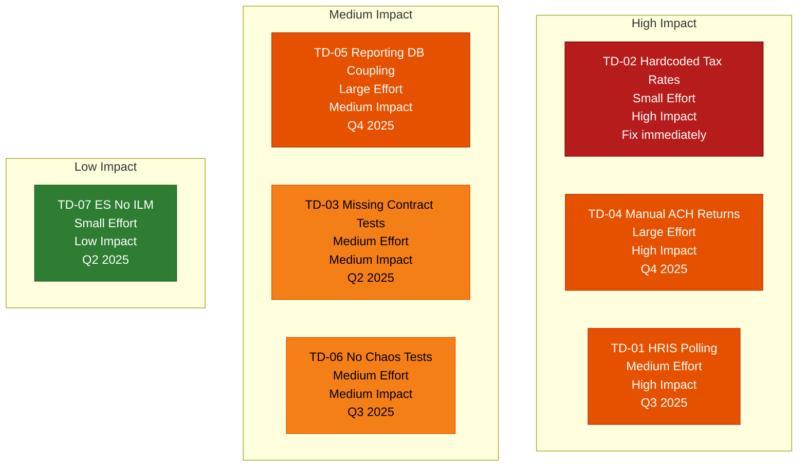

---

## 12. Glossary

### Payroll Domain Terms

| Term | Definition |
|------|-----------|
| **ACH** | Automated Clearing House — the U.S. electronic funds transfer network used for direct deposit payroll payments, governed by NACHA operating rules. PPD (Prearranged Payment and Deposit) is the standard ACH entry type for payroll direct deposit. |
| **ACA** | Affordable Care Act — federal law requiring employers with 50 or more full-time equivalent employees (Applicable Large Employers) to offer qualifying health insurance and report coverage annually via Forms 1094-C and 1095-C. |
| **Annualization** | The process of projecting a single pay period's wages to an annual equivalent for income tax bracket lookup, then de-annualizing the computed annual tax back to the pay period amount. Required by IRS Publication 15 method. |
| **Applicable Large Employer (ALE)** | Under ACA, an employer with 50 or more full-time equivalent employees in the prior calendar year, triggering employer shared responsibility requirements. |
| **Benefit-in-Kind** | Non-cash compensation such as a company vehicle or employer-paid life insurance over $50,000 that must be added to taxable wages as imputed income for withholding purposes. |
| **COBRA** | Consolidated Omnibus Budget Reconciliation Act — federal law requiring employers with 20 or more employees to offer continuation health coverage to qualified beneficiaries after a qualifying event such as termination or reduction in hours. |
| **Cost Center** | An organizational unit, typically a department or project, to which labor costs are allocated for financial reporting and general ledger journal entries. |
| **Deduction** | An amount subtracted from gross pay. Pre-tax deductions (401k, FSA, HSA, health premiums) reduce taxable income; post-tax deductions (Roth 401k, garnishments, after-tax life insurance) do not. |
| **Direct Deposit** | Electronic payment of net wages directly to an employee's bank account via ACH transfer, typically settling the business day before or on the stated pay date. |
| **EFW2** | Electronic Filing of W-2 — the SSA-specified electronic format for submitting W-2 wage data (formerly called MMREF). Required for employers filing 100 or more W-2s electronically to the SSA. |
| **Employer Match** | The employer's contribution to an employee's 401k or retirement plan, typically expressed as a percentage of the employee's elective deferral up to a specified wage base (for example, 50 percent match on up to 6 percent of pay). |
| **FICA** | Federal Insurance Contributions Act — mandates Social Security tax (6.2 percent up to the annual wage base, $168,600 in 2024) and Medicare tax (1.45 percent, no wage base), split equally between employer and employee. An Additional Medicare Tax of 0.9 percent applies to employee wages exceeding $200,000. |
| **FLSA** | Fair Labor Standards Act — federal law establishing minimum wage, overtime pay (1.5 times the regular rate for hours exceeding 40 in a workweek for non-exempt employees), child labor standards, and recordkeeping requirements. |
| **FMLA** | Family and Medical Leave Act — federal law entitling eligible employees at covered employers to 12 weeks of unpaid, job-protected leave per year for qualifying family or medical reasons. |
| **FSA** | Flexible Spending Account — an employer-sponsored pre-tax benefit account allowing employees to set aside funds for qualified healthcare expenses (Health FSA) or dependent care expenses (Dependent Care FSA), funded via payroll deductions. |
| **FUTA** | Federal Unemployment Tax Act — employer-only tax assessed at 6 percent on the first $7,000 of each employee's wages per year; effective rate is typically 0.6 percent after the 5.4 percent credit for timely SUTA payments. |
| **Garnishment** | A court-ordered or government-issued post-tax payroll deduction to satisfy a debt obligation, including child support orders, tax levies, student loan defaults, and creditor judgments. Subject to CCPA limits on the maximum amount that may be withheld per pay period. |
| **Gross Pay** | Total compensation earned before any deductions or taxes are applied. Includes base wages or salary, overtime earnings, bonuses, commissions, shift differentials, holiday pay, and other earnings types. |
| **HSA** | Health Savings Account — a pre-tax savings account paired exclusively with a High-Deductible Health Plan (HDHP). Both employer and employee contributions are pre-tax, and funds grow tax-free for qualified medical expenses. |
| **IRS Publication 15** | Also known as Employer's Tax Guide or Circular E — the IRS annual publication providing guidance on federal income tax withholding tables, Social Security and Medicare tax rates, and employer payroll tax obligations. Updated each January. |
| **NACHA** | National Automated Clearing House Association — the governing body that establishes the rules, standards, and formats for the ACH network, including payroll direct deposit. Compliance with NACHA Operating Rules is required for all ACH origination. |
| **Net Pay** | The amount deposited to or paid to the employee after all pre-tax deductions, income taxes, FICA taxes, and post-tax deductions are subtracted from gross pay. Also called take-home pay. |
| **Off-Cycle Payroll Run** | A payroll run executed outside the normal pay schedule, used to correct errors in a completed run, process termination payments, issue manual checks, or run bonus payments that should not wait for the next regular cycle. |
| **Pay Period** | The recurring time interval for which hours are accumulated and wages are computed: weekly (52 per year), biweekly (26 per year), semi-monthly (24 per year), or monthly (12 per year). |
| **Pay Stub** | A document provided to the employee with each payment detailing earnings by type, all deductions with descriptions, all taxes withheld, and net pay for both the current period and year-to-date cumulative totals. |
| **Payroll Run** | A complete execution of the payroll processing pipeline for all eligible employees for a specific pay period, resulting in authorized payment disbursements, tax liability records, and journal entries. |
| **PTO** | Paid Time Off — employer-provided paid leave encompassing vacation, sick time, and personal days, accrued according to company policy and tracked in the time-attendance-service against hourly or salaried rates. |
| **Reconciliation** | The systematic process of verifying that the sum of all individual employee gross pay, tax withholdings, and deductions equals the corresponding totals in the payroll run summary and that those totals match the general ledger payroll expense entries. |
| **Roth 401k** | An after-tax elective deferral to a 401k plan allowing employees to contribute post-tax dollars that grow tax-free. Unlike traditional 401k, Roth contributions do not reduce current taxable income and are deducted as post-tax items in payroll. |
| **SUTA** | State Unemployment Tax Act — state-level employer unemployment insurance tax; rates vary by state and employer experience rating (claims history); wage bases differ from FUTA and vary by state from $7,000 to over $60,000. |
| **Tax Withholding** | The amount of income tax the employer is legally required to deduct from an employee's wages and remit to federal, state, and local tax authorities on the employee's behalf, based on W-4 elections and current tax tables. |
| **W-2 Form** | Wage and Tax Statement — the annual document issued by employers to employees and filed with the SSA reporting total wages paid and all taxes withheld during the calendar year. Must be furnished to employees by January 31. |
| **W-4 Form** | Employee's Withholding Certificate — filed by the employee with the employer to declare filing status, number of dependents, additional withholding, and exemption claims for federal income tax calculation. Redesigned in 2020. |
| **Wage Base** | The maximum amount of an employee's annual wages subject to a specific payroll tax. Social Security wage base is $168,600 for 2024; FUTA is $7,000; each state has its own SUTA wage base. |
| **Year-to-Date (YTD)** | The cumulative total of wages, taxes withheld, or deductions from January 1 of the current calendar year through the current pay period end date. Critical for wage base limit tracking and accurate W-2 preparation at year-end. |

### Technical Terms

| Term | Definition |
|------|-----------|
| **ADR** | Architecture Decision Record — a structured document capturing a significant architectural decision, its context, options evaluated, the decision made, and resulting consequences. |
| **Bounded Context** | A Domain-Driven Design concept defining an explicit boundary within which a specific domain model applies and a single team has ownership. Each PayrollApp microservice represents one bounded context. |
| **Circuit Breaker** | A resilience design pattern that monitors downstream service calls and temporarily stops calling a failing service to prevent cascading failures, implemented via Resilience4j in PayrollApp. |
| **DDD** | Domain-Driven Design — a software design approach placing the business domain model at the center of development decisions, using concepts like bounded contexts, aggregates, and ubiquitous language. |
| **EKS** | Amazon Elastic Kubernetes Service — AWS managed Kubernetes control plane, handling upgrades, patching, and HA of the Kubernetes master nodes. |
| **GitOps** | An operational model where all infrastructure and deployment configuration is stored in Git as the single source of truth and applied automatically via a reconciliation agent (ArgoCD). |
| **HPA** | Horizontal Pod Autoscaler — Kubernetes mechanism that automatically adjusts the number of pod replicas based on observed CPU utilization, memory, or custom metrics like Kafka consumer lag. |
| **Idempotency** | The property of an operation that produces the same result regardless of how many times it is executed with the same input. Critical for payment APIs to prevent double-payment on network retries. |
| **Istio** | An open-source service mesh providing transparent mTLS, traffic management, observability, and policy enforcement between Kubernetes pods without application code changes. |
| **MSK** | Amazon Managed Streaming for Apache Kafka — fully managed Kafka service on AWS handling broker provisioning, patching, and replication. |
| **mTLS** | Mutual Transport Layer Security — a protocol where both the client and the server authenticate each other using X.509 certificates, used for all service-to-service communication in PayrollApp via Istio. |
| **OpenTelemetry** | A vendor-neutral observability framework providing standardized APIs, SDKs, and agents for collecting metrics, logs, and distributed traces from applications. |
| **RBAC** | Role-Based Access Control — an authorization model in which permissions are assigned to roles rather than individual users, and users are granted roles based on their job function. |
| **Saga Pattern** | A distributed transaction pattern where a sequence of local service transactions is coordinated via asynchronous events. If a step fails, compensating transactions are triggered to undo the effects of prior steps. |
| **SPIFFE / SPIRE** | Secure Production Identity Framework For Everyone — a standard and runtime for issuing cryptographic identities (SVIDs) to workloads in distributed systems, enabling zero-trust mTLS between Kubernetes pods. |
| **Vault Transit Engine** | HashiCorp Vault's encryption-as-a-service feature that performs AES-256-GCM encryption and decryption of data without the application ever holding the encryption key material directly. |

---

*This document is maintained by the PayrollApp Platform Architecture Team.*
*For questions or updates, contact the Principal Architect or open an issue in the architecture repository.*

*Document version: 1.0.0 | Generated: 2025-01-30 | Next scheduled review: 2025-07-30*
*Sections: 12 | Mermaid diagrams: 12 | ADRs: 5*

