# Architecture Documentation (Arc42)

**Project**: gs_test — GitHub Copilot Multi-Agent Code Analysis Platform  
**Repository**: jasamson1/gs_test  
**Version**: 1.0.0  
**Date**: 2025-01-30  
**Generated by**: Arc42 Documentation Generator (`arc42-documentor` agent)  
**Intended path**: `docs/arc42/arc42-documentation.md` *(directory created alongside this file)*

---

> **Note**: This documentation was generated by the `arc42-documentor` agent based on static analysis of the repository structure and all agent configuration files found in `.github/agents/`. No application source code (beyond agent definitions and workflow configuration) was present in the repository at analysis time.

---

## Table of Contents

1. [Introduction and Goals](#1-introduction-and-goals)
2. [Architecture Constraints](#2-architecture-constraints)
3. [System Scope and Context](#3-system-scope-and-context)
4. [Solution Strategy](#4-solution-strategy)
5. [Building Block View](#5-building-block-view)
6. [Runtime View](#6-runtime-view)
7. [Deployment View](#7-deployment-view)
8. [Cross-cutting Concepts](#8-cross-cutting-concepts)
9. [Architecture Decisions](#9-architecture-decisions)
10. [Quality Requirements](#10-quality-requirements)
11. [Risks and Technical Debt](#11-risks-and-technical-debt)
12. [Glossary](#12-glossary)

---

## 1. Introduction and Goals

### 1.1 Business Purpose

`gs_test` is a **GitHub Copilot Agent Test Repository** created by [jasamson1](https://github.com/jasamson1). Its primary purpose is to host and validate a **multi-agent code analysis platform** powered by GitHub Copilot. The platform automates the end-to-end analysis of any software repository—producing architecture documentation, code quality assessments, UML diagrams, BPMN process models, database schemas, and executive summaries—all driven by a coordinated fleet of specialised AI agents.

The system transforms a simple GitHub Issue (labelled `copilot-needed`) into a comprehensive suite of analysis artefacts. It is designed to reduce the time architects, developers, and technical managers spend on documentation, code review, and technical-debt discovery.

### 1.2 Key Features and Agent Roster

| Agent | Category | Responsibility |
|---|---|---|
| `code-analysis-orchestrator` | Coordination | Coordinates all specialised agents; plans and manages execution order |
| `code-documentor` | Analysis | Source-code documentation and business-logic extraction |
| `ast-analyzer` | Analysis | Abstract Syntax Tree structural analysis |
| `code-assessor` | Analysis | Code quality assessment and technical-debt scoring |
| `documentation-analyzer` | Analysis | Documentation gap analysis and code-vs-docs comparison |
| `uml-generator` | Generation | UML class, sequence, and use-case diagrams (Mermaid) |
| `bpmn-generator` | Generation | BPMN / workflow process diagrams (Mermaid flowcharts) |
| `ddl-generator` | Generation | SQL DDL schema generation and ER diagrams |
| `architecture-analyzer` | Generation | Cloud and component architecture diagrams |
| `executive-summary` | Synthesis | Executive summary with strategic recommendations |
| `arc42-documentor` | Synthesis | Arc42 architecture documentation (this document) |
| `all-in-one-code-analyzer` | All-in-one | Single agent combining all capabilities above |

### 1.3 Quality Goals

The following quality goals were derived from the agent configuration specifications:

| Priority | Quality Goal | Motivation |
|---|---|---|
| 1 | **Accuracy** | All analysis findings must be based on actual code artefacts, not assumptions. Agents must never modify source files. |
| 2 | **Completeness** | Every Arc42 section and every UML/BPMN diagram type must be covered in a single analysis run. |
| 3 | **Consistency** | Mermaid is the single, mandatory diagram format across all agents and all outputs. |
| 4 | **Extensibility** | New agents can be added to `.github/agents/` without modifying the orchestrator's core logic. |
| 5 | **Traceability** | Every generated artefact must reference its source agent and input files via structured logging. |
| 6 | **Non-intrusiveness** | The system reads and analyses code; it never executes, deploys, or modifies it. |

### 1.4 Stakeholders

| Stakeholder | Role | Key Concern |
|---|---|---|
| **jasamson1** | Repository owner / Platform maintainer | Ensuring agents work correctly; extending the platform with new agents |
| **Development Teams** | Consumers of analysis output | Receiving actionable quality reports, diagrams, and architecture documentation |
| **Software Architects** | Consumers of Arc42 & architecture diagrams | Understanding system structure, patterns, and technical debt |
| **Technical Managers / CTO** | Consumers of executive summary | High-level health overview and prioritised recommendations |
| **GitHub Copilot** | Execution engine | Receiving agent definitions, orchestrating sub-agents, writing artefacts |
| **New Contributors** | Onboarding users | Understanding the platform quickly through this documentation |

---

## 2. Architecture Constraints

### 2.1 Technical Constraints

| Constraint | Description | Source |
|---|---|---|
| **GitHub Copilot runtime** | All agents execute inside GitHub Copilot's agent framework. No custom runtime or external compute is permitted. | All `.github/agents/*.agent.md` files |
| **GitHub Actions trigger** | The pipeline is triggered exclusively via the `issues: [labeled]` event in `copilot.yml`. | `.github/workflows/copilot.yml` |
| **Label-based activation** | Only issues carrying the `copilot-needed` label invoke the Copilot assignment action. | `copilot.yml` |
| **Mermaid-only diagrams** | All diagrams must use Mermaid syntax inside ` ```mermaid ` code blocks. PlantUML and ASCII art are strictly forbidden across every agent. | All agent `.md` files |
| **Read-only code analysis** | No agent may modify, execute, or deploy source code. Analysis is strictly passive and non-destructive. | All agent `.md` files |
| **File-system communication** | Agents share data through structured JSON and Markdown files in `analysis_output/`. There is no in-memory message bus or external database. | `orchestrator.agent.md` |
| **Markdown + YAML front-matter configuration** | Agent definitions are plain Markdown files with YAML front-matter (`name`, `description`, `tools`). | `.github/agents/` directory |
| **Declared tool set per agent** | Each agent declares its allowed tools (`read`, `search`, `edit`, `todo`, `agent`). Agents cannot use tools outside their declared set. | Agent front-matter blocks |

### 2.2 Organisational Constraints

| Constraint | Description |
|---|---|
| **No source-code modification** | The platform is a pure observer; it does not own the repositories it analyses and must not alter them. |
| **Incremental output generation** | Agents must write outputs incrementally to avoid token/context-limit failures in Copilot. |
| **Sequential dependency chain** | `code-documentor` must run first; its JSON outputs are the foundation for all subsequent agents. |
| **Structured logging mandate** | Every file creation or update must produce a log line in `analysis_output/agent-log.txt`. |
| **One sub-folder per agent** | Each agent writes exclusively to its own sub-folder (`analysis_output/<agent-name>/`). |

### 2.3 Conventions

| Convention | Value |
|---|---|
| Agent file naming | `<agent-name>.agent.md` |
| Output root directory | `analysis_output/` |
| Log format | `<ISO-timestamp> \| <agent-name> \| created/updated \| <relative-path> \| <description>` |
| Primary diagram language | Mermaid |
| Documentation language | English |
| Intermediate data format | JSON (machine-readable) |
| Human-readable output format | Markdown |
| Agent configuration format | Markdown with YAML front-matter |

---

## 3. System Scope and Context

### 3.1 Business Context

The `gs_test` platform sits between a **target software repository** (the codebase being analysed) and a set of **human consumers** (developers, architects, managers). A GitHub Issue label triggers the platform, which then produces a rich set of analysis artefacts to help teams understand their codebase.

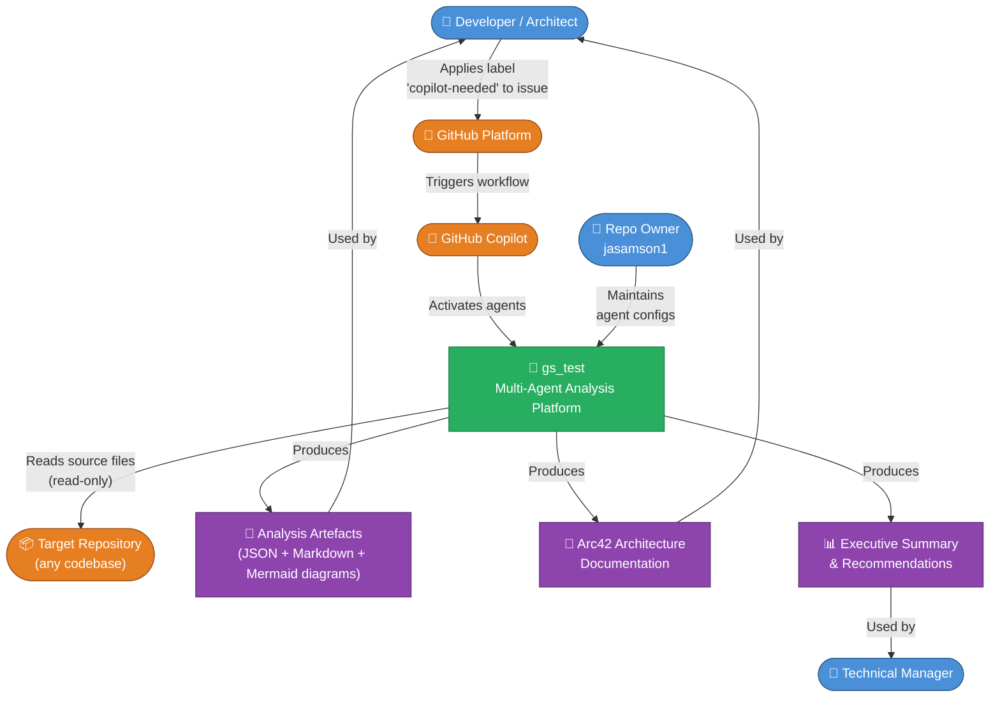

### 3.2 Technical Context

```mermaid
graph LR
    classDef trigger fill:#E74C3C,stroke:#922B21,color:#fff
    classDef workflow fill:#3498DB,stroke:#1A5276,color:#fff
    classDef agent fill:#27AE60,stroke:#1A7A43,color:#fff
    classDef store fill:#F39C12,stroke:#9A6A00,color:#000

    Issue["🏷️ GitHub Issue\n(label: copilot-needed)"]:::trigger
    Workflow["⚙️ GitHub Actions\ncopilot.yml"]:::workflow
    CopilotEngine["🤖 Copilot Agent Engine\notto-de/assign_issue_toCopilot_action@v1.0.1"]:::workflow
    Orchestrator["🎯 code-analysis-orchestrator\n(tools: read, search, agent, todo)"]:::agent
    Agents["🔬 10 Specialised Agents\n(analysis + generation + synthesis)"]:::agent
    FileSystem["💾 analysis_output/\n(JSON + Markdown artefacts)"]:::store
    AgentLog["📝 agent-log.txt\n(structured audit trail)"]:::store

    Issue -->|"issues:labeled event"| Workflow
    Workflow -->|"Assigns to Copilot\nusing GITHUB_TOKEN"| CopilotEngine
    CopilotEngine -->|"Invokes"| Orchestrator
    Orchestrator -->|"Coordinates via\ntool: agent"| Agents
    Agents -->|"Read inputs from"| FileSystem
    Agents -->|"Write outputs to"| FileSystem
    Agents -->|"Append entries to"| AgentLog
```

### 3.3 External Interfaces

| Interface | Direction | Protocol / Format | Description |
|---|---|---|---|
| **GitHub Issues API** | Inbound | GitHub Events (webhook) | Triggers the analysis pipeline when `copilot-needed` label is applied to any issue |
| **GitHub Actions** | Internal | YAML workflow (`copilot.yml`) | Assigns the labelled issue to Copilot using `otto-de/assign_issue_toCopilot_action@v1.0.1` |
| **Target Repository file system** | Inbound (read-only) | File I/O | Agents read source code, configuration files, and existing documentation from the target repository |
| **`analysis_output/` directory** | Internal (read-write) | File I/O — JSON + Markdown | Inter-agent communication medium and final artefact storage |
| **GitHub Copilot Agent Framework** | Internal | Agent tool calls | Orchestrator spawns sub-agents via the `agent` tool; agents interact with file system via `read`/`edit` tools |

---

## 4. Solution Strategy

### 4.1 Fundamental Approach

The platform adopts an **Orchestrator–Worker multi-agent architecture** running entirely within the GitHub Copilot agent framework. The core design choices are summarised below:

| Decision | Choice | Rationale |
|---|---|---|
| **Agent coordination pattern** | Centralised orchestrator + specialised workers | Separation of concerns; each agent is expert in exactly one domain |
| **Trigger mechanism** | GitHub Issue label (`copilot-needed`) | Zero-infrastructure trigger; no external CI server required; request is self-documenting |
| **Data exchange** | File system (JSON + Markdown) | Simple, inspectable, version-controlled artefacts; no message broker required |
| **Diagram standard** | Mermaid only | Renders natively in GitHub Markdown; no external rendering service needed |
| **Execution model** | Sequential with defined dependency chain | Predictable outputs; `code-documentor` provides foundational JSON data for all downstream agents |
| **Output organisation** | One sub-folder per agent | Clear ownership; easy to audit which agent produced which artefact |
| **Output format** | Incremental writes | Handles large codebases without hitting token/context limits |

### 4.2 Technology Stack Decisions

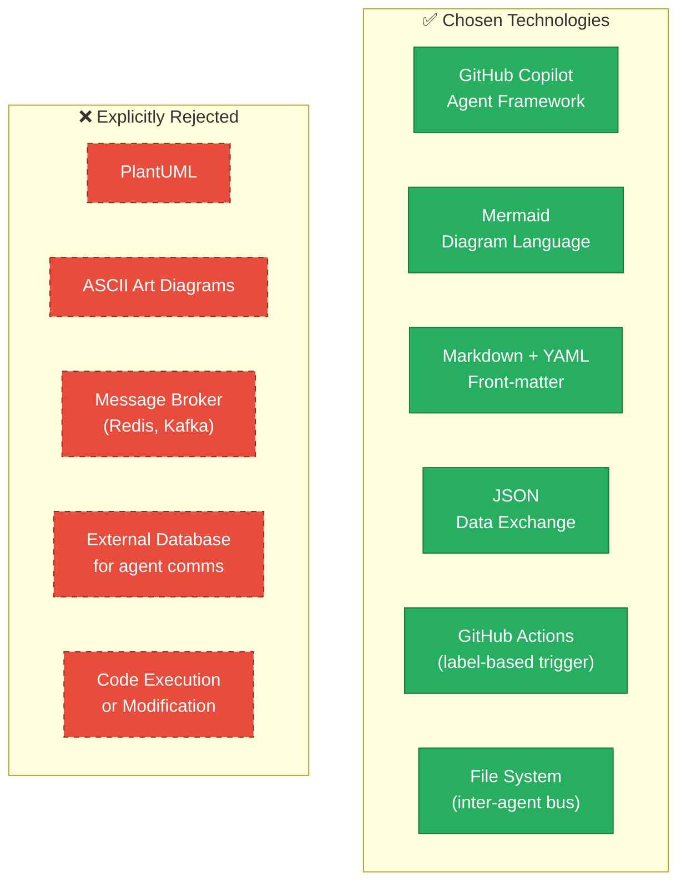

### 4.3 Approaches to Quality Goals

| Quality Goal | Strategy | Enforcement Mechanism |
|---|---|---|
| **Accuracy** | Each agent reads source files directly; no data is inferred or hallucinated | System prompt: "base all content on actual analysis results, not assumptions" |
| **Completeness** | Orchestrator runs all 10 specialised agents in a defined order; no agent is optional in full-analysis mode | Orchestrator's execution plan covers all 10 agents |
| **Consistency** | Global Mermaid-only rule with explicit prohibition on PlantUML and ASCII art | Enforced in every agent's system prompt with ✅/❌ formatting |
| **Extensibility** | New agents are added as `.agent.md` files; orchestrator agent list is updated accordingly | Agent discovery via `.github/agents/` directory |
| **Traceability** | Structured `agent-log.txt` with ISO timestamps tracks every file created/updated | Mandatory log step in every agent's output instructions |
| **Non-intrusiveness** | "You NEVER modify, edit, or change source code files" enforced in every agent | System prompt principle in all 12 agent definitions |

---

## 5. Building Block View

### 5.1 Level 1 — High-Level System Decomposition

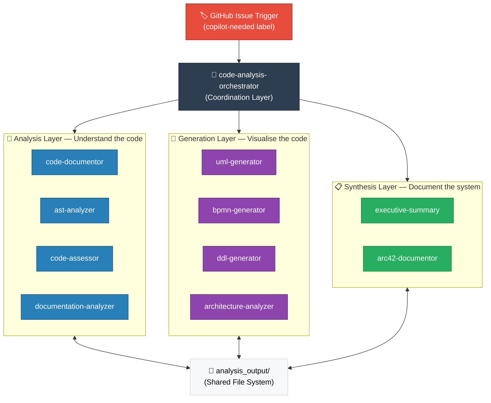

### 5.2 Level 2 — Analysis Layer Detail

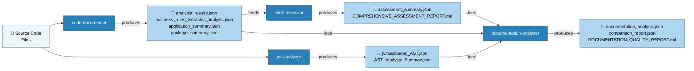

### 5.3 Level 2 — Generation Layer Detail

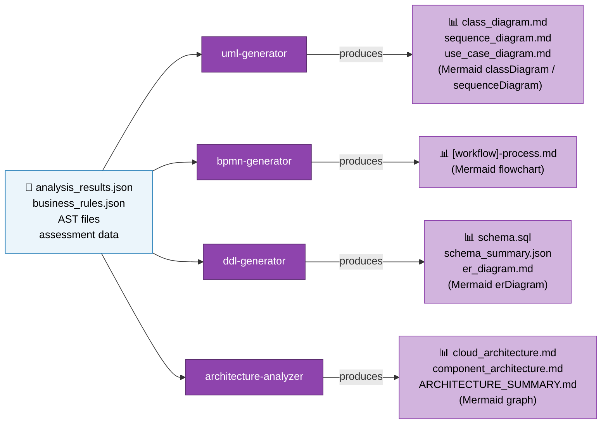

### 5.4 Level 2 — Synthesis Layer Detail

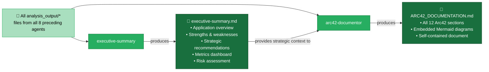

### 5.5 Level 3 — Orchestrator Class Model

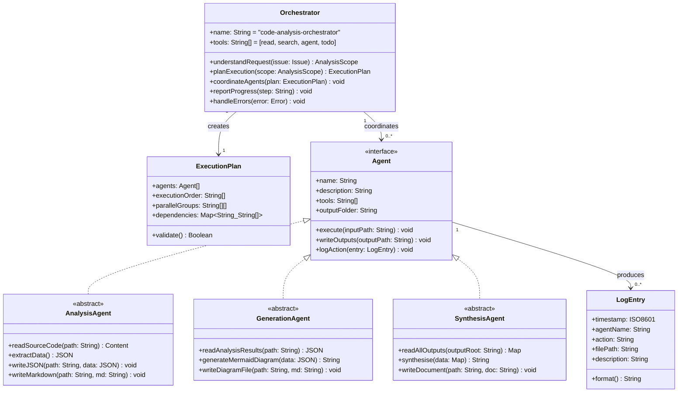

### 5.6 Agent Responsibility Summary

| Agent | Category | Input | Primary Output | Declared Tools |
|---|---|---|---|---|
| `code-analysis-orchestrator` | Coordination | GitHub Issue | Execution orchestration | `read`, `search`, `agent`, `todo` |
| `code-documentor` | Analysis | Source code files | `analysis_results.json`, `business_rules_extractor_analysis.json` | `read`, `search`, `edit`, `todo` |
| `ast-analyzer` | Analysis | Source code files | `[Class]_AST.json` per file, `AST_Analysis_Summary.md` | `read`, `search`, `edit`, `todo` |
| `code-assessor` | Analysis | `analysis_results.json` + source | `assessment_summary.json`, quality report | `read`, `search`, `edit`, `todo` |
| `documentation-analyzer` | Analysis | All agent outputs + existing docs | `documentation_analysis.json`, comparison report | `read`, `search`, `edit`, `todo` |
| `uml-generator` | Generation | `analysis_results.json`, AST files | Class, sequence, use-case diagrams (Mermaid) | `read`, `search`, `edit`, `todo` |
| `bpmn-generator` | Generation | `business_rules_extractor_analysis.json` | BPMN Mermaid flowcharts per workflow | `read`, `search`, `edit`, `todo` |
| `ddl-generator` | Generation | Field analysis, workflow analysis | SQL DDL script, ER diagram (Mermaid) | `read`, `search`, `edit`, `todo` |
| `architecture-analyzer` | Generation | All analysis outputs | Cloud + component architecture diagrams (Mermaid) | `read`, `search`, `edit`, `todo` |
| `executive-summary` | Synthesis | All agent outputs | `executive-summary.md` with metrics + recommendations | `read`, `search`, `edit`, `todo` |
| `arc42-documentor` | Synthesis | All agent outputs + exec summary | `ARC42_DOCUMENTATION.md` (this document) | `read`, `search`, `edit`, `todo` |
| `all-in-one-code-analyzer` | All-in-one | Source code files | All of the above in a single workflow | `read`, `search`, `edit`, `todo` |

---

## 6. Runtime View

### 6.1 Scenario 1 — Standard Full Analysis Pipeline

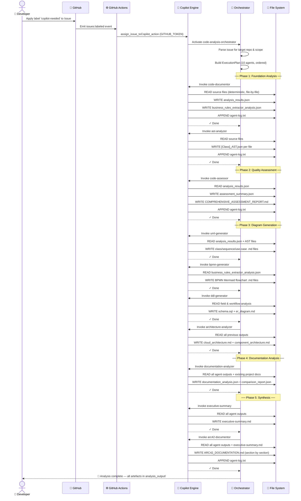

### 6.2 Scenario 2 — Targeted Analysis Decision Flow

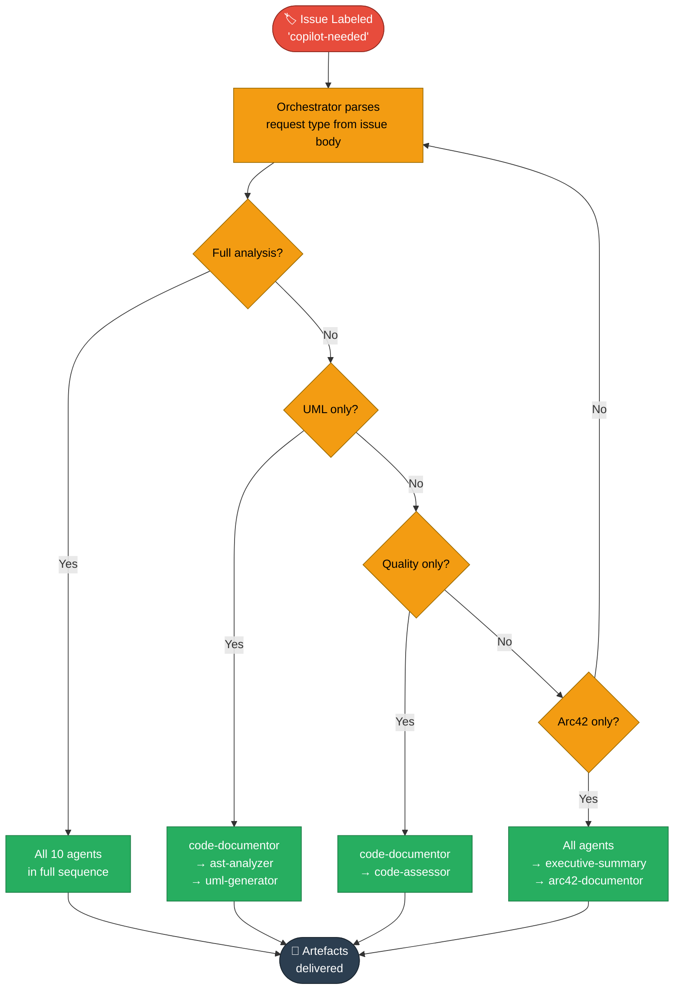

### 6.3 Scenario 3 — Agent Output Lifecycle State Machine

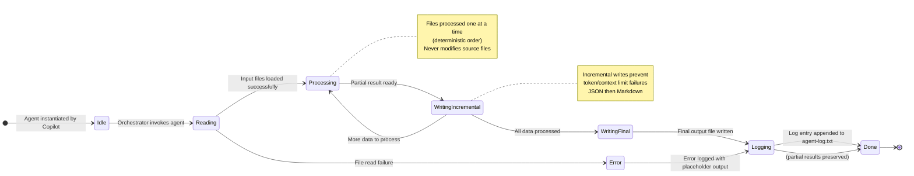

### 6.4 Key Business Process — Code Documentation Workflow

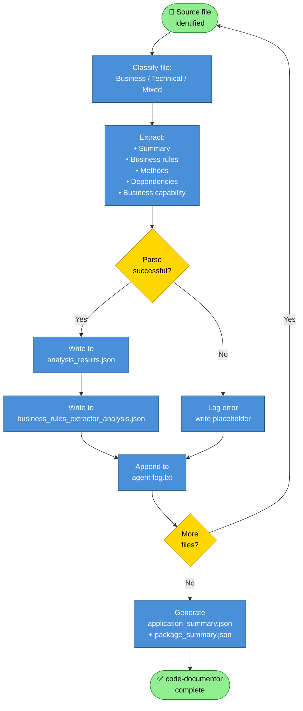

---

## 7. Deployment View

### 7.1 Infrastructure Overview

The entire platform runs inside **GitHub's managed cloud infrastructure**. There is no dedicated server, container registry, database, or cloud account required from the repository owner beyond a standard GitHub repository with GitHub Copilot access enabled.

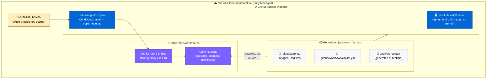

### 7.2 Deployment Topology

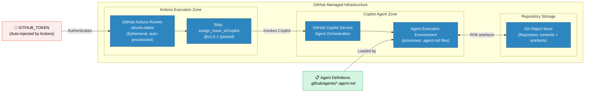

### 7.3 Deployment Requirements

| Requirement | Value | Notes |
|---|---|---|
| **Platform** | GitHub.com | Requires a GitHub account with Copilot access |
| **GitHub Actions** | Enabled on repository | Required for the `copilot.yml` workflow trigger |
| **GitHub Copilot** | Subscription active (individual or org) | Required for agent execution |
| **Repository visibility** | Public or Private | Works with both; private requires appropriate token scope |
| **Secret** | `GITHUB_TOKEN` | Auto-provided by GitHub Actions; no manual configuration required |
| **Storage** | Git LFS / standard Git | `analysis_output/` grows with each analysis run; consider `.gitignore` for large outputs |
| **Compute** | GitHub-managed ubuntu-latest | Ephemeral runner; no persistent compute resources owned by the user |
| **Network** | Internet access | GitHub's infrastructure handles all network connectivity |

### 7.4 Scaling Considerations

| Scenario | Approach |
|---|---|
| **Large codebase** | Incremental processing (one file at a time) prevents memory/token overflow |
| **Multiple concurrent analyses** | GitHub Actions queue manages concurrent workflow runs |
| **Frequent trigger activations** | GitHub Actions concurrency controls can be added to `copilot.yml` |
| **Growing `analysis_output/`** | Add `.gitignore` rules or automate cleanup via a separate workflow |

---

## 8. Cross-cutting Concepts

### 8.1 Domain Model

The core domain of this system is **code analysis artefact production**. The following entity-relationship diagram captures the key domain concepts:

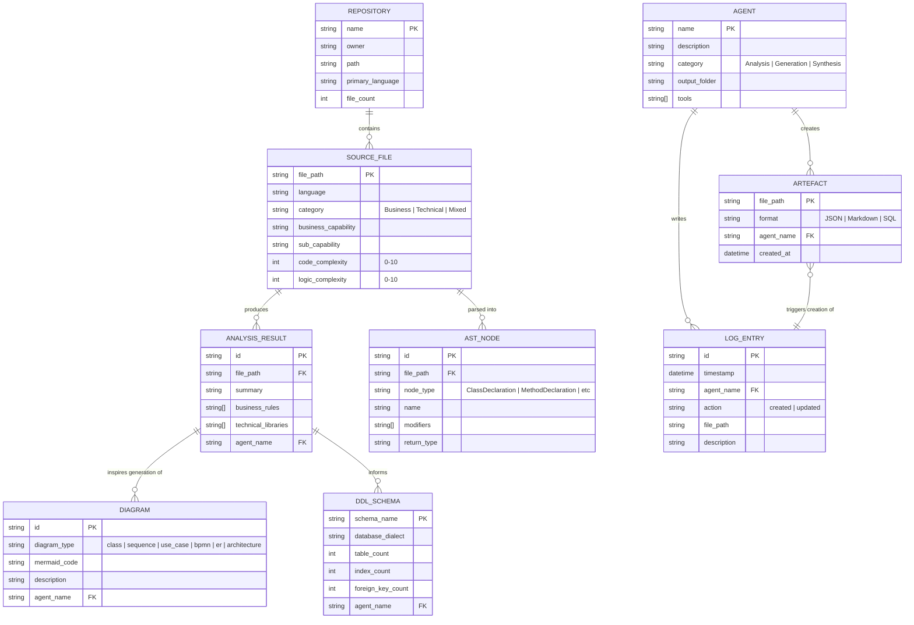

### 8.2 Design Patterns Applied

| Pattern | Applied In | Implementation Detail |
|---|---|---|
| **Orchestrator** | `code-analysis-orchestrator` | Central coordinator that manages all worker agents via the `agent` tool; decides execution order |
| **Chain of Responsibility** | All agents in sequence | Each agent enriches the shared file system; downstream agents depend on upstream outputs |
| **Strategy** | Orchestrator | Selects different execution plans based on requested analysis type (full / targeted / specific) |
| **Template Method** | All agents | Every agent follows: read → analyse → write incrementally → log; concrete steps vary per agent |
| **Facade** | `all-in-one-code-analyzer` | Single entry point combining all agent capabilities without the orchestrator overhead |
| **Observer** | `documentation-analyzer` | Reads outputs from all agents and produces a cross-cutting quality comparison report |
| **Builder** | `arc42-documentor` | Constructs the final Arc42 document section by section, assembling content from all analysis outputs |
| **Repository** (data pattern) | `analysis_output/` | Shared data store accessible to all agents; centralises artefact storage and retrieval |
| **Factory** (light) | Orchestrator + agent names | Orchestrator selects and invokes the appropriate agent by name based on the analysis plan |

### 8.3 Logging and Observability

**Log Format** (appended to `analysis_output/agent-log.txt`):
```
<ISO-8601-timestamp> | <agent-name> | <action> | <relative-file-path> | <description>
```

**Example entries**:
```
2025-01-30T10:00:01Z | code-documentor | created | analysis_output/code-documentor/analysis_results.json | File-by-file analysis results
2025-01-30T10:00:45Z | code-documentor | created | analysis_output/code-documentor/business_rules_extractor_analysis.json | Extracted business rules
2025-01-30T10:02:12Z | ast-analyzer | created | analysis_output/ast-analyzer/UserService_AST.json | AST for UserService.java
2025-01-30T10:08:33Z | code-assessor | created | analysis_output/code-assessor/assessment_summary.json | Quality metrics summary
2025-01-30T10:45:00Z | arc42-documentor | created | analysis_output/arc42-documentor/ARC42_DOCUMENTATION.md | Full Arc42 documentation
```

### 8.4 Error Handling Strategy

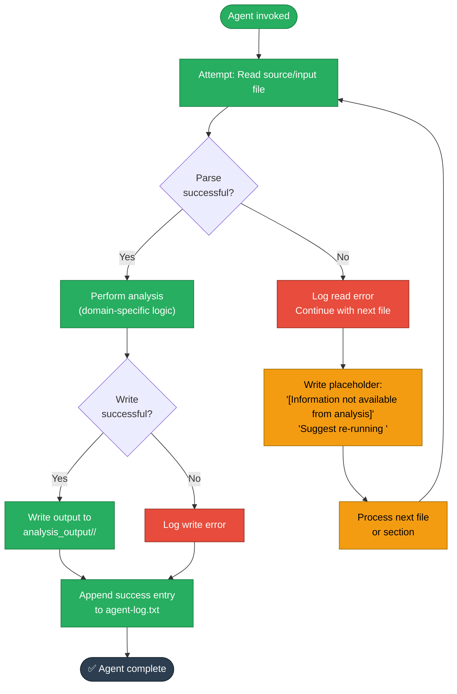

### 8.5 Security Concepts

| Security Concept | Implementation |
|---|---|
| **Authentication** | GitHub's built-in `GITHUB_TOKEN` is auto-injected by Actions; no external credentials are stored or transmitted |
| **Least privilege** | `GITHUB_TOKEN` is scoped to the repository; agents only receive permissions for the issuing repository |
| **No secret exfiltration** | Agents are read-only by principle; they cannot call external APIs or write to systems outside the repository |
| **Source code integrity** | Agents never modify source files; zero risk of unintended code changes |
| **Audit trail** | All agent actions logged with ISO timestamps in `agent-log.txt`; full traceability |
| **Action pinning** | `otto-de/assign_issue_toCopilot_action@v1.0.1` — version pinned to prevent supply-chain attacks |

### 8.6 Output File Organisation Standard

```mermaid
graph TD
    classDef root fill:#2C3E50,stroke:#1A252F,color:#fff
    classDef folder fill:#2980B9,stroke:#1A5276,color:#fff
    classDef file fill:#D6EAF8,stroke:#2980B9,color:#000

    Root["📁 analysis_output/"]:::root
    Log["📝 agent-log.txt\n(shared audit log)"]:::file

    CD["📁 code-documentor/"]:::folder
    AST["📁 ast-analyzer/"]:::folder
    CA["📁 code-assessor/"]:::folder
    UML["📁 uml-generator/"]:::folder
    BPMN["📁 bpmn-generator/"]:::folder
    DDL["📁 ddl-generator/"]:::folder
    AA["📁 architecture-analyzer/"]:::folder
    DA["📁 documentation-analyzer/"]:::folder
    ES["📁 executive-summary/"]:::folder
    A42["📁 arc42-documentor/"]:::folder

    Root --> Log
    Root --> CD & AST & CA & UML & BPMN & DDL & AA & DA & ES & A42

    CD --> CDf["analysis_results.json\nbusiness_rules_extractor_analysis.json\napplication_summary.json\npackage_summary.json"]:::file
    AST --> ASTf["[Class]_AST.json (per source file)\nAST_Analysis_Summary.md"]:::file
    CA --> CAf["assessment_summary.json\nCOMPREHENSIVE_ASSESSMENT_REPORT.md"]:::file
    UML --> UMLf["class_diagram.md\nsequence_diagram.md\nuse_case_diagram.md"]:::file
    BPMN --> BPMNf["[workflow-name]-process.md\n(Mermaid flowcharts)"]:::file
    DDL --> DDLf["schema.sql\nschema_summary.json\ner_diagram.md"]:::file
    AA --> AAf["cloud_architecture.md\ncomponent_architecture.md\nARCHITECTURE_SUMMARY.md"]:::file
    DA --> DAf["documentation_analysis.json\ncomparison_report.json\nDOCUMENTATION_QUALITY_REPORT.md"]:::file
    ES --> ESf["executive-summary.md"]:::file
    A42 --> A42f["ARC42_DOCUMENTATION.md"]:::file
```

---

## 9. Architecture Decisions

### ADR-001: Multi-Agent Orchestrator Architecture

| Attribute | Value |
|---|---|
| **Status** | ✅ Accepted |
| **Date** | 2025 (initial design) |
| **Deciders** | jasamson1 |

**Context**: A comprehensive code analysis platform needs to perform many distinct specialised tasks. A single monolithic agent would become unwieldy, difficult to maintain, and prone to context-limit failures in the Copilot agent framework.

**Decision**: Adopt a multi-agent architecture with a central `code-analysis-orchestrator` that delegates to specialised worker agents.

**Rationale**:
- Each agent is small, focused, and independently maintainable
- Agents can be developed, tested, and updated in isolation
- Context limits per agent are manageable (one domain per agent)
- Parallel execution is possible for independent agents

**Consequences**:
| ✅ Benefits | ⚠️ Trade-offs |
|---|---|
| Clear separation of concerns | Orchestration overhead |
| Independent agent evolution | File-system I/O latency between agents |
| Manageable token/context limits | Sequential dependency chain adds total run time |
| Easy to add new specialisations | Requires all agents to be defined and maintained |

---

### ADR-002: Mermaid as the Universal Diagram Standard

| Attribute | Value |
|---|---|
| **Status** | ✅ Accepted |
| **Date** | 2025 (initial design) |
| **Deciders** | jasamson1 |

**Context**: The platform generates many diagram types. A consistent format is needed that renders natively in GitHub without external tools or build steps.

**Decision**: Mandate Mermaid exclusively across all agents. Explicitly prohibit PlantUML and ASCII art.

**Consequences**:
| ✅ Benefits | ⚠️ Trade-offs |
|---|---|
| Native GitHub Markdown rendering | Limited support for some advanced UML constructs |
| No external rendering service | Very large diagrams may hit Mermaid limits |
| Version-control friendly text format | Mermaid syntax requires learning curve |
| Consistent visual style across all artefacts | Cannot generate PNG/SVG files directly |

---

### ADR-003: File System as Inter-Agent Communication Bus

| Attribute | Value |
|---|---|
| **Status** | ✅ Accepted |
| **Date** | 2025 (initial design) |
| **Deciders** | jasamson1 |

**Context**: Agents need to share analysis results. Options include in-memory passing, message queues, databases, or a shared file system.

**Decision**: Use the repository file system (`analysis_output/`) as the sole communication medium. Agents write structured JSON files; downstream agents read those files.

**Consequences**:
| ✅ Benefits | ⚠️ Trade-offs |
|---|---|
| Artefacts are human-readable and inspectable | Sequential dependency requires explicit execution ordering |
| Artefacts are version-controlled | Large repositories may produce very large output files |
| No external infrastructure required | File I/O slower than in-memory passing |
| Incremental writes support resumable analysis | Agents must agree on file naming conventions |

---

### ADR-004: Read-Only Analysis Principle

| Attribute | Value |
|---|---|
| **Status** | ✅ Accepted |
| **Date** | 2025 (initial design) |
| **Deciders** | jasamson1 |

**Context**: The platform analyses repositories owned by potentially other teams. Modifying source code without explicit authorisation is dangerous and undermines trust.

**Decision**: All agents are strictly read-only with respect to source code files. No agent may modify, execute, deploy, or test source files.

**Consequences**:
| ✅ Benefits | ⚠️ Trade-offs |
|---|---|
| Zero risk of unintended source modification | Cannot automatically fix identified issues |
| Safe to run on production codebases | Cannot validate recommendations by running tests |
| Builds trust with source code owners | Some analysis (e.g., runtime behaviour) is impossible |
| Legal/compliance safe | Recommendations require manual human implementation |

---

### ADR-005: Incremental Output Generation

| Attribute | Value |
|---|---|
| **Status** | ✅ Accepted |
| **Date** | 2025 (initial design) |
| **Deciders** | jasamson1 |

**Context**: Large codebases may cause agents to exhaust token/context limits if they generate all output in a single pass.

**Decision**: All agents must support incremental output — processing one file or one section at a time, writing partial results, and continuing in subsequent steps.

**Consequences**:
| ✅ Benefits | ⚠️ Trade-offs |
|---|---|
| Handles arbitrarily large codebases | Requires agents to be designed for resumability |
| Progress visible in real time | Aggregation step needed to merge incremental outputs |
| Partial results preserved on interruption | More complex agent logic |
| Consistent behaviour regardless of codebase size | Final synthesis must handle partial/missing inputs |

---

### ADR-006: Label-Based Trigger via GitHub Issues

| Attribute | Value |
|---|---|
| **Status** | ✅ Accepted |
| **Date** | 2025 (initial design) |
| **Deciders** | jasamson1 |

**Context**: The platform needs a simple, low-friction trigger that any team member can use without special tooling or CLI access.

**Decision**: Use a GitHub Issue label (`copilot-needed`) as the sole trigger mechanism, invoking the `copilot.yml` workflow.

**Consequences**:
| ✅ Benefits | ⚠️ Trade-offs |
|---|---|
| Zero friction — any member with Issue access can trigger | Requires GitHub Issues to be enabled |
| Analysis request is self-documenting in the Issue | Cannot be triggered programmatically without GitHub API |
| Results can be posted back as Issue comments | Label must be created manually in the repository |
| No CLI tools or scripts to install | Only one trigger type (labels) — no scheduled runs |

---

## 10. Quality Requirements

### 10.1 Quality Tree

```mermaid
graph TD
    classDef root fill:#2C3E50,stroke:#1A252F,color:#fff
    classDef primary fill:#2980B9,stroke:#1A5276,color:#fff
    classDef secondary fill:#AED6F1,stroke:#2980B9,color:#000
    classDef leaf fill:#EBF5FB,stroke:#2980B9,color:#000

    Q["🏆 Quality Goals\ngs_test Platform"]:::root

    ACC["Accuracy"]:::primary
    COMP["Completeness"]:::primary
    CONS["Consistency"]:::primary
    EXT["Extensibility"]:::primary
    TRACE["Traceability"]:::primary
    SAFE["Safety /\nNon-intrusiveness"]:::primary
    PERF["Performance"]:::primary

    Q --> ACC & COMP & CONS & EXT & TRACE & SAFE & PERF

    ACC --> A1["Findings based on actual\nsource files only"]:::leaf
    ACC --> A2["No hallucinated or\nassumed data"]:::leaf
    ACC --> A3["Diagram code reflects\nactual code structure"]:::leaf

    COMP --> C1["All 12 Arc42 sections\npopulated"]:::leaf
    COMP --> C2["All 3 UML types\ngenerated"]:::leaf
    COMP --> C3["Both cloud + component\narchitecture diagrams"]:::leaf
    COMP --> C4["Full agent pipeline\nexecuted"]:::leaf

    CONS --> CN1["Mermaid-only diagrams\nacross all agents"]:::leaf
    CONS --> CN2["Identical log format\nall agents"]:::leaf
    CONS --> CN3["Consistent JSON schema\nin intermediate files"]:::leaf

    EXT --> E1["New agent: add .agent.md\nfile only"]:::leaf
    EXT --> E2["No orchestrator core\nchanges required"]:::leaf

    TRACE --> T1["Every file write\nlogged with timestamp"]:::leaf
    TRACE --> T2["Agent name in\nevery log entry"]:::leaf

    SAFE --> S1["Zero source code\nmodification"]:::leaf
    SAFE --> S2["No code execution\nor deployment"]:::leaf
    SAFE --> S3["GITHUB_TOKEN scoped\nto repository"]:::leaf

    PERF --> P1["Incremental writes\nprevent context overflow"]:::leaf
    PERF --> P2["One-file-at-a-time\nprocessing"]:::leaf
```

### 10.2 Quality Scenarios

| ID | Quality Goal | Scenario | Stimulus | Expected Response | Measure |
|---|---|---|---|---|---|
| QS-01 | Completeness | Full repository analysis | Issue labelled `copilot-needed` | All 10 agents execute; all artefacts produced | 100% agent completion rate |
| QS-02 | Performance | Large codebase (500+ files) | Analysis triggered on large repo | Completes without token-limit failure | Incremental writes used; no agent crash |
| QS-03 | Accuracy | Empty repository | No source code present | Meaningful placeholder output with gap notes | No fabricated findings |
| QS-04 | Extensibility | Developer adds new `.agent.md` | File added to `.github/agents/` | Orchestrator can invoke new agent | Zero changes to orchestrator logic |
| QS-05 | Consistency | Agent attempts non-Mermaid diagram | PlantUML or ASCII art attempted | Mermaid alternative generated instead | 0 non-Mermaid diagrams in output |
| QS-06 | Safety | Agent processes production codebase | Analysis invoked on live repo | Source code unchanged after analysis | 0 source file modifications |
| QS-07 | Traceability | File created during analysis | Any agent writes output file | Log entry appended within same invocation | 100% log coverage |
| QS-08 | Robustness | Partial failure | One agent fails mid-run | Other agents continue; partial output preserved | No cascading failures |

### 10.3 Current State Assessment (This Repository)

Since `gs_test` contains only agent configuration files and no application source code, the following assessment applies to the *platform itself*:

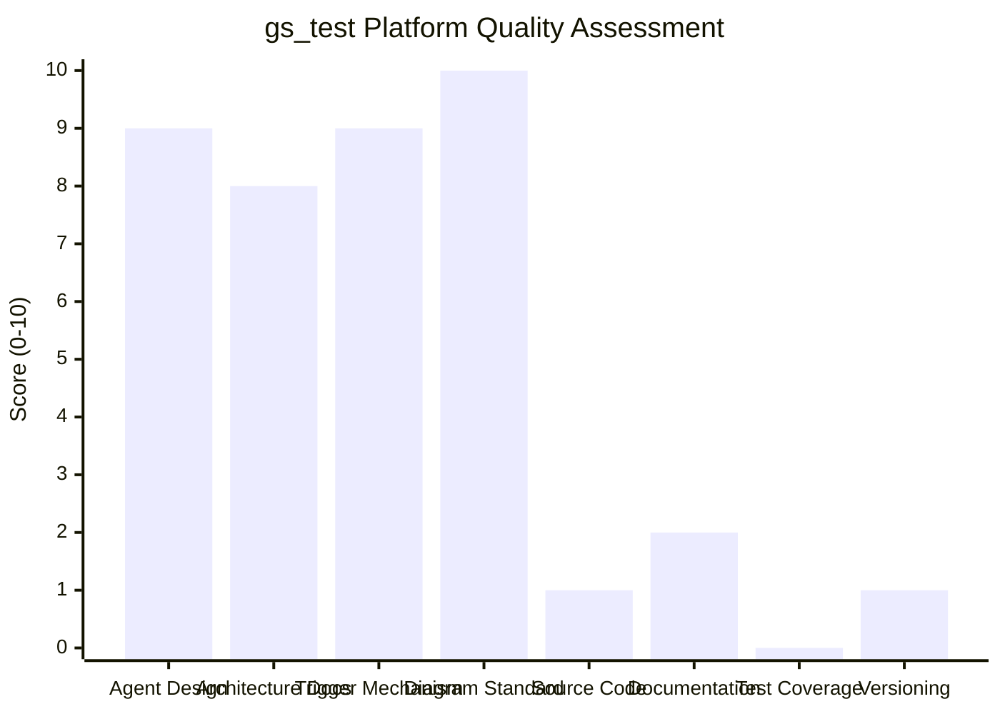

| Dimension | Score | Status | Notes |
|---|---|---|---|
| **Agent Design Completeness** | 9/10 | 🟢 Excellent | All 12 agent roles fully defined with detailed system prompts, tool declarations, and output specifications |
| **Architecture Documentation** | 8/10 | 🟢 Good | This Arc42 document; was previously absent |
| **Trigger Mechanism** | 9/10 | 🟢 Excellent | GitHub Actions workflow correctly configured with proper condition check |
| **Diagram Standard Compliance** | 10/10 | 🟢 Excellent | Mermaid enforced in all agent definitions with explicit PlantUML/ASCII prohibition |
| **Application Source Code** | 1/10 | 🔴 Missing | No application source code present (by design — this is a template/config repo) |
| **Repository Documentation** | 2/10 | 🔴 Poor | Only a single-line README; no setup guide, no usage examples, no contribution guide |
| **Test Coverage (Agent Logic)** | 0/10 | 🔴 None | No automated tests for agent configurations or pipeline integration |
| **Versioning & Changelog** | 1/10 | 🔴 Missing | No CHANGELOG, no semantic versioning, agents have no version numbers |

---

## 11. Risks and Technical Debt

### 11.1 Risk Register

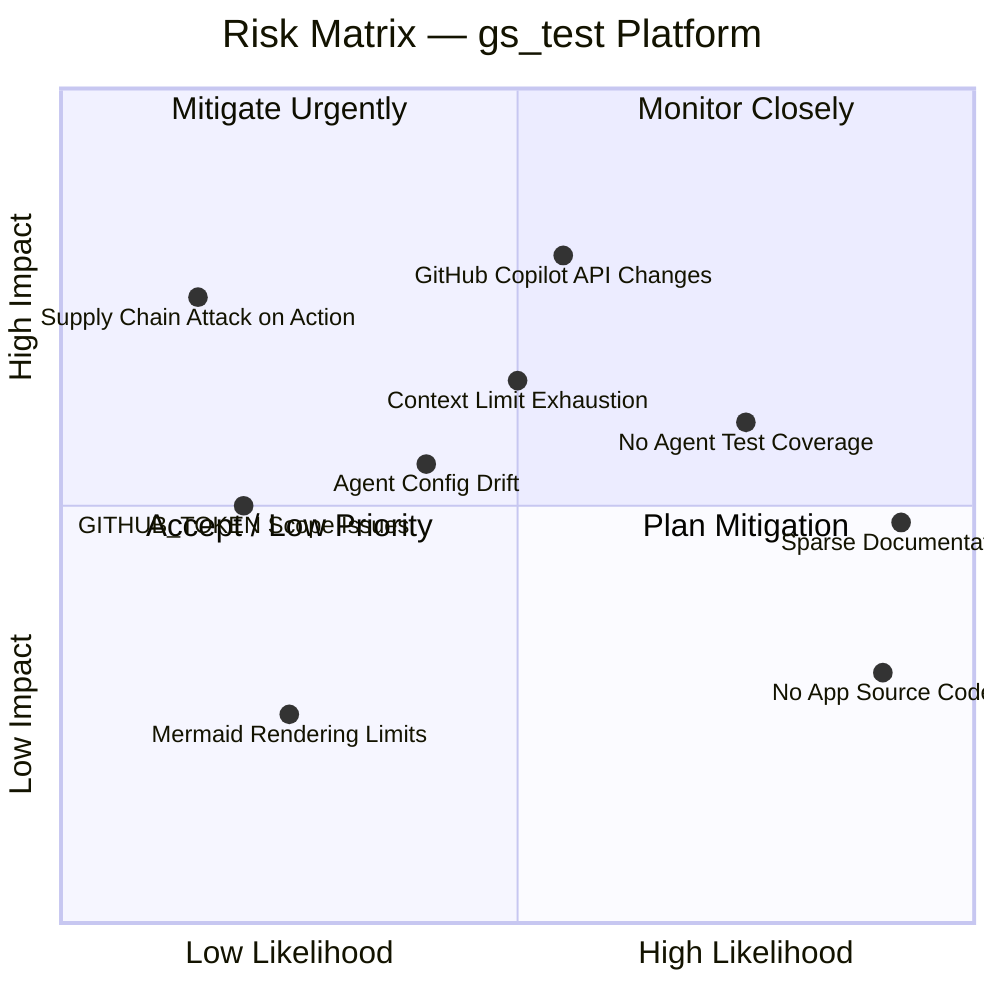

### 11.2 Detailed Risk Descriptions

| ID | Risk | Likelihood | Impact | Mitigation |
|---|---|---|---|---|
| **R-01** | **GitHub Copilot API Changes** — Copilot's agent framework or tool call contracts change, breaking agent definitions | Medium | High | Monitor GitHub Copilot release notes; pin action versions; maintain backwards-compatible agent prompts |
| **R-02** | **Context Limit Exhaustion** — Large codebases cause agents to exceed token limits during analysis | Medium | High | Incremental output strategy already mandated; add explicit chunking guidance; limit single-pass file count |
| **R-03** | **No Application Source Code** — Repository has no business code; agents produce minimal output when run against this repo | High | Low | This is a template/configuration repo; add sample application code for full agent validation |
| **R-04** | **Agent Configuration Drift** — Agent `.md` files become inconsistent with orchestrator expectations over time | Medium | Medium | Add CI linting step to validate agent front-matter schema; document change protocol |
| **R-05** | **GITHUB_TOKEN Scope Issues** — Token lacks permissions needed to write analysis artefacts back | Low | Medium | Document required token scopes; test with minimal permissions; consider PAT for broader access scenarios |
| **R-06** | **Mermaid Rendering Limits** — Very large diagrams hit Mermaid's rendering capacity in GitHub UI | Low | Low | Split large diagrams into multiple focused sub-diagrams; document maximum recommended complexity |
| **R-07** | **Sparse Documentation** — README is a single line; new contributors and users cannot onboard without guidance | High | Medium | This Arc42 document is created; rewrite README with setup guide, usage instructions, and architecture reference |
| **R-08** | **No Agent Test Coverage** — Agent logic cannot be unit-tested; failures are discovered only at runtime | High | Medium | Create integration test scenarios with sample repos; add CI validation job; document expected outputs |
| **R-09** | **Supply Chain Attack on Pinned Action** — `otto-de/assign_issue_toCopilot_action@v1.0.1` could be compromised | Low | High | Add Dependabot for GitHub Actions; consider pinning by commit SHA rather than tag |

### 11.3 Technical Debt Inventory

| ID | Debt Type | Description | Impact | Estimated Fix Effort |
|---|---|---|---|---|
| **TD-01** | **Documentation Debt** | `README.md` contains only one line of text — no setup guide, no usage instructions, no architecture reference, no contribution guidelines | HIGH | 3–6 hours |
| **TD-02** | **Test Debt** | Zero automated tests for agent configurations; no integration tests validating the full agent pipeline against sample repositories | HIGH | 24–40 hours |
| **TD-03** | **Configuration / Versioning Debt** | No agent versioning scheme; all agents are at implied v1.0 with no upgrade path, deprecation policy, or changelog | MEDIUM | 4–8 hours |
| **TD-04** | **Observability Debt** | No CI job validates that `agent-log.txt` is written correctly; no dashboard or monitoring for analysis run health and success rates | MEDIUM | 8–16 hours |
| **TD-05** | **Dependency Debt** | `otto-de/assign_issue_toCopilot_action@v1.0.1` pinned to tag (not commit SHA); no Dependabot configuration to alert on updates or vulnerabilities | LOW | 1–2 hours |
| **TD-06** | **Infrastructure Debt** | No `CODEOWNERS` file; no branch protection rules; no `CONTRIBUTING.md`; no issue/PR templates | LOW | 2–4 hours |
| **TD-07** | **Content Debt** | `.github/skills/` and `.github/hooks/` directories exist but contain only `.keep` files — no skills or hooks are defined or documented | LOW | Ongoing (as needed) |

### 11.4 Mitigation Roadmap

```mermaid
gantt
    title Technical Debt Mitigation Roadmap
    dateFormat  YYYY-MM-DD
    axisFormat  %b %d

    section Immediate (Week 1)
    Rewrite README.md with setup + usage guide       :crit, td01, 2025-02-01, 3d
    Pin action to commit SHA + add Dependabot        :td05, 2025-02-01, 1d
    Add CODEOWNERS + branch protection rules         :td06, 2025-02-03, 2d

    section Short-term (Weeks 2-4)
    Design agent versioning scheme                   :td03, 2025-02-10, 3d
    Create sample repository for agent testing       :td02a, 2025-02-10, 5d
    Write integration test scenarios                 :td02b, 2025-02-17, 7d
    Add CI validation job for agent-log format       :td04a, 2025-02-20, 3d

    section Medium-term (Month 2)
    Full CI/CD pipeline for agent integration tests  :td02c, 2025-03-01, 14d
    Observability dashboard for analysis runs        :td04b, 2025-03-10, 7d
    Define and document skills                       :td07a, 2025-03-15, 5d
    Define and document hooks                        :td07b, 2025-03-20, 5d
```

---

## 12. Glossary

| Term | Definition |
|---|---|
| **Agent** | A specialised AI module defined as a Markdown file with YAML front-matter in `.github/agents/`. Each agent has a specific responsibility within the analysis pipeline (e.g., code documentation, UML diagram generation). |
| **Agent Framework** | The GitHub Copilot infrastructure that executes agent definitions, manages tool calls, and supports sub-agent invocations via the `agent` tool. |
| **`analysis_output/`** | The shared directory on the repository file system where all agents read inputs from and write outputs to. Acts as the inter-agent communication bus. |
| **Arc42** | A standardised, pragmatic software architecture documentation template with 12 sections covering: goals, constraints, context, building blocks, runtime, deployment, crosscutting concepts, decisions, quality requirements, risks, and glossary. |
| **AST** | Abstract Syntax Tree — a hierarchical tree representation of the abstract syntactic structure of source code, produced by parsing source files without executing them. Used for static structural analysis. |
| **BPMN** | Business Process Model and Notation — an international standard (ISO 19510) for graphical notation used to model business workflows and processes. In this platform, BPMN processes are expressed as Mermaid flowcharts. |
| **`copilot-needed`** | The specific GitHub Issue label that triggers the entire analysis pipeline via the `copilot.yml` GitHub Actions workflow. |
| **DDL** | Data Definition Language — the subset of SQL used to define and modify database schemas (e.g., `CREATE TABLE`, `ALTER TABLE`, `CREATE INDEX`). |
| **Deterministic processing** | The principle that agents process files in a consistent, repeatable order (e.g., alphabetical or by discovery order) rather than random sampling. |
| **ER diagram** | Entity-Relationship diagram — a visual representation of the entities (tables) in a data model and the relationships between them. Generated using Mermaid `erDiagram` syntax. |
| **`GITHUB_TOKEN`** | An automatically provisioned, short-lived authentication token that GitHub Actions injects into workflow runs. Scoped to the repository; used by the `assign_issue_toCopilot_action` to authenticate with the GitHub API. |
| **Incremental output** | The agent practice of writing partial results to output files as processing progresses (one file or section at a time), rather than holding all results in memory and writing at the end. Prevents token/context limit failures. |
| **Mermaid** | An open-source JavaScript-based diagramming tool that renders diagrams from a concise text-based syntax. Natively supported in GitHub Markdown, making it the exclusive diagram format for this platform. |
| **Orchestrator** | The `code-analysis-orchestrator` agent that plans and coordinates the execution order of all specialised worker (sub-) agents. |
| **PlantUML** | An alternative text-based diagram specification language. **Explicitly prohibited** in this platform — Mermaid is the mandatory alternative. |
| **Read-Only Principle** | The fundamental architectural constraint that no agent may modify, execute, test, deploy, or otherwise alter the source files of the repository being analysed. |
| **Sub-agent** | A specialised worker agent invoked by the orchestrator using the `agent` tool. Each sub-agent has a single, well-defined responsibility. |
| **Technical debt** | The accumulated cost of suboptimal design or implementation decisions made for short-term convenience, which must eventually be paid back through refactoring, testing, or documentation work. |
| **Tool (agent tool)** | A declared capability available to an agent within the Copilot agent framework: `read` (read files), `search` (search codebase), `edit` (create/update files), `todo` (task management), `agent` (invoke sub-agents). |
| **UML** | Unified Modelling Language — an ISO-standard (ISO/IEC 19501) visual modelling language for software systems, including class diagrams, sequence diagrams, and use-case diagrams. |
| **YAML front-matter** | A YAML metadata block at the beginning of a Markdown file, delimited by `---` lines. Used in agent `.md` files to declare the agent's `name`, `description`, and allowed `tools`. |

---

*This document was generated by the `arc42-documentor` agent for the `gs_test` repository (jasamson1/gs_test).*  
*Generation date: 2025-01-30 | Document version: 1.0.0*  
*All diagrams use Mermaid syntax and render natively in GitHub Markdown.*
