# Architecture Documentation (Arc42)

**Project**: gs_test — GitHub Copilot Multi-Agent Code Analysis System  
**Repository**: jasamson1/gs_test  
**Version**: 1.0.0  
**Date**: 2025-07-14  
**Generated by**: Arc42 Documentation Generator (arc42-documentor agent)

---

> **Note**: This documentation is based on direct analysis of the repository's agent definition files
> (`.github/agents/`), GitHub Actions workflow, and README. No prior analysis-agent output files
> existed at generation time; all content has been synthesized from the source agent specifications.

---

## Table of Contents

1. [Introduction and Goals](#1-introduction-and-goals)
2. [Constraints](#2-constraints)
3. [Context and Scope](#3-context-and-scope)
4. [Solution Strategy](#4-solution-strategy)
5. [Building Block View](#5-building-block-view)
6. [Runtime View](#6-runtime-view)
7. [Deployment View](#7-deployment-view)
8. [Cross-cutting Concepts](#8-cross-cutting-concepts)
9. [Architecture Decisions](#9-architecture-decisions)
10. [Quality Requirements](#10-quality-requirements)
11. [Risks and Technical Debt](#11-risks-and-technical-debt)
12. [Glossary](#12-glossary)

---

## 1. Introduction and Goals

### 1.1 Business Context and Objectives

`gs_test` is a **GitHub Copilot multi-agent code analysis platform** — a test repository that
defines, configures, and demonstrates a coordinated system of AI-powered agents designed to perform
comprehensive source-code analysis and generate a wide spectrum of technical artefacts.

The core purpose is to automate the most labor-intensive phases of software archaeology and
architecture documentation:

- Automatically document unfamiliar codebases in minutes rather than weeks.
- Produce consistent, high-quality architecture documentation (Arc42) from any repository.
- Surface quality issues, security vulnerabilities, and technical debt without manual code review.
- Generate visual artefacts (UML, BPMN, ER diagrams, architecture maps) from source code.
- Synthesize findings into executive summaries accessible to non-technical stakeholders.

The platform achieves this through a **pipeline of eleven specialized AI agents** orchestrated by a
master coordinator, all operating exclusively in read-only mode against the target codebase.

### 1.2 Quality Goals

| Priority | Quality Goal | Motivation |
|----------|-------------|------------|
| 1 | **Correctness** | All generated documentation and diagrams must accurately reflect the analyzed source code. Incorrect architecture docs are worse than no docs. |
| 2 | **Consistency** | Terminology, diagram notation (Mermaid-only), and output formats must be uniform across all agents and all runs. |
| 3 | **Completeness** | Every Arc42 section must be populated — even if only with placeholder text signalling missing data. |
| 4 | **Non-destructiveness** | No agent may modify, delete, or execute source code. Analysis is strictly read-only. |
| 5 | **Traceability** | Every output file must be logged with a timestamp, agent name, and file path in `analysis_output/agent-log.txt`. |
| 6 | **Extensibility** | New specialized agents can be added without changing the orchestrator's core logic. |

### 1.3 Stakeholders

| Stakeholder | Role / Interest |
|-------------|----------------|
| **Software Architects** | Consume Arc42 documentation and architecture diagrams to understand system design. |
| **Development Teams** | Use code-assessor and code-documentor output to guide refactoring and reduce technical debt. |
| **Engineering Managers / Tech Leads** | Consume the executive summary for decision-making on resourcing and prioritization. |
| **Security Engineers** | Use code-assessor output to identify and remediate security vulnerabilities. |
| **Database Administrators** | Consume DDL generator output to create or validate database schemas. |
| **Technical Writers** | Use documentation-analyzer output to improve project documentation. |
| **GitHub Copilot Platform** | Executes agents in response to repository issues labeled `copilot-needed`. |
| **Repository Owner (jasamson1)** | Tests and evolves the multi-agent capability set. |

---

## 2. Constraints

### 2.1 Technical Constraints

| Constraint | Description | Impact |
|-----------|-------------|--------|
| **Read-only analysis** | All agents are explicitly prohibited from modifying, executing, or testing source code. | Agents can only produce documentation and recommendations; they cannot auto-fix issues. |
| **Mermaid-only diagrams** | All visual diagrams must use Mermaid syntax in fenced code blocks. PlantUML and ASCII art are explicitly forbidden. | Diagrams render natively in GitHub Markdown; no build step required. |
| **GitHub Copilot runtime** | Agents execute within the GitHub Copilot agent framework on GitHub-hosted infrastructure. | Agent tools are limited to `read`, `search`, `edit`, and `todo`; no shell execution. |
| **Markdown output format** | All human-readable outputs must be Markdown; technical data outputs are JSON. | No PDF or binary format generation without post-processing. |
| **Sequential agent dependency chain** | Several agents depend on outputs from earlier agents (e.g., `code-assessor` needs `analysis_results.json` from `code-documentor`). | Parallel execution is limited; the orchestrator must manage dependency order. |
| **Single-file self-contained docs** | The final `ARC42_DOCUMENTATION.md` must be completely self-contained — no external image references. | All diagram source code must be embedded inline. |
| **GitHub Actions environment** | The `copilot.yml` workflow uses `otto-de/assign_issue_toCopilot_action@v1.0.1`. | Workflow functionality depends on this third-party action's availability and API. |

### 2.2 Organizational Constraints

| Constraint | Description |
|-----------|-------------|
| **Test repository scope** | This is explicitly a test/demonstration repository; production deployment patterns may differ. |
| **Agent definition via Markdown** | All agent behavior is specified in `.md` files under `.github/agents/`. Adding or modifying agents requires changes to these configuration files. |
| **Issue-based triggering** | The Copilot workflow triggers only when a `copilot-needed` label is applied to an issue; there is no push-based or scheduled triggering defined. |
| **No source code present** | The repository contains only configuration files and a stub README; agents are defined here but intended to analyze *other* repositories. |

### 2.3 Conventions

| Convention | Description |
|-----------|-------------|
| **Agent naming** | Agent files follow `<agent-name>.agent.md` naming pattern. |
| **Output directory structure** | All outputs are written to `analysis_output/<agent-name>/` subdirectories. |
| **Shared log file** | All agents append to a single `analysis_output/agent-log.txt` using a standardized ISO-timestamp format. |
| **JSON for machine-readable data** | Structured analysis results (ASTs, quality metrics, business rules) are always JSON. |
| **Markdown for human-readable reports** | Documentation, summaries, and diagrams are always Markdown. |
| **Incremental output** | Agents produce outputs incrementally (file-by-file) rather than buffering all results in memory before writing. |

---

## 3. Context and Scope

### 3.1 Business Context

The system sits between a **target source-code repository** (any language, any framework) and the
various **consumer stakeholders** who need to understand that codebase. It transforms raw source code
into structured documentation, visual diagrams, quality reports, and strategic recommendations.

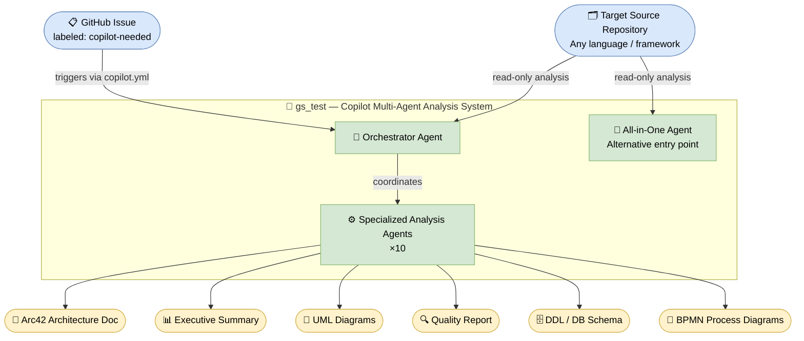

### 3.2 Technical Context

The platform integrates with the following external systems and technologies:

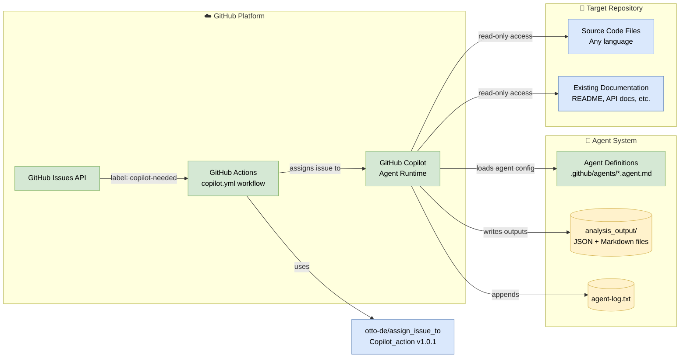

### 3.3 System Boundaries

**In scope (what the system does):**
- Read and analyze source code in any language/framework
- Generate JSON analysis data (ASTs, business rules, quality metrics)
- Generate Markdown documentation (Arc42, executive summary, quality assessments)
- Generate Mermaid diagrams (UML class, sequence, use-case; BPMN; architecture; ER)
- Generate SQL DDL schema definitions
- Log all activity to a shared audit log

**Out of scope (what the system does NOT do):**
- Modify, refactor, or execute source code
- Deploy infrastructure or databases
- Run tests or CI/CD pipelines
- Interact with external APIs of the analyzed system
- Render Mermaid diagrams to images (only Mermaid source code is produced)

---

## 4. Solution Strategy

### 4.1 Technology Decisions

| Decision | Choice | Rationale |
|----------|--------|-----------|
| **Agent framework** | GitHub Copilot Agents | Native integration with GitHub repositories and issues; no additional infrastructure needed. |
| **Diagram format** | Mermaid (exclusively) | Renders natively in GitHub Markdown; no build step required; version-control friendly. |
| **Data interchange format** | JSON | Language-agnostic, machine-readable, parseable by Python `json.loads()`. |
| **Documentation format** | Markdown | Version-control friendly, renders natively on GitHub. |
| **Agent configuration** | Markdown front-matter + natural language | Human-readable, version-controllable, editable by non-engineers. |
| **Output organization** | `analysis_output/<agent>/` hierarchy | Clear ownership, easy to find, supports incremental writes. |

### 4.2 Top-Level Decomposition Strategy

The system uses a **multi-agent pipeline architecture** with three decomposition patterns:

1. **Specialization** — Each agent has a single, well-defined responsibility (single-responsibility at the agent level).
2. **Orchestration** — A master orchestrator coordinates agent execution order, managing dependencies and data flow.
3. **Layering** — Agents execute in layers: Foundation agents first, then Analysis agents, then Synthesis agents.

### 4.3 Approaches to Quality Goals

| Quality Goal | Approach |
|-------------|----------|
| **Correctness** | Agents read source directly; no intermediate transformation that could corrupt data. |
| **Consistency** | Shared conventions enforced in every agent definition: same log format, same output structure, same diagram tool. |
| **Completeness** | Arc42 template mandates all 12 sections; agents use placeholder text for unavailable data. |
| **Non-destructiveness** | "Analysis Only" principle stated in every agent; tools list excludes code-writing capability. |
| **Traceability** | Mandatory append to `agent-log.txt` after every file operation. |
| **Extensibility** | New agents only need to follow the shared conventions; orchestrator logic is additive. |

---

## 5. Building Block View

### 5.1 Level 1: High-Level System Decomposition

The system decomposes into four major subsystems organized into execution phases:

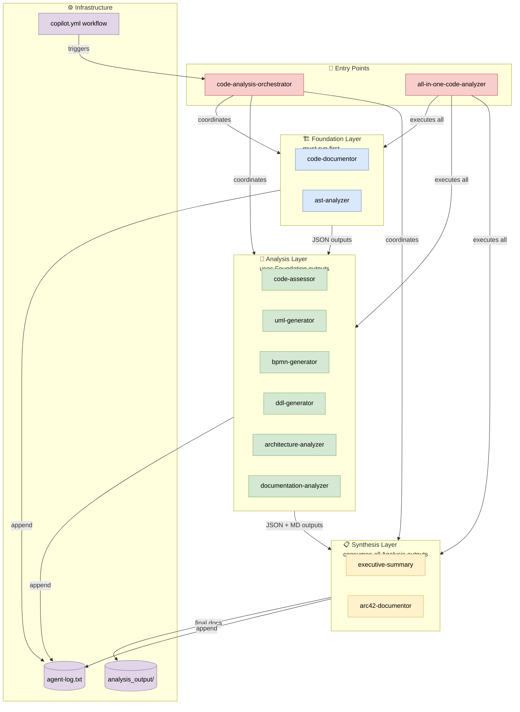

### 5.2 Level 2: Agent Data Flow

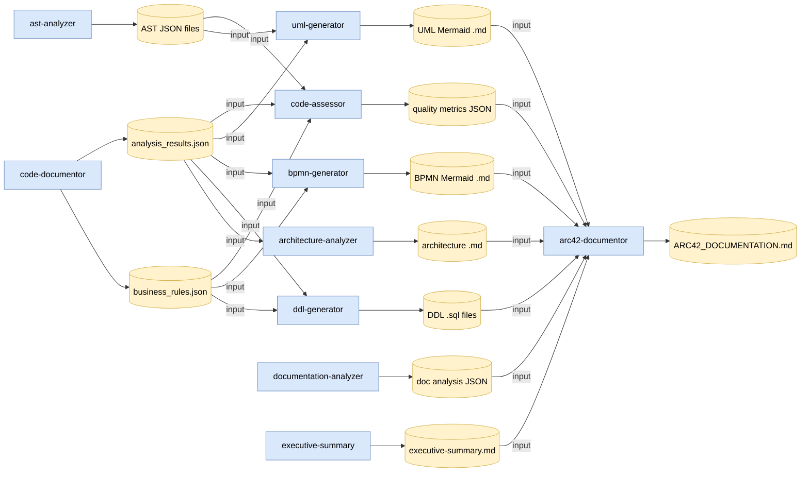

### 5.3 Level 3: Individual Agent Class Structure

```mermaid
classDiagram
    class Agent {
        <<abstract>>
        +name String
        +description String
        +tools List~String~
        +outputDir String
        +analyzeFiles() void
        +generateOutputs() void
        #writeOutput(path, content) void
        #appendToLog(entry) void
    }

    class FoundationAgent {
        <<abstract>>
        +dependsOn None
        +generateJSON() void
    }

    class AnalysisAgent {
        <<abstract>>
        +dependsOn FoundationAgent
        +readAnalysisResults() JSON
        +generateDiagrams() Mermaid
    }

    class SynthesisAgent {
        <<abstract>>
        +dependsOn List~Agent~
        +synthesizeAllOutputs() void
        +embedDiagrams() void
    }

    class CodeDocumentor {
        +classifyFile() String
        +extractBusinessRules() List
        +documentMethods() List
    }

    class AstAnalyzer {
        +parseTypeDeclarations() void
        +parseMethodBodies() void
        +extractDependencies() void
    }

    class CodeAssessor {
        +assessComplexity() Score
        +identifyIssues() List~Issue~
        +analyzeDebt() List~DebtItem~
    }

    class UmlGenerator {
        +generateClassDiagram() Mermaid
        +generateSequenceDiagram() Mermaid
        +generateUseCaseDiagram() Mermaid
    }

    class BpmnGenerator {
        +mapCodeToFlowchart() Mermaid
        +identifySwimLanes() List~Lane~
    }

    class DdlGenerator {
        +identifyEntities() List~Entity~
        +generateTableDDL() SQL
        +generateIndexes() SQL
    }

    class ArchitectureAnalyzer {
        +detectArchPattern() String
        +generateCloudDiagram() Mermaid
        +generateComponentDiagram() Mermaid
    }

    class DocumentationAnalyzer {
        +scoreDocQuality() Score
        +identifyGaps() List~Gap~
        +compareWithCode() Report
    }

    class ExecutiveSummary {
        +synthesizeStrengths() List
        +synthesizeWeaknesses() List
        +generateRecommendations() List
    }

    class Arc42Documentor {
        +generateAllSections() void
        +embedAllDiagrams() void
        +validateSelfContained() bool
    }

    Agent <|-- FoundationAgent
    Agent <|-- AnalysisAgent
    Agent <|-- SynthesisAgent
    FoundationAgent <|-- CodeDocumentor
    FoundationAgent <|-- AstAnalyzer
    AnalysisAgent <|-- CodeAssessor
    AnalysisAgent <|-- UmlGenerator
    AnalysisAgent <|-- BpmnGenerator
    AnalysisAgent <|-- DdlGenerator
    AnalysisAgent <|-- ArchitectureAnalyzer
    AnalysisAgent <|-- DocumentationAnalyzer
    SynthesisAgent <|-- ExecutiveSummary
    SynthesisAgent <|-- Arc42Documentor
```

### 5.4 Agent Capability Matrix

| Agent | Reads Source | Reads Agent Outputs | Writes JSON | Writes MD | Writes SQL | Writes Diagrams |
|-------|:------------:|:-------------------:|:-----------:|:---------:|:----------:|:---------------:|
| code-documentor | ✅ | ❌ | ✅ | ✅ | ❌ | ❌ |
| ast-analyzer | ✅ | ✅ optional | ✅ | ✅ | ❌ | ✅ |
| code-assessor | ✅ | ✅ | ✅ | ✅ | ❌ | ✅ |
| uml-generator | ❌ | ✅ | ✅ | ✅ | ❌ | ✅ |
| bpmn-generator | ❌ | ✅ | ✅ | ✅ | ❌ | ✅ |
| ddl-generator | ❌ | ✅ | ✅ | ✅ | ✅ | ✅ |
| architecture-analyzer | ❌ | ✅ | ✅ | ✅ | ❌ | ✅ |
| documentation-analyzer | ✅ | ✅ | ✅ | ✅ | ❌ | ❌ |
| executive-summary | ❌ | ✅ | ❌ | ✅ | ❌ | ❌ |
| arc42-documentor | ❌ | ✅ | ❌ | ✅ | ❌ | ✅ |

---

## 6. Runtime View

### 6.1 Scenario 1: Full Analysis Pipeline (Orchestrated)

The primary runtime scenario is a full analysis triggered by a GitHub issue labeled `copilot-needed`.

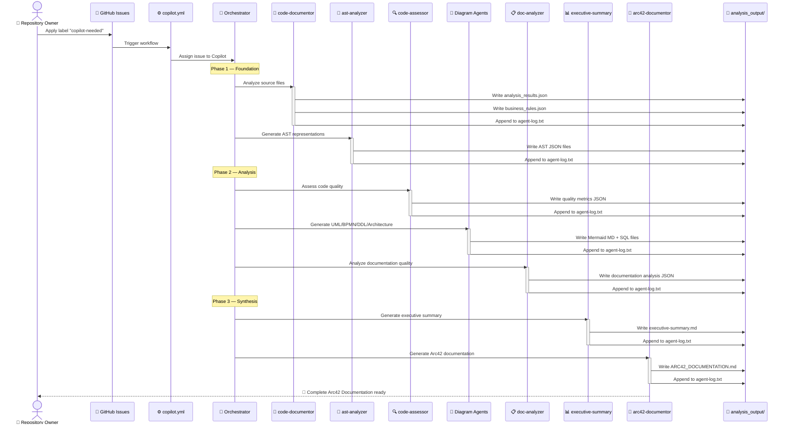

### 6.2 Scenario 2: Targeted Analysis (Minimal Agent Set)

When only a specific analysis type is requested, the orchestrator selects the minimum required agents:

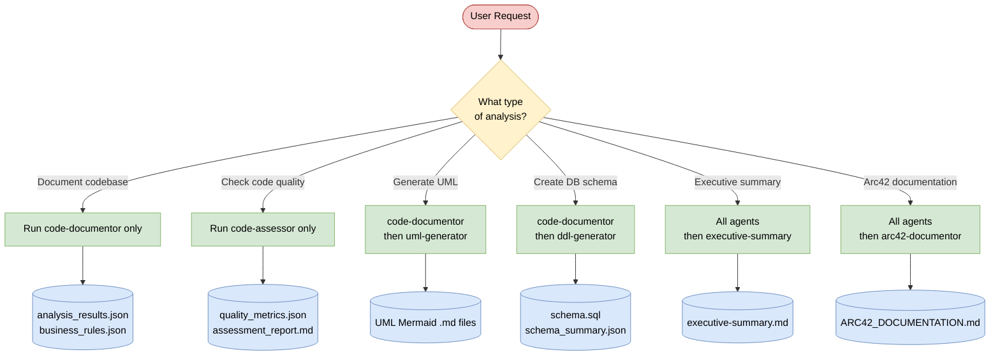

### 6.3 Scenario 3: Incremental File-by-File Processing

All agents process source files one at a time, writing partial outputs continuously:

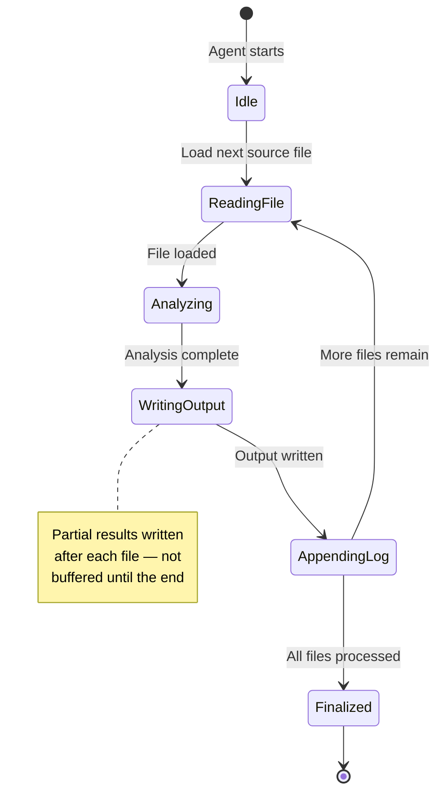

### 6.4 Agent Execution Order and Dependencies

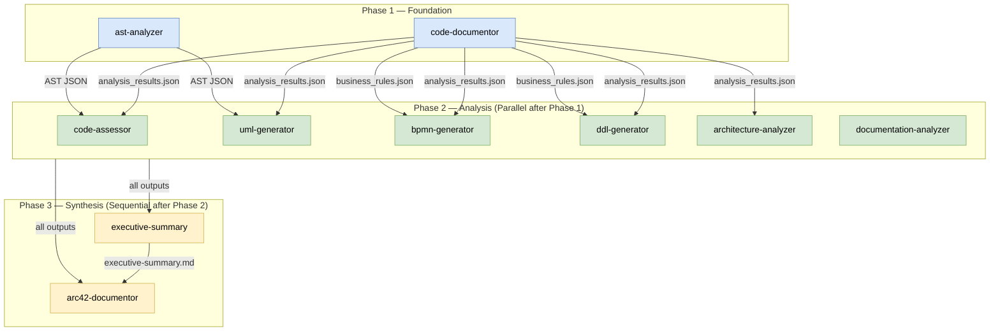

---

## 7. Deployment View

### 7.1 Infrastructure Overview

The system is fully hosted on GitHub's platform — no separate server, container, or cloud
infrastructure to manage.

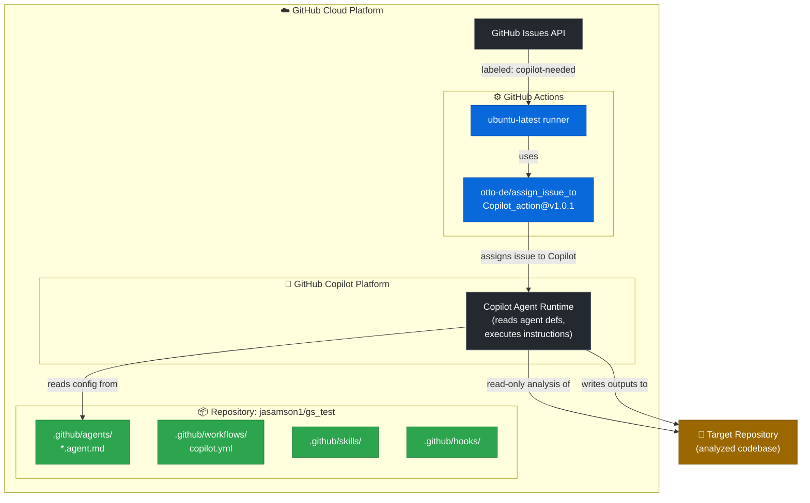

### 7.2 Deployment Topology

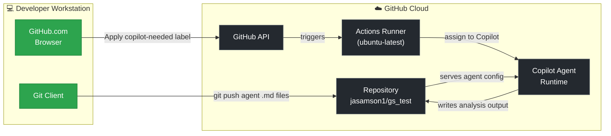

### 7.3 Runtime Configuration

| Configuration | Value | Source |
|--------------|-------|--------|
| **Trigger event** | `issues: labeled` | `.github/workflows/copilot.yml` |
| **Trigger condition** | Label name contains `copilot-needed` | `.github/workflows/copilot.yml` |
| **Runner OS** | `ubuntu-latest` | `.github/workflows/copilot.yml` |
| **Third-party action** | `otto-de/assign_issue_toCopilot_action@v1.0.1` | `.github/workflows/copilot.yml` |
| **Required secret** | `GITHUB_TOKEN` (auto-provided by GitHub) | GitHub Actions default |
| **Agent tool permissions** | `read`, `search`, `edit`, `todo` | Per-agent `.agent.md` front-matter |
| **Output directory** | `analysis_output/` (relative to repo root) | Agent convention |

### 7.4 Scalability Considerations

Execution occurs within the GitHub Copilot runtime; scalability is governed by:

- GitHub Copilot API rate limits (tokens per minute / requests per hour)
- GitHub Actions concurrent job limits (per plan tier)
- Target repository size (larger repos → more agent calls → longer runtime)
- The incremental output strategy mitigates memory limitations for very large codebases

---

## 8. Cross-cutting Concepts

### 8.1 Non-Destructiveness (Read-Only Principle)

The most fundamental cross-cutting concern. Every agent — regardless of its specific responsibility —
is explicitly prohibited from:

- Modifying source code files
- Executing code or running tests
- Interacting with live systems, databases, or APIs of the analyzed project

This principle is stated verbatim in every agent definition and architecturally enforced by limiting
agent tool permissions to `read`, `search`, `edit` (for output files only), and `todo`.

### 8.2 Unified Logging

All agents share a single logging convention appended to `analysis_output/agent-log.txt`:

```
<ISO 8601 timestamp> | <agent-name> | created/updated | <relative-file-path> | <description>
```

**Example entries:**
```
2025-07-14T10:23:44Z | code-documentor | created | analysis_output/code-documentor/analysis_results.json | File-by-file analysis results
2025-07-14T10:25:01Z | ast-analyzer | created | analysis_output/ast-analyzer/UserService_AST.json | AST for UserService.java
2025-07-14T10:31:17Z | arc42-documentor | created | analysis_output/arc42-documentor/ARC42_DOCUMENTATION.md | Complete Arc42 documentation
```

This creates a shared audit trail enabling reconstruction of what each agent did, in what order,
and to which files.

### 8.3 Diagram Standardization (Mermaid-Only)

All diagrams across all agents must use Mermaid syntax in fenced code blocks:

| Diagram Type | Mermaid Syntax |
|-------------|----------------|
| Class diagrams | `classDiagram` |
| Sequence diagrams | `sequenceDiagram` |
| Use case diagrams | `graph LR` with subgraphs |
| BPMN / flowcharts | `graph TD` or `flowchart TD` |
| Architecture diagrams | `graph TB` or `graph LR` |
| Entity-relationship | `erDiagram` |
| Deployment diagrams | `graph TB` |
| State diagrams | `stateDiagram-v2` |

**Strictly forbidden**: PlantUML (`@startuml`/`@enduml`), ASCII art (`+----+`), external image references.

### 8.4 Agent Data Model (Entity Relationships)

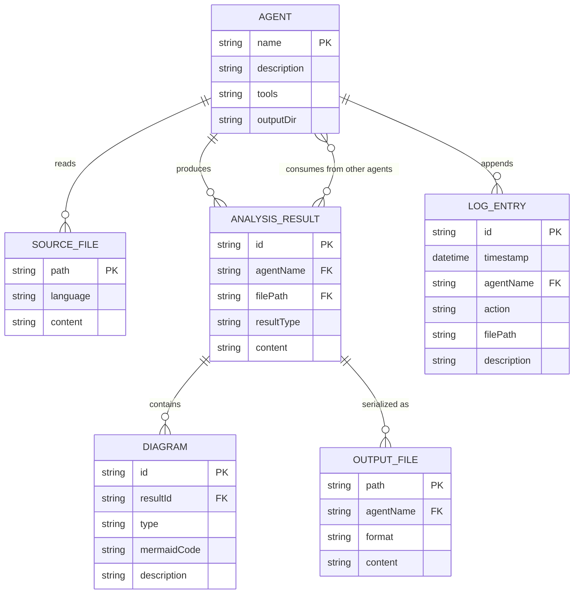

### 8.5 Business Rules Governing the System

| Rule ID | Rule | Enforcement Point |
|---------|------|------------------|
| BR-01 | Never modify source code | All agent tool lists (no write tool for source paths) |
| BR-02 | Always log every file operation | Mandatory `agent-log.txt` append in every agent |
| BR-03 | Use only Mermaid for diagrams | Explicit prohibition in every agent definition |
| BR-04 | Self-contained final documents | arc42-documentor: no external file references allowed |
| BR-05 | Produce outputs incrementally | File-by-file processing pattern in every agent |
| BR-06 | Process files deterministically | Consistent file ordering stated in orchestrator |
| BR-07 | JSON must be parseable by `json.loads()` | Stated in code-documentor, ast-analyzer, code-assessor |
| BR-08 | Use placeholder text for missing data | Error handling convention in arc42-documentor |

### 8.6 Error Handling Convention

All agents follow this convention:

1. If a file cannot be parsed → log the error, skip the file, continue with the next
2. If required input from another agent is missing → document gap with placeholder text, continue
3. If a diagram cannot be generated → include a textual description instead
4. Never abort the entire pipeline due to a single file or agent failure

---

## 9. Architecture Decisions

### ADR-001: Multi-Agent Pipeline Architecture

| | |
|--|--|
| **Status** | Accepted |
| **Context** | A single monolithic agent tasked with all analysis would have an enormous context window, difficulty maintaining domain quality, and no separation of concerns. |
| **Decision** | Use a multi-agent pipeline: each agent specializes in a single domain, with JSON outputs from earlier agents flowing as inputs to later agents. |
| **Positive Consequences** | Clear separation of concerns; each agent independently tunable; parallel execution of independent agents; simpler per-agent reasoning. |
| **Negative Consequences** | More complex orchestration; data must be serialized as JSON/Markdown between agents; total runtime longer than a hypothetical omniscient single agent. |
| **Alternatives Rejected** | Single monolithic agent — rejected due to context limits and quality degradation across domains. |

---

### ADR-002: Mermaid as Exclusive Diagram Format

| | |
|--|--|
| **Status** | Accepted |
| **Context** | Multiple diagramming formats exist (PlantUML, Graphviz DOT, ASCII art, Mermaid). The GitHub Copilot runtime cannot execute code to render images. |
| **Decision** | All diagrams must use Mermaid syntax in fenced code blocks. PlantUML and ASCII art are explicitly and permanently forbidden. |
| **Positive Consequences** | Native rendering in GitHub Markdown; no build step; human-readable source; version-control friendly. |
| **Negative Consequences** | Complex diagrams (detailed network topology, large class hierarchies) are harder to express in Mermaid than PlantUML; occasional rendering limitations. |
| **Alternatives Rejected** | PlantUML — requires rendering dependency; ASCII art — unmaintainable and unprofessional. |

---

### ADR-003: JSON as Inter-Agent Data Format

| | |
|--|--|
| **Status** | Accepted |
| **Context** | Agents need to share structured analysis results in a machine-parseable format. |
| **Decision** | All structured analysis data (ASTs, business rules, quality metrics) is serialized as JSON, parseable by Python's `json.loads()`. |
| **Positive Consequences** | Language-agnostic; widely supported; human-readable; easy to validate and process programmatically. |
| **Negative Consequences** | Large JSON files can be verbose; deeply nested structures can be hard to navigate. |

---

### ADR-004: GitHub Actions for Workflow Triggering

| | |
|--|--|
| **Status** | Accepted |
| **Context** | Agents need a trigger mechanism that integrates natively with GitHub. |
| **Decision** | Use a GitHub Actions workflow (`copilot.yml`) triggered by `issues: labeled` event with `copilot-needed` label condition, using `otto-de/assign_issue_toCopilot_action@v1.0.1`. |
| **Positive Consequences** | Zero infrastructure to manage; tight GitHub integration; label-based triggering is explicit and controllable. |
| **Negative Consequences** | Dependency on third-party action; triggering only on issues (no push-based trigger); requires `GITHUB_TOKEN` permissions. |

---

### ADR-005: Agent Definitions as Markdown Files

| | |
|--|--|
| **Status** | Accepted |
| **Context** | Agents need configuration that is both human-readable and machine-parseable by the Copilot runtime. |
| **Decision** | Each agent is a Markdown file with YAML front-matter (`name`, `description`, `tools`) followed by natural language behavioral instructions. |
| **Positive Consequences** | Entirely human-readable; version-controllable with meaningful diffs; self-documenting; editable by non-engineers. |
| **Negative Consequences** | Natural language instructions can be ambiguous; behavior depends on LLM interpretation; no formal typing or validation. |

---

### ADR-006: Shared Output Directory with Agent Subdirectories

| | |
|--|--|
| **Status** | Accepted |
| **Context** | Multiple agents produce files that must be organized and accessible to downstream agents. |
| **Decision** | All outputs go to `analysis_output/<agent-name>/`. A shared `analysis_output/agent-log.txt` records all file operations. |
| **Positive Consequences** | Clear ownership per agent; predictable file locations; single log provides full audit trail. |
| **Negative Consequences** | Concurrent runs from different branches could create merge conflicts in the output directory. |

---

### ADR-007: All-in-One Agent as Alternative Entry Point

| | |
|--|--|
| **Status** | Accepted |
| **Context** | The orchestrator + specialized agents pattern requires coordination overhead. For simple use cases, this may be unnecessary. |
| **Decision** | Provide `all-in-one-code-analyzer` as an alternative entry point that combines all agent capabilities. |
| **Positive Consequences** | Simpler triggering; all capabilities available without orchestration overhead. |
| **Negative Consequences** | Larger context window per call; parallel execution not possible within a single agent. |

---

## 10. Quality Requirements

### 10.1 Quality Tree

```mermaid
graph TD
    classDef root fill:#f8cecc,stroke:#b85450,color:#000
    classDef category fill:#dae8fc,stroke:#6c8ebf,color:#000
    classDef leaf fill:#d5e8d4,stroke:#82b366,color:#000

    Root["Quality Goals\ngs_test Multi-Agent System"]:::root

    Root --> Correct[Correctness]:::category
    Root --> Consist[Consistency]:::category
    Root --> Complete[Completeness]:::category
    Root --> Safe["Safety &\nNon-destructiveness"]:::category
    Root --> Trace[Traceability]:::category
    Root --> Extend[Extensibility]:::category
    Root --> Perf[Performance]:::category

    Correct --> C1["Diagrams accurately reflect\nanalyzed source code"]:::leaf
    Correct --> C2["JSON outputs parseable\nby json.loads()"]:::leaf
    Correct --> C3["Business rules correctly\nextracted from code"]:::leaf

    Consist --> Co1["Mermaid-only diagrams\nacross all agents"]:::leaf
    Consist --> Co2["Uniform log format\nacross all agents"]:::leaf
    Consist --> Co3["Consistent JSON schema\nper output type"]:::leaf
    Consist --> Co4["Uniform output directory\nnaming convention"]:::leaf

    Complete --> Cp1["All 12 Arc42 sections\npopulated"]:::leaf
    Complete --> Cp2["All analysis types\ncovered by agents"]:::leaf
    Complete --> Cp3["Placeholder text for\nmissing data"]:::leaf

    Safe --> S1["No source code\nmodification"]:::leaf
    Safe --> S2["No code execution\nor test running"]:::leaf
    Safe --> S3["Read-only tool\npermissions enforced"]:::leaf

    Trace --> T1["Timestamped log entry\nper file operation"]:::leaf
    Trace --> T2["Agent name in\nevery log entry"]:::leaf
    Trace --> T3["Self-contained final\ndocument"]:::leaf

    Extend --> E1["New agents added\nwithout orchestrator changes"]:::leaf
    Extend --> E2["Convention-based\nintegration"]:::leaf

    Perf --> P1["Incremental file-by-file\nprocessing"]:::leaf
    Perf --> P2["Parallel agent execution\nwhere dependencies allow"]:::leaf
```

### 10.2 Quality Scenarios

| ID | Scenario | Stimulus | Expected Response | Measure |
|----|---------|----------|-------------------|---------|
| QS-01 | Large codebase | Repo with 500+ source files | Incremental processing; partial results written after each file | No OOM errors; partial results available per-file |
| QS-02 | Unrecognized file type | Agent encounters `.kt` Kotlin file | Attempt analysis with general principles; log any parse errors; continue | No pipeline abort; error logged; other files processed |
| QS-03 | Missing upstream output | uml-generator runs before code-documentor completes | Document gap with placeholder text; continue generation | Output produced with gap notation; no crash |
| QS-04 | Diagram correctness | Class diagram generated for Java file | All public classes, fields, and relationships from imports represented | 100% of public classes in output diagram |
| QS-05 | Log completeness | Any agent creates or modifies a file | Log entry appended to `agent-log.txt` | Every file operation has exactly one log entry |
| QS-06 | Self-contained doc | Arc42 documentation generated | Final Markdown contains all diagram source code inline | Zero external file references in final doc |
| QS-07 | Non-destructive operation | Agent execution on any repository | Zero modifications to source code files | Git diff on source shows no changes after agent run |

### 10.3 Repository Documentation Assessment

Analysis of the repository's own documentation (`README.md` + agent files):

| Dimension | Score | Notes |
|-----------|:-----:|-------|
| **Completeness** | 2/10 | README contains only title + one-line description. No setup, usage, or architecture docs. |
| **Clarity** | 5/10 | Agent definition files are well-structured and detailed; README itself is minimal. |
| **Accuracy** | 8/10 | Agent definitions accurately describe intended behavior with rich examples. |
| **Structure** | 7/10 | Agent files follow consistent format: YAML front-matter + structured natural language body. |
| **Accessibility** | 2/10 | No navigation, no index, no getting-started guide at the repository level. |
| **Examples** | 8/10 | Agent definition files contain rich code examples and sample JSON/Markdown outputs. |
| **Overall** | **5.3/10** | Good internal agent documentation; poor repository-level onboarding documentation. |

**Priority Recommendations:**
1. Expand `README.md` with system overview, quick-start, agent list, and usage examples *(est. 2–3 hours)*
2. Add `CONTRIBUTING.md` explaining how to add new agents *(est. 2 hours)*
3. Document `.github/skills/` and `.github/hooks/` intended use *(est. 1 hour)*

---

## 11. Risks and Technical Debt

### 11.1 Risk Register

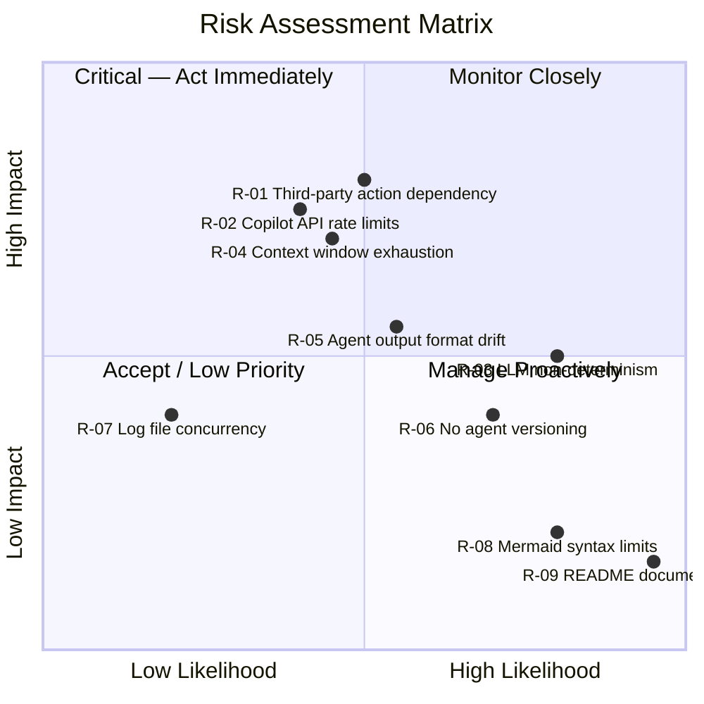

### 11.2 Detailed Risk Analysis

| Risk ID | Risk | Likelihood | Impact | Severity | Mitigation |
|---------|------|:----------:|:------:|:--------:|-----------|
| **R-01** | `otto-de/assign_issue_toCopilot_action@v1.0.1` deprecated, removed, or breaks | Medium | High | 🔴 Critical | Pin to commit SHA. Fork as backup. Monitor action repository. |
| **R-02** | GitHub Copilot API rate limits throttle analysis mid-run | Medium | High | 🔴 Critical | Design agents to resume from incremental checkpoint files. |
| **R-03** | LLM non-determinism: different runs produce different (valid) outputs | High | Medium | 🟠 High | Define strict JSON schemas; structured prompts with explicit format requirements. |
| **R-04** | Large repository (10,000+ files) exceeds agent context window | Medium | High | 🟠 High | Incremental processing (already designed); sub-package analysis; document limits. |
| **R-05** | Agent output schemas drift independently, breaking downstream consumers | Medium | Medium | 🟡 Medium | Define and version JSON schemas; add schema validation to consumer agents. |
| **R-06** | No agent versioning makes behavior changes untraceable | High | Medium | 🟡 Medium | Add version to agent front-matter; CHANGELOG for agent definitions. |
| **R-07** | Concurrent agents corrupting shared `agent-log.txt` | Low | Medium | 🟡 Medium | Currently sequential; monitor if parallel execution is introduced. |
| **R-08** | Complex diagrams hard to express cleanly in Mermaid | High | Low | 🟢 Low | Split large diagrams into smaller focused diagrams. |
| **R-09** | Near-empty README creates poor first impression | Certain | Low | 🟢 Low | Update README (tracked as TD-01). |

### 11.3 Technical Debt Register

| ID | Type | Description | Impact | Est. Effort |
|----|------|-------------|:------:|:-----------:|
| **TD-01** | Documentation Debt | `README.md` contains only title + one-line description. No setup, usage, architecture, or agent list. | **HIGH** | 2–4 h |
| **TD-02** | Documentation Debt | No `CONTRIBUTING.md` or developer guide for adding new agents. | **MEDIUM** | 2–3 h |
| **TD-03** | Test Debt | Zero tests of any kind — no unit, integration, or schema validation tests. Regressions undetectable. | **HIGH** | 20–40 h |
| **TD-04** | Security Debt | `GITHUB_TOKEN` permissions not scoped — uses broad defaults instead of least-privilege. | **MEDIUM** | 1 h |
| **TD-05** | Design Debt | No formal JSON Schema definitions for inter-agent data contracts. Format drift has no detection. | **MEDIUM** | 4–8 h |
| **TD-06** | Security Debt | Third-party action pinned to version tag `@v1.0.1` rather than immutable commit SHA. | **MEDIUM** | 0.5 h |
| **TD-07** | Design Debt | No versioning scheme for agent definitions; impossible to know which version produced a given output. | **LOW** | 2–3 h |
| **TD-08** | Documentation Debt | `.github/skills/` and `.github/hooks/` contain only `.keep` files with no documentation of intent. | **LOW** | 1 h |

### 11.4 Mitigation Roadmap

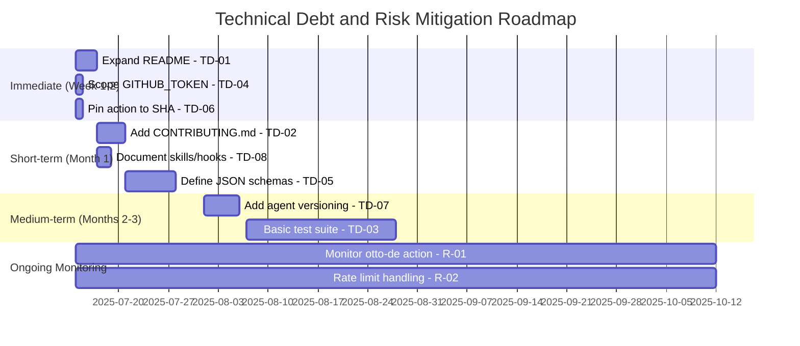

---

## 12. Glossary

| Term | Definition |
|------|-----------|
| **Agent** | An AI-powered module with a specific analysis responsibility, defined as a Markdown file with YAML front-matter and natural language instructions. Each agent has a `name`, `description`, `tools` list, and output conventions. |
| **agent-log.txt** | The shared audit log at `analysis_output/agent-log.txt`. Every agent appends one timestamped line per file it creates or modifies. Format: `<timestamp> | <agent> | created/updated | <path> | <description>`. |
| **all-in-one-code-analyzer** | An alternative entry-point agent (`all-in-one-agent.md`) that combines all ten specialized agent capabilities into a single agent, bypassing the orchestrator for simpler use cases. |
| **analysis_output/** | Root output directory where all agent-generated files are stored, organized by agent name in subdirectories (`analysis_output/<agent-name>/`). |
| **analysis_results.json** | Primary structured output of `code-documentor`, containing file-by-file analysis including summary, category, business rules, method breakdowns, and technical libraries. |
| **arc42-documentor** | The synthesis agent (`arc42-documentor.agent.md`) that reads all other agents' outputs and produces the comprehensive self-contained Arc42 architecture documentation Markdown file. |
| **Arc42** | A template for software architecture documentation with twelve defined sections (Introduction & Goals → Glossary). Created by Peter Hruschka and Gernot Starke. |
| **architecture-analyzer** | Specialized agent that generates cloud and component architecture diagrams in Mermaid from code analysis results, detecting patterns (monolithic, microservices, layered, etc.). |
| **AST (Abstract Syntax Tree)** | A tree representation of source code's syntactic structure, capturing classes, methods, statements, and expressions. Generated as JSON by `ast-analyzer`. |
| **ast-analyzer** | Specialized agent that generates JSON-format ASTs from source code, providing detailed structural analysis including type declarations, method bodies, control flow, and dependencies. |
| **BPMN (Business Process Model and Notation)** | A standard notation for modeling business processes. In this system, BPMN concepts are expressed as Mermaid `graph TD` flowchart diagrams by `bpmn-generator`. |
| **bpmn-generator** | Specialized agent that translates source code workflows and business logic into Mermaid flowchart diagrams representing business processes, including swimlanes and error handling paths. |
| **business_rules_extractor_analysis.json** | Secondary output of `code-documentor`, containing extracted business rules, validation logic, workflow steps, and decision criteria. |
| **code-assessor** | Specialized agent for comprehensive code quality assessment: identifies issues (criticality 1–5), documents technical debt, measures complexity (0–10 scales), and provides enhancement recommendations. |
| **code-documentor** | The foundational analysis agent that analyzes source code files, classifies them (Business/Technical/Mixed), extracts business rules and method breakdowns, and produces `analysis_results.json` and `business_rules_extractor_analysis.json`. |
| **code-analysis-orchestrator** | The master coordinator agent (`orchestrator.agent.md`) that plans and sequences the execution of all specialized agents in the correct dependency order, providing progress updates and routing data between agents. |
| **copilot-needed** | The GitHub issue label that triggers the `copilot.yml` Actions workflow, which routes the issue to GitHub Copilot for processing. |
| **copilot.yml** | The GitHub Actions workflow at `.github/workflows/copilot.yml` that listens for `issues: labeled` events and assigns `copilot-needed`-labeled issues to GitHub Copilot via `otto-de/assign_issue_toCopilot_action`. |
| **DDL (Data Definition Language)** | SQL statements that define database schema elements: tables, columns, indexes, constraints, and foreign key relationships. Generated by `ddl-generator`. |
| **ddl-generator** | Specialized agent that analyzes code entities, fields, and relationships to generate optimized SQL DDL files including tables, indexes, constraints, views, and triggers, plus ER diagrams. |
| **documentation-analyzer** | Specialized agent that evaluates existing project documentation quality (completeness, clarity, accuracy, structure), identifies gaps, and compares documentation against actual code implementation. |
| **executive-summary** | Synthesis agent that transforms technical analysis findings from all agents into executive-level strategic insights: strengths, weaknesses, prioritized recommendations, cost-benefit analysis, and risk assessment. |
| **Foundation Layer** | Phase 1 of agent execution — `code-documentor` and `ast-analyzer` — whose outputs are required by all downstream analysis agents. These may run sequentially or in parallel. |
| **GitHub Copilot Agent Runtime** | The execution environment provided by GitHub Copilot that runs agent definitions against target repositories, providing tools: `read`, `search`, `edit`, and `todo`. |
| **Incremental Output Pattern** | The design pattern whereby agents write partial results to output files after processing each source file, rather than buffering all results before writing. Enables large-codebase processing and partial result availability. |
| **Mermaid** | An open-source diagramming tool with a Markdown-like text syntax that generates diagrams at render time. The exclusive diagram format used by all agents in this system. |
| **orchestrator** | See **code-analysis-orchestrator**. |
| **Pipeline Architecture** | The overall system design: agents execute in phases (Foundation → Analysis → Synthesis), with JSON/Markdown outputs from one phase flowing as inputs to the next. |
| **Read-only Principle** | The fundamental constraint that no agent may modify, delete, or execute source code in the analyzed repository. All operations are read-only with respect to the target codebase. |
| **Synthesis Layer** | Phase 3 of agent execution — `executive-summary` (first) followed by `arc42-documentor` — which consume all phase-1 and phase-2 outputs to produce high-level documentation artefacts. |
| **uml-generator** | Specialized agent that generates UML class diagrams (`classDiagram`), sequence diagrams (`sequenceDiagram`), and use case diagrams (`graph LR`) in Mermaid format from code-documentor and ast-analyzer outputs. |

---

*Documentation generated by the **arc42-documentor** agent*  
*System: gs_test GitHub Copilot Multi-Agent Code Analysis Platform*  
*Arc42 Template Version: 8 | Diagram Format: Mermaid (all diagrams self-contained)*  
*Repository: jasamson1/gs_test*
