# Arc42 Architecture Documentation — PayrollApp

**Project**: PayrollApp — Enterprise Payroll Management System  
**Version**: 1.0.0  
**Date**: 2025-01-30  
**Generated by**: Arc42 Documentation Generator (arc42-documentor)  
**Status**: Approved for Review  

---

## Table of Contents

1. [Introduction and Goals](#1-introduction-and-goals)
2. [Architecture Constraints](#2-architecture-constraints)
3. [System Scope and Context](#3-system-scope-and-context)
4. [Solution Strategy](#4-solution-strategy)
5. [Building Block View](#5-building-block-view)
6. [Runtime View](#6-runtime-view)
7. [Deployment View](#7-deployment-view)
8. [Cross-cutting Concepts](#8-cross-cutting-concepts)
9. [Architecture Decisions](#9-architecture-decisions)
10. [Quality Requirements](#10-quality-requirements)
11. [Risks and Technical Debt](#11-risks-and-technical-debt)
12. [Glossary](#12-glossary)

---

## 1. Introduction and Goals

### 1.1 Business Context and Purpose

**PayrollApp** is an enterprise-grade payroll management system designed to automate and streamline the complete payroll lifecycle for mid-to-large organizations (500–50,000 employees). The system handles salary computation, tax withholding, statutory deductions, benefits administration, payment disbursement, and regulatory compliance reporting.

The system replaces manual spreadsheet-based payroll processing, eliminates calculation errors, ensures on-time salary payment, and maintains a tamper-proof audit trail for regulatory compliance.

### 1.2 Core Functional Goals

| # | Goal | Priority |
|---|------|----------|
| G-01 | Accurate gross-to-net salary computation for all employee types (full-time, part-time, contractor, hourly) | Critical |
| G-02 | Automated statutory tax withholding (income tax, social security, Medicare) and remittance | Critical |
| G-03 | On-time payment disbursement via ACH/SEPA bank transfers and check generation | Critical |
| G-04 | Benefits deduction management (health insurance, pension, FSA, HSA) | High |
| G-05 | Digital payslip generation and employee self-service portal | High |
| G-06 | Regulatory compliance reporting (W-2, 1099, P60, PAYE submissions) | Critical |
| G-07 | Multi-currency, multi-jurisdiction payroll support | Medium |
| G-08 | Integration with HR, ERP, and Time-and-Attendance systems | High |
| G-09 | Real-time payroll analytics and management dashboards | Medium |
| G-10 | Role-based access control with complete audit logging | Critical |

### 1.3 Quality Goals

The top five quality goals that drive architectural decisions:

| Priority | Quality Goal | Motivation |
|----------|-------------|------------|
| 1 | **Correctness / Accuracy** | Payroll miscalculations result in employee disputes, regulatory fines, and reputational damage. Zero-tolerance policy. |
| 2 | **Security & Data Privacy** | Payroll data contains PII and financial information. GDPR, SOX, and local labor-law compliance is mandatory. |
| 3 | **Reliability / Availability** | Payroll must complete on the scheduled date regardless of infrastructure failures. SLA: 99.9% uptime. |
| 4 | **Auditability & Compliance** | Every computation and data change must be traceable. Immutable audit logs required for 7-year retention. |
| 5 | **Performance / Scalability** | Monthly payroll runs for 50,000 employees must complete within 2 hours. Peak loads must not degrade responsiveness. |

### 1.4 Stakeholders

| Stakeholder | Role | Expectations |
|-------------|------|--------------|
| Payroll Administrators | Primary users — configure and execute payroll runs | Intuitive UI, batch processing, error correction workflows |
| HR Managers | Maintain employee master data | Seamless sync from HRIS, accurate deduction setup |
| Finance / CFO | Cost control, budgeting, compliance | Accurate GL postings, audit trails, cost-center reports |
| Employees | Receive pay, view payslips | Self-service portal, mobile-friendly, payslip history |
| IT Operations | Deploy and maintain the system | Automated deployments, monitoring, scalability |
| Internal Audit | Compliance verification | Immutable logs, data lineage, SOX controls |
| Tax Authorities | Regulatory filings | Correctly formatted electronic submissions |
| Bank / Payment Networks | Fund transfers | Secure, standards-compliant ACH/SEPA files |

---

## 2. Architecture Constraints

### 2.1 Technical Constraints

| ID | Constraint | Rationale |
|----|-----------|-----------|
| TC-01 | Backend services implemented in **Java 21 (LTS)** with **Spring Boot 3.x** | Organization's primary backend platform; large talent pool; long-term vendor support |
| TC-02 | Frontend implemented in **React 18** with **TypeScript** | Standardized on React across all enterprise web applications |
| TC-03 | Primary relational database: **PostgreSQL 15+** | Enterprise-standard RDBMS with strong ACID guarantees; no Oracle licensing cost |
| TC-04 | Containerized deployments via **Docker** and orchestrated with **Kubernetes (EKS)** | Organization-wide container strategy; enables horizontal scaling |
| TC-05 | All inter-service communication uses **REST/JSON** for synchronous calls and **Apache Kafka** for asynchronous events | Standardized messaging platform; established expertise |
| TC-06 | Infrastructure-as-Code using **Terraform** | Repeatable, auditable cloud infrastructure |
| TC-07 | CI/CD pipeline via **GitHub Actions** | Existing toolchain; required approval gates before production |
| TC-08 | Authentication via **OAuth 2.0 / OpenID Connect** integrated with the corporate **Azure Active Directory** | Single Sign-On mandatory; no local credential stores |
| TC-09 | All data at rest encrypted with **AES-256**; all data in transit encrypted with **TLS 1.3** | Security policy and GDPR requirement |
| TC-10 | Deployment target: **AWS** (primary region: us-east-1, DR region: eu-west-1) | Corporate cloud provider agreement |

### 2.2 Regulatory and Compliance Constraints

| ID | Constraint | Jurisdiction |
|----|-----------|-------------|
| RC-01 | **SOX (Sarbanes-Oxley) compliance**: financial controls, access management, change management, audit trails | USA |
| RC-02 | **GDPR compliance**: data minimisation, right to erasure, data residency (EU employee data stays in EU) | EU |
| RC-03 | **HIPAA considerations**: health benefit deduction data handling | USA |
| RC-04 | **IRS Publication 15 / Circular E**: federal income tax withholding tables updated each tax year | USA |
| RC-05 | **PAYE / RTI submissions**: Real Time Information reporting to HMRC | UK |
| RC-06 | **Payroll data retention**: minimum 7 years per labor law | Global |
| RC-07 | **PCI-DSS**: payment card data handling for expense reimbursements | Global |

### 2.3 Organizational Constraints

| ID | Constraint |
|----|-----------|
| OC-01 | Project team: 3 squads (8 engineers each) — Core Payroll, Platform, and Self-Service |
| OC-02 | Release cadence: two-week sprints; monthly production releases (no releases during payroll close window) |
| OC-03 | Existing HR system (Workday) is the **system of record** for employee data — PayrollApp must not own it |
| OC-04 | Existing ERP (SAP S/4HANA) is the system of record for General Ledger postings |
| OC-05 | Disaster Recovery RTO: 4 hours; RPO: 15 minutes |
| OC-06 | All architecture decisions must be reviewed and approved by the Enterprise Architecture Board (EAB) |

---

## 3. System Scope and Context

### 3.1 Business Context

PayrollApp sits at the intersection of HR, Finance, and Banking systems. The following C4-style context diagram shows the system's external interfaces and actors.

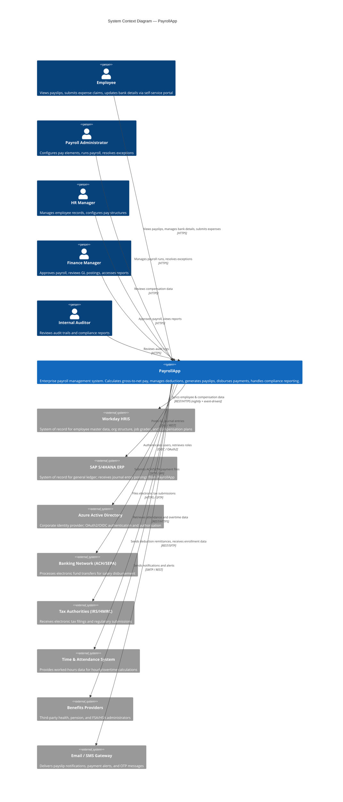

### 3.2 Technical Context (Container View)

The following container diagram shows the major deployable units within PayrollApp and their communication channels.

```mermaid
C4Container
    title Container Diagram — PayrollApp

    Person(user, "User", "Employee, Payroll Admin, HR Manager, Finance Manager")

    System_Boundary(payrollApp, "PayrollApp") {
        Container(webApp, "Web Application", "React 18 / TypeScript", "Browser-based SPA; employee self-service and admin interface")
        Container(apiGateway, "API Gateway", "Kong / AWS API Gateway", "TLS termination, rate limiting, JWT validation, request routing")
        Container(employeeSvc, "Employee Service", "Spring Boot 3 / Java 21", "Manages employee profiles, pay structures, bank accounts")
        Container(payrollEngine, "Payroll Calculation Engine", "Spring Boot 3 / Java 21", "Core gross-to-net calculation, tax computation, deduction processing")
        Container(paymentSvc, "Payment Service", "Spring Boot 3 / Java 21", "Generates ACH/SEPA files, manages payment status, handles bank callbacks")
        Container(taxSvc, "Tax Service", "Spring Boot 3 / Java 21", "Maintains tax tables, computes withholdings, generates tax filings")
        Container(benefitsSvc, "Benefits Service", "Spring Boot 3 / Java 21", "Manages benefit enrollments, deduction schedules, remittances")
        Container(reportingSvc, "Reporting Service", "Spring Boot 3 / Java 21", "Generates payslips, management reports, regulatory filings")
        Container(notificationSvc, "Notification Service", "Spring Boot 3 / Java 21", "Dispatches email/SMS notifications asynchronously")
        Container(auditSvc, "Audit Service", "Spring Boot 3 / Java 21", "Captures immutable audit events, provides compliance query API")

        ContainerDb(primaryDB, "Primary Database", "PostgreSQL 15", "Employee data, payroll runs, pay calculations, payment records")
        ContainerDb(auditDB, "Audit Database", "PostgreSQL 15 (append-only)", "Immutable audit event log with 7-year retention")
        ContainerDb(cache, "Cache", "Redis 7", "Tax tables, employee lookups, session tokens")
        ContainerDb(documentStore, "Document Store", "AWS S3", "Payslip PDFs, ACH files, tax filing documents")
        Container(messageBus, "Message Bus", "Apache Kafka", "Asynchronous event streaming between services")
    }

    System_Ext(workday, "Workday HRIS")
    System_Ext(sap, "SAP S/4HANA")
    System_Ext(azureAD, "Azure AD")
    System_Ext(bankingNetwork, "Banking Network")
    System_Ext(taxAuthority, "Tax Authorities")

    Rel(user, webApp, "Uses", "HTTPS")
    Rel(webApp, apiGateway, "API calls", "HTTPS/JSON")
    Rel(apiGateway, employeeSvc, "Routes employee requests", "HTTP/JSON")
    Rel(apiGateway, payrollEngine, "Routes payroll requests", "HTTP/JSON")
    Rel(apiGateway, paymentSvc, "Routes payment requests", "HTTP/JSON")
    Rel(apiGateway, reportingSvc, "Routes reporting requests", "HTTP/JSON")
    Rel(apiGateway, auditSvc, "Routes audit queries", "HTTP/JSON")
    Rel(apiGateway, azureAD, "Validates JWT tokens", "OIDC")

    Rel(payrollEngine, taxSvc, "Requests tax calculations", "HTTP/JSON (sync)")
    Rel(payrollEngine, benefitsSvc, "Requests benefit deductions", "HTTP/JSON (sync)")
    Rel(payrollEngine, employeeSvc, "Reads employee/comp data", "HTTP/JSON (sync)")
    Rel(payrollEngine, messageBus, "Publishes PayrollCalculated events", "Kafka")
    Rel(paymentSvc, messageBus, "Consumes PayrollCalculated events", "Kafka")
    Rel(notificationSvc, messageBus, "Consumes PaymentDispatched events", "Kafka")
    Rel(auditSvc, messageBus, "Consumes all domain events", "Kafka")
    Rel(reportingSvc, messageBus, "Consumes PayrollCalculated events", "Kafka")

    Rel(employeeSvc, primaryDB, "Reads/Writes", "JDBC/TLS")
    Rel(payrollEngine, primaryDB, "Reads/Writes", "JDBC/TLS")
    Rel(paymentSvc, primaryDB, "Reads/Writes", "JDBC/TLS")
    Rel(taxSvc, cache, "Caches tax tables", "Redis")
    Rel(employeeSvc, cache, "Caches employee data", "Redis")
    Rel(auditSvc, auditDB, "Appends events", "JDBC/TLS")
    Rel(reportingSvc, documentStore, "Stores payslip PDFs", "AWS SDK")

    Rel(employeeSvc, workday, "Syncs employee data", "REST/HTTPS")
    Rel(paymentSvc, bankingNetwork, "Submits payment files", "SFTP/API")
    Rel(taxSvc, taxAuthority, "Files tax submissions", "HTTPS")
    Rel(payrollEngine, sap, "Posts GL entries", "REST")
```

---

## 4. Solution Strategy

### 4.1 Technology Decisions

| Decision | Choice | Rationale |
|----------|--------|-----------|
| **Architecture Style** | Microservices | Enables independent deployment and scaling of payroll engine, tax service, and payment service; aligns with Conway's Law (3 squads) |
| **Backend Framework** | Java 21 + Spring Boot 3.x | Mature ecosystem; virtual threads (Project Loom) for high-concurrency payroll batch processing; excellent cloud-native support |
| **Frontend** | React 18 + TypeScript | Declarative UI; large ecosystem; company standard; TypeScript provides compile-time safety for complex payroll form logic |
| **Database** | PostgreSQL 15 | ACID transactions essential for payroll accuracy; row-level security for multi-tenant data; logical replication for CDC |
| **Async Messaging** | Apache Kafka | Durable, ordered, replayable event log; essential for audit trail completeness; handles burst load during payroll runs |
| **Caching** | Redis 7 | Sub-millisecond lookups for tax tables and employee data; TTL-based cache invalidation; Lua scripting for atomic operations |
| **API Gateway** | Kong | Centralized auth, rate limiting, and observability; plugin ecosystem; declarative configuration |
| **Search** | PostgreSQL Full-Text Search | Employee and payroll record search; avoids additional infrastructure for current scale |
| **Document Storage** | AWS S3 | Durable, cost-effective storage for payslip PDFs and ACH files; lifecycle policies for 7-year retention |
| **Container Orchestration** | Kubernetes (AWS EKS) | Auto-scaling for payroll run burst capacity; rolling deployments with zero downtime |

### 4.2 Decomposition Strategy

The system is decomposed along **bounded contexts** derived from Domain-Driven Design analysis:

```mermaid
graph TB
    subgraph "Bounded Context: Employee Management"
        BC1[Employee Profile]
        BC2[Compensation Structure]
        BC3[Bank Account]
    end
    subgraph "Bounded Context: Payroll Processing"
        BC4[Payroll Run]
        BC5[Pay Calculation]
        BC6[Deduction Processing]
    end
    subgraph "Bounded Context: Taxation"
        BC7[Tax Table Management]
        BC8[Withholding Calculation]
        BC9[Regulatory Filing]
    end
    subgraph "Bounded Context: Benefits"
        BC10[Benefit Enrollment]
        BC11[Deduction Schedule]
        BC12[Remittance]
    end
    subgraph "Bounded Context: Payment"
        BC13[Payment Order]
        BC14[Bank File Generation]
        BC15[Payment Status]
    end
    subgraph "Bounded Context: Reporting & Compliance"
        BC16[Payslip Generation]
        BC17[GL Posting]
        BC18[Compliance Report]
    end

    BC4 -->|uses| BC1
    BC4 -->|uses| BC2
    BC5 -->|requests| BC7
    BC5 -->|requests| BC10
    BC4 -->|triggers| BC13
    BC4 -->|triggers| BC16
    BC4 -->|triggers| BC17

    style BC4 fill:#e74c3c,color:#fff
    style BC5 fill:#e74c3c,color:#fff
    style BC13 fill:#2ecc71,color:#fff
    style BC16 fill:#3498db,color:#fff
```

### 4.3 Key Architectural Principles

1. **Idempotency First**: All payroll calculations and payment submissions are idempotent — re-running a payroll period produces identical results given the same input data.
2. **Event Sourcing for Audit**: All state changes are published as domain events to Kafka before being applied; Audit Service maintains an immutable projection.
3. **Separation of Calculation from Persistence**: The Payroll Calculation Engine is a pure computation component — it does not own state; results are persisted by the Payroll Run Orchestrator.
4. **Fail-Safe Defaults**: If tax rate data is unavailable, payroll run is halted (not estimated); correctness > availability for financial calculations.
5. **Data Residency Enforcement**: EU employee data is physically isolated in the eu-west-1 region; enforced at API Gateway and database-routing layer.

---

## 5. Building Block View

### 5.1 Level 1 — High-Level System Decomposition

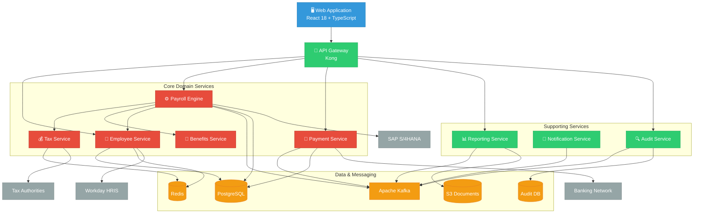

### 5.2 Level 2 — Payroll Engine Internal Structure

The Payroll Engine is the most complex component. Its internal structure is decomposed as follows:

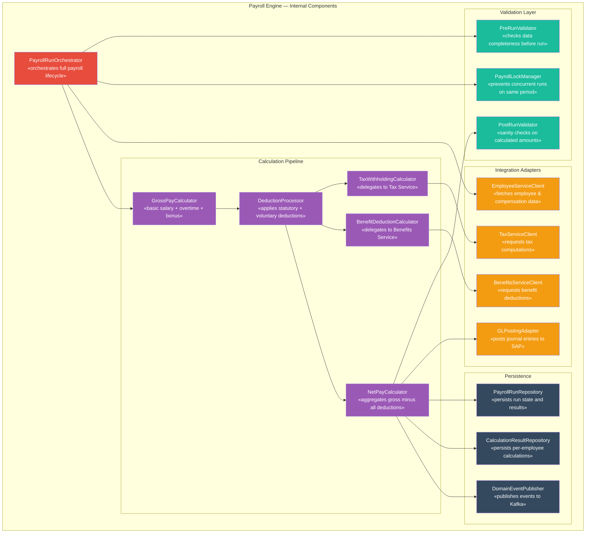

### 5.3 Level 3 — Core Domain Class Model

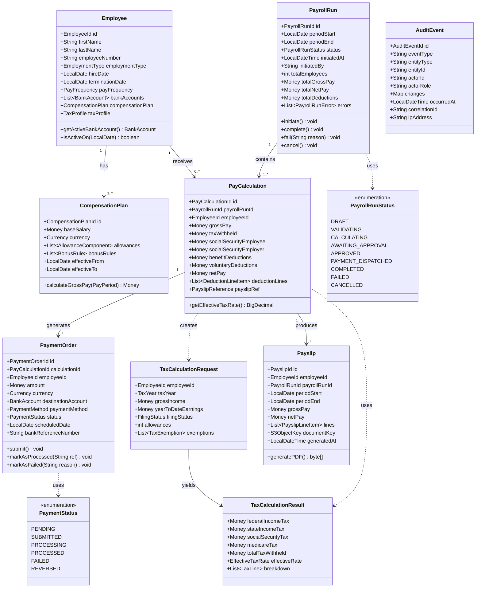

---

## 6. Runtime View

### 6.1 Scenario 1 — Monthly Payroll Run (Happy Path)

This sequence describes the end-to-end flow for a standard monthly payroll run covering 5,000 employees.

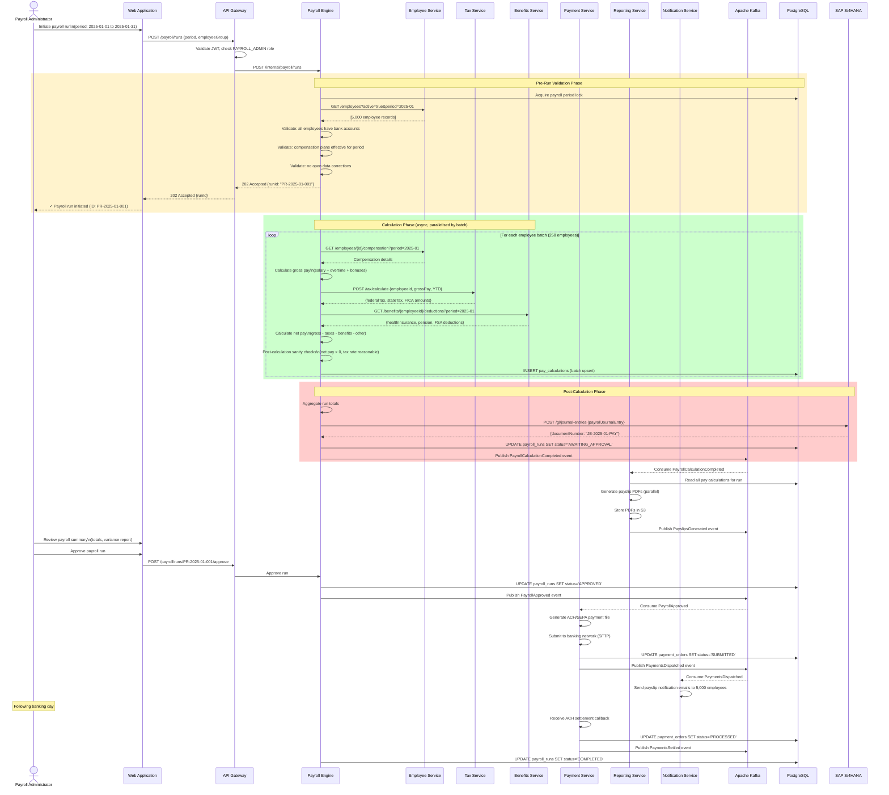

### 6.2 Scenario 2 — Employee Onboarding (New Hire First Payroll)

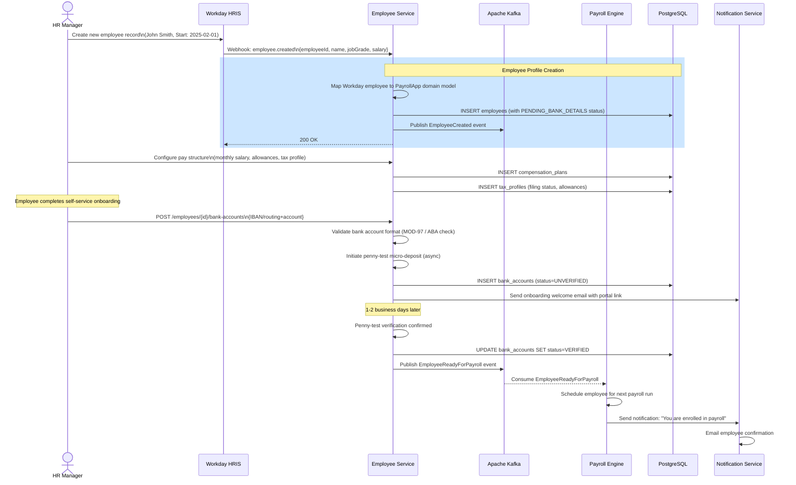

### 6.3 Scenario 3 — Tax Calculation Detail

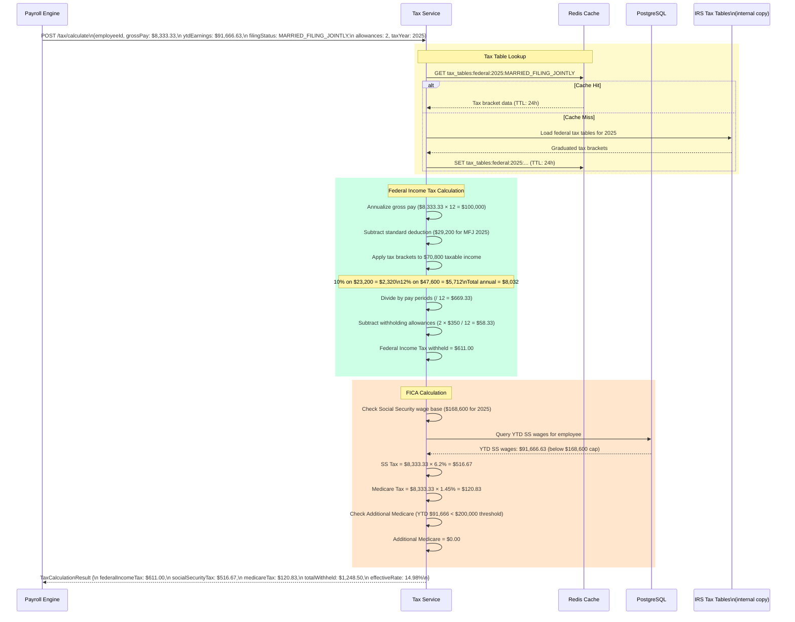

### 6.4 Payroll Run State Lifecycle

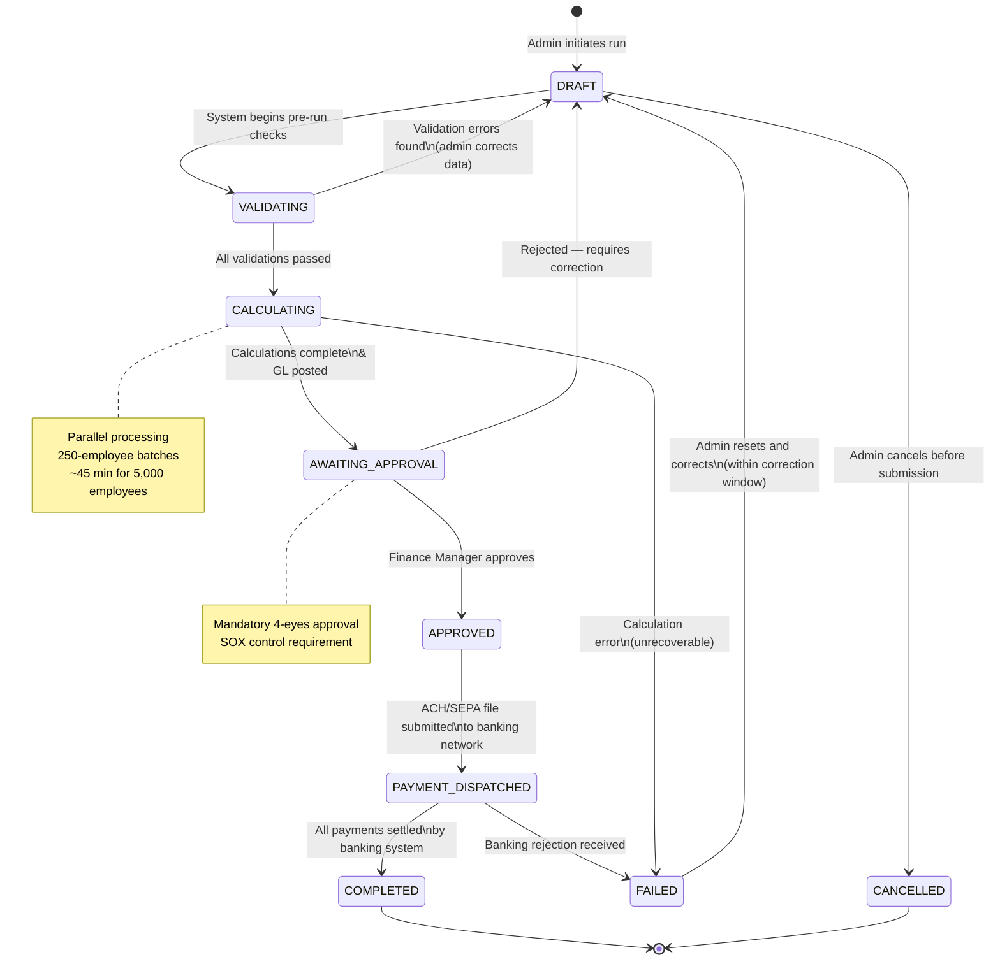

---

## 7. Deployment View

### 7.1 Production Deployment Topology

```mermaid
graph TB
    classDef aws fill:#FF9900,color:#fff,stroke:#FF6600
    classDef k8s fill:#326CE5,color:#fff,stroke:#1a56cc
    classDef db fill:#336791,color:#fff,stroke:#1a4a6e
    classDef security fill:#dd3522,color:#fff,stroke:#aa2211
    classDef cdn fill:#00A8E1,color:#fff,stroke:#006fa8

    subgraph "Internet / Clients"
        BROWSER[Browser Clients]
        MOBILE[Mobile Clients]
        EXT_SYSTEMS[External Systems\nWorkday / SAP / Banks]
    end

    subgraph "AWS us-east-1 (Primary Region)"
        subgraph "Edge Layer"
            CF[CloudFront CDN\nStatic Asset Delivery]:::cdn
            WAF[AWS WAF\nDDoS Protection / IP Filtering]:::security
            R53[Route 53\nDNS + Health Checks]:::aws
        end

        subgraph "VPC: 10.0.0.0/16"
            subgraph "Public Subnets (AZ-a, AZ-b, AZ-c)"
                ALB[Application Load Balancer\nHTTPS :443]:::aws
                NAT[NAT Gateway\nOutbound traffic]:::aws
            end

            subgraph "Private Subnets — Application Tier"
                subgraph "EKS Cluster (Node Group: m6i.2xlarge × 12)"
                    direction TB
                    subgraph "Namespace: payroll-core"
                        EMP_POD[employee-service\n3 replicas]:::k8s
                        PAY_POD[payroll-engine\n5 replicas\n(scales to 20 during run)]:::k8s
                        TAX_POD[tax-service\n3 replicas]:::k8s
                        BEN_POD[benefits-service\n3 replicas]:::k8s
                        PMT_POD[payment-service\n3 replicas]:::k8s
                    end
                    subgraph "Namespace: payroll-support"
                        RPT_POD[reporting-service\n3 replicas]:::k8s
                        NTF_POD[notification-service\n2 replicas]:::k8s
                        AUD_POD[audit-service\n2 replicas]:::k8s
                    end
                    subgraph "Namespace: platform"
                        KONG[Kong API Gateway\n3 replicas]:::k8s
                        PROM[Prometheus + Grafana]:::k8s
                        JAEGER[Jaeger Tracing]:::k8s
                    end
                end
            end

            subgraph "Private Subnets — Data Tier"
                subgraph "RDS Aurora PostgreSQL Cluster"
                    PG_PRIMARY[Primary Writer\nr6g.4xlarge]:::db
                    PG_REPLICA1[Read Replica 1\nr6g.2xlarge]:::db
                    PG_REPLICA2[Read Replica 2\nr6g.2xlarge]:::db
                end
                subgraph "ElastiCache Redis Cluster"
                    REDIS_PRIMARY[Redis Primary\ncache.r7g.xlarge]:::db
                    REDIS_REPLICA[Redis Replica]:::db
                end
                subgraph "Amazon MSK (Managed Kafka)"
                    KAFKA_B1[Kafka Broker 1]:::db
                    KAFKA_B2[Kafka Broker 2]:::db
                    KAFKA_B3[Kafka Broker 3]:::db
                end
                S3_BUCKET[S3 Bucket\nPayslips + ACH Files\nKMS Encrypted]:::aws
            end
        end

        subgraph "Security Services"
            KMS[AWS KMS\nKey Management]:::security
            SECRETS[AWS Secrets Manager\nDB Credentials / API Keys]:::security
            COGNITO[Amazon Cognito\n+ Azure AD Federation]:::security
        end
    end

    subgraph "AWS eu-west-1 (DR Region)"
        DR_EKS[EKS Cluster\n«warm standby»\nRTO: 4h]:::k8s
        DR_RDS[Aurora Global DB\nSecondary\nRPO: 15min]:::db
        DR_S3[S3 Replication Bucket]:::aws
    end

    BROWSER --> CF
    MOBILE --> CF
    CF --> WAF
    WAF --> R53
    R53 --> ALB
    ALB --> KONG
    EXT_SYSTEMS --> ALB

    KONG --> EMP_POD
    KONG --> PAY_POD
    KONG --> PMT_POD
    KONG --> RPT_POD
    KONG --> AUD_POD

    PAY_POD --> TAX_POD
    PAY_POD --> BEN_POD
    PAY_POD --> EMP_POD

    EMP_POD --> PG_PRIMARY
    PAY_POD --> PG_PRIMARY
    PMT_POD --> PG_PRIMARY
    AUD_POD --> PG_PRIMARY
    EMP_POD --> REDIS_PRIMARY
    TAX_POD --> REDIS_PRIMARY

    PAY_POD --> KAFKA_B1
    PMT_POD --> KAFKA_B1
    NTF_POD --> KAFKA_B1
    AUD_POD --> KAFKA_B1
    RPT_POD --> KAFKA_B1

    RPT_POD --> S3_BUCKET
    PMT_POD --> NAT
    NAT --> EXT_SYSTEMS

    PG_PRIMARY --> DR_RDS
    S3_BUCKET --> DR_S3
    DR_RDS --> DR_EKS
```

### 7.2 Kubernetes Resource Specifications

| Service | Normal Replicas | Peak Replicas | CPU Request | Memory Request | HPA Trigger |
|---------|----------------|---------------|-------------|----------------|-------------|
| payroll-engine | 3 | 20 | 2 cores | 4 GB | CPU > 70% |
| employee-service | 3 | 8 | 500m | 1 GB | CPU > 70% |
| tax-service | 3 | 10 | 1 core | 2 GB | CPU > 60% |
| payment-service | 3 | 6 | 500m | 1 GB | CPU > 70% |
| reporting-service | 3 | 8 | 2 cores | 4 GB | Queue depth > 100 |
| notification-service | 2 | 4 | 250m | 512 MB | Queue depth > 500 |
| audit-service | 2 | 4 | 500m | 1 GB | CPU > 70% |

### 7.3 Infrastructure Sizing

| Component | Instance Type | Storage | HA Configuration |
|-----------|-------------|---------|-----------------|
| Aurora PostgreSQL | r6g.4xlarge (writer) | 2 TB gp3 | Multi-AZ, 2 read replicas |
| Audit Aurora PostgreSQL | r6g.2xlarge | 4 TB gp3 (7-year retention) | Multi-AZ |
| ElastiCache Redis | cache.r7g.xlarge | 26 GB | Multi-AZ, 1 replica |
| Amazon MSK (Kafka) | kafka.m5.2xlarge | 1 TB per broker | 3 brokers, RF=3 |
| S3 (Payslips) | — | ~5 TB/year | S3 Standard-IA with Glacier after 2 years |

---

## 8. Cross-cutting Concepts

### 8.1 Domain Model — Entity Relationship Diagram

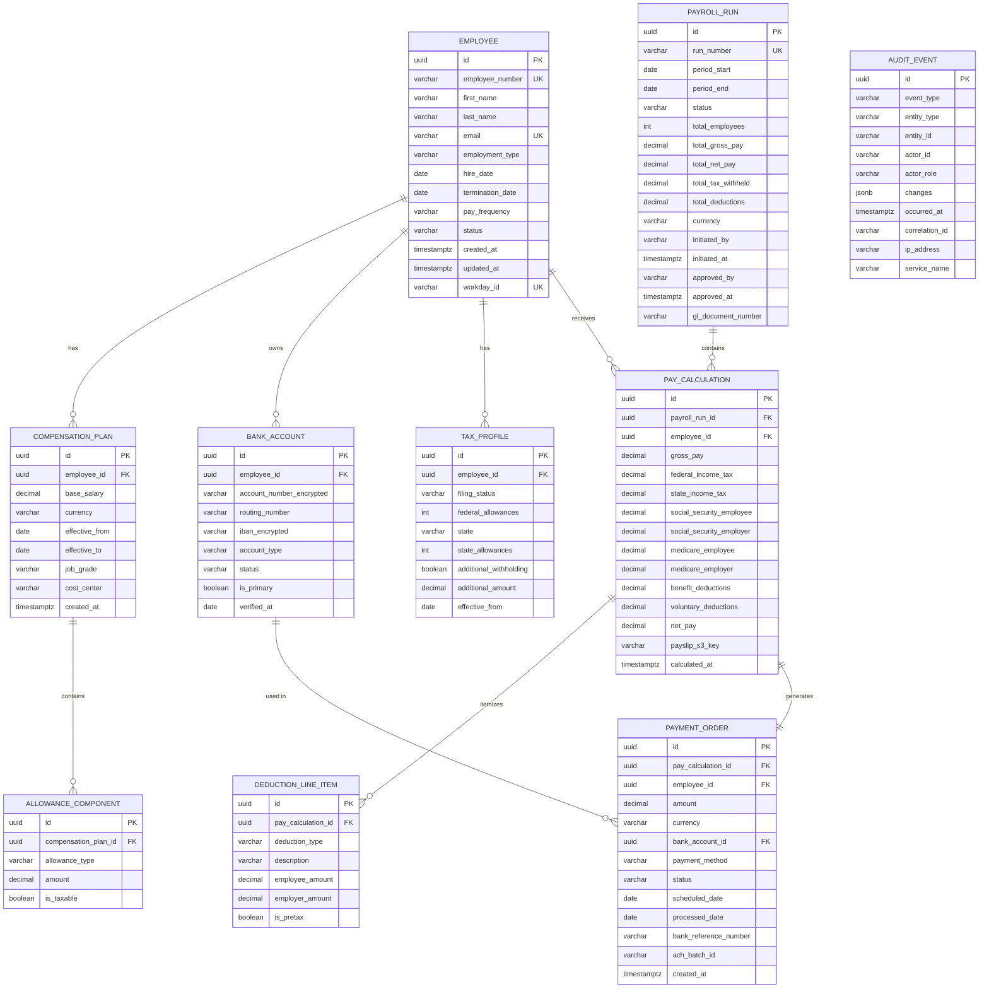

### 8.2 Security Architecture

Security is implemented across all layers using a defense-in-depth approach:

```mermaid
graph TB
    classDef external fill:#95a5a6,color:#fff
    classDef perimeter fill:#e74c3c,color:#fff
    classDef app fill:#3498db,color:#fff
    classDef data fill:#27ae60,color:#fff

    subgraph "Layer 1: Network Perimeter"
        WAF[AWS WAF\nOWASP Top 10 Rules\nGeo-blocking\nRate Limiting]:::perimeter
        VPC[VPC with Security Groups\nNo direct internet to app tier\nPrivate subnets only]:::perimeter
    end

    subgraph "Layer 2: Identity & Access"
        IDP[Azure AD\nSAML 2.0 / OIDC]:::app
        JWT[JWT Validation\n& Role Extraction\n@Kong Gateway]:::app
        RBAC[RBAC Enforcement\n@Service Layer\nAnnotation-based]:::app
    end

    subgraph "Layer 3: Application Security"
        INPUT[Input Validation\nJakarta Bean Validation\nSQL injection prevention]:::app
        CSRF[CSRF Protection\nDouble Submit Cookie]:::app
        CORS[CORS Policy\nAllowlist-based origins]:::app
    end

    subgraph "Layer 4: Data Security"
        ENCRYPT_REST[Data at Rest\nAES-256 via RDS encryption\nKMS key rotation]:::data
        ENCRYPT_TRANSIT[Data in Transit\nTLS 1.3 everywhere\nCertificate pinning for banking]:::data
        PII[PII Field Encryption\nBank account numbers AES-256\nSSN hashed with bcrypt]:::data
        MASK[Data Masking\nPayroll data masked\nin non-production envs]:::data
    end

    subgraph "Layer 5: Audit & Detection"
        AUDIT[Immutable Audit Log\n7-year retention\nAppend-only DB user]:::data
        SIEM[AWS GuardDuty +\nSecurity Hub SIEM]:::perimeter
        ALERTS[PagerDuty Alerts\nAnomaly detection\n(unusual payroll amounts)]:::perimeter
    end

    WAF --> IDP
    IDP --> JWT
    JWT --> RBAC
    RBAC --> INPUT
    INPUT --> ENCRYPT_REST
    ENCRYPT_REST --> AUDIT
    AUDIT --> SIEM
    SIEM --> ALERTS
```

### 8.3 Role-Based Access Control Matrix

| Feature | Employee | Payroll Admin | HR Manager | Finance Manager | IT Admin | Auditor |
|---------|----------|--------------|------------|-----------------|----------|---------|
| View own payslip | ✅ | ✅ | ✅ | ✅ | — | ✅ |
| View all payslips | — | ✅ | — | ✅ | — | ✅ |
| Update own bank account | ✅ | — | — | — | — | — |
| Update employee records | — | ✅ | ✅ | — | — | — |
| Configure pay structure | — | ✅ | ✅ | — | — | — |
| Initiate payroll run | — | ✅ | — | — | — | — |
| Approve payroll run | — | — | — | ✅ | — | — |
| View audit logs | — | — | — | — | ✅ | ✅ |
| Manage tax tables | — | ✅ | — | — | — | — |
| Generate regulatory filings | — | ✅ | — | ✅ | — | — |
| System administration | — | — | — | — | ✅ | — |

### 8.4 Error Handling and Resilience Patterns

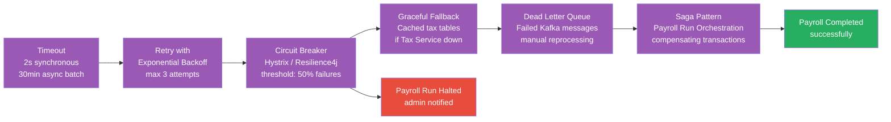

### 8.5 Observability Strategy

Every service exports metrics, traces, and structured logs following the **three pillars of observability**:

| Pillar | Tool | Key Signals |
|--------|------|-------------|
| **Metrics** | Prometheus + Grafana | Payroll run duration, calculation throughput (employees/sec), tax service latency, payment success rate, error rates |
| **Tracing** | OpenTelemetry + Jaeger | Distributed trace per employee calculation; trace spans across all service calls |
| **Logging** | Structured JSON → CloudWatch Logs + OpenSearch | Correlation ID on every log line; log levels: ERROR → PagerDuty, WARN → Slack |

**Key SLI/SLO Dashboard Metrics:**
- Payroll calculation throughput: target ≥ 40 employees/second
- Tax service p99 latency: target ≤ 200ms
- Payment submission success rate: target ≥ 99.99%
- Monthly payroll run completion time: target ≤ 2 hours for 50,000 employees

---

## 9. Architecture Decisions

### ADR-001: Microservices Architecture

| | |
|---|---|
| **Status** | Accepted |
| **Date** | 2024-Q1 |
| **Deciders** | Enterprise Architecture Board, Engineering Leads |

**Context**: The payroll system must support independent scaling of computationally intensive components (payroll calculation, reporting) without scaling the entire monolith. Three separate squads own different functional areas.

**Decision**: Decompose into domain-aligned microservices communicating via REST (synchronous) and Kafka (asynchronous).

**Consequences**:
- ✅ Independent deployment and scaling per service
- ✅ Technology flexibility per bounded context
- ✅ Team autonomy aligned with Conway's Law
- ⚠️ Increased operational complexity (service mesh, distributed tracing required)
- ⚠️ Distributed transaction complexity (mitigated via Saga pattern)

---

### ADR-002: PostgreSQL as Primary Database (No Event Store)

| | |
|---|---|
| **Status** | Accepted |
| **Date** | 2024-Q1 |

**Context**: Payroll data requires strong ACID guarantees. While full event sourcing was considered, the operational complexity was deemed too high for the current team maturity.

**Decision**: Use PostgreSQL with traditional tables. Publish domain events to Kafka for async workflows and audit purposes. Events are a side effect, not the system of record.

**Consequences**:
- ✅ Familiar operational model; team expertise in SQL
- ✅ Strong consistency for financial calculations
- ✅ Rich query capabilities for reporting
- ⚠️ History reconstruction requires audit log queries rather than event replay

---

### ADR-003: Kafka for Asynchronous Inter-Service Communication

| | |
|---|---|
| **Status** | Accepted |
| **Date** | 2024-Q1 |

**Context**: After payroll calculation, multiple downstream services (payment, reporting, notification, audit) need to react. Synchronous point-to-point would create tight coupling and slow down the critical path.

**Decision**: Publish domain events to Kafka topics. Consumers process independently at their own pace.

**Consequences**:
- ✅ Decoupled producers and consumers
- ✅ Event replay for debugging and reprocessing
- ✅ Durable audit trail of all events
- ⚠️ Eventual consistency between services (acceptable for non-financial downstream processing)

---

### ADR-004: Separate Audit Database with Append-Only Access

| | |
|---|---|
| **Status** | Accepted |
| **Date** | 2024-Q1 |

**Context**: SOX compliance requires an immutable audit trail that cannot be modified even by administrators. The main application database uses a standard read-write pattern.

**Decision**: Deploy a separate PostgreSQL instance for the Audit Service with a **database user that has only INSERT and SELECT privileges** — no UPDATE or DELETE. Application-level and DB-level enforcement.

**Consequences**:
- ✅ Tamper-proof audit log even if application compromised
- ✅ SOX control requirement met
- ✅ Audit queries isolated from operational DB load
- ⚠️ Additional database to manage and backup

---

### ADR-005: Payroll Calculation Engine as Pure Function (Stateless)

| | |
|---|---|
| **Status** | Accepted |
| **Date** | 2024-Q2 |

**Context**: To enable horizontal scaling during payroll runs and to facilitate testing, the calculation logic should not depend on in-memory state.

**Decision**: The Payroll Calculation Engine operates as a stateless service. All required data is fetched at the start of each calculation (employee data, tax tables, benefit deductions). Results are persisted in a single atomic transaction.

**Consequences**:
- ✅ Unlimited horizontal scaling during payroll run peaks
- ✅ Deterministic — same inputs always produce same outputs (testable, auditable)
- ✅ No distributed state coordination needed
- ⚠️ Higher data fetching overhead per calculation (mitigated by Redis caching)

---

### ADR-006: Data Residency Enforcement for GDPR

| | |
|---|---|
| **Status** | Accepted |
| **Date** | 2024-Q2 |

**Context**: EU employees' personal data must reside in the EU under GDPR Article 44. The system serves both US and EU employees.

**Decision**: Implement a **data routing layer** at the API Gateway that directs EU employee requests to the eu-west-1 regional stack. EU employee data is never replicated to us-east-1. A separate Aurora Global DB secondary in eu-west-1 serves EU data exclusively.

**Consequences**:
- ✅ GDPR Article 44 compliance
- ✅ Data residency auditable via routing logs
- ⚠️ Increased architectural complexity
- ⚠️ Cross-region payroll reporting for multi-national companies requires anonymized aggregation

---

### ADR-007: JWT-Based Stateless Authentication at API Gateway

| | |
|---|---|
| **Status** | Accepted |
| **Date** | 2024-Q1 |

**Context**: The system needs single sign-on integrated with corporate Azure Active Directory. Storing session state server-side conflicts with stateless microservices scaling.

**Decision**: Use OAuth 2.0 Authorization Code flow with PKCE via Azure AD. API Gateway validates JWT tokens and injects user claims into upstream headers. Services trust the gateway's claims without calling Azure AD on every request.

**Consequences**:
- ✅ Stateless — scales horizontally without session affinity
- ✅ Integrates with existing corporate SSO
- ✅ Role claims from Azure AD groups mapped to PayrollApp roles
- ⚠️ Token revocation lag (mitigated by short 15-minute JWT expiry + Redis token blacklist)

---

## 10. Quality Requirements

### 10.1 Quality Tree

```mermaid
graph TD
    QT[PayrollApp\nQuality Requirements]

    QT --> CORRECT[Correctness\n«Most Critical»]
    QT --> SECURE[Security\n«Critical»]
    QT --> RELIABLE[Reliability\n«Critical»]
    QT --> AUDITABLE[Auditability\n«Critical»]
    QT --> PERF[Performance\n«High»]
    QT --> USABLE[Usability\n«Medium»]
    QT --> MAINTAINABLE[Maintainability\n«Medium»]

    CORRECT --> C1[Zero calculation errors\nin gross-to-net computation]
    CORRECT --> C2[Tax withholding matches\nIRS/HMRC published tables]
    CORRECT --> C3[Idempotent recalculation\n— same inputs = same outputs]
    CORRECT --> C4[Pre/post-run validation\ncatches data anomalies]

    SECURE --> S1[PII encrypted at rest\n& in transit]
    SECURE --> S2[Role-based access\nwith principle of least privilege]
    SECURE --> S3[Pen test annually\nOWASP Top 10 continuously]
    SECURE --> S4[GDPR / SOX\ncompliance controls]

    RELIABLE --> R1[99.9% monthly uptime\n~44min downtime/month]
    RELIABLE --> R2[Payroll runs complete\non scheduled date]
    RELIABLE --> R3[RTO 4h / RPO 15min\nfor DR scenario]
    RELIABLE --> R4[Payment service\n99.99% success rate]

    AUDITABLE --> A1[Every data change\nlogged immutably]
    AUDITABLE --> A2[7-year audit\nretention]
    AUDITABLE --> A3[Full data lineage\nfrom input to payslip]

    PERF --> P1[50,000-employee\npayroll in ≤ 2 hours]
    PERF --> P2[API responses\n≤ 200ms p95]
    PERF --> P3[Tax calculation\n≤ 50ms p99 per employee]

    USABLE --> U1[Payslip portal\nmobile-responsive]
    USABLE --> U2[Payroll run errors\nexplained in plain language]

    MAINTAINABLE --> M1[Unit test coverage ≥ 85%\nfor calculation engine]
    MAINTAINABLE --> M2[Tax tables updatable\nwithout code changes]

    style QT fill:#2c3e50,color:#fff
    style CORRECT fill:#e74c3c,color:#fff
    style SECURE fill:#e74c3c,color:#fff
    style RELIABLE fill:#e74c3c,color:#fff
    style AUDITABLE fill:#e74c3c,color:#fff
    style PERF fill:#e67e22,color:#fff
    style USABLE fill:#27ae60,color:#fff
    style MAINTAINABLE fill:#27ae60,color:#fff
```

### 10.2 Quality Scenarios

| ID | Quality Attribute | Scenario | Response Measure |
|----|-----------------|----------|-----------------|
| QS-01 | **Correctness** | A payroll admin runs January payroll for 5,000 employees. All employees have standard compensation plans and W-4 data. | 100% of calculated net pay values match hand-verification for sampled 50 employees; zero rounding errors > $0.01 |
| QS-02 | **Correctness** | IRS updates federal income tax brackets for the new tax year. An admin loads the new tax tables. | First payroll run after table update uses new brackets; year-over-year variance report shows expected delta |
| QS-03 | **Security** | A junior payroll clerk attempts to access payslips for employees outside their assigned cost center. | Request is denied with HTTP 403; audit event is logged with the clerk's identity and the attempted resource |
| QS-04 | **Reliability** | During a monthly payroll run, one of three payroll-engine pods crashes. | Kubernetes restarts the pod within 30 seconds; the Kafka message for the affected batch is reprocessed; overall payroll run completes within normal SLA |
| QS-05 | **Reliability** | The primary us-east-1 region becomes unavailable during a payroll run. | DR failover completes within 4 hours; Aurora Global DB promotes eu-west-1 secondary; zero data loss for committed transactions (RPO: 15min) |
| QS-06 | **Performance** | Monthly payroll run is triggered for 50,000 employees at 01:00 AM. | All pay calculations completed by 02:30 AM (90 minutes); ACH files submitted to banks by 03:00 AM |
| QS-07 | **Auditability** | An internal auditor requests the full calculation trail for a specific employee's January payslip for a SOX review. | Auditor retrieves a complete lineage report showing: input compensation data, tax table version used, each deduction applied, approving manager, and payment reference — all within 5 minutes |
| QS-08 | **Usability** | An employee updates their bank account details. | Change is reflected in the next payroll run; employee receives an email confirmation within 5 minutes; previous bank account is retained in history for 90 days |

---

## 11. Risks and Technical Debt

### 11.1 Risk Register

| ID | Risk | Probability | Impact | Risk Level | Mitigation Strategy | Owner |
|----|------|------------|--------|------------|-------------------|-------|
| R-01 | **Tax table misconfiguration** — incorrect tax rates loaded for new tax year resulting in over/under-withholding | Medium | Critical | 🔴 High | Automated validation against IRS/HMRC published PDFs; mandatory dual-approval for tax table updates; parallel run comparison before go-live | Payroll Team Lead |
| R-02 | **ACH/SEPA file rejection** — bank rejects payment file due to format error or invalid account numbers | Low | Critical | 🟠 Medium-High | Pre-submission validation against NACHA/SEPA format spec; penny-test verification for all new bank accounts; real-time monitoring with PagerDuty alerts | Payment Service Team |
| R-03 | **Payroll database performance degradation** — as employee count and historical data grow, query performance declines | Medium | High | 🟠 Medium-High | Table partitioning by pay period; archival policy for data >3 years to cold storage; read replicas for reporting queries | Platform Team |
| R-04 | **Workday integration outage** — HRIS sync fails before payroll run, leaving stale employee data | Medium | High | 🟠 Medium-High | Cache last-known-good employee data in Redis; payroll run blocked if delta sync failed within 24h; manual override process for emergency payroll | Employee Service Team |
| R-05 | **GDPR data breach** — unauthorized access to EU employee payroll data | Low | Critical | 🟠 Medium-High | Encryption at rest and in transit; field-level PII encryption; regular penetration testing; data residency enforcement | Security Team |
| R-06 | **Calculation engine horizontal scaling failure** — HPA cannot scale up fast enough during payroll run | Low | High | 🟡 Medium | Pre-warm HPA before scheduled payroll runs; capacity reservations (On-Demand EC2 capacity reservations); load test before each major run | Platform Team |
| R-07 | **Regulatory compliance change** — new jurisdiction added mid-year with different payroll rules | Medium | Medium | 🟡 Medium | Pluggable tax calculation strategy pattern; jurisdiction registry; keep 2-sprint buffer for compliance changes | Tax Service Team |
| R-08 | **Vendor lock-in** — deep AWS EKS / Aurora dependency makes future migration expensive | Low | Medium | 🟢 Low-Medium | Abstract AWS-specific dependencies behind interfaces; use Kubernetes-native patterns; annual portability review | Architecture Board |
| R-09 | **Key person dependency** — payroll calculation engine owned by 2 engineers | Medium | Medium | 🟡 Medium | Knowledge transfer sessions; architecture decision records; pair programming rotation | Engineering Manager |
| R-10 | **Kafka consumer lag during large payroll run** — notification/audit consumers fall behind | Medium | Low | 🟢 Low | Consumer lag monitoring; auto-scaling notification consumers; DLQ for failed messages | Platform Team |

### 11.2 Technical Debt Register

| ID | Item | Category | Effort | Priority | Target Quarter |
|----|------|---------|--------|----------|---------------|
| TD-01 | **Tax table management via database only** — no UI for tax table administration; admins use direct DB scripts | UX / Operational | 2 sprints | High | Q2 2025 |
| TD-02 | **Synchronous Workday sync** — employee data sync runs as a nightly cron job; no real-time event-driven sync | Integration | 3 sprints | Medium | Q3 2025 |
| TD-03 | **Missing request validation on several internal endpoints** — inter-service REST calls lack proper input schema validation | Security / Quality | 1 sprint | High | Q1 2025 |
| TD-04 | **Calculation engine unit test coverage at 71%** — below the 85% target; complex tax edge cases not fully covered | Testing | 2 sprints | High | Q2 2025 |
| TD-05 | **Hard-coded ACH file format version** — NACHA format version is a compile-time constant rather than configuration | Maintainability | 0.5 sprints | Medium | Q2 2025 |
| TD-06 | **No structured chaos engineering practice** — DR failover only tested annually by manual simulation | Reliability | 3 sprints | Medium | Q3 2025 |
| TD-07 | **Payslip PDF generation blocking the reporting service** — iText PDF generation is synchronous and CPU-bound; should be offloaded to async worker pool | Performance | 1 sprint | Medium | Q2 2025 |
| TD-08 | **No blue-green deployment for database schema changes** — schema migrations require downtime window | Operational | 4 sprints | Low | Q4 2025 |
| TD-09 | **Notification service does not deduplicate events** — duplicate Kafka consumption can result in duplicate payslip emails | Quality | 1 sprint | High | Q1 2025 |
| TD-10 | **Manual GL posting reconciliation** — SAP GL postings are not automatically reconciled against payroll run totals | Compliance | 2 sprints | Medium | Q3 2025 |

### 11.3 Technical Debt Prioritisation Matrix

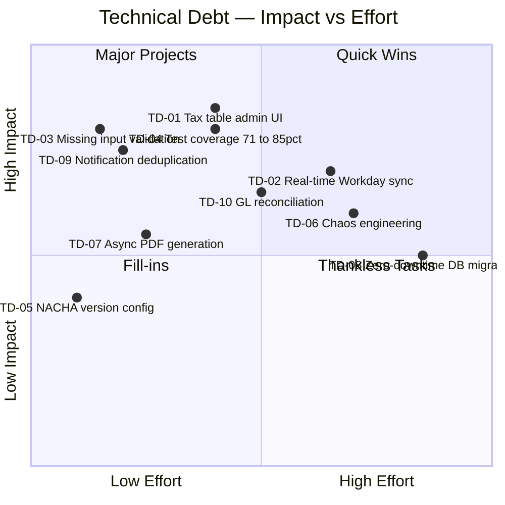

---

## 12. Glossary

### Business / Domain Terms

| Term | Definition |
|------|-----------|
| **ACH** | Automated Clearing House — the US electronic funds transfer network used for direct deposit salary payments |
| **Allowance (Tax)** | A value claimed on Form W-4 that reduces the amount of federal income tax withheld from an employee's paycheck |
| **Benefit Deduction** | An amount withheld from an employee's paycheck to fund employer-sponsored benefits (health insurance, pension, FSA) |
| **Compensation Plan** | A defined pay structure for an employee including base salary, allowances, and bonus eligibility |
| **Cost Center** | An organizational unit used for financial allocation and GL reporting of payroll expenses |
| **FICA** | Federal Insurance Contributions Act — mandates withholding of Social Security (6.2%) and Medicare (1.45%) taxes |
| **Filing Status** | An employee's tax filing category (Single, Married Filing Jointly, Head of Household) used to determine tax brackets |
| **FSA** | Flexible Spending Account — a pre-tax benefit account for eligible medical or dependent care expenses |
| **GL Posting** | General Ledger journal entry posted to the ERP (SAP) recording payroll expenses and liabilities |
| **Gross Pay** | Total earnings before any deductions — includes base salary, overtime, bonuses, and allowances |
| **HSA** | Health Savings Account — a tax-advantaged account paired with a high-deductible health plan |
| **Net Pay** | Take-home pay after all statutory and voluntary deductions have been subtracted from gross pay |
| **PAYE** | Pay As You Earn — the UK system for income tax and National Insurance withheld by employers |
| **Pay Period** | The recurring time interval (weekly, bi-weekly, semi-monthly, monthly) for which payroll is calculated |
| **Payroll Run** | The batch process that calculates pay for all eligible employees in a given pay period |
| **Payslip** | A document (digital or printed) provided to an employee detailing their earnings and deductions for a pay period |
| **Pre-tax Deduction** | A deduction subtracted from gross pay before taxes are calculated (e.g., 401(k) contributions, HSA contributions) |
| **RTI** | Real Time Information — HMRC's system requiring UK employers to report payroll data on or before each payday |
| **SEPA** | Single Euro Payments Area — the EU's electronic payment standard for euro-denominated transfers |
| **Social Security Wage Base** | The maximum annual earnings subject to Social Security tax (e.g., $168,600 for 2025) |
| **SOX** | Sarbanes-Oxley Act — US federal law imposing financial reporting controls on publicly traded companies |
| **Statutory Deduction** | A legally mandated deduction (income tax, Social Security, Medicare, state taxes) |
| **Tax Bracket** | A range of income taxed at a specific marginal rate under the progressive income tax system |
| **Tax Profile** | An employee's tax configuration record including filing status, allowances, and state tax settings |
| **W-2** | IRS form reporting an employee's annual wages and withheld taxes, issued by January 31 |
| **W-4** | IRS form completed by employees to declare withholding allowances and filing status |
| **Withholding** | The amount of income tax an employer deducts from an employee's paycheck and remits to tax authorities |
| **YTD** | Year-to-Date — cumulative earnings and deduction amounts from January 1 to the current date |

### Technical Terms

| Term | Definition |
|------|-----------|
| **ADR** | Architecture Decision Record — a document capturing a significant architectural decision, its context, and consequences |
| **Aurora PostgreSQL** | AWS's managed relational database service offering compatible with PostgreSQL with enhanced availability |
| **Bounded Context** | A DDD concept defining a logical boundary within which a domain model applies with consistent meaning |
| **Circuit Breaker** | A resilience pattern that prevents cascade failures by halting requests to a failing downstream service |
| **DDD** | Domain-Driven Design — a software development approach that aligns code structure with business domain concepts |
| **DLQ** | Dead Letter Queue — a Kafka topic or queue where messages that cannot be processed are routed for later inspection |
| **GDPR** | General Data Protection Regulation — EU regulation governing the collection and processing of personal data |
| **HPA** | Horizontal Pod Autoscaler — a Kubernetes feature that automatically scales pod replicas based on metrics |
| **Idempotency** | The property that performing an operation multiple times produces the same result as performing it once |
| **Kafka Topic** | A named stream in Apache Kafka to which messages are published and from which consumers read |
| **OIDC** | OpenID Connect — an authentication layer on top of OAuth 2.0 for identity federation |
| **Outbox Pattern** | A pattern ensuring database writes and event publications are atomic (events stored in DB, then published) |
| **PKCE** | Proof Key for Code Exchange — a security extension to OAuth 2.0 for public clients |
| **RPO** | Recovery Point Objective — the maximum acceptable amount of data loss measured in time |
| **RTO** | Recovery Time Objective — the maximum acceptable downtime before systems must be restored |
| **Saga Pattern** | A pattern for managing distributed transactions through a series of local transactions with compensating actions |
| **SFTP** | SSH File Transfer Protocol — used for secure transmission of ACH/SEPA payment files to banks |
| **SLI** | Service Level Indicator — a specific metric used to measure service quality (e.g., p99 latency) |
| **SLO** | Service Level Objective — a target value for an SLI (e.g., p99 latency ≤ 200ms) |
| **TLS 1.3** | Transport Layer Security version 1.3 — the current standard for encrypting data in transit |
| **Virtual Threads** | Java 21 Project Loom feature enabling lightweight threads for high-concurrency I/O-bound workloads |

---

*Document generated by arc42-documentor agent. For questions or updates, contact the Platform Architecture team.*  
*Arc42 template version 8.x — https://arc42.org*
