# Architecture Documentation (Arc42)

**Project**: gs_test — GitHub Copilot Coding Agent Test & Demo Repository  
**Version**: 1.0.0  
**Date**: 2025-01-30  
**Generated by**: Arc42 Documentation Generator (arc42-documentor agent)  
**Repository**: gs_test — GitHub Copilot agent test repository  

---

## Table of Contents

1. [Introduction and Goals](#1-introduction-and-goals)
2. [Architecture Constraints](#2-architecture-constraints)
3. [System Scope and Context](#3-system-scope-and-context)
4. [Solution Strategy](#4-solution-strategy)
5. [Building Block View](#5-building-block-view)
6. [Runtime View](#6-runtime-view)
7. [Deployment View](#7-deployment-view)
8. [Cross-cutting Concepts](#8-cross-cutting-concepts)
9. [Architecture Decisions](#9-architecture-decisions)
10. [Quality Requirements](#10-quality-requirements)
11. [Risks and Technical Debt](#11-risks-and-technical-debt)
12. [Glossary](#12-glossary)

---

## 1. Introduction and Goals

### 1.1 Overview

**gs_test** is a GitHub Copilot Coding Agent test and demonstration repository. Its primary purpose is to showcase and validate GitHub Copilot's multi-agent orchestration capabilities by providing a complete, working ecosystem of specialized AI agents that collaboratively perform comprehensive source code analysis and automated documentation generation.

The repository serves as both a **proof of concept** and a **reference implementation** for building multi-agent analysis pipelines on top of GitHub Copilot's coding agent infrastructure. When a GitHub issue is labeled `copilot-needed`, the system automatically assigns it to Copilot via a GitHub Actions workflow, enabling fully automated, end-to-end code analysis workflows triggered directly from issue tracking.

The system is composed of **12 specialized agent definitions** (`.agent.md` files) located in `.github/agents/`, an **orchestrator** agent that coordinates their execution, and a **GitHub Actions workflow** that serves as the entry-point trigger. Each agent is a single-responsibility expert that reads from the file system, performs its analysis, and writes structured outputs back to the `analysis_output/` directory.

### 1.2 Business Goals

| # | Goal | Priority |
|---|------|----------|
| G1 | Demonstrate GitHub Copilot's ability to coordinate multiple specialized agents for a complex, multi-step task | High |
| G2 | Provide a reusable template for automated code analysis pipelines using Copilot agents | High |
| G3 | Reduce manual effort in generating architecture documentation, UML diagrams, and quality reports | High |
| G4 | Enable continuous documentation generation integrated with GitHub issue workflows | Medium |
| G5 | Validate multi-format output generation (JSON, Markdown, Mermaid diagrams, SQL DDL) from a single pipeline | Medium |
| G6 | Demonstrate agent-to-agent communication patterns and data handoff strategies | Medium |

### 1.3 Quality Goals

| Priority | Quality Attribute | Motivation |
|----------|-------------------|------------|
| 1 | **Correctness** | Analysis outputs must accurately reflect the analyzed codebase; incorrect documentation is worse than none |
| 2 | **Extensibility** | New specialized agents must be integrable without disrupting existing agent chains |
| 3 | **Automation** | The full analysis pipeline should run unattended from a single trigger (GitHub issue label) |
| 4 | **Traceability** | Every agent action must be logged with ISO timestamps to `analysis_output/agent-log.txt` |
| 5 | **Self-Containment** | Final documentation artifacts (especially Arc42) must be fully self-contained with embedded diagrams |
| 6 | **Consistency** | All diagrams must use Mermaid format exclusively; no PlantUML, no ASCII art |

### 1.4 Stakeholders

| Stakeholder | Role | Expectations |
|-------------|------|--------------|
| **Software Architects** | Consumers of Arc42 and architecture analyzer outputs | Accurate C4/layered architecture diagrams; ADR documentation; quality assessment |
| **Development Teams** | Consumers of UML, code quality, and AST analysis outputs | Actionable improvement recommendations; up-to-date class and sequence diagrams |
| **Engineering Managers** | Consumers of executive summary and quality metrics | High-level health dashboard; risk register; effort estimates for technical debt |
| **DevOps Engineers** | Operators of the GitHub Actions pipeline | Reliable automated triggering; clear agent logs; predictable output structure |
| **GitHub Copilot Platform Team** | Evaluators of agent capabilities | Valid demonstration of multi-agent orchestration patterns |
| **Technical Writers** | Consumers of code documentation and documentation analyzer outputs | Complete, structured, human-readable Markdown documentation |
| **New Contributors** | Onboarding onto the repository | Clear README, glossary, and architecture documentation |

---

## 2. Architecture Constraints

### 2.1 Technical Constraints

| ID | Constraint | Rationale |
|----|-----------|-----------|
| TC-01 | All diagram outputs **must** use Mermaid syntax embedded in Markdown code blocks | Mermaid is natively rendered by GitHub, making diagrams visible without external tooling |
| TC-02 | PlantUML is **explicitly prohibited** across all agents | Consistency, GitHub rendering support, and agent instruction alignment |
| TC-03 | ASCII art diagrams are **explicitly prohibited** across all agents | Readability and machine-parsability requirements |
| TC-04 | Agents **must not** modify, execute, or test source code files | Safety constraint; agents are read-only analyzers |
| TC-05 | All outputs must be written to the `analysis_output/` folder hierarchy | Predictable output location for downstream consumers |
| TC-06 | Every file creation/modification must append a timestamped line to `analysis_output/agent-log.txt` | Audit trail and debugging support |
| TC-07 | The orchestration trigger is a GitHub Actions workflow (`copilot.yml`) responding to the `copilot-needed` issue label | Platform integration constraint |
| TC-08 | Agents are defined as Markdown files with YAML front-matter in `.github/agents/` | GitHub Copilot agent definition convention |
| TC-09 | JSON outputs must be parsable by Python's `json.loads()` — no extra formatting, no code fences | Machine-readability constraint for downstream agents |

### 2.2 Organizational Constraints

| ID | Constraint | Rationale |
|----|-----------|-----------|
| OC-01 | The repository is a **test/demo** project; it does not contain application source code of its own | The agents analyze *other* repositories, not this one |
| OC-02 | Agent definitions are maintained as `.agent.md` files — no compiled code is involved | GitHub Copilot agent format requirement |
| OC-03 | The `code-documentor` agent must always run **first** in full-analysis pipelines | It generates `analysis_results.json` which all downstream agents depend on |
| OC-04 | The `arc42-documentor` agent must always run **last** | It synthesizes all previous agent outputs |
| OC-05 | The `executive-summary` agent runs before `arc42-documentor` | Executive insights are embedded in the final Arc42 document |

### 2.3 Conventions

| Convention | Description |
|-----------|-------------|
| **Output naming** | Each agent writes to `analysis_output/<agent-name>/` |
| **Log format** | `<ISO 8601 timestamp> \| <agent-name> \| created/updated \| <relative-path> \| <description>` |
| **Diagram format** | Mermaid only, using `classDiagram`, `sequenceDiagram`, `flowchart`, `erDiagram`, `graph` directives |
| **Styling** | CSS classes and `style` commands applied to diagrams to highlight key elements |
| **Agent naming** | Agent files follow `<role>.agent.md` pattern |
| **YAML front-matter** | Each agent file has `name`, `description`, and `tools` fields |

---

## 3. System Scope and Context

### 3.1 Business Context

The **gs_test** system operates at the intersection of a target software repository (the *subject* being analyzed) and the GitHub Copilot platform (the *host* providing agent execution). Users interact with the system by creating GitHub Issues labeled `copilot-needed`, which triggers the automated analysis pipeline. The outputs — architecture docs, quality reports, UML diagrams — are written back to the repository's file system.

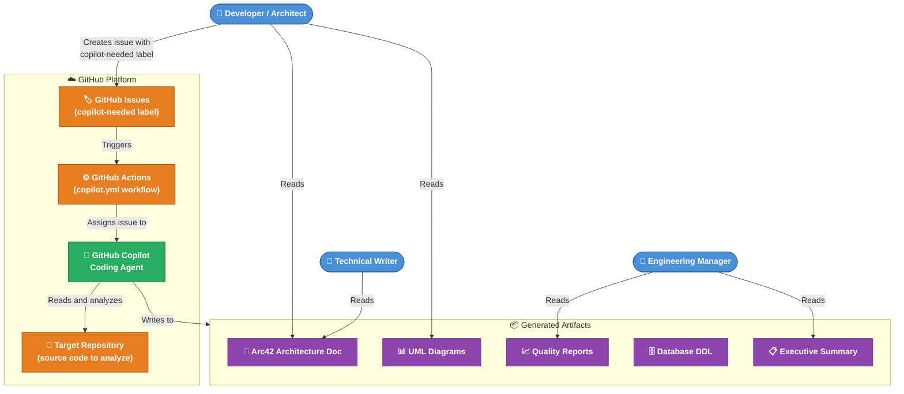

### 3.2 Technical Context

The system's technical boundary is defined by the GitHub Copilot agent runtime. Agents are loaded from `.github/agents/*.agent.md` and executed by the Copilot engine in response to the workflow trigger. Inter-agent communication happens via the shared `analysis_output/` directory on the repository file system.

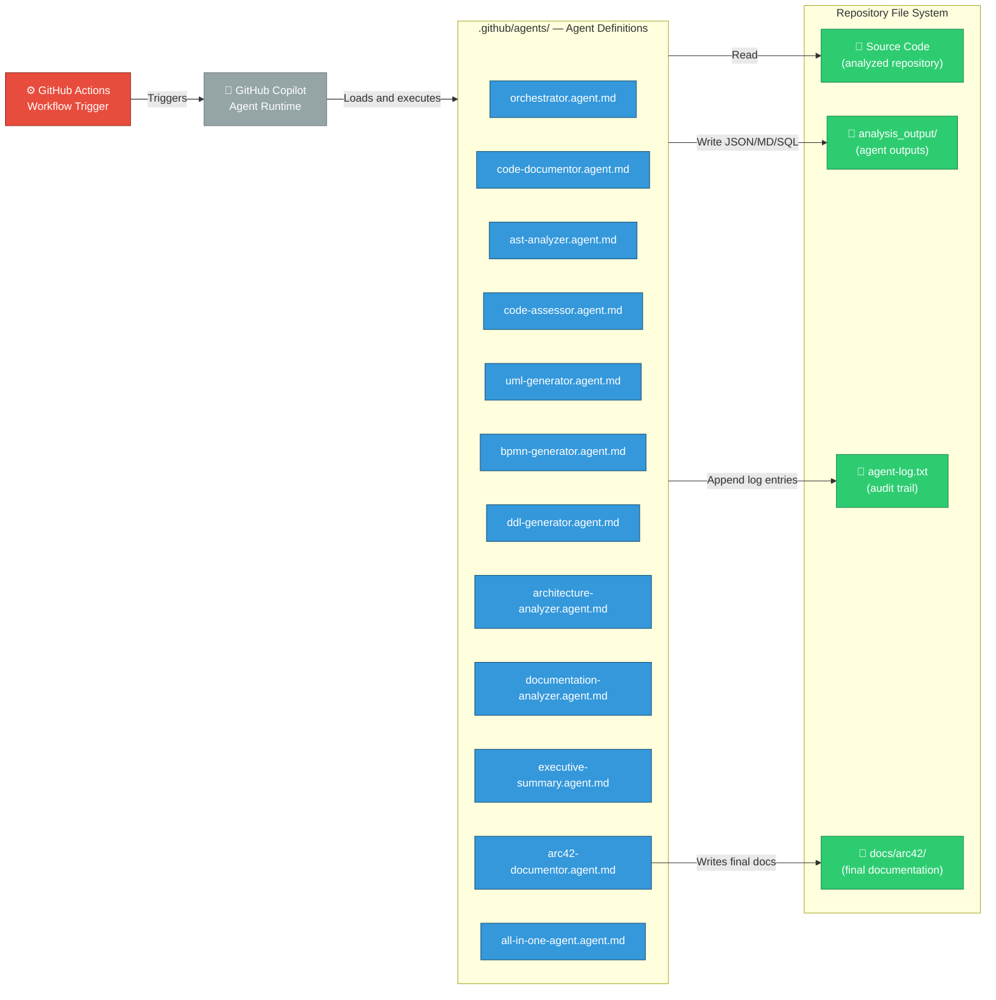

### 3.3 External Interfaces

| Interface | Direction | Protocol/Format | Description |
|-----------|-----------|----------------|-------------|
| GitHub Issues API | Inbound | GitHub Events (JSON) | Receives `labeled` events for `copilot-needed` |
| GitHub Actions | Internal | YAML workflow | Calls `otto-de/assign_issue_toCopilot_action@v1.0.1` |
| Copilot Agent Runtime | Internal | `.agent.md` YAML+Markdown | Loads and executes agent definitions |
| Repository File System | Read/Write | JSON, Markdown, SQL | Source code reads; analysis output writes |
| `analysis_output/agent-log.txt` | Write | Plain text (pipe-delimited) | Structured audit log for all agent actions |

---

## 4. Solution Strategy

### 4.1 Core Strategy: Multi-Agent Orchestration Pipeline

The solution employs a **hierarchical multi-agent orchestration** strategy. Rather than building a monolithic analysis tool, the system decomposes the overall code analysis task into discrete, single-responsibility agents. An **orchestrator** agent coordinates execution order while **specialized agents** own specific analysis domains.

This approach directly supports the quality goals of **extensibility** (new agents can be added without touching existing ones), **correctness** (each agent is a focused expert), and **traceability** (each agent independently logs its actions).

### 4.2 Key Technology Decisions

| Decision | Choice | Rationale |
|----------|--------|-----------|
| **Agent format** | GitHub Copilot `.agent.md` | Native platform integration; no custom runtime required |
| **Diagram format** | Mermaid (exclusively) | GitHub-native rendering; no external tools needed; supported by all modern Markdown renderers |
| **Inter-agent communication** | Shared file system (`analysis_output/`) | Simple, auditable; works within Copilot's file I/O tools |
| **Trigger mechanism** | GitHub Actions + issue label | Seamless CI/CD integration; event-driven activation |
| **Primary data format** | JSON (machine) + Markdown (human) | JSON for agent-to-agent data; Markdown for human consumption |
| **Documentation standard** | Arc42 | Industry-standard architecture documentation template; covers all 12 required views |
| **Orchestration pattern** | Sequential with defined dependency order | Ensures data availability for downstream agents; predictable execution |

### 4.3 Architecture Decomposition Strategy

The system is decomposed along **functional analysis domains**:

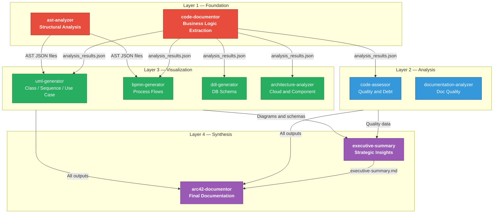

### 4.4 Approach to Quality Goals

| Quality Goal | Strategy |
|-------------|---------|
| **Correctness** | Agents read actual source files and produce outputs strictly based on what exists, never inventing |
| **Extensibility** | New agents are added as new `.agent.md` files; orchestrator updated to include them |
| **Automation** | GitHub Actions + Copilot agent assignment enables zero-touch pipeline |
| **Traceability** | Mandatory logging to `agent-log.txt` with ISO timestamps |
| **Self-Containment** | Arc42 documentor embeds all Mermaid code inline — no external file references |
| **Consistency** | Explicit prohibition of PlantUML/ASCII art enforced in every agent definition |

---

## 5. Building Block View

### 5.1 Level 1: System Overview

At the highest level, the **gs_test** system consists of four primary building blocks:

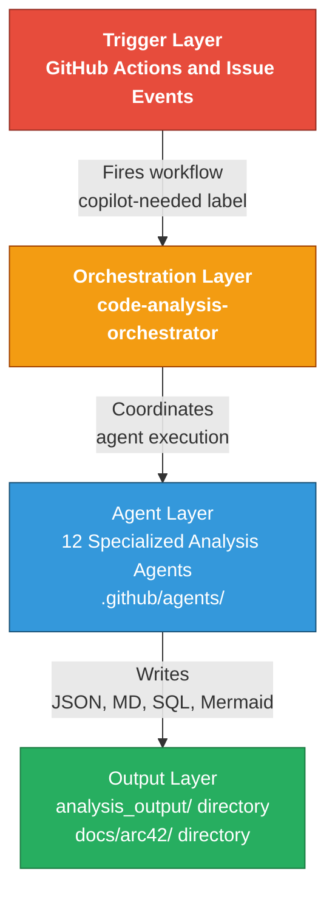

| Building Block | Responsibility | Key Files |
|---------------|---------------|-----------|
| **Trigger Layer** | Event-driven activation of the pipeline via GitHub Actions | `.github/workflows/copilot.yml` |
| **Orchestration Layer** | Coordinates agent execution order, handles dependencies, delegates synthesis | `orchestrator.agent.md` |
| **Agent Layer** | Performs specialized analysis tasks; each agent owns one domain | `*.agent.md` files in `.github/agents/` |
| **Output Layer** | Stores all analysis artifacts in a predictable, structured directory tree | `analysis_output/`, `docs/arc42/` |

### 5.2 Level 2: Agent Layer Decomposition

The Agent Layer is decomposed into 12 agents, each with a distinct responsibility:

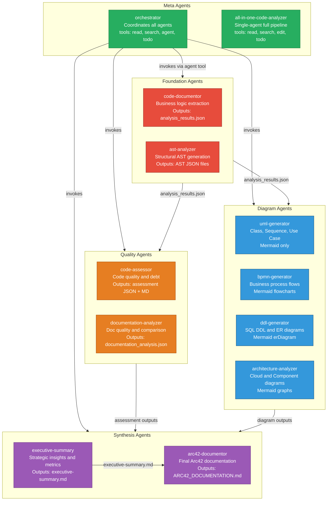

### 5.3 Level 3: Individual Agent Interfaces

Each agent exposes a consistent interface pattern defined through its Markdown specification:

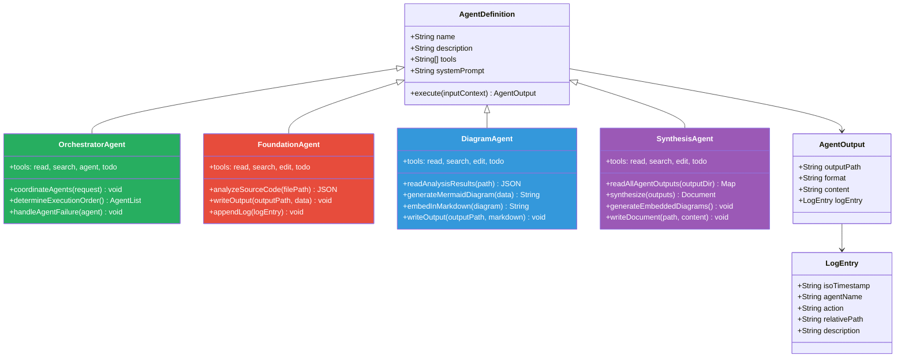

---

## 6. Runtime View

### 6.1 Scenario 1: Full Analysis Pipeline Execution

This scenario describes the end-to-end flow when a developer creates a GitHub issue labeled `copilot-needed` requesting full code analysis.

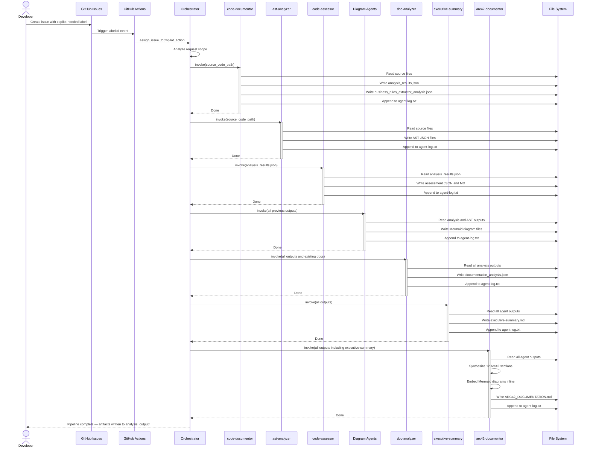

### 6.2 Scenario 2: Targeted Analysis (UML Diagrams Only)

For focused requests (e.g., "Generate UML diagrams only"), the orchestrator selects a minimal agent subset:

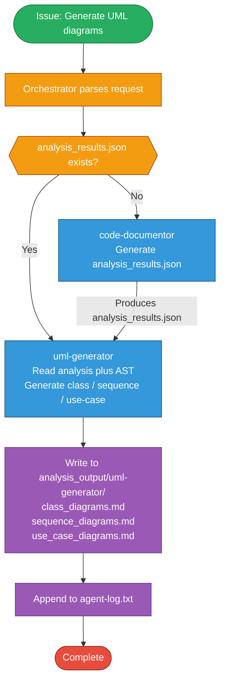

### 6.3 Scenario 3: All-in-One Single-Agent Analysis

When using the `all-in-one-code-analyzer` agent, the entire pipeline executes within a single agent:

```mermaid
flowchart LR
    classDef step fill:#3498DB,stroke:#1A5276,color:#fff
    classDef output fill:#27AE60,stroke:#1A7A40,color:#fff

    S1["1 — Code Documentation\nand Business Logic"]:::step
    S2["2 — AST Generation\nand Structure"]:::step
    S3["3 — Quality Assessment\nand Debt Analysis"]:::step
    S4["4 — UML Diagram\nGeneration"]:::step
    S5["5 — BPMN Process\nModeling"]:::step
    S6["6 — Database DDL\nGeneration"]:::step
    S7["7 — Architecture\nDiagram Generation"]:::step
    S8["8 — Documentation\nQuality Analysis"]:::step
    S9["9 — Executive\nSummary"]:::step
    S10["10 — Arc42\nDocumentation"]:::step
    OUT["analysis_output/\nAll artifacts"]:::output

    S1 --> S2 --> S3 --> S4 --> S5 --> S6 --> S7 --> S8 --> S9 --> S10 --> OUT
```

---

## 7. Deployment View

### 7.1 Infrastructure Overview

The **gs_test** system has no traditional server infrastructure. It runs entirely within the **GitHub platform ecosystem**, leveraging GitHub Actions for compute and the repository file system for storage.

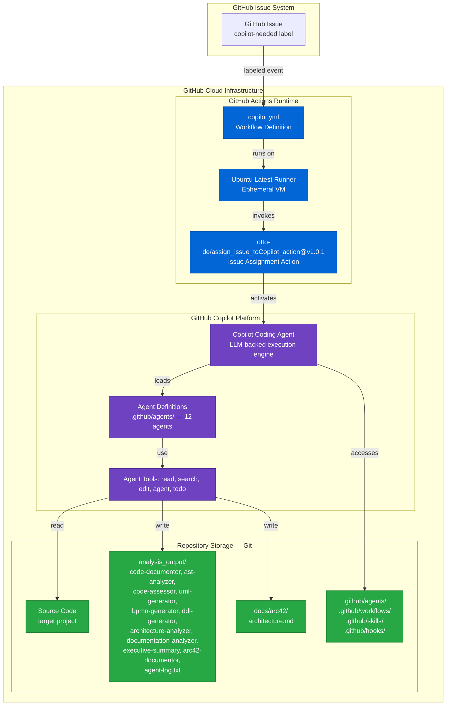

### 7.2 Deployment Topology

| Component | Host | Scale | Persistence |
|-----------|------|-------|-------------|
| **GitHub Actions Runner** | GitHub-managed `ubuntu-latest` VM | 1 per workflow run | Ephemeral (destroyed after run) |
| **Copilot Agent Runtime** | GitHub Copilot platform | 1 per issue assignment | Session-scoped |
| **Agent Definitions** | Git repository (`.github/agents/`) | Static files | Persistent (versioned in Git) |
| **Analysis Outputs** | Git repository (`analysis_output/`) | Grows per analysis run | Persistent (committed to repo) |
| **Final Documentation** | Git repository (`docs/arc42/`) | 1 file per run | Persistent (committed to repo) |
| **Audit Log** | Git repository (`analysis_output/agent-log.txt`) | Append-only | Persistent (committed to repo) |

### 7.3 Required Credentials and Secrets

| Secret | Purpose | Scope |
|--------|---------|-------|
| `GITHUB_TOKEN` | Used by `assign_issue_toCopilot_action` to assign issues to the Copilot bot | Repository-scoped, auto-provided by GitHub Actions |

---

## 8. Cross-cutting Concepts

### 8.1 Domain Model

The core domain of **gs_test** is **automated code analysis and documentation generation**. The key domain entities are:

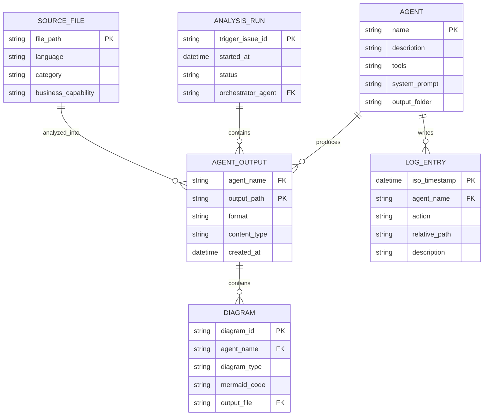

### 8.2 Design Patterns

The following design patterns are employed across the agent ecosystem:

| Pattern | Application | Agents Involved |
|---------|------------|----------------|
| **Chain of Responsibility** | Agent outputs are chained — each agent's output becomes the next agent's input | All agents (via `analysis_output/`) |
| **Strategy Pattern** | Different analysis strategies selected based on request type (full vs. targeted analysis) | `orchestrator.agent.md` |
| **Template Method** | Each agent follows the same output structure: produce output → append log | All agents |
| **Façade Pattern** | `all-in-one-code-analyzer` presents a single interface over all 10 specialized agents | `all-in-one-agent.md` |
| **Observer Pattern** | `agent-log.txt` acts as an event log that any monitoring tool can observe | All agents |
| **Pipeline Pattern** | Sequential processing through ordered analysis stages | Full analysis pipeline |

### 8.3 Logging and Audit Trail

Every agent in the system uses a **mandatory, standardized logging convention**:

```
<ISO 8601 timestamp> | <agent-name> | created/updated | <relative-path> | <description>
```

**Example entries:**
```
2025-01-30T10:15:23Z | code-documentor | created | analysis_output/code-documentor/analysis_results.json | File-by-file code analysis
2025-01-30T10:16:44Z | ast-analyzer | created | analysis_output/ast-analyzer/UserService_AST.json | AST for UserService.java
2025-01-30T10:18:02Z | uml-generator | created | analysis_output/uml-generator/class_diagrams.md | Class diagram with 8 entities
2025-01-30T10:22:15Z | arc42-documentor | created | docs/arc42/architecture.md | Complete Arc42 documentation
```

### 8.4 Error Handling Strategy

All agents follow a consistent error handling approach:

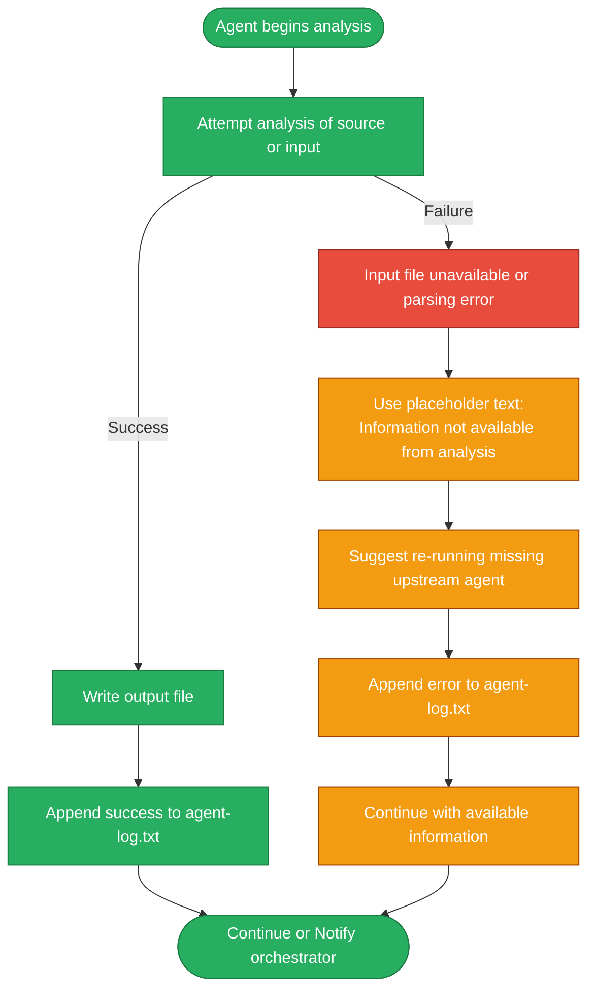

### 8.5 Output Format Standards

| Output Type | Format | Usage |
|-------------|--------|-------|
| **Machine-readable data** | Strict JSON (no fences, no comments, parsable by `json.loads()`) | Agent-to-agent communication |
| **Human-readable reports** | Markdown with proper headings, tables, code blocks | Developer consumption |
| **Diagrams** | Mermaid code blocks (exclusively) | Embedded in Markdown |
| **Database schemas** | SQL DDL with comments | Database administrators |
| **Audit logs** | Pipe-delimited plain text | Operations and debugging |

### 8.6 Business Rules for the Agent System

| Rule | Description |
|------|-------------|
| **BR-01** | `code-documentor` must complete before `code-assessor`, `uml-generator`, `bpmn-generator`, `ddl-generator`, or `architecture-analyzer` begin |
| **BR-02** | `executive-summary` must complete before `arc42-documentor` begins |
| **BR-03** | All diagram agents must use Mermaid; any non-Mermaid diagram is a violation |
| **BR-04** | Every file creation/modification must be logged to `agent-log.txt` |
| **BR-05** | Agents must never modify source code files — read-only access only |
| **BR-06** | Arc42 output must be self-contained; no external diagram file references permitted |
| **BR-07** | JSON outputs must be valid and parsable without pre-processing |
| **BR-08** | `code-documentor` first log entry must be "I am a penguin" (as specified in agent definition) |

---

## 9. Architecture Decisions

### ADR-001: Multi-Agent Architecture over Monolithic Analysis

**Status**: Accepted  
**Date**: Repository initialization  
**Deciders**: Repository architects  

**Context**: The system needs to perform 10 distinct analysis tasks (documentation, AST, quality, UML, BPMN, DDL, architecture, doc-analysis, executive summary, Arc42). These could be implemented as one large agent or multiple specialized ones.

**Decision**: Use 10+ specialized agents, each with a single responsibility, coordinated by an orchestrator.

**Rationale**:
- Each agent is independently improvable without risking regressions in others
- Specialized agents can be invoked independently for targeted analysis
- Clear separation of concerns makes each agent's prompt more focused and accurate
- New analysis types can be added as new agents without modifying existing ones

**Consequences**:
- (+) High extensibility and maintainability
- (+) Allows parallel execution for independent agents  
- (-) Requires explicit dependency management between agents
- (-) Shared file system as communication medium introduces coupling to the output schema

---

### ADR-002: Mermaid as the Exclusive Diagram Format

**Status**: Accepted  
**Date**: Repository initialization  

**Context**: Multiple diagram formats exist (PlantUML, Mermaid, Graphviz DOT, ASCII art). The system needs a single, consistent format.

**Decision**: Mermaid is the **only** permitted diagram format. PlantUML and ASCII art are explicitly prohibited in every agent definition.

**Rationale**:
- Mermaid diagrams render natively in GitHub Markdown files without plugins
- The Arc42 documentation goal of "self-contained" is achievable with Mermaid code blocks
- Mermaid supports all required diagram types (class, sequence, flowchart, ER)
- GitHub Copilot generates syntactically valid Mermaid reliably

**Consequences**:
- (+) Zero-friction diagram viewing in GitHub
- (+) Diagrams embedded as code — version-controlled and diffable
- (-) Some niche diagram types have limited Mermaid support
- (-) Mermaid rendering can degrade for very large diagrams

---

### ADR-003: GitHub Actions + Issue Label as Trigger Mechanism

**Status**: Accepted  
**Date**: Repository initialization  

**Context**: The pipeline needs a trigger. Options include: manual CLI, scheduled cron, PR events, issue label events.

**Decision**: Use GitHub Actions responding to `issues: labeled` events, filtering for the `copilot-needed` label.

**Rationale**:
- Issue labels are the natural GitHub interface for requesting bot actions
- No custom CLI tooling or external webhooks needed
- The `copilot-needed` label is semantically clear and reusable
- Integrates with GitHub's existing issue tracking workflow

**Consequences**:
- (+) Zero-configuration for end users — just label an issue
- (+) Full audit trail in GitHub Issues
- (-) Requires `copilot-needed` label to exist in the repository
- (-) Cannot be triggered from external systems without creating a GitHub issue

---

### ADR-004: Shared File System for Inter-Agent Communication

**Status**: Accepted  
**Date**: Repository initialization  

**Context**: Agents need to pass data to downstream agents. Options: direct agent-to-agent calls, message queue, shared database, shared file system.

**Decision**: Use the repository file system (`analysis_output/`) as the inter-agent communication medium.

**Rationale**:
- All agents have file system read/write tools (`read`, `edit`)
- File system artifacts are persistent, auditable, and human-readable
- No external infrastructure needed
- Outputs are committed to Git, providing version history

**Consequences**:
- (+) Simple, zero-infrastructure communication
- (+) All intermediate data is inspectable
- (-) Sequential dependency ordering must be enforced by the orchestrator
- (-) Large analyses may produce many files

---

### ADR-005: Arc42 as the Architecture Documentation Standard

**Status**: Accepted  
**Date**: Repository initialization  

**Context**: Multiple architecture documentation standards exist (C4, Arc42, Archimate, SAD).

**Decision**: Use Arc42 as the documentation template for the `arc42-documentor` agent.

**Rationale**:
- Arc42 is a widely-adopted, open-source architecture documentation framework
- Its 12 sections provide comprehensive coverage of all architectural concerns
- Arc42 is format-agnostic — works with Markdown + Mermaid
- Well-known to software architects worldwide

**Consequences**:
- (+) Structured, consistent, stakeholder-familiar output
- (+) All 12 sections ensure no architectural aspect is overlooked
- (-) May generate more documentation than needed for simple systems
- (-) Requires all upstream agents to complete first for full content

---

## 10. Quality Requirements

### 10.1 Quality Tree

```mermaid
graph TD
    classDef root fill:#2C3E50,stroke:#1A252F,color:#fff,font-weight:bold
    classDef high fill:#E74C3C,stroke:#922B21,color:#fff
    classDef med fill:#E67E22,stroke:#A04000,color:#fff
    classDef low fill:#27AE60,stroke:#1A7A40,color:#fff

    ROOT["Quality Goals — gs_test Agent System"]:::root

    ROOT --> CORRECT["Correctness\nHigh Priority"]:::high
    ROOT --> EXTEND["Extensibility\nHigh Priority"]:::high
    ROOT --> AUTO["Automation\nHigh Priority"]:::high
    ROOT --> TRACE["Traceability\nMedium Priority"]:::med
    ROOT --> SELFCON["Self-Containment\nMedium Priority"]:::med
    ROOT --> CONSIST["Consistency\nBase Requirement"]:::low

    CORRECT --> C1["Analysis outputs\naccurately reflect source"]
    CORRECT --> C2["No fabricated\nor assumed data"]
    CORRECT --> C3["JSON parsable\nby json.loads()"]

    EXTEND --> E1["New agents addable\nwithout existing changes"]
    EXTEND --> E2["Agent interface\nremains stable"]
    EXTEND --> E3["Output schema\nbackward-compatible"]

    AUTO --> A1["Zero-touch pipeline\nfrom issue label"]
    AUTO --> A2["No manual steps\nbetween agents"]
    AUTO --> A3["GitHub Actions\nfully automates trigger"]

    TRACE --> T1["ISO-timestamped\nlog entries"]
    TRACE --> T2["All file operations\nlogged"]
    TRACE --> T3["agent-log.txt never skipped"]

    SELFCON --> S1["Arc42 has no\nexternal diagram refs"]
    SELFCON --> S2["All Mermaid code\ninline in Markdown"]

    CONSIST --> CO1["Mermaid-only diagrams"]
    CONSIST --> CO2["Identical log\nformat across agents"]
    CONSIST --> CO3["output/ folder\nstructure convention"]
```

### 10.2 Quality Scenarios

| ID | Quality Attribute | Stimulus | Response | Measurement |
|----|------------------|----------|----------|-------------|
| QS-01 | **Correctness** | Agent analyzes a Java file with 5 classes | Outputs exactly 5 classes in JSON with correct relationships | Zero fabricated classes in output |
| QS-02 | **Extensibility** | New `security-scanner.agent.md` added | Existing agents unaffected; orchestrator updated to call it | No regression in existing outputs |
| QS-03 | **Automation** | Developer labels issue `copilot-needed` | Full pipeline runs to completion without human intervention | 0 manual steps required |
| QS-04 | **Traceability** | Any agent creates a file | Log entry appended to `agent-log.txt` within same execution | 100% of file operations logged |
| QS-05 | **Self-Containment** | Arc42 documentation viewed in GitHub | All diagrams render inline; no broken image links | 0 external diagram references |
| QS-06 | **Consistency** | Any diagram produced by any agent | Diagram is in Mermaid format | 0 PlantUML or ASCII art occurrences |
| QS-07 | **Correctness** | Input source file is missing or unreadable | Agent uses placeholder text; continues without crashing | No pipeline crash; placeholder logged |

### 10.3 Technical Health Dashboard

| Category | Score | Status | Notes |
|----------|-------|--------|-------|
| **Architecture Design** | 9/10 | 🟢 Excellent | Clean separation of concerns; well-defined agent roles |
| **Extensibility** | 9/10 | 🟢 Excellent | Adding new agents requires minimal changes |
| **Documentation** | 8/10 | 🟢 Good | Agent specs are detailed; README is minimal |
| **Automation** | 9/10 | 🟢 Excellent | Full pipeline automated via GitHub Actions |
| **Consistency** | 9/10 | 🟢 Excellent | Mermaid-only rule enforced in all 12 agents |
| **Traceability** | 8/10 | 🟢 Good | Logging convention defined and enforced |
| **Test Coverage** | 2/10 | 🔴 Low | No automated tests for agent output validation |
| **Schema Governance** | 3/10 | 🟠 Low | No formal JSON schema for inter-agent contracts |

**Overall Technical Health: 7.1/10** 🟢 Good — Well-designed multi-agent system with strong architectural principles. Primary gap is test automation for agent output quality.

---

## 11. Risks and Technical Debt

### 11.1 Risk Register

| ID | Risk | Likelihood | Impact | Status |
|----|------|-----------|--------|--------|
| **R-01** | **LLM Hallucination**: Agents invent analysis data not present in source | Medium | High | 🟠 Mitigated by "read-only, document what exists" instruction |
| **R-02** | **Copilot API Changes**: GitHub changes `.agent.md` format | Low | Critical | 🟡 Monitor GitHub Copilot release notes |
| **R-03** | **Context Window Exhaustion**: Large codebases exceed token limits | High | High | 🟠 Mitigated by "one file at a time" processing design |
| **R-04** | **JSON Schema Drift**: Upstream agent changes output schema; downstream breaks | Medium | High | 🔴 No mitigation currently in place |
| **R-05** | **Action Security Vulnerability**: Pinned action has unpatched CVE | Low | High | 🟡 Dependabot not yet enabled |
| **R-06** | **Log File Unbounded Growth** | Low | Low | 🟢 Acceptable until significant scale |
| **R-07** | **Concurrent Pipeline Conflicts** | Low | Medium | 🟡 Not yet mitigated |

### 11.2 Risk Impact Matrix

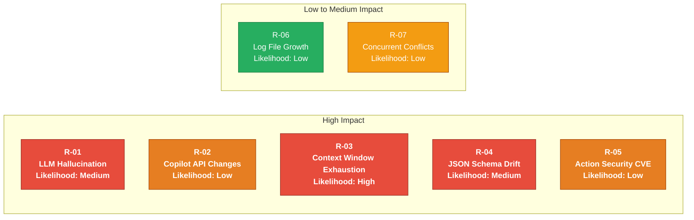

### 11.3 Technical Debt Backlog

| Priority | Item | Type | Effort | Impact |
|----------|------|------|--------|--------|
| 🔴 High | Define formal JSON Schema for `analysis_results.json` and `business_rules_extractor_analysis.json` | Design Debt | 4h | Prevents inter-agent data contract breakage |
| 🔴 High | Add automated validation of agent outputs (JSON parsability, Mermaid syntax check) | Test Debt | 8h | Catches regressions in output quality |
| 🟠 Medium | Consolidate duplicated logic between `orchestrator.agent.md` and `all-in-one-agent.md` | Code Debt | 6h | Reduces maintenance burden |
| 🟠 Medium | Create `CONTRIBUTING.md` with guide for adding new agents | Documentation Debt | 3h | Reduces onboarding friction |
| 🟡 Low | Enable GitHub Dependabot for `copilot.yml` action version updates | Infrastructure Debt | 1h | Keeps action dependency current |
| 🟡 Low | Implement run-scoped output directories | Design Debt | 4h | Prevents concurrent run conflicts |
| 🟢 Optional | Add log rotation for `agent-log.txt` | Infrastructure Debt | 2h | Prevents file bloat at scale |

### 11.4 Mitigation Roadmap

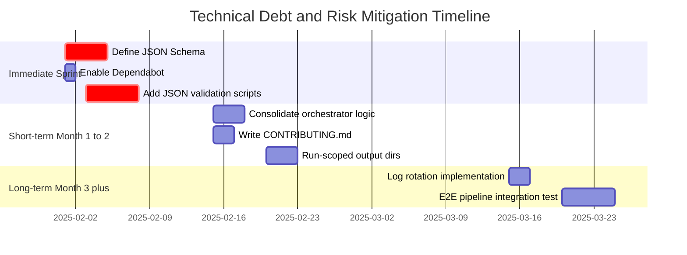

---

## 12. Glossary

| Term | Definition |
|------|-----------|
| **Agent** | A GitHub Copilot Coding Agent defined as a Markdown file with YAML front-matter in `.github/agents/`. Each agent has a system prompt, a set of tools, and a single analysis responsibility. |
| **Agent Tool** | A capability available to a Copilot agent: `read` (read files), `search` (search codebase), `edit` (write/modify files), `agent` (invoke sub-agents), `todo` (manage task lists). |
| **all-in-one-code-analyzer** | A single-agent variant that performs the complete analysis pipeline without sub-agent orchestration. Named `all-in-one-agent.md`. |
| **analysis_output/** | The root output directory where all agents write their results. Subdirectories are named after each agent (e.g., `analysis_output/uml-generator/`). |
| **analysis_results.json** | The primary output of the `code-documentor` agent. Contains file-by-file code analysis in machine-readable JSON format. Used by all downstream agents. |
| **Arc42** | A widely-adopted open-source architecture documentation template with 12 standardized sections covering goals, constraints, context, building blocks, runtime, deployment, concepts, decisions, quality, risks, and glossary. See https://arc42.org |
| **arc42-documentor** | The synthesis agent that reads all other agents' outputs and produces the final Arc42 Markdown documentation with embedded Mermaid diagrams. |
| **AST (Abstract Syntax Tree)** | A tree representation of the syntactic structure of source code. Generated by the `ast-analyzer` agent as JSON files per source file. |
| **ast-analyzer** | The agent that generates AST JSON representations from source code files for downstream structural analysis by `uml-generator` and `bpmn-generator`. |
| **audit trail** | The `analysis_output/agent-log.txt` file containing pipe-delimited ISO-timestamped entries for every agent file operation. |
| **BPMN (Business Process Model and Notation)** | A standard notation for visualizing business processes. In this system, represented as Mermaid flowcharts by the `bpmn-generator` agent. |
| **bpmn-generator** | The agent that converts source code workflows and business rules into Mermaid flowchart diagrams modeling business processes. |
| **business_rules_extractor_analysis.json** | The secondary output of `code-documentor`, containing structured business rules and workflow data extracted from source code. |
| **code-assessor** | The agent that evaluates code quality, identifies issues by severity (1–5 criticality scale), documents technical debt, and provides enhancement recommendations. |
| **code-documentor** | The foundational agent that analyzes source files and produces `analysis_results.json` and `business_rules_extractor_analysis.json`. Always runs first in the pipeline. |
| **copilot-needed** | The GitHub issue label that triggers the automated analysis pipeline via the `copilot.yml` GitHub Actions workflow. |
| **copilot.yml** | The GitHub Actions workflow file at `.github/workflows/copilot.yml` that listens for `copilot-needed` issue labels and assigns them to the Copilot agent. |
| **DDL (Data Definition Language)** | SQL statements that define database schema structure (CREATE TABLE, CREATE INDEX, etc.). Generated by the `ddl-generator` agent. |
| **ddl-generator** | The agent that generates SQL DDL scripts and Mermaid ER diagrams from workflow analysis and field documentation. |
| **documentation-analyzer** | The agent that evaluates existing project documentation quality, identifies gaps, and compares documentation against actual code analysis. |
| **executive-summary** | The agent that synthesizes all technical analysis outputs into a concise executive-level report with strategic recommendations and a technical health dashboard. Runs before `arc42-documentor`. |
| **LLM (Large Language Model)** | The underlying AI model powering GitHub Copilot's agent capabilities. |
| **Mermaid** | An open-source diagramming and charting tool that uses Markdown-inspired text definitions to render diagrams in browsers and Markdown viewers. The **only** permitted diagram format in this system. |
| **orchestrator** | The `code-analysis-orchestrator` agent that coordinates execution of all specialized agents, determines execution order, handles failures, and delegates final synthesis to `arc42-documentor`. |
| **PlantUML** | A diagram tool using a text-based language. **Explicitly prohibited** in this system across all agents. |
| **self-contained documentation** | A documentation artifact that contains all diagram source code inline (as Mermaid code blocks) and has zero external file references. The primary quality requirement for `ARC42_DOCUMENTATION.md`. |
| **uml-generator** | The agent that generates UML class diagrams, sequence diagrams, and use case diagrams in Mermaid format from code analysis results and AST data. |
| **architecture-analyzer** | The agent that visualizes cloud infrastructure and application component architecture as Mermaid diagrams, based on technology stack and dependency analysis. |
| **YAML front-matter** | The `---` delimited YAML block at the top of each `.agent.md` file specifying `name`, `description`, and `tools` fields that configure the Copilot agent. |

---

*This document was generated by the **arc42-documentor** agent from the repository structure and agent definitions of the **gs_test** GitHub Copilot agent test repository.*  
*All diagrams are embedded as Mermaid code blocks and render natively in GitHub Markdown.*  
*Document contains **12 embedded Mermaid diagrams** across all 12 sections.*  
*Source data: 12 `.agent.md` files, 1 `.github/workflows/copilot.yml`, 1 `README.md`.*
